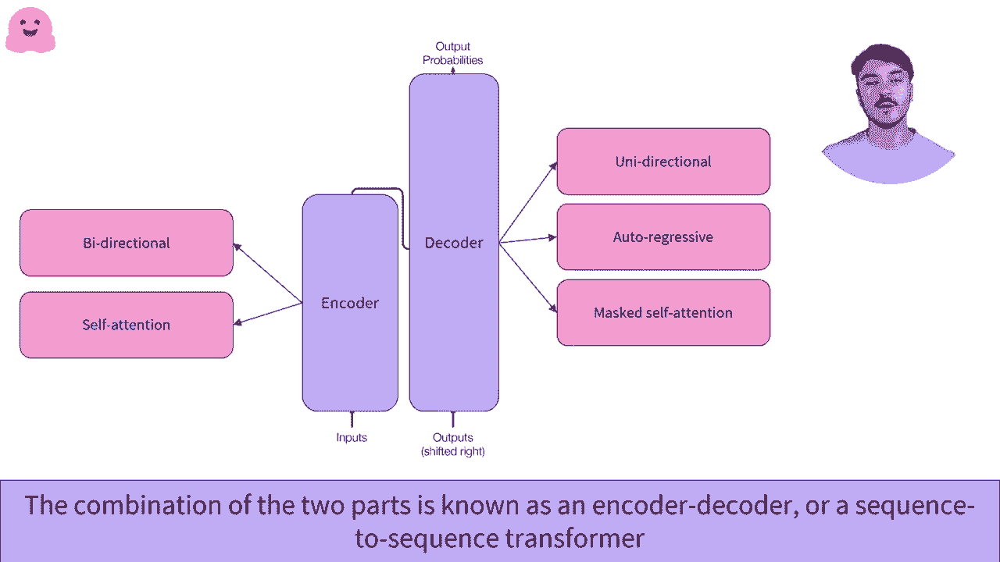

# Transformers 原理细节及 NLP 任务应用！P4：L1.4- Transformer架构 🏗️

在本节课中，我们将要学习 Transformer 模型的核心架构。我们将它分解为编码器和解码器两部分，并解释它们如何独立或协同工作，以处理各种自然语言处理任务。

## 概述

Transformer 架构源自论文《Attention Is All You Need》。我们将从该论文的示意图出发，理解其整体设计。该架构可以根据任务需求，灵活地使用其全部或部分组件。我们的目标是理解其不同部分的功能与协作方式，无需深入的神经网络知识，但了解基本的向量和张量概念会有所帮助。

## 编码器与解码器的划分

首先，我们可以将架构图清晰地划分为左侧的**编码器**和右侧的**解码器**。这两个部分既可以联合使用，构成完整的序列到序列模型，也可以独立应用于特定任务。

上一节我们介绍了架构的整体划分，本节中我们来看看编码器部分的具体功能。

### 编码器部分

编码器接收代表文本的输入序列，并将其转换为一系列**数字表示**。这些数字表示通常被称为**嵌入**或**特征向量**。编码器的核心组件是**自注意力机制**，它能够帮助模型理解输入序列中各个元素之间的关系。

以下是编码器工作的关键点：
*   **输入**：文本序列（例如，一个句子）。
*   **核心机制**：**自注意力**。公式可以简化为 `Attention(Q, K, V) = softmax(QK^T / sqrt(d_k)) V`，其中 Q（查询）、K（键）、V（值）均来自输入序列自身。
*   **输出**：输入序列的上下文感知的**高级数字表示**。
*   **特性**：**双向**的，在处理每个词时都能考虑到序列中所有其他词的信息。

我们建议你观看专门讲解编码器的视频，以深入了解这些数字表示的具体含义及其生成过程。

### 解码器部分

解码器在结构上与编码器相似，也接收文本输入。它同样采用了注意力机制，但是一种**被掩蔽的自注意力**机制。正是由于这种机制，解码器的工作方式与编码器有本质区别。

以下是解码器工作的关键点：
*   **输入**：通常是目标序列（在训练时）或自身之前生成的输出（在推理时）。
*   **核心机制**：**掩蔽自注意力**。这确保了在生成当前位置的输出时，模型只能“看到”之前位置的序列信息，无法获取未来信息。
*   **工作模式**：通常以**自回归**方式运行，即逐个生成输出序列的元素，并将已生成的部分作为下一步的输入。
*   **特性**：**单向**的，保证了生成过程的因果性。

为了透彻理解解码器的运作，我们同样建议你观看相关的专题视频。

## 编码器-解码器架构

将编码器和解码器两部分结合在一起，就构成了完整的**编码器-解码器**架构，也称为**序列到序列**模型。这种架构适用于机器翻译、文本摘要等需要将一个序列转换为另一个序列的任务。

上一节我们分别介绍了编码器和解码器，现在来看看它们如何协同工作。

其工作流程如下：
1.  **编码阶段**：编码器接收源语言输入序列，并计算出其高级的上下文表示。
2.  **连接阶段**：编码器的输出被传递给解码器，作为解码器注意力机制中的**键（K）**和**值（V）**。
3.  **解码阶段**：解码器结合编码器提供的上下文信息以及自身（掩蔽的）输入，逐步预测输出序列。在推理时，这个过程是**自回归**的，即上一个时间步的预测结果会作为下一个时间步的输入。

为了全面掌握编码器-解码器的工作细节，请务必观看相关的专题讲解视频。

## 总结

本节课中，我们一起学习了 Transformer 的基础架构。我们了解到，Transformer 主要由**编码器**和**解码器**两大模块构成。编码器利用**双向自注意力**为输入序列生成丰富的上下文表示；解码器则利用**掩蔽自注意力**以**自回归**的方式生成输出序列。两者可以独立用于如文本分类或文本生成等任务，也可以组合成强大的**编码器-解码器**模型，处理复杂的序列到序列转换问题。理解这一基本架构是深入学习各种现代 Transformer 变体模型的基础。