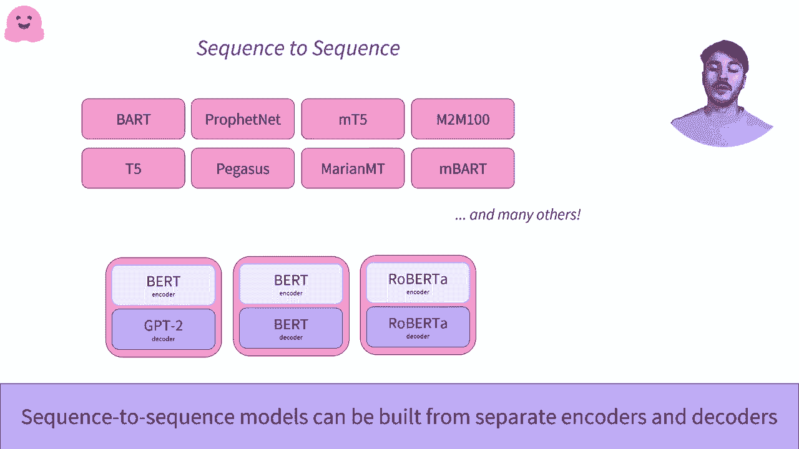

# Transformers 原理细节及 NLP 任务应用！P7：L1.7- Transformer：编码器-解码器 🤖

在本节课中，我们将要学习 Transformer 模型中的编码器-解码器架构。这种架构是处理序列到序列任务的核心，例如机器翻译和文本摘要。我们将详细拆解其工作原理，并通过具体例子展示其应用。

---

## 概述

编码器-解码器架构由两个主要部分组成：一个编码器和一个解码器。编码器负责处理输入序列并生成其数值表示，解码器则利用这个表示来生成输出序列。两者协同工作，共同完成从一种序列到另一种序列的转换任务。

---

## 编码器的工作原理

上一节我们介绍了 Transformer 的基本组件，本节中我们来看看编码器的具体作用。

编码器接收单词序列作为输入。经过内部处理，它为输入序列中的每个单词生成一个数值表示。这个表示包含了关于整个序列语义的信息。

我们可以用以下伪代码来描述编码器的核心功能：
```python
encoder_output = Encoder(input_sequence)
```
这里的 `encoder_output` 是一个包含序列信息的密集向量。

---

## 解码器的工作原理

理解了编码器后，我们再来看看解码器。解码器在编码器-解码器架构中的使用方式与独立使用时有所不同。

以下是解码器的工作流程：

解码器接收两个输入：
1.  编码器输出的数值表示。
2.  一个初始序列（通常是一个表示序列开始的特殊标记，如 `<sos>`）。

解码器结合这两个输入，开始解码过程，并输出第一个预测的单词。

---

## 编码器与解码器的协同工作

现在，我们将编码器和解码器结合起来，看看完整的机制是如何运作的。

我们有一个发送到编码器的初始序列。编码器处理该序列并输出其数值表示。然后，该表示被发送给解码器。

解码器使用编码器的输出和一个起始标记（如 `<sos>`）作为输入，预测出第一个单词。

此时，编码器的任务已完成。解码器进入自回归生成模式。它刚刚输出的第一个单词，会与编码器的输出表示结合，作为新的输入，用于预测第二个单词。

这个过程会持续进行，直到解码器输出一个特定的停止标记（如句号 `.` 或 `<eos>`），表示序列生成结束。

让我们用公式描述单步解码过程：
**`下一个单词 = Decoder(编码器输出， 已生成序列)`**

---

## 应用实例：机器翻译

为了更具体地理解，我们来看一个机器翻译的例子，这属于序列转导任务。

假设我们要将英语句子 “welcome to NYC” 翻译成法语。

1.  **编码阶段**：英语句子被输入编码器，编码器生成其数值表示。
2.  **初始解码**：解码器接收编码器输出和起始标记 `<sos>`，预测出第一个法语单词 “Bienvenue”（意为“欢迎”）。
3.  **自回归生成**：
    *   解码器接收编码器输出和序列 `[<sos>, “Bienvenue”]`，预测出第二个单词 “à”。
    *   解码器接收编码器输出和序列 `[<sos>, “Bienvenue”, “à”]`，预测出第三个单词 “NYC”。
4.  **结束**：最终得到翻译结果 “Bienvenue à NYC”。

---

## 编码器-解码器架构的优势

这种架构有几个关键优势：

以下是其主要优点：

*   **处理序列到序列任务**：专为输入和输出都是序列的任务设计，如翻译和摘要。
*   **组件独立性**：编码器和解码器的权重通常是分开的、不共享的。这意味着它们可以针对不同模态（如文本、图像）或不同语言进行独立优化和训练。
*   **处理不同长度序列**：编码器和解码器可以处理不同长度的上下文。例如，编码器可以处理长篇文章，而解码器只需生成较短的摘要。

---

## 其他应用与模型

序列到序列模型的应用非常广泛。

以下是一些流行的编码器-解码器模型示例：

*   **T5**：一个将所有文本任务都转化为文本到文本格式的统一模型。
*   **BART**：一个用于文本生成（如摘要、翻译）的降噪自编码器。
*   **MarianMT**：专注于机器翻译的模型。

在实践中，你可以根据特定任务，选择并加载在该任务上表现优异的预训练编码器和解码器。



---


## 总结

本节课中我们一起学习了 Transformer 的编码器-解码器架构。我们了解了编码器如何将输入序列编码为富含信息的向量表示，以及解码器如何以自回归的方式，利用该表示生成输出序列。通过机器翻译的例子，我们看到了该架构如何协同工作以完成复杂的序列到序列任务。这种架构的灵活性和强大能力，使其成为自然语言处理中诸多核心应用的基石。