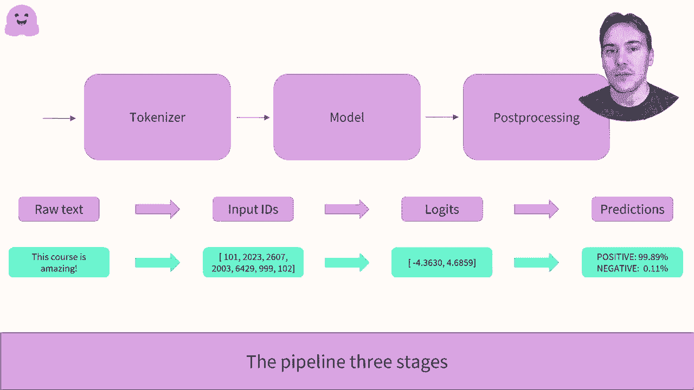

# Transformers 原理细节及 NLP 任务应用！P8：L2.1- 管道函数内部会发生什么？(PyTorch) 🤖

在本节课中，我们将深入探讨 Hugging Face Transformers 库中 `pipeline` 函数的工作原理。我们将以情感分析任务为例，详细拆解其内部执行的三个核心步骤：标记化、模型推理和后处理。通过理解这些步骤，你将能够更好地定制和使用这些强大的工具。

## 概述 📋

`pipeline` 函数为执行各种 NLP 任务提供了便捷的接口。当我们调用它时，背后实际上发生了三个关键阶段：首先，文本被转换为模型可理解的数字（标记化）；其次，这些数字通过预训练模型进行计算；最后，模型的原始输出被处理成人类可读的标签和分数。本节我们将逐一剖析这些阶段。

## 第一阶段：标记化 (Tokenization) 🧩

上一节我们介绍了管道的整体流程，本节中我们首先来看看第一步——标记化。标记化是将原始文本转换为模型输入数字序列的过程。

以下是标记化过程的具体步骤：

1.  **文本拆分**：将输入文本拆分为称为“标记”的小块。标记可以是单词、子词或标点符号。
2.  **添加特殊标记**：根据模型要求，在序列开头添加 `[CLS]` 标记，在结尾添加 `[SEP]` 标记（对于分类任务）。
3.  **词汇映射**：将每个标记映射到预训练模型词汇表中的唯一 ID。
4.  **批处理格式化**：对于多个句子，通过填充和截断确保它们长度一致，以便组成一个张量数组。

要加载与特定预训练模型对应的标记器，Transformers 库提供了 `AutoTokenizer` API。

```python
from transformers import AutoTokenizer

checkpoint = “distilbert-base-uncased-finetuned-sst-2-english”
tokenizer = AutoTokenizer.from_pretrained(checkpoint)
```

`from_pretrained` 方法会下载并缓存与给定检查点相关的配置和词汇表。接着，我们可以对句子进行编码：

```python
raw_inputs = [
    “I’ve been waiting for a HuggingFace course my whole life.”,
    “I hate this so much!”,
]
inputs = tokenizer(raw_inputs, padding=True, truncation=True, return_tensors=“pt”)
```

参数说明：
*   `padding=True`：对较短的句子进行填充。
*   `truncation=True`：确保过长的句子被截断。
*   `return_tensors=“pt”`：返回 PyTorch 张量。

查看 `inputs`，我们会得到一个包含两个键的字典：
*   `input_ids`：包含两个句子 ID 的张量，填充位置用 0 表示。
*   `attention_mask`：指示哪些位置是填充的（值为0），以便模型在计算注意力时忽略它们。

至此，标记化步骤完成。

## 第二阶段：模型推理 (Model Inference) 🧠

在文本被成功转换为数字之后，下一步就是将这些数字输入到模型中进行计算。与标记化类似，Transformers 库也提供了 `AutoModel` API 来加载模型。

```python
from transformers import AutoModel

model = AutoModel.from_pretrained(checkpoint)
```

`AutoModel` 仅会实例化模型的主体部分（即去掉预训练任务头之后的网络）。它的输出是一个高维张量，代表了句子的抽象特征，但对于分类任务来说并不直接可用。

```python
outputs = model(**inputs)
print(outputs.last_hidden_state.shape)
# 输出可能为：torch.Size([2, 16, 768])
```

这个张量包含两个句子，每个句子有 16 个标记，每个标记的特征维度是 768。为了得到与分类任务相关的输出，我们需要使用带有分类头的模型类。

```python
from transformers import AutoModelForSequenceClassification

model = AutoModelForSequenceClassification.from_pretrained(checkpoint)
outputs = model(**inputs)
print(outputs.logits)
# 输出示例：tensor([[ 1.5694, -1.3894],
#                   [-3.6363,  3.4243]], grad_fn=<AddmmBackward>)
```

`AutoModelForSequenceClassification` 会自动构建一个带有分类头的模型。现在，我们得到了一个形状为 `[2, 2]` 的张量，对应两个句子和两个可能的类别（如正面/负面）。这些值称为 `logits`，是未经归一化的原始分数，它们的总和不为 1。

## 第三阶段：后处理 (Post-processing) 🎯

模型的原始输出 `logits` 需要经过处理才能转化为直观的概率和标签。这就是管道的最后一个步骤。

以下是后处理的核心步骤：

1.  **应用 Softmax**：对 `logits` 应用 softmax 函数，将其转换为概率分布。Softmax 确保所有概率值为正数且总和为 1。
    **公式**：`softmax(x_i) = exp(x_i) / Σ_j exp(x_j)`
2.  **映射标签**：确定每个概率值对应的具体标签（如“正面”或“负面”）。这个映射关系由模型的 `config.id2label` 属性提供。

```python
import torch

predictions = torch.nn.functional.softmax(outputs.logits, dim=-1)
print(predictions)
# 输出示例：tensor([[0.8795, 0.1205],
#                   [0.0006, 0.9994]], grad_fn=<SoftmaxBackward>)

print(model.config.id2label)
# 输出示例：{0: ‘NEGATIVE’, 1: ‘POSITIVE’}
```

通过 `id2label` 映射，我们知道索引 0 对应“负面”标签，索引 1 对应“正面”标签。这样，我们就得到了每个句子的最终情感标签及其置信度分数。



## 总结 ✨


本节课我们一起学习了 `pipeline` 函数内部的工作原理。我们将其分解为三个清晰的步骤：
1.  **标记化**：使用 `AutoTokenizer` 将文本转换为数字 ID 和注意力掩码。
2.  **模型推理**：使用 `AutoModelForSequenceClassification` 等任务特定类加载模型并计算 `logits`。
3.  **后处理**：对 `logits` 应用 softmax 函数，并利用模型配置将概率映射到人类可读的标签。

理解了这些基础步骤后，你就不再局限于使用黑箱式的 `pipeline`，而是可以灵活地调整和组合每一个环节，以适应更复杂或特定的任务需求。