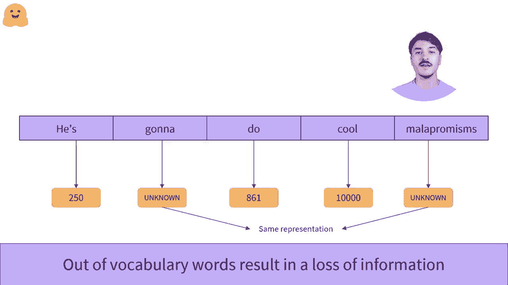

# Transformers 原理细节及NLP任务应用！P13：L2.6- 基于词的分词器 📝

在本节课中，我们将要学习一种基础的分词方法——基于词的分词器。我们将了解其核心思想、工作原理、优点以及它面临的主要挑战。

## 概述

基于词的分词是一种直观的文本处理方法。它的核心思想是通过在空格或特定标点符号处分割原始文本，将其拆分成独立的单词，并为每个单词分配一个唯一的编号或ID。

## 工作原理

上一节我们介绍了分词的基本概念，本节中我们来看看基于词的分词器具体如何工作。

这种方法首先扫描整个文本，识别出单词之间的自然分隔符，例如空格、逗号、句号等。然后，它将每个独立的单词视为一个基本单元，并为其创建一个唯一的标识符。

例如，在句子“VI 250, Du 861!”中，分词器可能会进行如下处理：
*   `VI` -> 250
*   `Du` -> 861
*   `!` -> 345

这个过程可以用一个简单的映射关系来表示：
```python
# 一个简化的词汇表映射示例
vocab = {
    “VI”: 250,
    “Du”: 861,
    “!”: 345,
    # ... 更多单词
}
```

## 优点与特点

基于词的分词方法有其显著的优势。

由于每个ID对应一个完整的单词，因此单个数字承载了丰富的语义信息。一个单词本身就包含了特定的上下文和含义，这使得模型的表示基于完整的语义单元。

## 面临的挑战

然而，这种方法也存在一些明显的局限性。以下是基于词的分词器面临的主要问题：

1.  **无法处理词形变化**：单词“dog”和“dogs”含义高度相关，仅是单复数的区别。但基于词的分词器会将它们视为两个完全不同的词，分配不同的ID，导致模型需要为它们学习两个独立的嵌入向量，无法自动捕获这种词法关联。

2.  **词汇量爆炸**：一种语言中的单词数量（即词汇表大小）可能非常庞大。如果我们希望模型理解所有可能的句子，就需要为每个单词分配一个ID。这会导致词汇表迅速膨胀。

    词汇表大小 `|V|` 过大会带来问题：每个ID都映射到一个高维向量（例如，`embedding_dim = 768`），存储所有向量的权重矩阵大小为 `|V| x embedding_dim`。当 `|V|` 很大时，模型参数会急剧增加，影响效率和存储。



3.  **未登录词问题**：为了控制模型大小，通常会限制词汇表的大小，例如只保留训练语料中最常见的10，000个单词。任何不在这个预设词汇表中的单词都会被统一标记为“未知词”。

    例如，一个处理后的未知词可能被表示为：
    ```
    [UNK]
    ```
    这是一种折衷方案，其后果是模型对所有未知单词都使用完全相同的表示，如果文本中包含大量未知词，将导致严重的语义信息丢失。


## 总结

本节课中我们一起学习了基于词的分词器。我们了解到，它通过分割空格和标点来创建单词单元，并为每个单词分配唯一ID。这种方法优点是语义单元完整，信息密度高。但其主要缺点在于难以处理词形变化、容易导致词汇表过大，并且对未登录词的处理会损失信息。理解这些特点是探索更先进分词方法的基础。