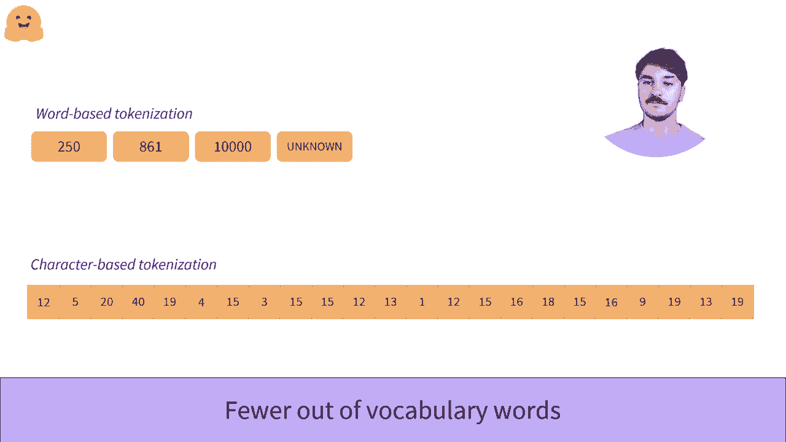

# Transformers 原理细节及NLP任务应用！P14：L2.7- 基于字符的分词器 🧩

在本节课中，我们将要学习基于字符的分词方法。我们将探讨其工作原理、优缺点，并与基于词的分词方法进行对比，以便你全面理解不同分词策略在自然语言处理中的应用。

## 概述

在深入了解基于字符的分词之前，理解这种分词的有趣之处需要了解基于词的分词的缺陷。如果你还没有看到关于基于词的组织的第一部视频，建议你在观看这个视频之前先去看看。

## 基于字符分词的基本原理

我们现在将文本拆分为单个字符而不是单词。

一般来说，有很多不同的单词和语言，而字符的数量相对较少。首先，让我们看看英语。它估计有170,000个不同的单词，因此我们需要一个非常大的词汇来涵盖所有单词。

在基于字符的词汇中，我们只需256个字符即可，这包括字母、数字和特殊字符。即使是字符众多的语言，如汉语，也可以拥有多达20,000个不同字符的字典，但不同的单词超过375,000个。

所以基于字符的词汇让我们使用比基于词的分词字典更少的不同令牌。这些词汇也比它们的基于词的词汇更完整，因为我们的词汇包含了语言中使用的所有字符，甚至在分词器训练期间未见过的单词仍然可以被分词。

## 基于字符分词的优点

以下是基于字符分词的主要优势：

*   **词汇量小且完整**：词汇表仅包含所有可能的字符，数量远小于单词词汇表，且能覆盖所有字符。
*   **强大的泛化能力**：能正确处理训练时未见过的新词或拼写错误的单词，不会将其标记为未知令牌。
*   **解决未登录词问题**：避免了基于词的分词中常见的未登录词问题。

## 基于字符分词的缺点与挑战

然而，这个算法也并不完美。

直观地说，字符单独所承载的信息不如一个单词所承载的信息多。例如，单词 `language` 比其首个字符 `L` 承载了更多的信息。当然，这并不适用于所有语言。

因为一些语言（如表意文字语言）在单个字符中承载了很多信息。但对于像罗马字母这样的语言，模型必须同时理解多个令牌才能获取原本在单词中承载的信息。

这导致了基于字符的分词器的另一个问题。它们的序列被转换为大量的令牌供模型处理。这可能会影响模型携带的上下文大小，并减少我们可以用作模型输入的文本大小，这通常是有限的。

以下是其主要缺点：

*   **信息密度低**：单个字符的语义信息较弱，模型需要学习更长的序列来理解相同内容。
*   **序列长度激增**：分词后产生的令牌序列非常长，可能超出模型的上下文窗口限制。
*   **计算效率较低**：处理更长的序列通常需要更多的计算资源和时间。

## 应用与总结

这个组织虽然有一些问题，但在过去取得了一些非常好的结果。因此，在面对新问题时，应考虑它，因为它解决了基于词的算法中遇到的问题。

本节课中我们一起学习了基于字符的分词方法。我们了解到，它将文本分解为单个字符，从而构建出更小、更完整的词汇表，并有效解决了未登录词问题。然而，这种方法也带来了序列过长、信息密度低的挑战。在实际应用中，需要根据具体任务和语言特性，权衡利弊，选择合适的分词策略。