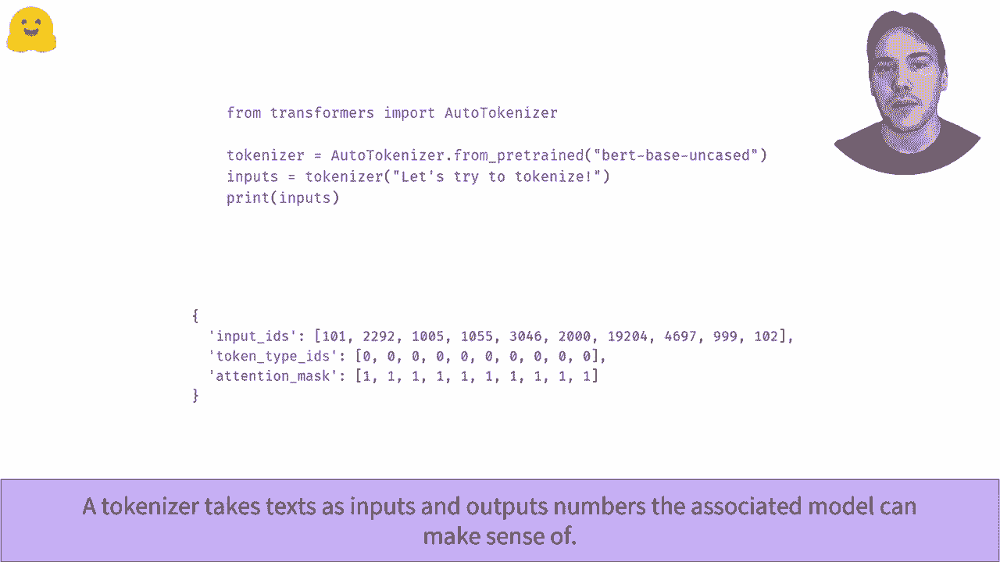

# Transformers 原理细节及NLP任务应用！P16：L2.9- Tokenizer流水线处理 🧩

在本节课中，我们将学习Tokenizer（分词器）如何将原始文本转换为模型能够理解的数字序列。我们将详细拆解其内部处理流水线，并了解其中的关键步骤。

---

## 概述

Tokenizer是自然语言处理中的关键组件，它负责将文本字符串转换为模型可以处理的数字ID序列。本节将深入探讨这一转换过程的具体步骤。

---

## 文本到标记的拆分

首先，Tokenizer会将输入文本拆分成更小的单元，这些单元被称为“标记”。标记可以是完整的单词、单词的一部分（子词），或者是标点符号。

为此，Tokenizer会执行一系列预处理操作，例如将文本转换为小写，然后根据特定规则将结果拆分成小块。大多数现代Transformer模型使用**子词分词算法**，这意味着一个单词可能被拆分为多个标记。

以下是使用Tokenizer进行分词的基本代码示例：
```python
from transformers import AutoTokenizer
tokenizer = AutoTokenizer.from_pretrained("bert-base-uncased")
tokens = tokenizer.tokenize("Hello world!")
print(tokens)
# 输出可能类似于: ['hello', 'world', '!']
```

---

## 添加特殊标记与约定

在分词过程中，Tokenizer可能会添加一些特殊标记，并遵循特定的约定。

例如，某些Tokenizer（如BERT）会使用 `[CLS]` 和 `[SEP]` 这样的特殊标记来表示句子的开始和分隔。而像ALBERT这样的Tokenizer，则可能在所有前面有空格的标记前添加一个下划线 `▁` 作为约定。这些约定确保了不同模型和任务间标记化的一致性。

---

## 标记到ID的映射

分词流水线的第二步，是将上一步得到的文本标记映射为词汇表中对应的唯一数字ID。

这就是为什么在使用预训练模型时，我们需要下载对应的词汇表文件。我们必须确保使用的ID映射与模型训练时完全相同。我们使用 `convert_tokens_to_ids` 方法来完成这一映射。

以下是将标记列表转换为ID列表的代码：
```python
token_ids = tokenizer.convert_tokens_to_ids(tokens)
print(token_ids)
# 输出为一串数字，例如: [7592, 2088, 999]
```

你可能会注意到，此时的ID列表可能还不完整，缺少了像 `[CLS]` 和 `[SEP]` 这样的特殊标记对应的ID。

---

## 添加特殊标记并编码

为了生成模型所需的完整输入，我们需要使用Tokenizer的编码方法（如 `encode` 或 `__call__`）。这些方法知道词汇表中特殊标记的索引，并会自动在输入ID列表的开头和结尾添加相应的数字。

不同的Tokenizer使用的特殊标记可能不同。例如，BERT使用 `[CLS]` 和 `[SEP]`，而RoBERTa则使用 `<s>` 和 `</s>`。

你可以使用Tokenizer的 `decode` 方法来观察编码和解码的过程，验证文本是否被正确转换。

---

## 最终输出与更多信息

现在你了解了Tokenizer的工作原理。在实际应用中，你通常不需要关心所有中间步骤，只需在输入文本上直接调用Tokenizer即可。

然而，Tokenizer的输出不仅仅包含 `input_ids`（输入ID序列）。完整的输出通常还包括：
*   **attention_mask**（注意力掩码）：用于区分真实标记和填充标记。
*   **token_type_ids**（标记类型ID）：用于区分句子对中的不同句子。

要了解如何处理批量输入或句子对，请参考相关的专题视频。



---

## 总结


本节课我们一起学习了Tokenizer的完整流水线处理过程。我们了解到，这个过程主要包含三个核心步骤：
1.  **分词**：将文本拆分为标记（可能是子词）。
2.  **映射**：根据词汇表将标记转换为唯一的数字ID。
3.  **格式化**：添加必要的特殊标记（如 `[CLS]`, `[SEP]`），并生成包括 `attention_mask` 在内的完整模型输入。

理解这一流程是有效使用Transformer模型进行NLP任务的重要基础。