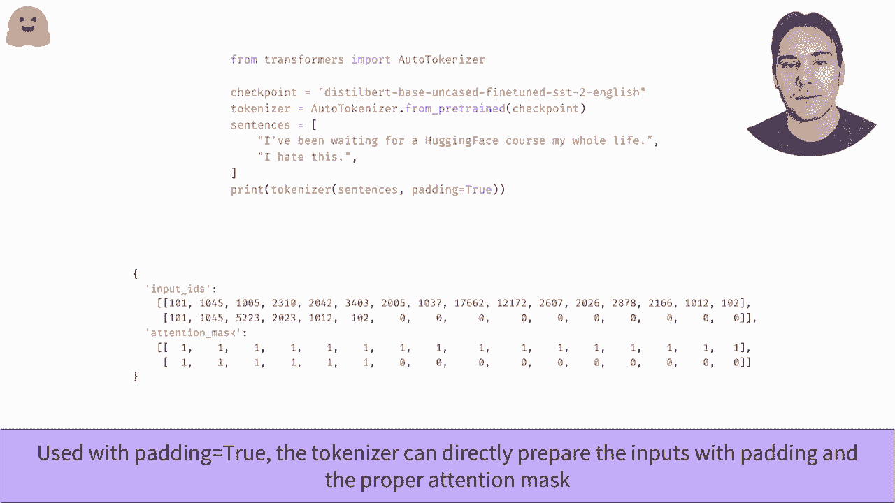

# Transformers 原理细节及NLP任务应用！P18：L2.11- 批处理输入(TensorFlow) 🤖

在本节课中，我们将学习如何将多个不同长度的句子组合成一个批次，并输入到Transformer模型中。我们将重点介绍**填充**和**注意力掩码**这两个核心概念，它们是实现高效批处理的关键。

---

## 概述

在自然语言处理任务中，我们通常需要同时处理多个句子。然而，这些句子的长度往往各不相同。为了将它们高效地输入到模型中，我们需要将它们处理成统一的格式。本节将详细讲解如何通过**填充**使序列等长，以及如何使用**注意力掩码**来确保模型在处理填充后的序列时，其注意力机制不受填充标记的干扰。

---

## 批处理中的长度不一致问题

上一节我们介绍了如何将单个句子转换为模型可接受的输入。本节中我们来看看，当同时处理多个句子时会遇到什么挑战。

当我们有两个句子需要进行情感分类时，首先会对它们进行分词并映射为输入ID。例如：

```python
# 假设有两个句子
sentence1 = ["I", "love", "this", "movie"]
sentence2 = ["It", "was", "terrible"]
# 转换为输入ID后
input_ids1 = [101, 1045, 2293, 2023, 3185, 102]  # 长度为6
input_ids2 = [101, 2009, 2001, 9999, 102]        # 长度为5
```

可以看到，我们得到了两个长度不同的列表。如果直接尝试将它们组合成一个张量（如 `tf.constant([input_ids1, input_ids2])`），程序会报错，因为张量要求所有维度是规则的（即矩形）。

---

## 解决方案：填充与截断

为了解决长度不一致的问题，主要有两种方法：**填充**和**截断**。

以下是两种方法的详细说明：

1.  **填充**：在较短的序列末尾添加一个特殊的**填充标记**，使其长度与最长的序列一致。这个填充标记的ID不应随意选择，而应使用分词器预定义的 `pad_token_id`。例如，在BERT中，填充标记通常是 `[PAD]`，其ID为0。

2.  **截断**：将较长的序列截断到与最短序列相同的长度。这种方法会丢失信息，因此通常只在句子长度超过模型最大处理限制时使用。例如，如果模型最大长度为512，而句子有600个词，则必须进行截断。

**核心公式**：对于一个批次 `B` 中的 `N` 个序列，其长度分别为 `L1, L2, ..., Ln`。设最大长度为 `L_max = max(L1, L2, ..., Ln)`。
*   **填充**后，每个序列长度变为 `L_max`。
*   **截断**后，每个序列长度变为 `L_min = min(L1, L2, ..., Ln)`。

---

## 注意力掩码的重要性

上一节我们介绍了填充的方法，本节中我们来看看为什么仅仅填充还不够。

如果我们简单地将填充后的两个句子单独或批量输入模型，会发现有效句子（即非填充部分）的输出结果并不相同。这是因为Transformer模型的核心——**注意力层**——在计算每个词的上下文表示时，会关注序列中的所有其他词，包括我们添加的填充标记。

为了在有填充的情况下获得与无填充时相同的结果，我们必须告诉注意力层忽略这些填充标记。这是通过**注意力掩码**实现的。

注意力掩码是一个与输入ID张量形状完全相同的张量，其值为：
*   **1**：表示对应的词是真实内容，注意力层应予以考虑。
*   **0**：表示对应的词是填充标记，注意力层应忽略。

例如，对于填充后的输入：
```
输入IDs:  [101, 1045, 2293, 2023, 3185, 102, 0]
注意力掩码: [1,    1,    1,    1,    1,    1, 0]
```
将输入ID和注意力掩码一同传递给模型，就能确保模型只关注有效内容，从而得到与处理单个句子时一致的结果。

---

## 使用Tokenizer自动处理

在实际应用中，我们无需手动进行填充和创建掩码。Hugging Face的 `Tokenizer` 提供了便捷的方法。

当你使用 `tokenizer` 处理多个句子，并设置参数 `padding=True` 时，它会自动完成以下工作：
1.  将所有句子填充到批次内的最大长度。
2.  使用正确的 `pad_token_id` 进行填充。
3.  生成对应的注意力掩码。

```python
import tensorflow as tf
from transformers import AutoTokenizer

tokenizer = AutoTokenizer.from_pretrained("bert-base-uncased")
sentences = ["I love this movie.", "It was terrible."]



# 自动批处理，包含填充和掩码
batch_encoding = tokenizer(sentences, padding=True, truncation=True, return_tensors="tf")
print(batch_encoding["input_ids"])
print(batch_encoding["attention_mask"])
```

---


## 总结

本节课中我们一起学习了Transformer模型批处理输入的核心技术。我们了解到，处理不同长度句子的关键在于**填充**和**注意力掩码**。填充确保了输入张量的形状规则，而注意力掩码则保证了模型的注意力机制不会被填充标记干扰，从而得到正确的计算结果。最后，我们看到了如何使用 `Tokenizer` 的 `padding` 参数来自动化这一过程，这在实际项目中是最高效和准确的做法。