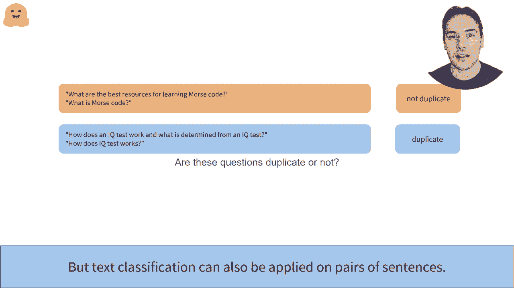
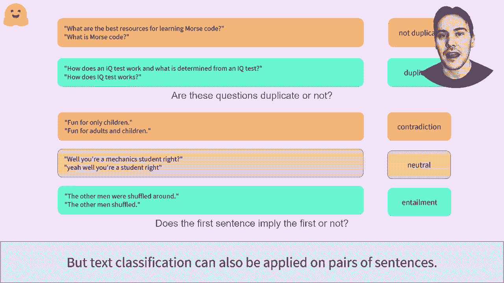
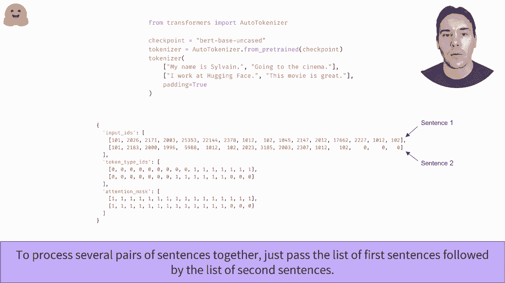
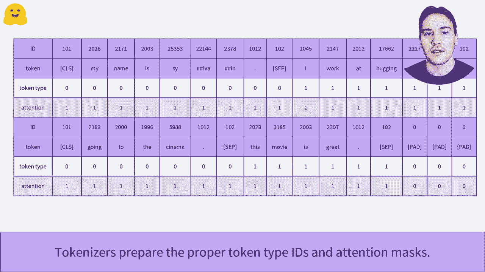

# Transformers原理细节及NLP任务应用！P19：L3.2- 预处理句对数据(PyTorch) 📚

在本节课中，我们将要学习如何使用PyTorch和`transformers`库对句子对数据进行预处理。这是处理许多重要自然语言处理任务（如重复问题检测、自然语言推理等）的关键步骤。

上一节我们介绍了如何对单个句子进行分词和编码。本节中我们来看看如何处理由两个句子组成的输入对。

## 句对任务概述

许多NLP任务需要同时处理两个句子。例如，我们可能需要判断两个文本是否相同，或者它们在逻辑上是否相关。



以下是两种常见的句对分类任务：

1.  **重复问题识别**：判断两个问题是否在语义上重复。例如，从Quora问题对数据集中提取的示例中，需要识别两个问题是否为重复问题。
    

2.  **自然语言推理**：判断两个句子之间的逻辑关系（如蕴含、矛盾或中立）。例如，从MultiNLI数据集中提取的例子，需要为每对句子分配一个标签（矛盾/中立/蕴含）。
    

句对分类是一个重要的问题。在GLUE等学术基准测试中，10个数据集里有8个都专注于使用句子对的任务。因此，像BERT这样的模型通常采用双重训练目标，除了语言建模，还包含与句对相关的目标（如下一句预测）。


## 使用Tokenizer处理句对

幸运的是，`transformers`库中的Tokenizer提供了简洁的API来处理句子对。你只需将两个句子作为参数传递给它。

除了我们已经熟悉的`input_ids`和`attention_mask`，分词器还会返回一个名为`token_type_ids`的新字段。这个字段告诉模型哪些标记属于第一句，哪些属于第二句。

以下是一个处理句对的代码示例：

```python
from transformers import AutoTokenizer

tokenizer = AutoTokenizer.from_pretrained(“bert-base-uncased”)
sentence_a = “How old are you?”
sentence_b = “What is your age?”

# 关键步骤：将两个句子作为参数传递
encoded_input = tokenizer(sentence_a, sentence_b, return_tensors=“pt”)
print(encoded_input.keys()) # 输出: dict_keys([‘input_ids’, ‘token_type_ids’, ‘attention_mask’])
```

让我们放大观察编码后的输出结构：
*   `input_ids`: 包含特殊标记（如`[CLS]`, `[SEP]`）和两个句子分词后的ID序列。
*   `token_type_ids`: 一串数字（通常是0和1），用于区分两个句子。例如，第一句的所有标记对应0，第二句的所有标记对应1。
*   `attention_mask`: 指示哪些是真实标记（1），哪些是填充标记（0）。

其结构可以表示为：
`[CLS]` + **句子A的标记** + `[SEP]` + **句子B的标记** + `[SEP]`

## 批量处理多个句对

在实际应用中，我们通常需要批量处理数据。我们可以通过传递两个句子列表（第一个句子列表和第二个句子列表）来实现。

以下是批量处理的示例：

```python
sentences_a = [“Sentence A1”, “Sentence A2”]
sentences_b = [“Sentence B1”, “Sentence B2”]



batch_encoded = tokenizer(sentences_a, sentences_b, padding=True, return_tensors=“pt”)
```


放大后可以看到，分词器会自动为较短的句对添加填充（`[PAD]`），使批次内所有样本长度一致。同时，它会正确生成每对句子的`token_type_ids`和`attention_mask`。




## 总结

本节课中我们一起学习了如何使用`transformers`库的Tokenizer对句子对数据进行预处理。我们了解了句对任务（如NLI和重复检测）的重要性，掌握了通过传递两个参数给分词器来编码句对的方法，并认识了由此产生的三个关键输出：`input_ids`、`token_type_ids`和`attention_mask`。最后，我们还学习了如何批量处理多个句对，这是将模型应用于实际数据的关键步骤。