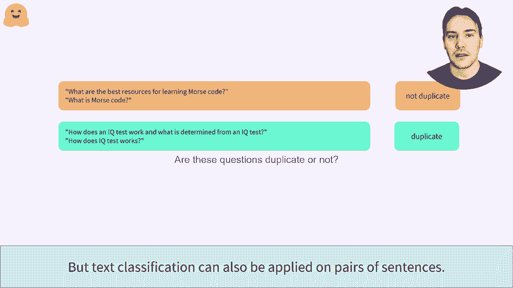
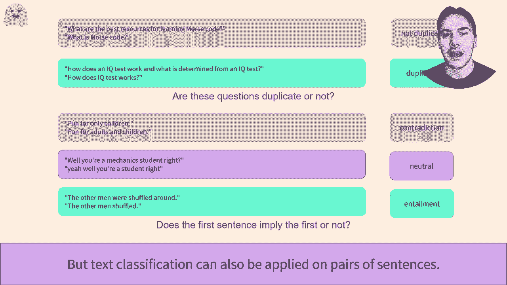
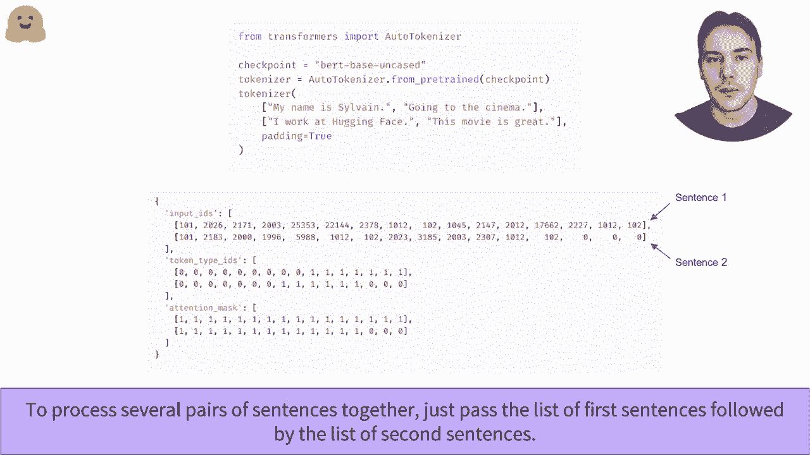
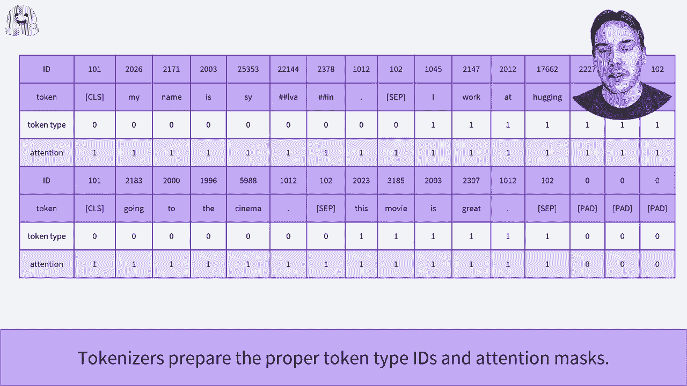
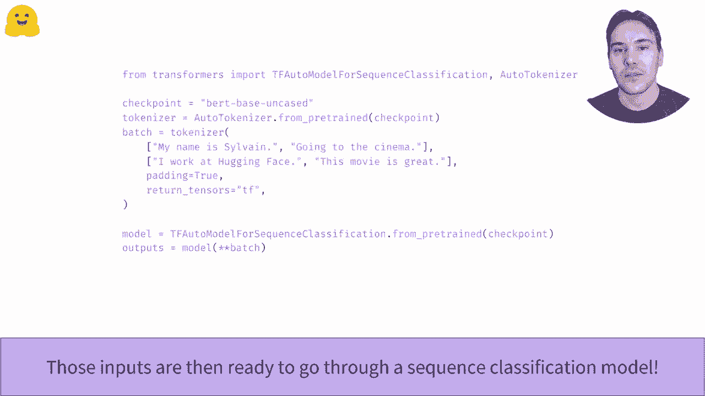

# Transformers原理细节及NLP任务应用！P25：L4.2- 预处理句对数据集(TensorFlow) 🤖

在本节课中，我们将要学习如何处理句子对数据，这是自然语言处理中一项常见且重要的任务。我们将了解为何需要处理句子对，并学习如何使用TensorFlow和Transformers库中的分词器来高效地预处理这类数据。

## 为何需要处理句子对？🤔

上一节我们介绍了如何对单个句子进行分类和批量处理。本节中我们来看看如何处理由两个句子组成的输入对。分类句子对是一项关键任务，例如，判断两个问题是否重复，或者判断两个句子在逻辑上是否相关。

以下是两个具体的应用示例：

*   **重复问题识别**：例如，判断“如何学习编程？”和“编程学习方法是什么？”是否为重复问题。
*   **自然语言推理**：判断两个句子之间的关系，标签通常为“矛盾”、“无关”或“蕴涵”。例如，“猫在垫子上”与“动物在家具上”构成“蕴涵”关系。

实际上，在GLUE等权威的文本分类基准测试中，10个数据集里有8个都集中在句子对任务上。因此，像BERT这样的预训练模型通常也包含针对句子对设计的训练目标。

## 使用分词器处理句子对 🛠️

幸运的是，使用Transformers库中的分词器处理句子对非常简单。你只需将两个句子作为参数传递给分词器。

以下是传递给分词器的核心参数：

*   `text`：第一个句子。
*   `text_pair`：第二个句子。
*   `padding`：填充策略，例如 `padding=‘max_length’` 或 `padding=True`。
*   `truncation`：截断策略。
*   `return_tensors`：返回的张量格式，例如 `return_tensors=‘tf’`。

除了我们熟悉的`input_ids`（输入ID）和`attention_mask`（注意力掩码）外，处理句子对时还会返回一个关键的字段：`token_type_ids`（分词类型ID）。这个字段告诉模型哪些分词属于第一个句子，哪些属于第二个句子。

让我们通过一个例子来看输入是如何组织的。假设我们有两个句子：
1.  “How old are you?”
2.  “What is your age?”

分词器会将它们处理为以下格式：
`[CLS] How old are you ? [SEP] What is your age ? [SEP]`

对应的`token_type_ids`可能是：
`[0, 0, 0, 0, 0, 0, 0, 1, 1, 1, 1, 1, 1]`
这里，`0` 表示属于第一个句子的分词，`1` 表示属于第二个句子的分词。

## 批量处理多个句子对 📦

如果需要处理多个句子对，可以高效地批量进行。

以下是批量处理的方法：

*   将第一个句子列表传递给 `text` 参数。
*   将对应的第二个句子列表传递给 `text_pair` 参数。
*   分词器会自动进行填充，使批次内所有样本长度一致，并正确生成每个样本的 `attention_mask` 和 `token_type_ids`。

处理完成后，得到的字典（包含`input_ids`, `attention_mask`, `token_type_ids`）就可以直接输入到Transformer模型中进行训练或推理。

## 总结 📝

本节课中我们一起学习了句子对数据的预处理。我们首先了解了句子对任务的重要性及其常见应用场景，如重复问题检测和自然语言推理。接着，我们重点掌握了如何使用Transformers库的分词器来处理句子对，特别是理解了`token_type_ids`的作用。最后，我们学习了如何批量处理多个句子对以提高效率。掌握这些步骤是构建基于Transformer的句子对分类模型的基础。