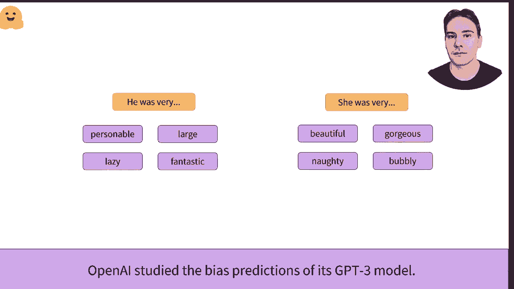

# Transformers 原理细节及NLP任务应用！P3：L1.3- 什么是迁移学习？ 🤖➡️📚

在本节课中，我们将要学习**迁移学习**的核心概念、工作原理及其在自然语言处理（NLP）和计算机视觉（CV）领域的应用。我们将探讨其优势、实施方法以及需要注意的潜在问题。

## 概述

迁移学习的理念是利用在另一个任务上用大量数据训练的模型所获得的知识。模型A将专门为任务A进行训练。现在假设你想为不同的任务B训练它。一种选择是从头开始训练模型，这可能需要大量计算、时间和数据。

相反，我们可以用与模型A相同的权重初始化模型B，从而将模型A在任务A上获得的知识转移过来。从头开始训练时，所有的中间权重都是随机初始化的。

## 迁移学习的工作原理

上一节我们介绍了迁移学习的基本理念，本节中我们来看看它的具体工作原理和效果对比。

在这个例子中，我们在识别两个句子是否相似的任务上训练一个模型。左边是从头开始训练，右边是微调的预训练模型。可以看到，在预训练模型上使用迁移学习能取得更好的结果。

而且无论我们训练多久，从头开始的训练保持在70%的准确率，而微调的模型则能轻松达到86%。这是因为预训练模型通常是在大量数据上训练的，它提供了一个模型对在预训练期间使用的语言有统计理解。

## 迁移学习的应用领域

了解了其工作原理后，我们来看看迁移学习在不同领域的成功应用。

在计算机视觉中，迁移学习已经成功应用了近10年。模型通常在一个包含120万张照片的ImageNet数据集上进行微调，每张图像被分类为1000个类别之一。这样的训练方式使用有标签数据，称为**监督学习**。

在自然语言处理领域，迁移学习相对较新。与ImageNet的一个关键区别在于，训练通常是**自监督**的，这意味着不需要人工标注。

以下是两个常见的自监督预训练目标示例：

*   **预测下一个词**：一个很常见的预训练目标是猜测句子中的下一个单词。这只需要大量的文本。例如，GPT-2就是这样使用用户在Reddit上发布的4500万个链接的内容来训练的。
*   **掩码语言建模**：另一个自监督预训练目标的例子是预测随机掩蔽的词汇，这类似于你在学校做的完形填空测试。BERT模型就是通过使用英语维基百科和1,000本已出版的书籍来以此方式训练的。

## 如何实施迁移学习

上一节我们看到了迁移学习的应用场景，本节中我们来看看在实践中如何具体实施它。

在实践中，迁移学习是通过抛弃一个给定模型的**头部**来应用的，即其最后几层专注于预训练目标。然后我们用一个新随机初始化的头部进行适配。

例如，当你早些时候在构建模型时，我们移除了分类器的部分，并用具有两个输出的分类器替换它，因为我们的任务是两个类别的分类。

为了尽可能高效，所用的预训练模型应该与其微调的任务尽可能相似。例如，如果问题是对德语句子进行分类，最好使用在德语语料上预训练的模型。

## 迁移学习的潜在问题

好的东西也会带来坏处。这个模型不仅传递其知识，还传递它可能包含的任何偏见。

ImageNet主要包含来自美国和西欧的图像。因此，用它微调的模型通常在这些国家的图像上表现更好。

但研究也揭示了其GPT-2预测中的偏见，这涉及到使用代词（如“he”/“she”）与职业词汇之间的关系。将性别从“he”改为“she”改变了大部分中性职业的预测，几乎仅限于体力劳动职业。

在GPT-2模型的发布文档中，OpenAI也承认其偏见，并不鼓励在与人类互动的系统中不加审查地使用它。

## 总结

本节课中我们一起学习了**迁移学习**。我们了解到，迁移学习通过复用预训练模型的知识，能显著减少新任务所需的计算资源和数据量，并通常能获得更好的性能。它在计算机视觉和自然语言处理中都有广泛应用，实施的关键步骤是替换模型的最后一层（头部）并进行微调。同时，我们必须意识到预训练模型可能携带的数据偏见，并在应用时保持谨慎。