# Transformers原理细节及NLP任务应用！P30：L5.1 - 模型Hub中心速览 🧭

在本节课中，我们将学习如何浏览和使用Hugging Face模型中心。这是一个托管了数千个预训练模型的平台，涵盖自然语言处理、计算机视觉、音频等多个领域。掌握如何高效地查找和了解这些模型，是应用它们的第一步。

## 主页与模型库入口

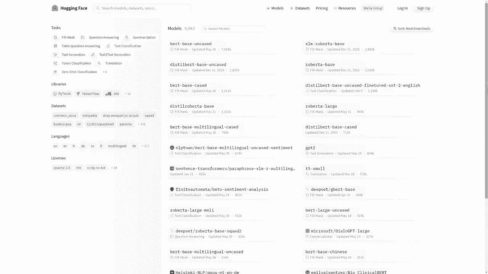

要访问Hugging Face的模型库，首先进入其官网主页。在页面右上角，点击“模型”选项卡，即可进入模型库的主界面。


## 左侧筛选类别详解

进入模型库后，页面左侧提供了多个筛选类别，可以帮助你快速定位到所需的模型。以下是各个类别的具体功能：

**第一类是任务。** 模型库中的模型可用于多种任务。这包括自然语言处理任务，如问答或文本分类，但也不仅限于此。其他领域的任务也可用，例如计算机视觉中的图像分类，或语音识别中的自动语音识别。

**第二类是库。** 模型库中的模型通常基于几种主流深度学习框架构建。最常见的三种是：`PyTorch`、`TensorFlow`或`JAX`。然而，其他框架的模型，如`Rust`或`ONNX`，也存在。此选项卡也可用于指定模型来自哪个高层库，这包括`transformers`库，但不局限于此。模型库用于托管许多不同框架的模型，平台也在积极寻找托管其他框架模型的机会。

**第三类是数据集。** 从该选项卡中选择一个数据集，意味着筛选出在该特定数据集上训练过的模型。

**第四类是语言。** 从此选项卡中选择一种语言，意味着筛选出能够处理所选语言的模型。

**最后一类是许可证。** 此类允许你根据模型的共享许可证进行筛选，这对于商业应用或开源项目合规性非常重要。

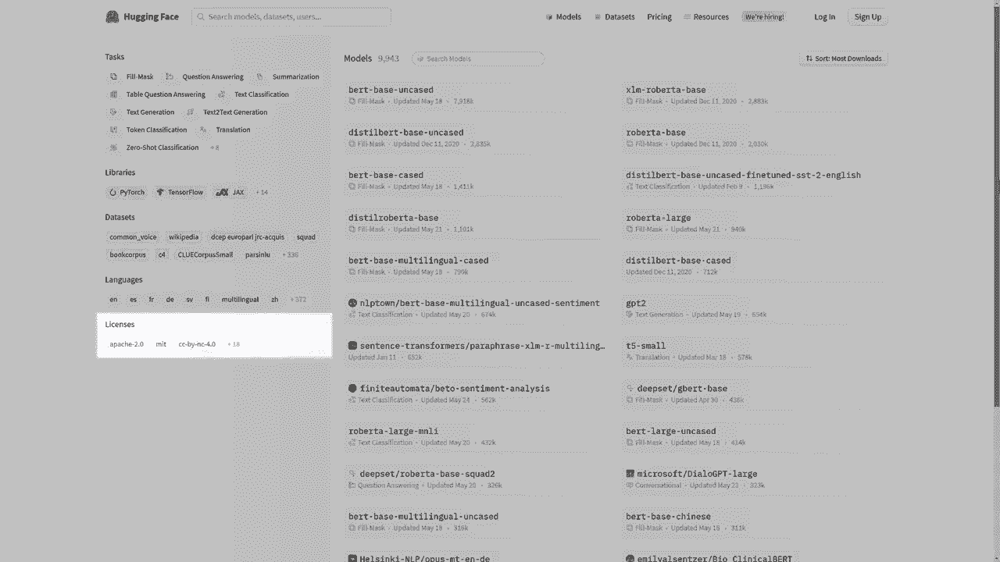
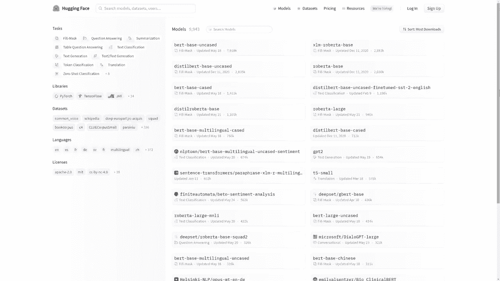

## 模型列表与排序


在页面右侧，你会看到模型库中可用的模型列表。

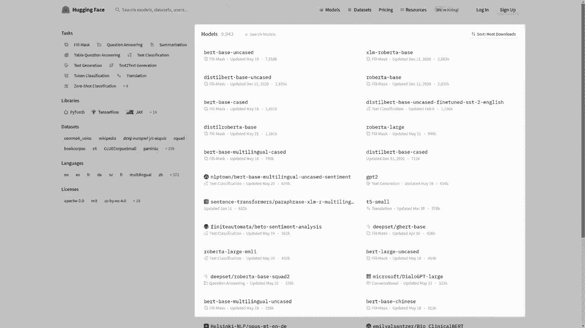


模型默认按下载量进行排序，这通常反映了模型的流行度和可靠性。点击任意一个模型，即可进入其详情页面。

## 模型卡：核心信息页面


点击模型后，你将看到其“模型卡”。模型卡是了解一个模型最关键的部分，它包含了关于该模型的全面信息。

模型卡通常包括以下内容：
*   **描述**：模型的基本介绍和设计目的。
*   **预期用途**：说明模型适合在什么场景下使用。
*   **限制和偏见**：指出模型的局限性以及可能存在的偏见，这对负责任地使用AI至关重要。
*   **代码片段**：展示如何使用该模型的示例代码。
*   **训练信息**：可能包括训练过程、使用的数据处理方法。
*   **评估结果**：模型在标准数据集上的性能指标。
*   **版权信息**：模型的许可证详情。

这些信息对于正确、高效地使用模型非常重要。一份制作精良的模型卡，能让其他用户更容易理解并应用该模型。

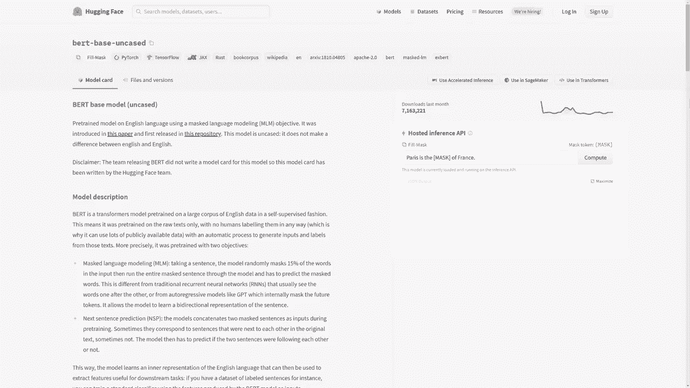

## 交互式推理API


在模型卡的右侧，你会找到“推理API”区域。

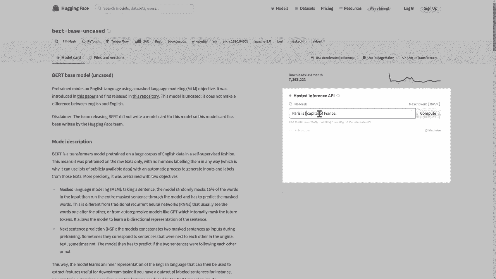
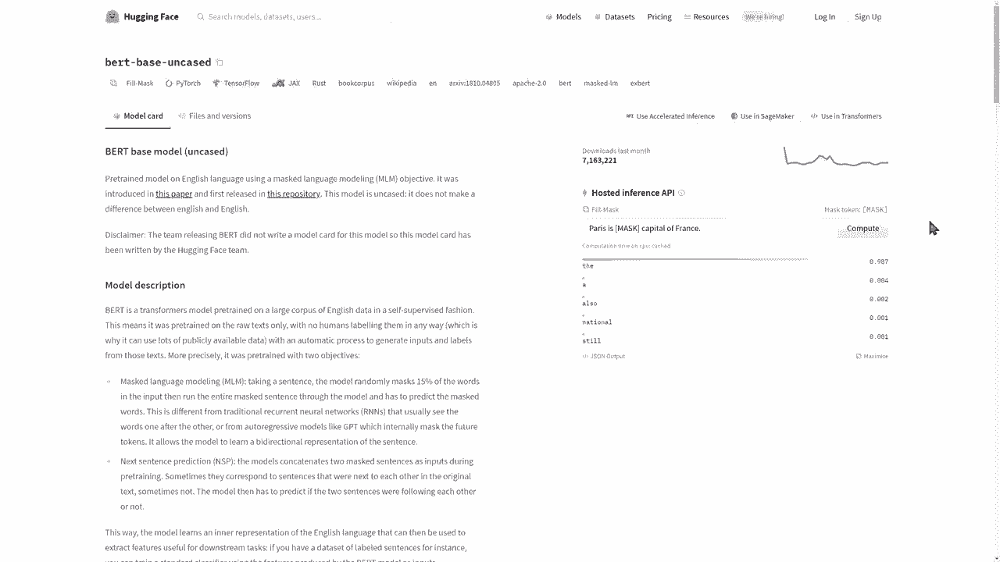

这个工具允许你直接在网页上与模型进行交互。你可以输入文本（对于NLP模型）或其他类型的数据，然后点击“Compute”按钮，即可看到模型对你输入的实时预测结果。这是一个快速测试模型能力的好方法。


## 模型标签与仓库信息


在模型卡屏幕的顶部，你可以看到一系列标签。😊

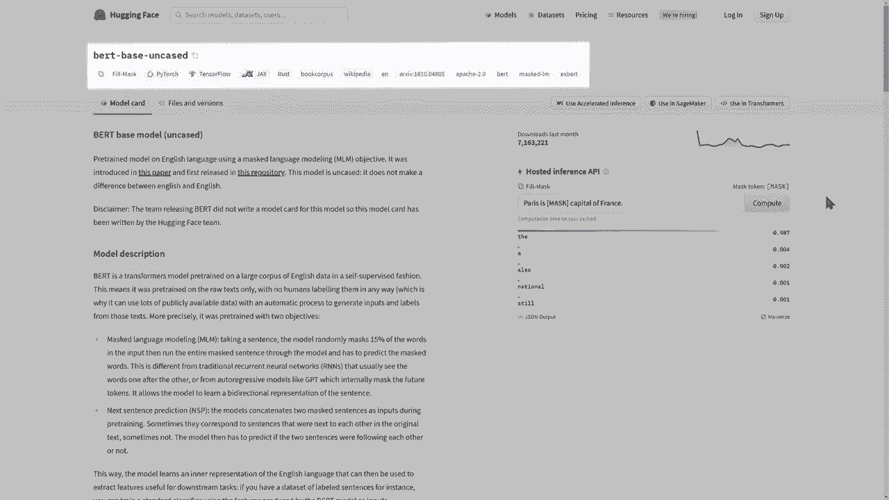

这些标签标明了模型的任务类型，以及其他与左侧筛选类别相关的信息，如使用的框架、语言等，让你对模型有一个快速的概览。


点击“文件和版本”选项卡，可以查看该模型的Git仓库结构。

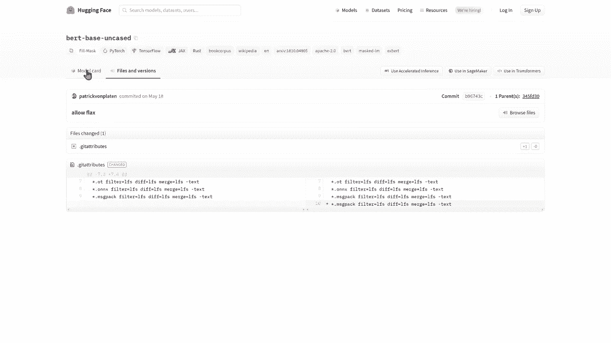

这里展示了定义该模型的所有文件，包括配置文件、模型权重等。你可以看到Git仓库的所有常规功能，例如可用的分支、提交历史记录以及不同提交之间的代码差异。


## 实用功能按钮

在模型卡顶部，通常有三个非常实用的按钮，提供了进一步使用模型的途径。

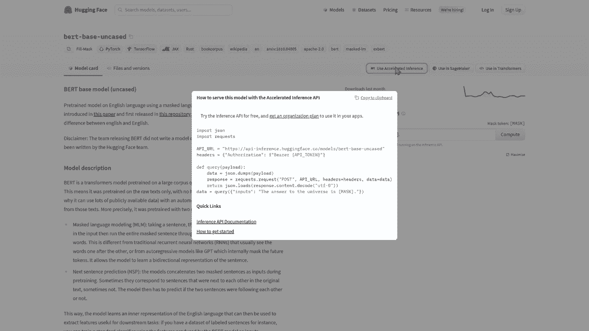

**第一个按钮**展示了如何以编程方式使用推理API。它会提供一段代码示例，教你如何通过HTTP请求调用该模型的API服务。


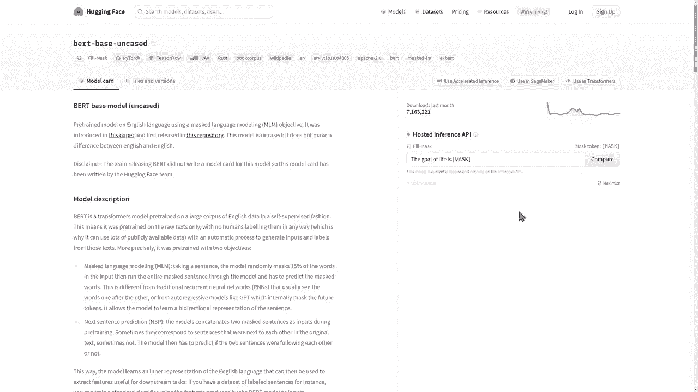


**第二个按钮**展示了如何在Amazon SageMaker云服务中训练这个模型。

**最后一个按钮**展示了如何在相应的代码库中加载该模型。对于大多数基于`transformers`库的模型，点击它会显示类似以下的加载代码：
```python
from transformers import AutoModel, AutoTokenizer
model = AutoModel.from_pretrained("模型名称")
tokenizer = AutoTokenizer.from_pretrained("模型名称")
```

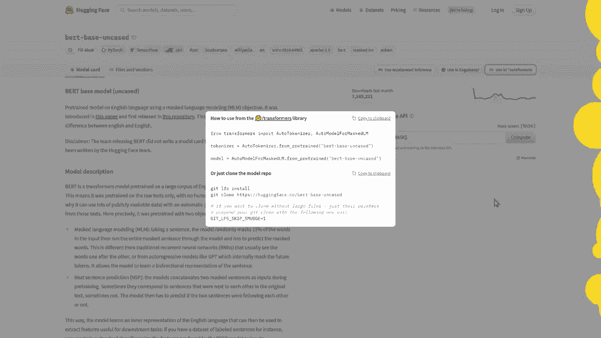


---

本节课中，我们一起学习了Hugging Face模型中心的完整浏览方法。我们从主页入口开始，详细了解了左侧的各类筛选条件，学会了如何查看模型列表和解读详细的模型卡信息。我们还实践了使用交互式推理API测试模型，并探索了模型标签、文件仓库以及顶部的实用代码按钮。掌握这些知识，你将能在这个庞大的模型库中自如地探索，并为后续的模型下载与应用打下坚实基础。