# Transformers 原理细节及NLP任务应用！P33：L6.1 - Sylvain的在线直播讲解 📚

在本节课中，我们将要学习Transformer模型的基本原理及其在自然语言处理任务中的应用。我们将从高层次概述开始，逐步深入到编码器、解码器以及序列到序列模型的具体架构和工作原理。

## 概述

欢迎来到本课程的第一章。本节将概括性地介绍Transformer模型的功能。我们将学习如何从Hugging Face Hub下载预训练模型，并利用自己的数据进行文本分类任务。课程分为三部分：第一部分介绍基础应用；第二部分深入探讨所有NLP任务的微调方法；第三部分将进一步深化。完成本部分后，你将能够下载模型、应用于自己的问题，并将结果上传分享。

---

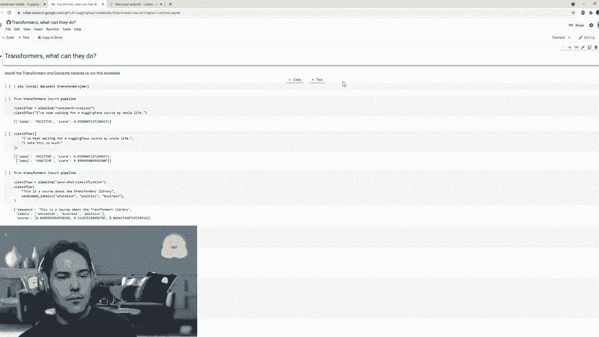


## 1. NLP任务简介

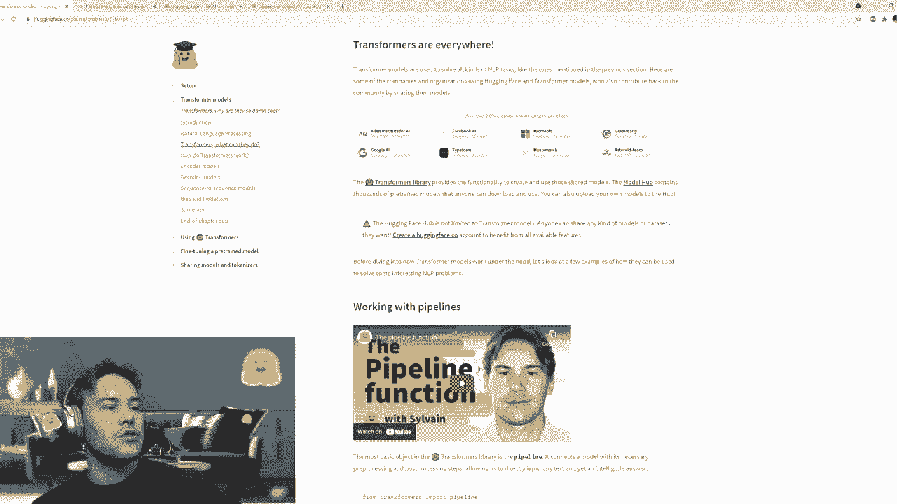

上一节我们介绍了课程的整体结构，本节中我们来看看Transformer模型主要处理哪些NLP任务。

NLP代表自然语言处理，这是一个处理人类语言的领域。NLP任务的目标通常是对文本进行分类或生成。


以下是几种主要的NLP任务类型：
*   **文本分类**：例如，判断评论的情感（正面/负面）、检测邮件是否为垃圾邮件、判断句子语法是否正确。
*   **词元分类**：对文本中的每个词进行分类，例如命名实体识别，判断一个词是人名、地点还是组织。
*   **文本生成**：根据提示补全文本，例如手机输入法建议、Gmail的邮件智能补全。
*   **问答系统**：从给定的长文本中提取问题的答案。
*   **序列到序列任务**：根据输入文本生成新的句子，例如翻译、文本摘要、风格转换。

在深度学习普及之前，处理这些任务通常依赖人工编写的规则。而现代方法主要使用基于Transformer的预训练模型和Hugging Face库。这些模型通过大量数据和梯度下降算法进行训练，不断优化损失函数，最终形成一个能够很好泛化的“黑箱”模型。

---

## 2. 实践入门：使用Pipeline

了解了NLP任务后，本节我们来看看如何快速使用Transformer模型。最简便的方式是使用Hugging Face提供的`pipeline`函数。

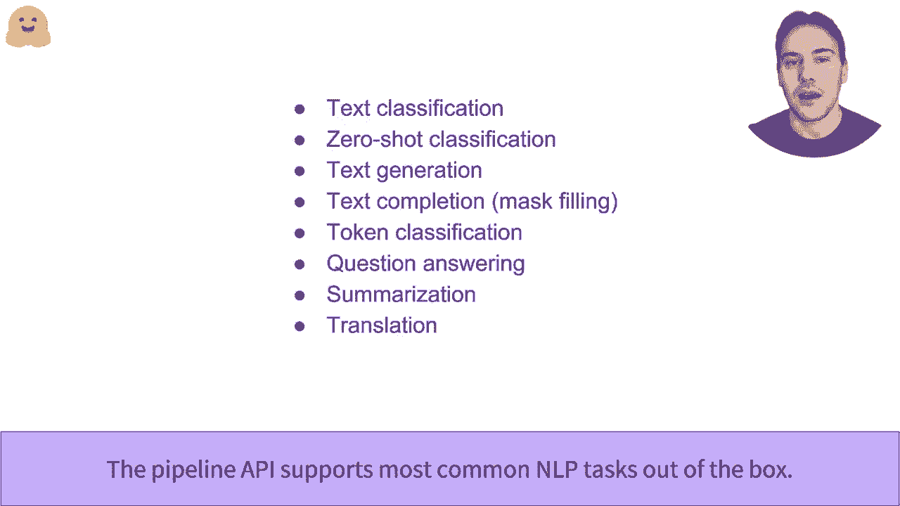


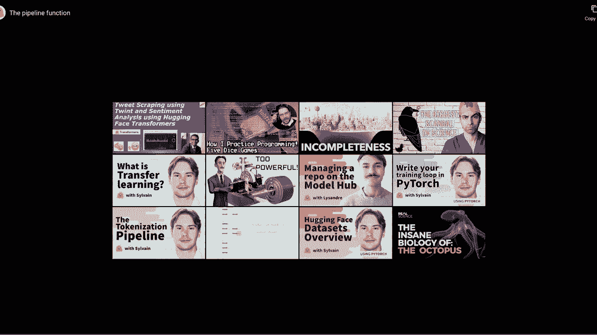

`pipeline`是Transformers库中最高层次的API，它将文本预处理、模型推理和后处理步骤封装在一起，让用户只需几行代码就能完成复杂的NLP任务。

以下是`pipeline`支持的一些常见任务示例：

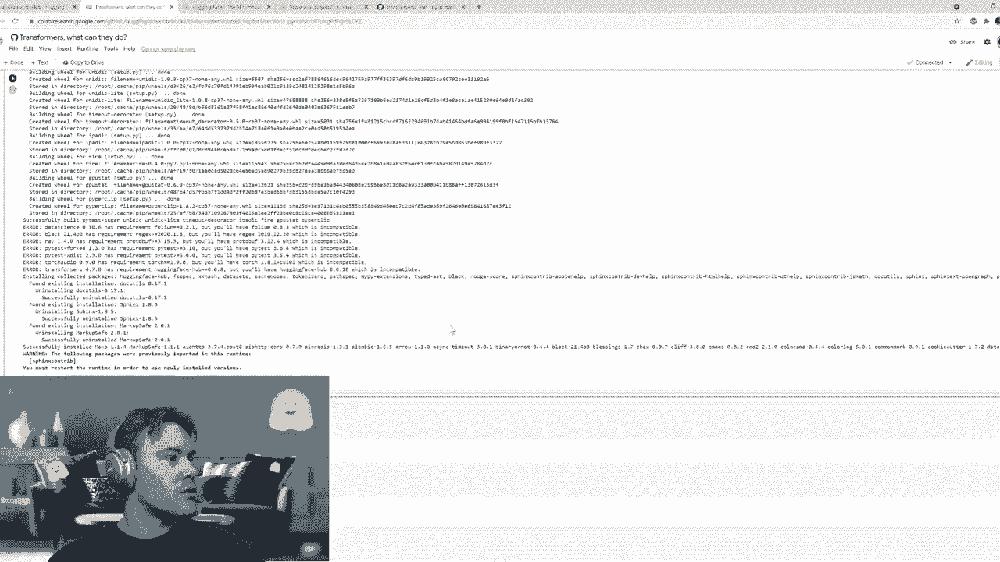

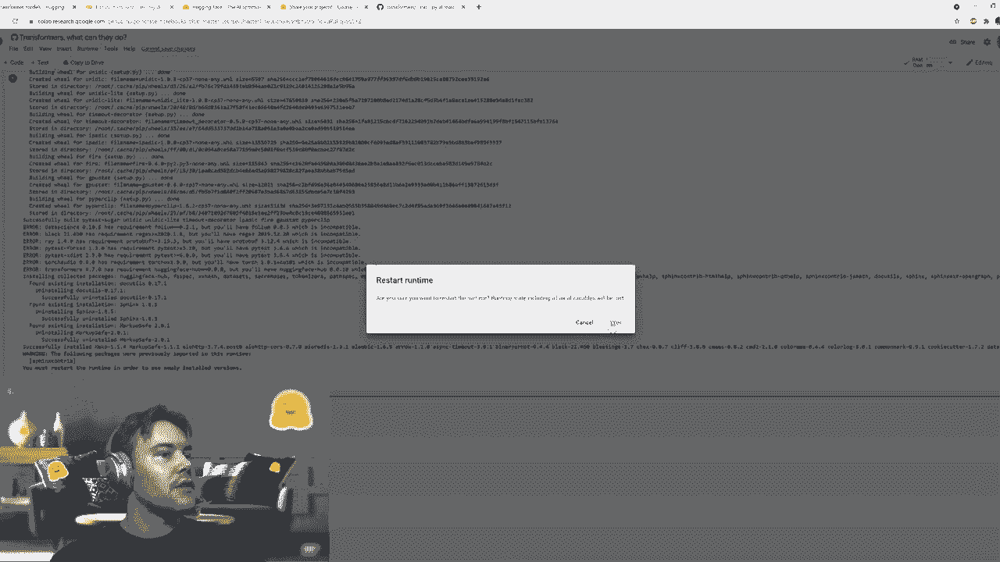

*   **情感分析**：对文本进行正面或负面分类。
    ```python
    from transformers import pipeline
    classifier = pipeline("sentiment-analysis")
    result = classifier("I love this course!")
    # 输出: [{'label': 'POSITIVE', 'score': 0.9998}]
    ```

*   **零样本分类**：使用自定义的标签对文本进行分类。
    ```python
    classifier = pipeline("zero-shot-classification")
    result = classifier(
        "This is a course about the Transformer library",
        candidate_labels=["education", "politics", "business"]
    )
    ```

*   **文本生成**：根据给定提示补全文本。
    ```python
    generator = pipeline("text-generation", model="distilgpt2")
    result = generator("In this course, we will teach you how to", max_length=30)
    ```

*   **掩码语言建模**：预测句子中被遮盖的词语。
    ```python
    unmasker = pipeline("fill-mask")
    result = unmasker("The man worked as a <mask>.")
    ```

*   **命名实体识别**：识别句子中的人名、组织名、地名等实体。
    ```python
    ner = pipeline("ner", grouped_entities=True)
    result = ner("My name is Sylvain and I work at Hugging Face in Brooklyn.")
    ```

*   **问答**：从给定上下文中提取答案。
    ```python
    question_answerer = pipeline("question-answering")
    result = question_answerer(
        question="Where do I work?",
        context="My name is Sylvain and I work at Hugging Face in Brooklyn."
    )
    ```

*   **摘要**：生成长文本的简短摘要。
    ```python
    summarizer = pipeline("summarization")
    result = summarizer("长文本内容...", max_length=130, min_length=30)
    ```

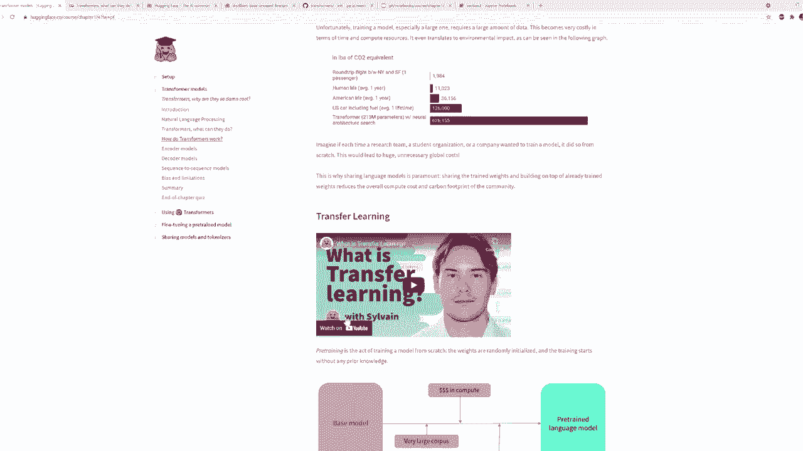


*   **翻译**：将文本从一种语言翻译成另一种语言。
    ```python
    translator = pipeline("translation", model="Helsinki-NLP/opus-mt-fr-en")
    result = translator("Ce cours est excellent!")
    ```

你可以通过Hugging Face Model Hub的交互式界面或Google Colab笔记本尝试所有这些任务。

---

## 3. Transformer模型架构概览

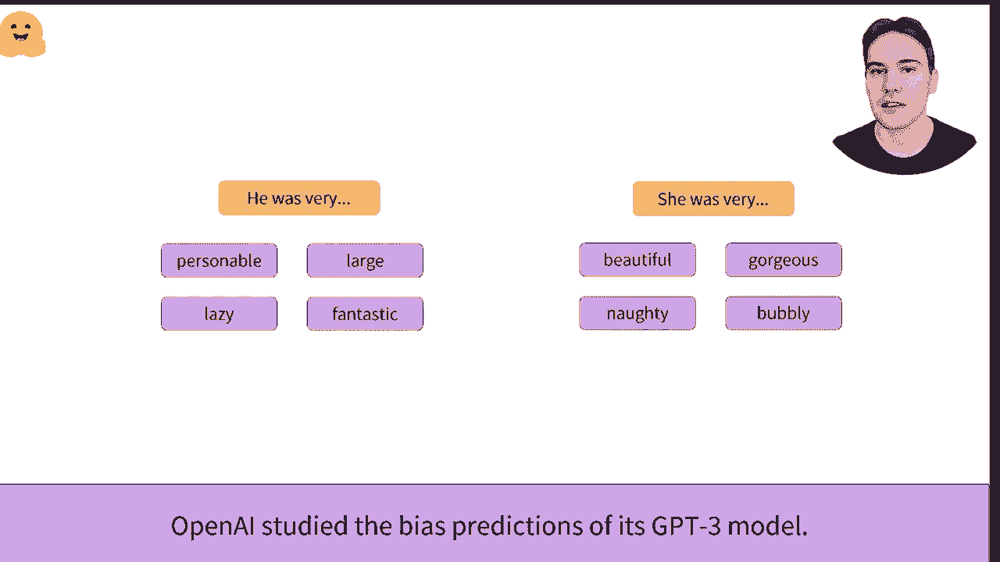


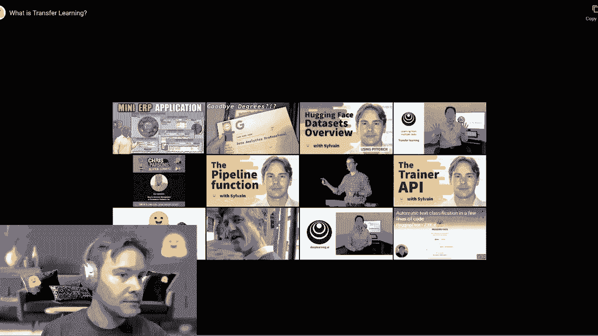

上一节我们通过`pipeline`体验了模型的能力，本节中我们来看看这些能力背后的核心架构。

Transformer模型架构于2017年提出，其核心是**注意力机制**。根据不同的注意力机制和应用目标，Transformer模型主要分为三类：

1.  **仅编码器模型**：如BERT、RoBERTa。这类模型使用**双向自注意力**，在预训练时通常通过预测被随机掩盖的词语来学习。它们擅长提取文本的深层表示，适用于文本分类、命名实体识别等任务。
2.  **仅解码器模型**：如GPT系列。这类模型使用**掩码自注意力**（只能关注当前位置之前的词元），通过预测下一个词语进行训练。它们天生擅长**文本生成**任务。
3.  **编码器-解码器模型**：如T5、BART。这类模型结合了编码器和解码器，编码器理解输入序列，解码器根据编码器的输出生成新序列。它们专为**序列到序列**任务设计，如翻译、摘要。

这些模型通常参数量巨大（数亿到数千亿），因此直接从头训练成本极高。实践中我们采用**迁移学习**：先在一个大型通用语料库上对模型进行预训练，然后针对特定任务使用少量标注数据进行**微调**。这大大节省了计算资源和数据需求。

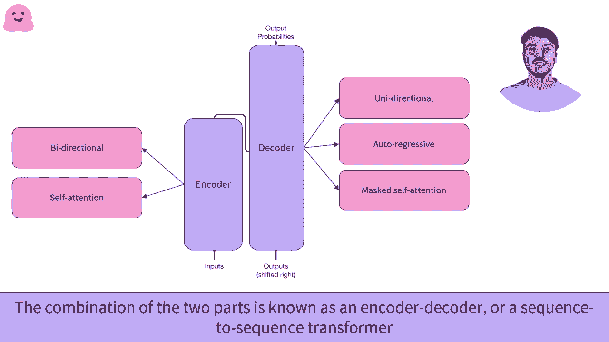


---

## 4. 深入编码器模型

在了解了三种模型类型后，本节我们首先深入探讨仅编码器模型。

仅编码器模型（如BERT）接收文本输入，并为每个输入词元输出一个**上下文化的向量表示**。这个向量的维度由模型架构决定（例如BERT-base是768维）。

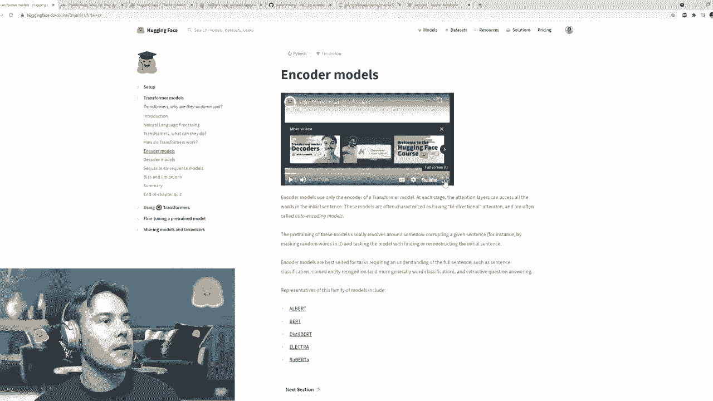

**关键特性**：编码器的自注意力机制是**双向**的。这意味着在计算单词“York”的表示时，模型可以同时关注其左侧的“New”和右侧可能存在的“City”，从而获得包含完整上下文的语义信息。


**主要应用场景**：
*   **掩码语言建模**：预测句子中被遮盖的词语，这是BERT的预训练目标之一。
*   **序列分类**：如情感分析，模型基于整个句子的聚合表示进行分类。
*   **词元分类**：如命名实体识别，模型为句子中的每个词打上标签。

流行的仅编码器模型包括：**BERT**, **RoBERTa**, **DistilBERT**, **ALBERT**, **ELECTRA**。

---

## 5. 深入解码器模型

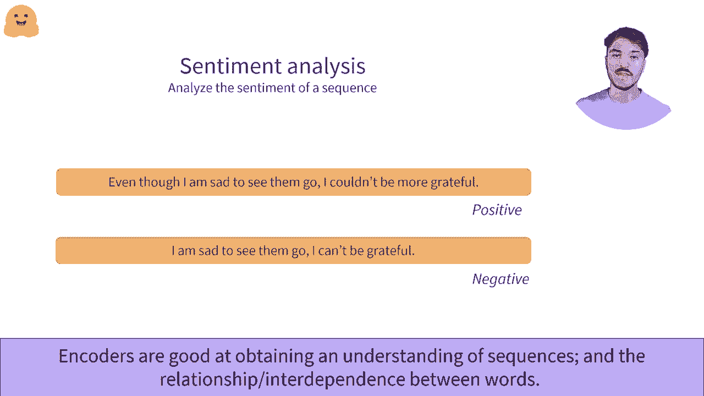


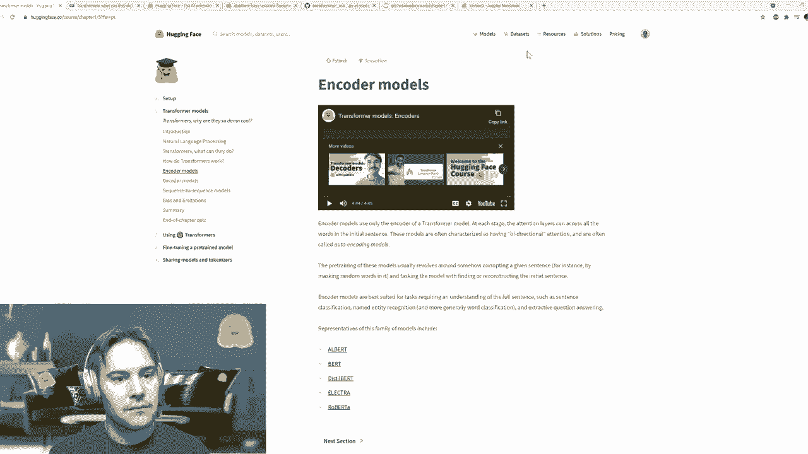

上一节我们介绍了编码器模型，本节中我们来看看与之对应的仅解码器模型。


仅解码器模型（如GPT-2）在架构上与编码器相似，但有一个根本区别：其自注意力机制是**掩码的**和**单向的**。

**关键特性**：在计算某个词元的表示时，解码器只能关注该词元**之前**的上下文，而不能“看到”未来的词元。这是为了防止在文本生成任务中“作弊”。

**核心应用：因果语言建模与文本生成**
解码器模型通过**自回归**方式生成文本：
1.  给定一个起始词元（如“My”）。
2.  模型输出一个表示，并通过“语言模型头”映射到词表，预测出最可能的下一个词（如“name”）。
3.  将预测出的词追加到输入序列中（“My name”），再次输入模型，预测下一个词（如“is”）。
4.  重复此过程，直到生成完整句子或达到长度限制。

这种机制使得仅解码器模型在故事创作、对话生成、代码补全等任务上表现出色。

---

## 6. 深入编码器-解码器模型

我们已经分别了解了编码器和解码器，本节我们来看看将它们结合起来的编码器-解码器模型。

编码器-解码器模型（如T5）分两步工作：
1.  **编码**：编码器处理输入序列（如一句英文），并将其转换为一个富含语义信息的数值表示。
2.  **解码**：解码器接收这个表示以及一个起始符号，以自回归的方式逐步生成输出序列（如对应的法文翻译）。

**关键优势**：
*   **处理序列到序列任务**：专为输入和输出都是序列的任务设计，如翻译、摘要、改写。
*   **灵活处理长度**：编码器和解码器可以处理不同长度的上下文。例如，编码器可以阅读很长的文章，而解码器只需生成简短的摘要。
*   **模态转换**：编码器和解码器可以针对不同模态（如文本到图像、语音到文本）进行专门优化。

这种架构非常强大，因为它明确分离了“理解”输入和“生成”输出两个阶段。

---

## 7. 模型的偏见与局限性

在学习了Transformer模型的强大能力后，本节我们必须认识其重要局限性：**偏见问题**。

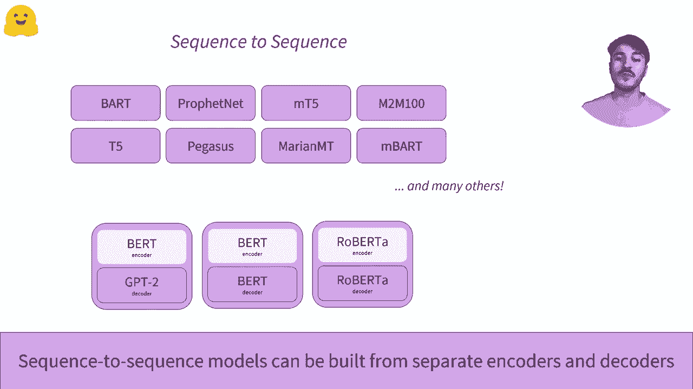


像所有数据驱动的模型一样，Transformer模型会反映其训练数据中存在的偏见。例如，一个在传统文本上训练的模型可能会表现出性别或种族刻板印象。

**示例**：使用BERT进行“The man worked as a `<mask>`”和“The woman worked as a `<mask>`”的预测，前者可能补全为“doctor”、“lawyer”，而后者可能补全为“nurse”、“secretary”，甚至带有冒犯性的词汇。

**原因与对策**：
*   偏见来源于预训练数据（如维基百科、网络文本）中存在的现实社会偏见。
*   微调过程通常不会消除这些偏见，反而可能延续甚至放大。
*   **应对措施**：在将模型部署到生产环境前，必须仔细评估其输出是否存在有害偏见。可以通过精心构建平衡、无偏的微调数据集来缓解这一问题。开发者有责任确保AI系统的公平性与安全性。

---

## 总结


本节课我们一起学习了Transformer模型的基础知识。我们从NLP任务概述开始，实践了如何使用`pipeline`快速应用模型。然后，我们深入探讨了Transformer的三大架构：仅编码器模型（擅长理解与分类）、仅解码器模型（擅长文本生成）以及编码器-解码器模型（擅长序列转换任务）。最后，我们强调了在使用这些强大工具时必须警惕的数据偏见问题。掌握这些核心概念，是你进一步探索和微调Transformer模型，以解决实际NLP问题的基础。