# Transformers 原理细节及NLP任务应用！P35：L6.3- Sylvain的在线直播讲解 📚

在本节课中，我们将详细探讨 Hugging Face Transformers 库的核心组件。我们将深入了解 `pipeline` 对象背后的工作原理，学习如何手动加载模型、使用分词器预处理输入，以及如何处理模型输出以获得预测结果。通过本次学习，你将能够灵活调整这些步骤以适应自己的任务。

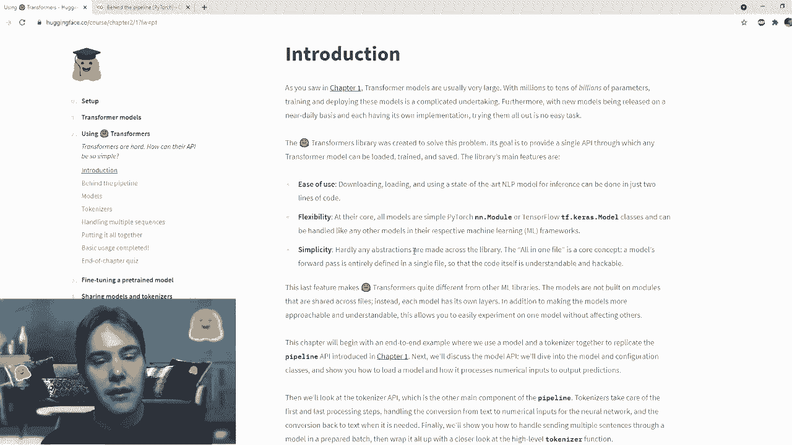

---

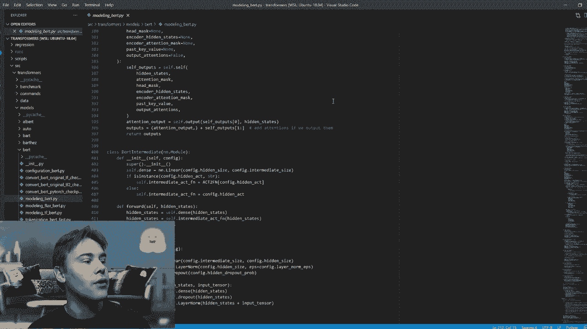

## 直播介绍与课程概述 🎥

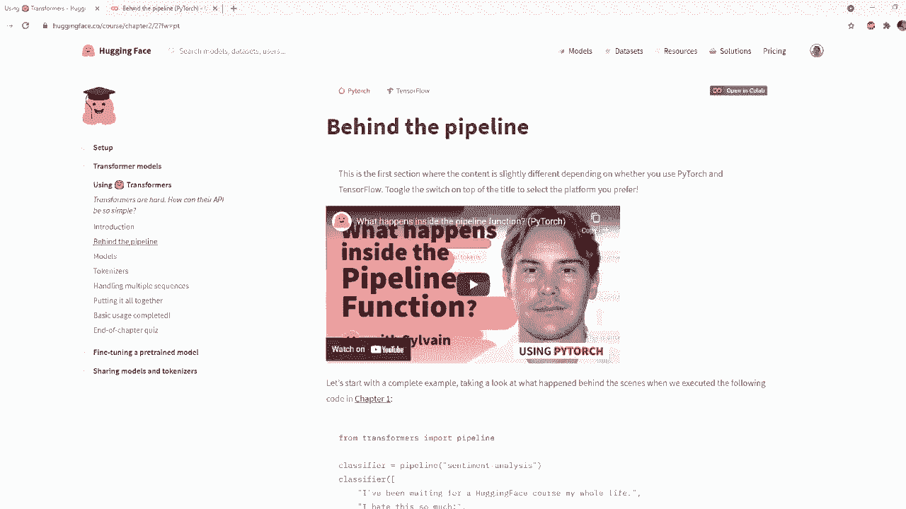


欢迎来到本次直播环节。我们将讨论本课程的第二章内容。在第二章中，我们将详细查看在第一章中用于所有 NLP 任务的 `pipeline` 对象。我们将确切了解它是如何工作的，包括如何加载模型、如何使用分词器预处理输入，以及如何处理输出以获取预测和概率。本章包含比第一章更多的现场编码内容。

Hugging Face 主要以其 Transformers 库而闻名。这是一个包含众多预训练 Transformer 模型的库，它提供了一个简单的 API 来下载和使用不同的模型架构。目前库中可用的架构超过60个。它提供了统一的 API，并暴露了 PyTorch 或 TensorFlow 模型，供你自行使用或通过库提供的 API 进行训练。其设计目标是实现灵活性和简单性。

Transformers 库的一个关键优势是代码结构清晰。每个模型架构都在自己的建模文件中完全定义。例如，BERT 模型的代码就在 `modeling_bert.py` 文件中。这种设计意味着，如果你想修改模型内部的代码，你不需要在多个文件中寻找，只需在对应的建模文件中进行更改即可。

---

## 管道（Pipeline）背后的三个步骤 🔄

在第一章中，我们使用了 `pipeline` 函数来执行情感分析等任务。`pipeline` 函数内部主要执行三个步骤：

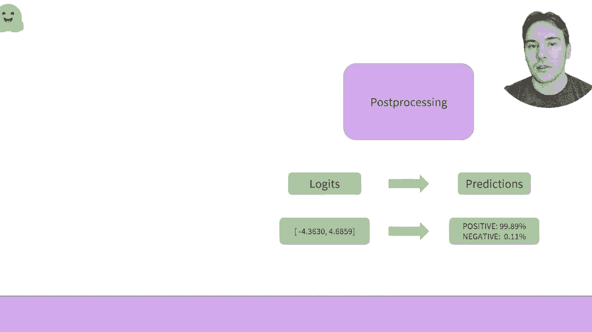


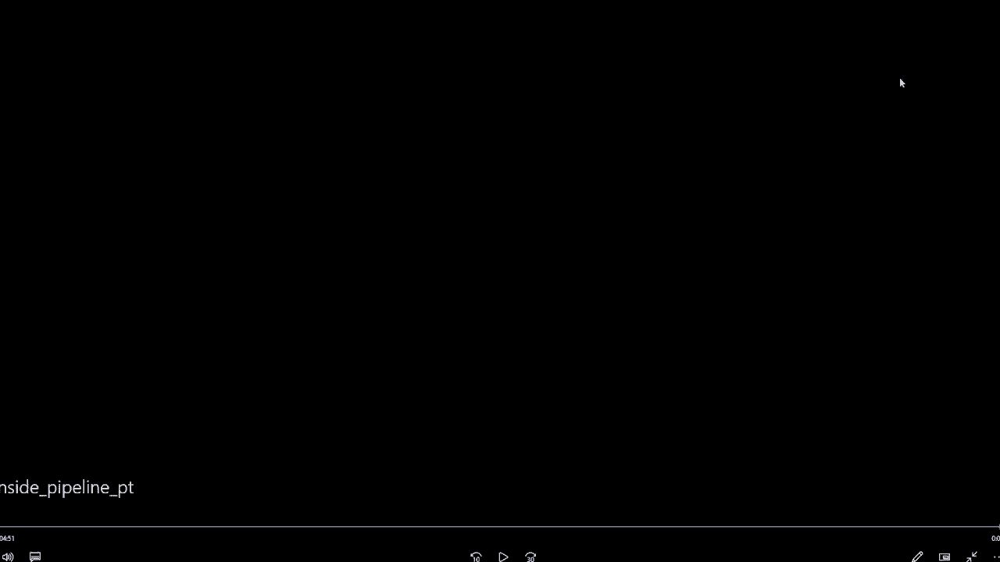

1.  **预处理**：使用分词器将文本转换为模型可以理解的数字。
2.  **模型推理**：将数字输入模型，得到原始输出（logits）。
3.  **后处理**：将模型的原始输出转换为人类可读的标签和分数。

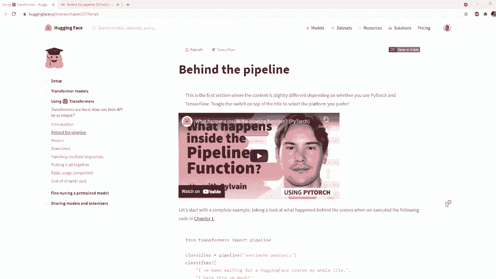

上一节我们介绍了课程概述，本节中我们来看看如何手动复现 `pipeline` 的这三个步骤。

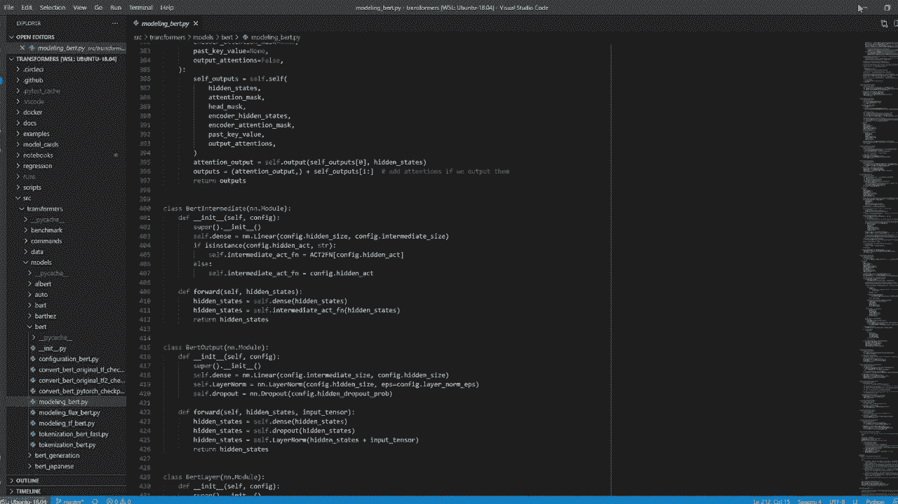

### 第一步：使用分词器（Tokenizer）进行预处理

分词器的目标是将原始文本转换为模型可以处理的数字 ID。这个过程通常包括将文本拆分为更小的单元（称为 token），添加模型所需的特殊 token，并将每个 token 映射到词汇表中的唯一 ID。

以下是加载和使用分词器的关键代码：

```python
from transformers import AutoTokenizer

checkpoint = "distilbert-base-uncased-finetuned-sst-2-english"
tokenizer = AutoTokenizer.from_pretrained(checkpoint)

sentences = ["I've been waiting for a HuggingFace course my whole life.",
             "I hate this so much!"]

inputs = tokenizer(sentences, padding=True, truncation=True, return_tensors="pt")
print(inputs)
```
*   `AutoTokenizer.from_pretrained()` 会自动下载并与给定检查点对应的分词器。
*   `padding=True` 会对较短的句子进行填充，使所有句子长度一致。
*   `truncation=True` 会确保超过模型最大长度的句子被截断。
*   `return_tensors=“pt”` 指定返回 PyTorch 张量。

执行后，`inputs` 是一个包含两个键的字典：
*   `input_ids`：包含句子 token ID 的张量。
*   `attention_mask`：注意力掩码，指示哪些位置是真实 token（1），哪些是填充 token（0），以便模型忽略填充部分。

### 第二步：加载模型并进行推理

与分词器类似，我们可以使用 `AutoModel` API 来加载模型。但需要注意的是，基础的 `AutoModel` 仅加载模型主体（不含任务特定的头部）。对于分类任务，我们需要使用带有分类头的类，例如 `AutoModelForSequenceClassification`。

以下是加载分类模型并进行推理的代码：

```python
from transformers import AutoModelForSequenceClassification

model = AutoModelForSequenceClassification.from_pretrained(checkpoint)
outputs = model(**inputs)
print(outputs.logits)
```
*   `AutoModelForSequenceClassification.from_pretrained()` 会加载带有分类头的预训练模型。
*   将 `inputs` 字典解包传递给模型后，得到的 `outputs` 包含 `logits` 张量。`logits` 是模型最后的原始输出，尚未经过归一化。

### 第三步：后处理——将 Logits 转换为概率

模型输出的 `logits` 并不是概率。为了得到每个类别的概率，我们需要对其应用 `softmax` 函数。同时，我们需要知道每个输出索引对应的标签名称。

以下是进行后处理的代码：

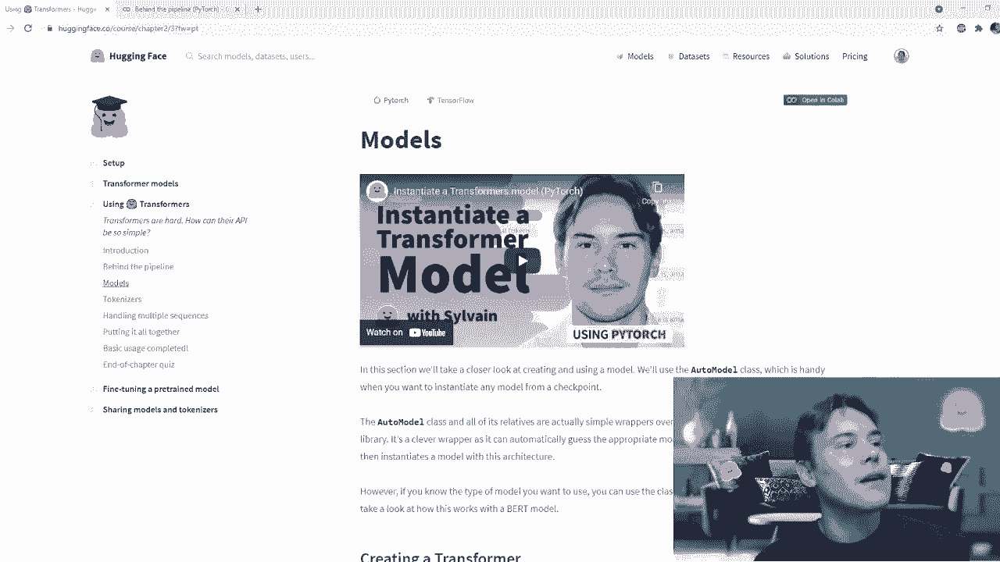

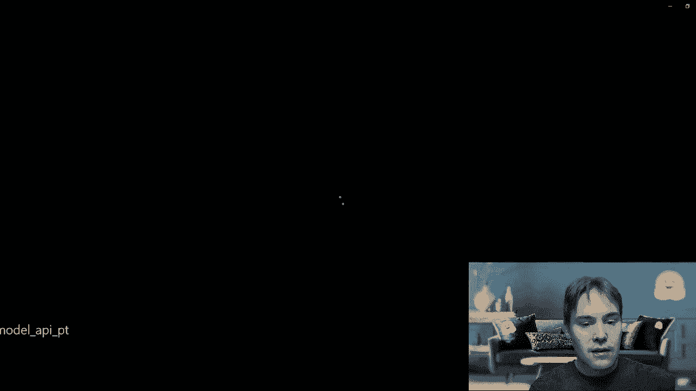

```python
import torch

probabilities = torch.nn.functional.softmax(outputs.logits, dim=-1)
print(probabilities)

# 从模型配置中获取标签名称
print(model.config.id2label)
```
*   `torch.nn.functional.softmax()` 函数将 logits 转换为概率，所有类别概率之和为 1。
*   模型的配置（`model.config`）中包含 `id2label` 字段，这是一个将输出索引映射到可读标签名称的字典。

通过以上三个步骤，我们完全复现了 `pipeline` 函数的功能。理解这些步骤使你能够灵活地调整流程，例如处理不同的输入格式或自定义后处理逻辑。

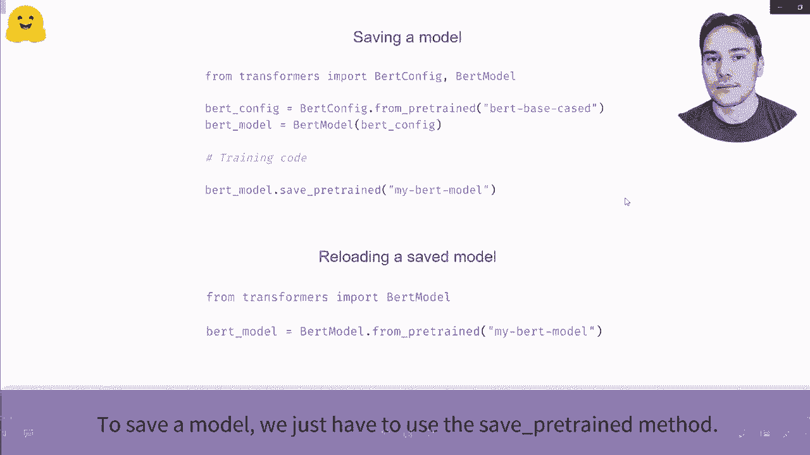


---

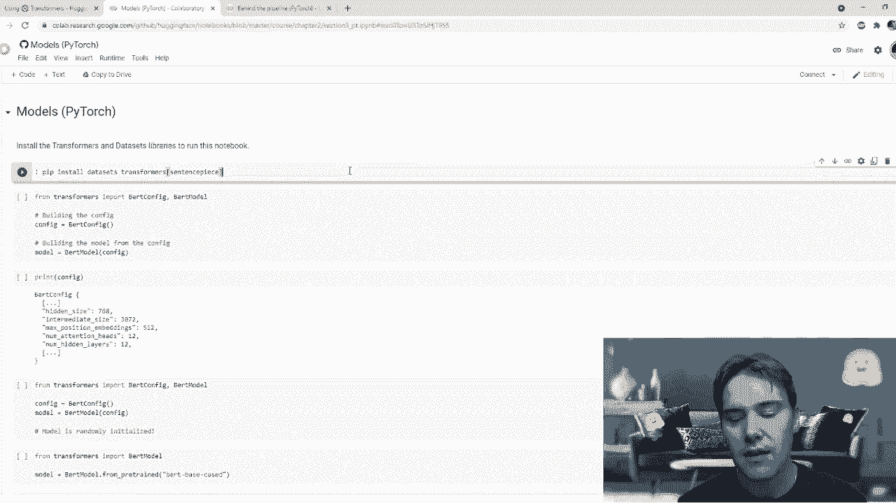

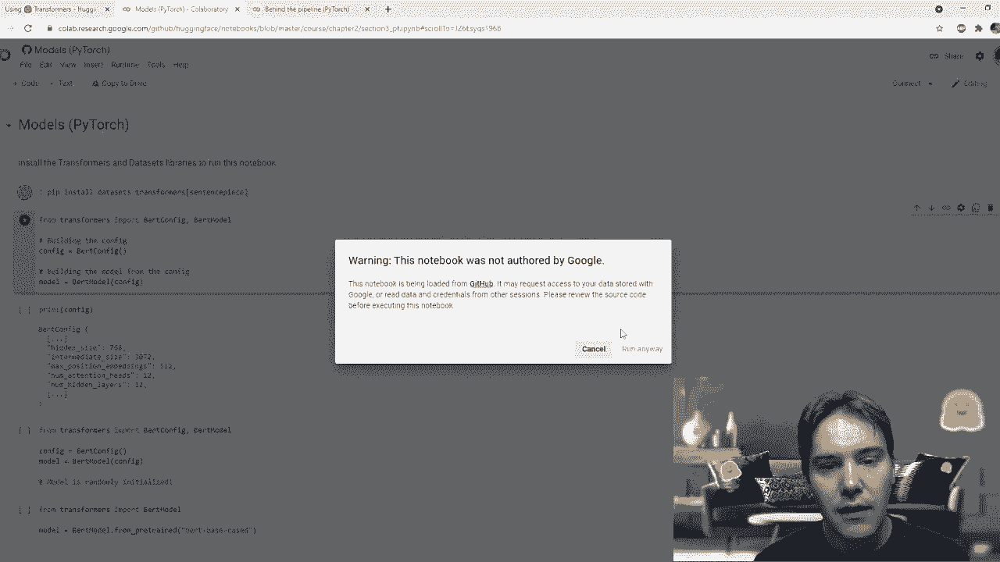

## 深入理解模型（Model）🏗️

上一节我们拆解了 `pipeline` 的流程，本节中我们来看看其中的核心组件——模型。`AutoModel` 类是其核心，它能够根据提供的检查点名称自动实例化正确的模型架构。

### 使用 AutoModel 加载预训练模型

`AutoModel.from_pretrained()` 方法会执行以下操作：
1.  下载并缓存模型配置文件。
2.  根据配置文件确定正确的模型架构类（如 `BertModel`, `GPT2Model`）。
3.  下载并加载预训练权重。

```python
from transformers import AutoModel

model = AutoModel.from_pretrained(“bert-base-uncased”)
```

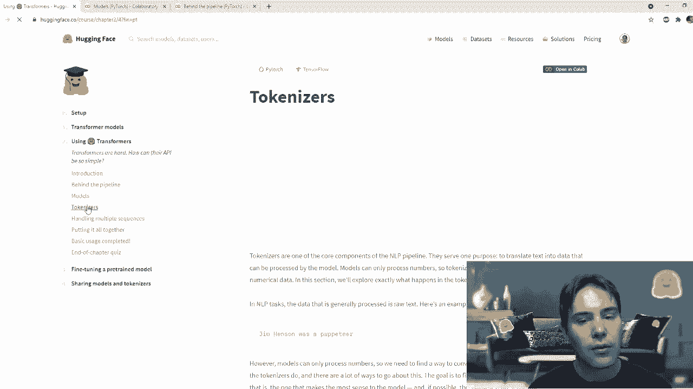

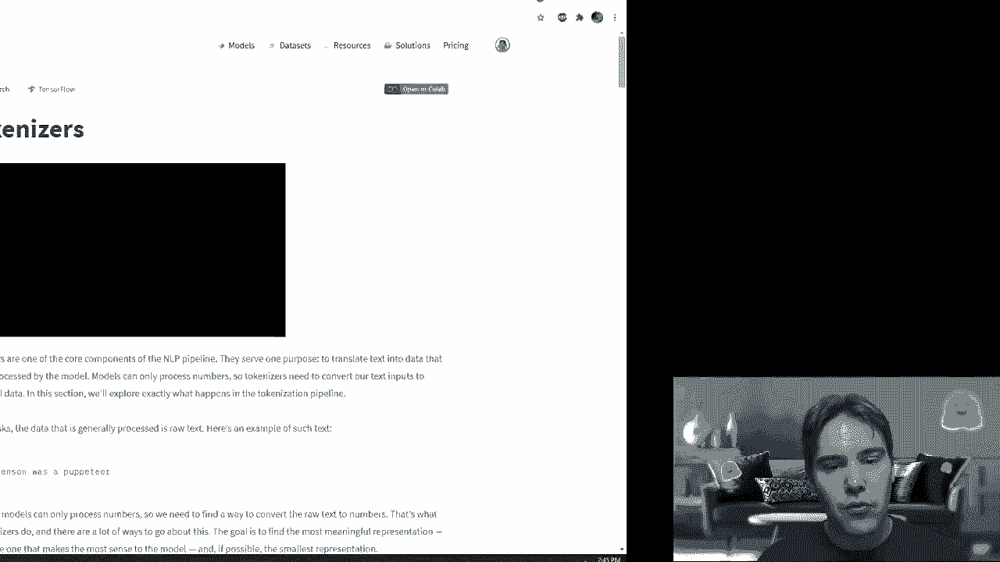

### 模型配置（Config）

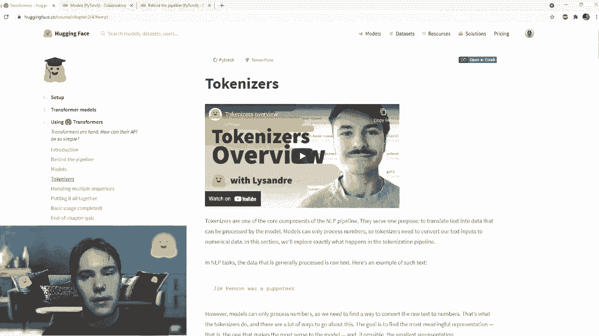


每个模型都有一个配置对象（`config`），它包含了构建模型所需的所有参数，例如层数、隐藏层大小、注意力头数等。你可以通过修改配置来创建架构相同但参数不同的模型。

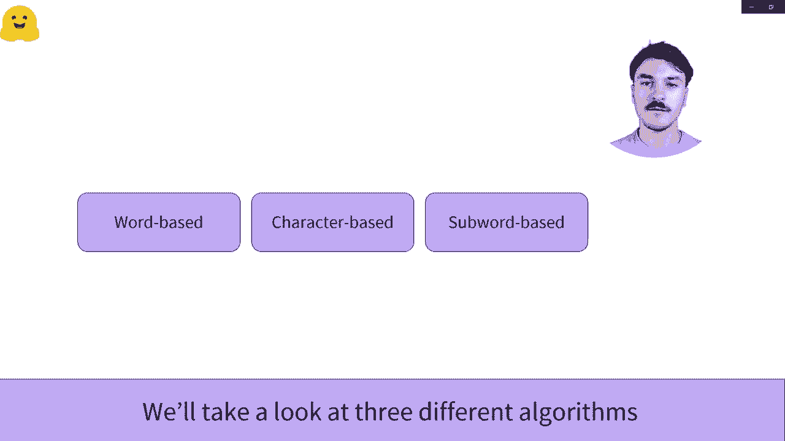


```python
from transformers import BertConfig

# 创建一个随机初始化的 BERT 模型，但只包含 10 层（而非标准的 12 层）
config = BertConfig.from_pretrained(“bert-base-uncased”, num_hidden_layers=10)
model_custom = AutoModel.from_config(config)
```
*   通过 `from_config()` 初始化的模型权重是随机的，适用于从头开始训练。
*   你可以在 `from_pretrained()` 时传入配置参数来修改模型，但注意不能修改影响预训练权重大小的参数（如层数），否则会导致加载错误。

### 保存与加载模型

训练或微调后的模型可以轻松保存到本地。

```python
# 保存模型
model.save_pretrained(“./my_saved_model/“)

# 加载模型
model_loaded = AutoModel.from_pretrained(“./my_saved_model/“)
```

---

## 深入理解分词器（Tokenizer）✂️

模型处理数字，而人类使用文本。分词器是连接二者的桥梁。其主要任务是将文本拆分为模型词汇表中存在的 token，并将其转换为 ID。

### 分词策略

主要有三种分词策略：
1.  **基于词（Word-based）**：按空格和标点分割。优点简单，但词汇表庞大，且无法处理未登录词（OOV）。
2.  **基于字符（Character-based）**：按每个字符分割。词汇表小，无 OOV 问题，但序列长度长，单个字符语义信息弱。
3.  **基于子词（Subword-based）**：现代 Transformer 模型的常用方法。将词拆分为更常见的子词单元（如 “un”, “##able”）。能在词汇表大小和语义表示间取得良好平衡。常见的算法有 **BPE**、**WordPiece** 和 **Unigram**。

### 分词器实践

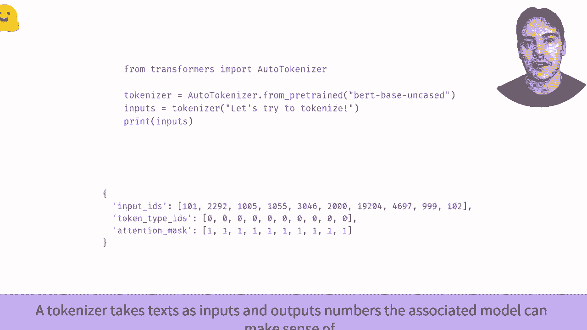


使用 `AutoTokenizer` 是最佳实践，它会自动匹配模型对应的分词器。

```python
from transformers import AutoTokenizer
tokenizer = AutoTokenizer.from_pretrained(“bert-base-uncased”)

# 查看分词结果
tokens = tokenizer.tokenize(“Hello, world!”)
print(tokens) # [‘hello’, ‘,’, ‘world’, ‘!’]

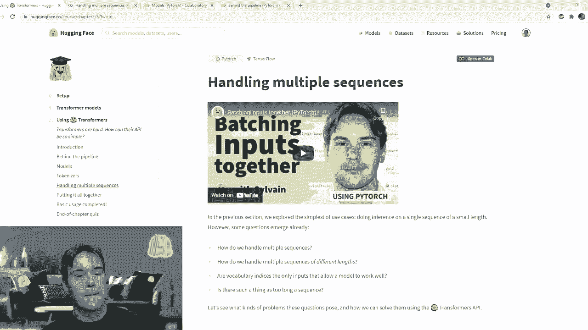

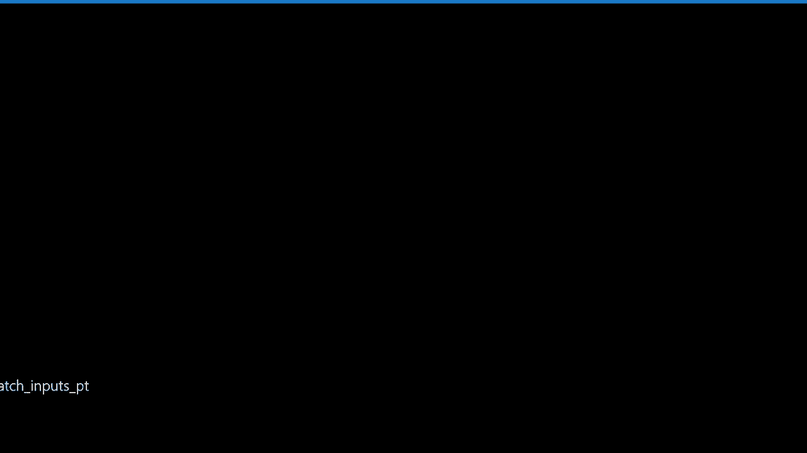

# 将 token 转换为 ID
ids = tokenizer.convert_tokens_to_ids(tokens)
print(ids)

# 直接调用分词器（推荐）
inputs = tokenizer(“Hello, world!”, return_tensors=“pt”)
print(inputs.input_ids)
```
*   直接调用 `tokenizer()` 方法会完成所有步骤：分词、添加特殊 token、转换为 ID、并生成注意力掩码等。

---

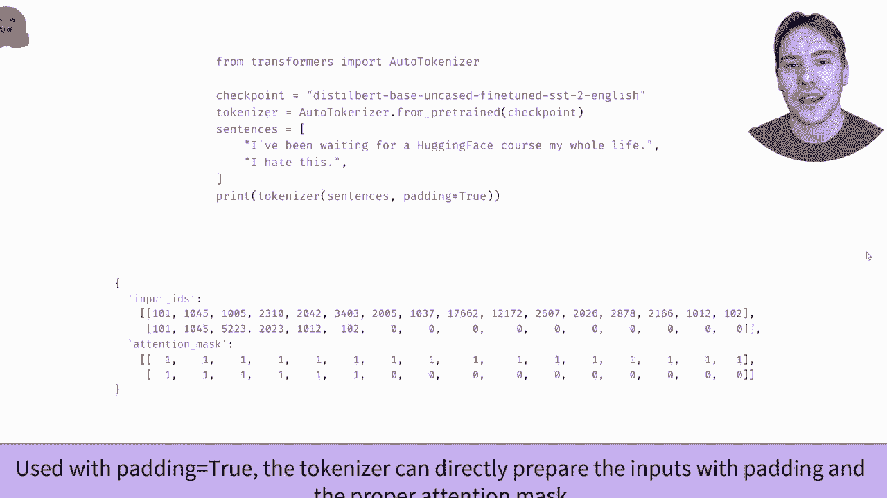


## 批处理与填充（Batching & Padding）📦

在实际应用中，我们通常需要同时处理多个句子。由于句子长度不同，我们需要将它们填充到相同长度才能组成一个批次的张量。

### 为什么需要填充和注意力掩码？

Transformer 模型的核心是自注意力机制，它会计算序列中每个 token 与其他所有 token 的关系。如果我们简单地将填充 token（如 `[PAD]`）加入序列而不做任何处理，模型会“关注”这些无意义的填充 token，从而影响对真实 token 的表示计算。

**注意力掩码（Attention Mask）** 就是为了解决这个问题而设计的。它是一个与 `input_ids` 形状相同的 0/1 张量，其中 1 表示真实的 token，0 表示填充 token。模型在计算注意力时会忽略掩码为 0 的位置。

### 使用分词器自动处理

幸运的是，分词器可以自动完成填充和生成注意力掩码。

```python
sentences = [“This is short”, “This is a much longer sentence that needs padding.”]
inputs = tokenizer(sentences, padding=True, truncation=True, return_tensors=“pt”)

print(inputs.input_ids)
print(inputs.attention_mask)
```
*   `padding=True` 或 `padding=‘longest’`：将批次内的句子填充到该批次中最长句子的长度。
*   `padding=‘max_length’`：将所有句子填充到模型规定的最大长度（如 512）。
*   `truncation=True`：当句子超过模型最大长度时进行截断。

**动态填充**是一种更高效的训练技巧，即在构建每个训练批次时，只将该批次内的句子填充到相同的长度，而不是整个数据集的全局最大长度。这能显著减少不必要的计算。

---

## 总结与回顾 🎯

本节课中我们一起学习了 Hugging Face Transformers 库的核心机制：

1.  **管道分解**：我们拆解了 `pipeline` 函数，将其分为 **分词预处理**、**模型推理** 和 **后处理** 三个可手动控制的步骤。
2.  **模型加载**：学会了使用 `AutoModel` 及相关任务类（如 `AutoModelForSequenceClassification`）加载预训练模型，并了解了模型配置的作用。
3.  **分词器详解**：理解了基于子词的分词策略，以及如何使用 `AutoTokenizer` 将文本转换为模型输入。
4.  **批处理技术**：掌握了使用填充和注意力掩码来处理不同长度句子批次的原理和方法，这是高效使用 Transformer 模型的关键。

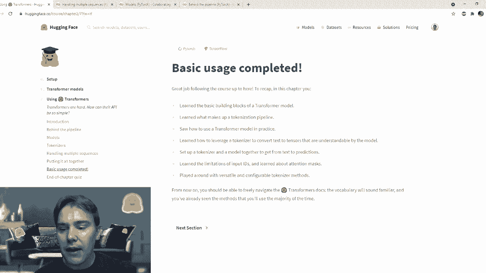


通过掌握这些基础知识，你现在已经能够脱离 `pipeline` 的封装，更灵活地使用 Transformers 库来构建和实验自己的 NLP 应用了。在接下来的章节中，我们将学习如何为自己的数据微调模型，并将训练好的模型分享给社区。