# Transformers 原理细节及NLP任务应用！P36：L6.4- Lewis的在线直播讲解 🤖

在本节课中，我们将把前两章学到的所有组件结合起来，学习如何使用 Hugging Face 生态系统进行模型训练。我们将从回顾开始，然后深入探讨数据集库（`datasets`）的使用、训练器（`Trainer`）API，并最终通过编写自定义训练循环来理解其内部机制，同时介绍用于分布式训练的 `accelerate` 库。

---

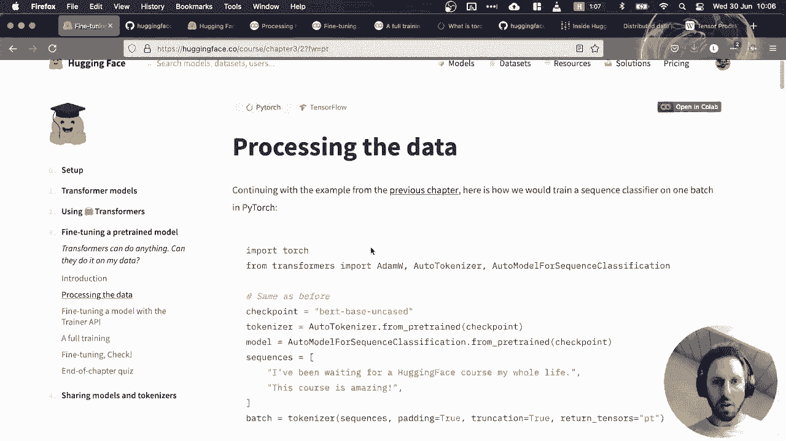

## 📚 课程回顾与本章概述

在第一章，我们探讨了 Transformer 的基本概念、分词以及预训练。第二章则深入了管道（Pipeline）API 的内部工作原理，并学习了如何理解模型的输入输出以及分词器的处理过程。

本章我们将整合这些知识，完成以下三件事：
1.  学习使用 `datasets` 库高效处理各种规模的数据集。
2.  使用 `Trainer` API 训练我们的第一个模型，它封装了训练循环的复杂性。
3.  通过编写自定义的 PyTorch 训练循环来深入理解 `Trainer` 的工作机制，并在此过程中介绍用于分布式训练的 `accelerate` 库。

我们当前的生态系统围绕几个核心组件构建：使用 `hub` 加载模型、分词器和数据集；`transformers` 库与 `datasets` 库交互以训练模型；训练完成后，可以将模型推送回 `hub` 进行分享和部署。


---

## 📊 探索 Datasets 库

`datasets` 库是一个用于处理各种类型数据集的通用库。它最初专注于 NLP 文本数据，现已扩展到支持图像、音频等多种格式。其主要优势在于提供了一套统一的 API，可以快速加载和处理大规模数据集（甚至达到 TB 级别），这得益于其底层使用的 Apache Arrow 格式，实现了高效的懒加载内存管理。

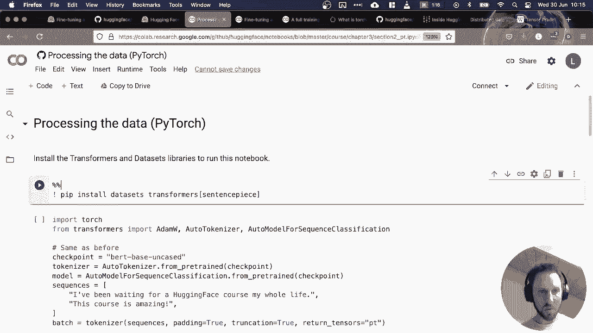

### 加载与查看数据集

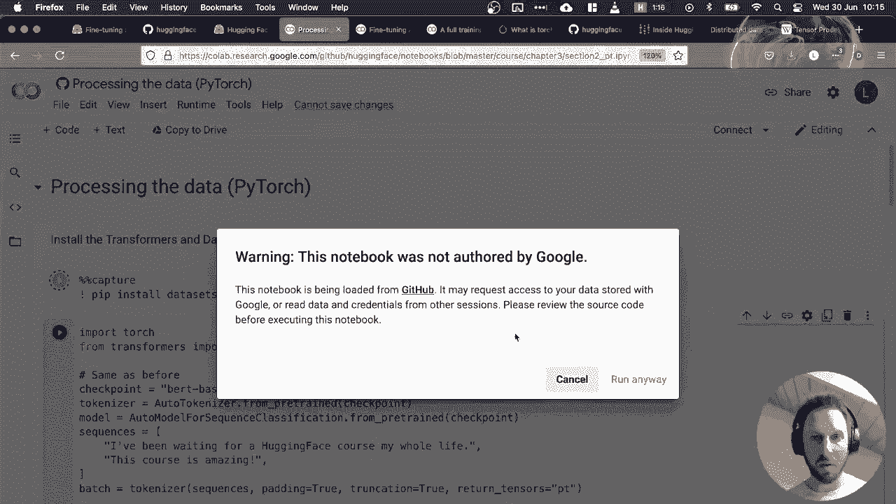

以下是使用 `datasets` 库的基本步骤。

首先，我们使用 `load_dataset` 函数加载一个数据集。这里以 GLUE 基准中的 MRPC（微软同义句识别）任务为例。

```python
from datasets import load_dataset

# 加载数据集，指定数据集名称和配置（子任务）
raw_datasets = load_dataset("glue", "mrpc")
# 查看数据集的拆分（如训练集、验证集）
print(raw_datasets)
```

`load_dataset` 返回一个 `DatasetDict` 对象，它是一个将拆分名称（如 `train`）映射到 `Dataset` 对象的字典。我们的大部分操作将在 `Dataset` 对象上进行。

```python
# 访问训练集
train_dataset = raw_datasets["train"]
# 查看第一个样本
print(train_dataset[0])
```
一个样本可能包含 `sentence1`, `sentence2`, `label` 等字段，标签 `1` 通常表示两个句子是同义句。

### 数据集的类型系统

`datasets` 库为每一列明确定义了数据类型（特征），这有助于早期错误检查和高效处理。

```python
# 查看数据集的特征（列类型）
features = train_dataset.features
print(features)

# 对于分类标签，可以方便地在数字和字符串间转换
label_feature = features["label"]
print(label_feature.int2str(1))  # 输出: equivalent
print(label_feature.int2str(0))  # 输出: not_equivalent
```

### 使用 Map 函数处理数据

最常见的操作是对整个数据集进行分词。我们定义一个分词函数，然后使用 `map` 方法将其应用到数据集的每一行。

```python
from transformers import AutoTokenizer

checkpoint = "bert-base-uncased"
tokenizer = AutoTokenizer.from_pretrained(checkpoint)

def tokenize_function(example):
    # 对句子对进行分词
    return tokenizer(example["sentence1"], example["sentence2"], truncation=True)

# 应用分词函数到所有拆分
tokenized_datasets = raw_datasets.map(tokenize_function, batched=True)
# 查看分词后的结果
print(tokenized_datasets["train"][0])
```
`map` 函数会自动添加新的列（如 `input_ids`, `attention_mask`）。设置 `batched=True` 可以显著加快处理速度。

**关于 `map` 函数的补充说明**：
*   `map` 函数接受一个返回字典的函数，字典的键将成为数据集的新列名。
*   操作不是就地（in-place）的，需要将结果赋值给新变量。
*   所有操作都会被缓存，重新运行时无需重复计算。

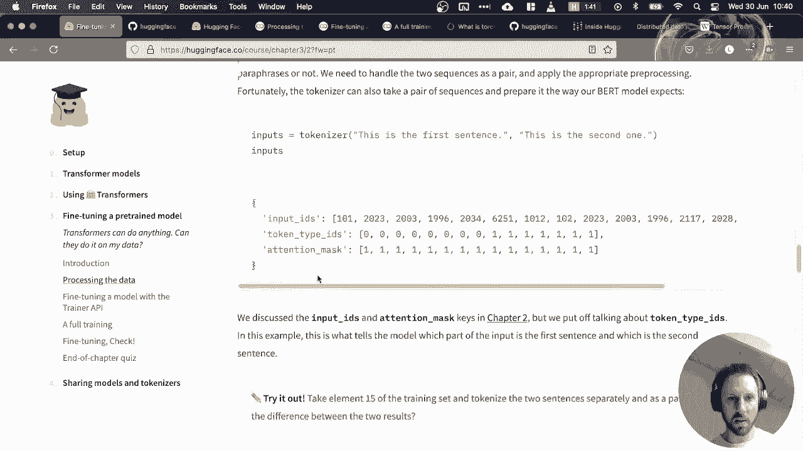


---

## ⚙️ 动态填充与数据整理器

在训练时，我们需要将样本批次处理成相同长度。有两种策略：
1.  **固定填充**：在分词时就将整个数据集填充到最大长度。缺点是对于短句子居多的批次，会引入大量无效计算。
2.  **动态填充**：在组成批次时，只填充到该批次内最长样本的长度。这能减少计算量，提升速度，但会导致批次形状不固定。

Transformers 库提供了**数据整理器（Data Collator）** 来处理动态填充。最常用的是 `DataCollatorWithPadding`。

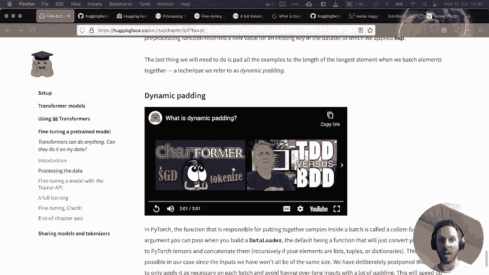

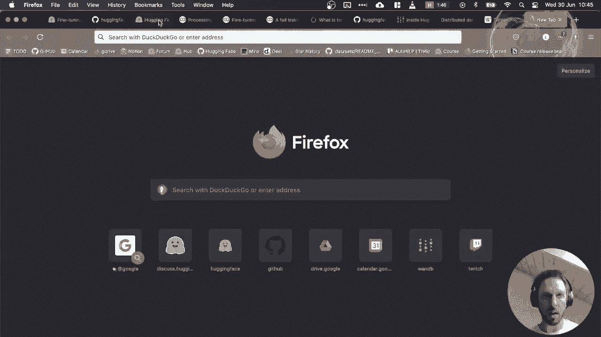

```python
from transformers import DataCollatorWithPadding

data_collator = DataCollatorWithPadding(tokenizer=tokenizer)

# 演示：对一个批次的数据进行动态填充
samples = tokenized_datasets["train"][:8]
batch = data_collator(samples)
print({k: v.shape for k, v in batch.items()})
```
数据整理器会接收一个样本列表，并自动将它们填充到相同的长度，然后堆叠成张量。

---

## 🚀 使用 Trainer API 进行训练

`Trainer` API 极大地简化了训练过程，自动处理了设备放置、混合精度训练、日志记录、评估等复杂环节。

### 设置训练参数与模型

首先，我们定义训练参数和模型。

```python
from transformers import AutoModelForSequenceClassification, TrainingArguments

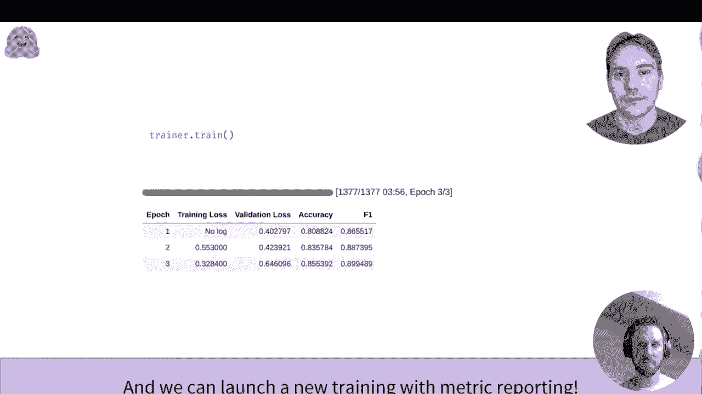


model = AutoModelForSequenceClassification.from_pretrained(checkpoint, num_labels=2)

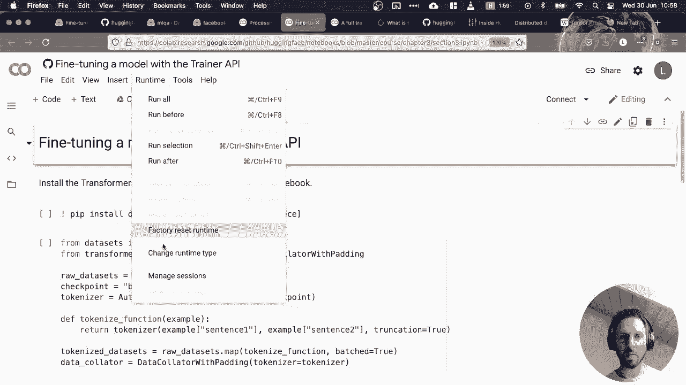

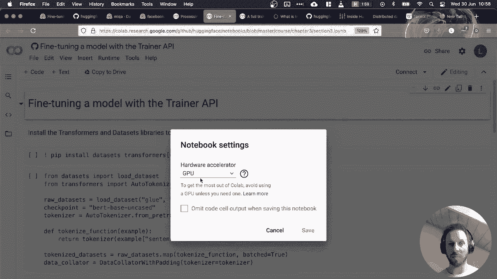

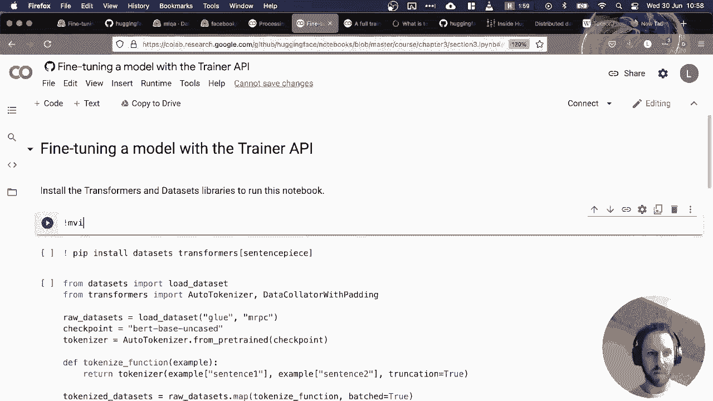

training_args = TrainingArguments(
    output_dir="./test_trainer",  # 模型和日志输出目录
    evaluation_strategy="epoch",   # 每个 epoch 结束后进行评估
    learning_rate=2e-5,
    per_device_train_batch_size=16,
    per_device_eval_batch_size=16,
    num_train_epochs=3,
    weight_decay=0.01,
)
```

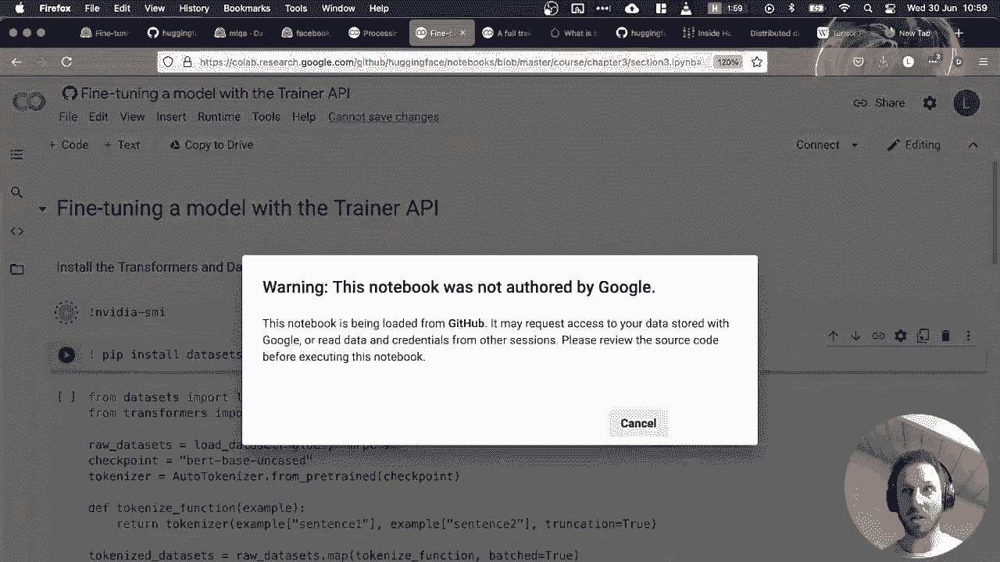

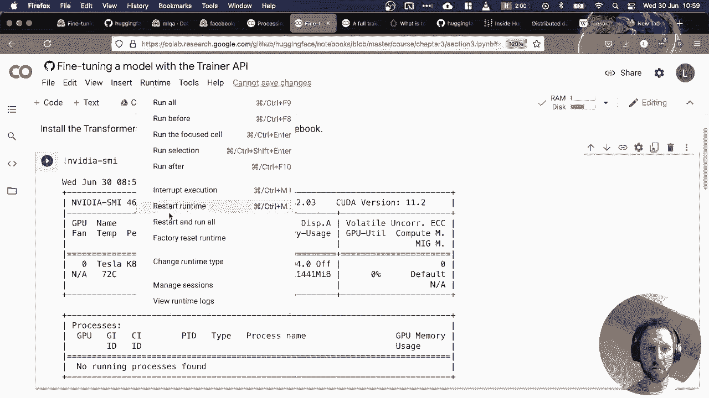

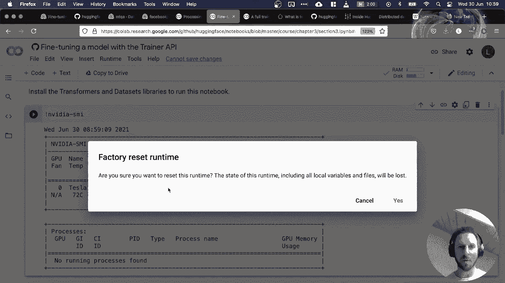

### 定义评估指标

为了让训练过程显示我们关心的指标（如准确率），需要定义一个计算指标的函数。

```python
import numpy as np
from datasets import load_metric

metric = load_metric("glue", "mrpc")

def compute_metrics(eval_pred):
    predictions, labels = eval_pred
    predictions = np.argmax(predictions, axis=-1)
    return metric.compute(predictions=predictions, references=labels)
```

### 实例化并运行 Trainer

将模型、参数、数据、整理器和指标计算函数组合起来，创建 `Trainer` 并开始训练。

```python
from transformers import Trainer

trainer = Trainer(
    model=model,
    args=training_args,
    train_dataset=tokenized_datasets["train"],
    eval_dataset=tokenized_datasets["validation"],
    data_collator=data_collator,
    tokenizer=tokenizer,
    compute_metrics=compute_metrics,
)

trainer.train()
```
训练结束后，可以方便地进行评估和预测。

```python
# 评估
eval_results = trainer.evaluate()
print(eval_results)

# 预测
predictions = trainer.predict(tokenized_datasets["validation"])
print(predictions.predictions.shape, predictions.label_ids.shape)
```

---

## 🔧 编写自定义训练循环与 Accelerate 库

虽然 `Trainer` 很方便，但理解其底层原理很重要。我们将编写一个标准的 PyTorch 训练循环，然后使用 `accelerate` 库轻松地将其改造为支持分布式训练（多 GPU/TPU）的版本。

### 标准的 PyTorch 训练循环

首先，我们需要准备数据加载器（DataLoader）。

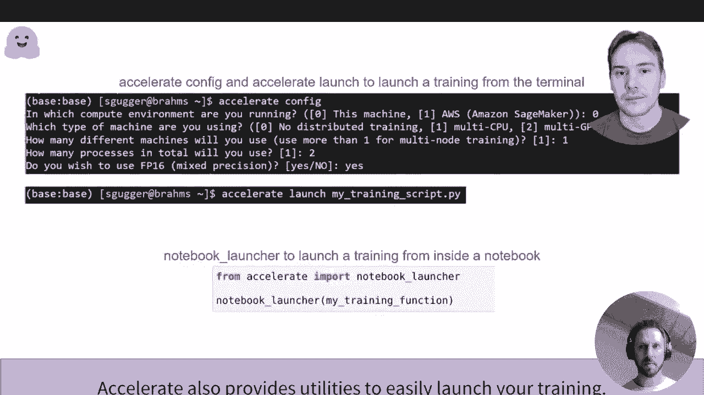


```python
from torch.utils.data import DataLoader

# 移除不需要的文本列，将标签列重命名为 `labels`，并设置格式为 PyTorch 张量
tokenized_datasets = tokenized_datasets.remove_columns(["sentence1", "sentence2", "idx"])
tokenized_datasets = tokenized_datasets.rename_column("label", "labels")
tokenized_datasets.set_format("torch")

train_dataloader = DataLoader(
    tokenized_datasets["train"], shuffle=True, batch_size=16, collate_fn=data_collator
)
eval_dataloader = DataLoader(
    tokenized_datasets["validation"], batch_size=16, collate_fn=data_collator
)
```

接下来是标准的训练循环代码：

```python
import torch
from transformers import AdamW, get_scheduler

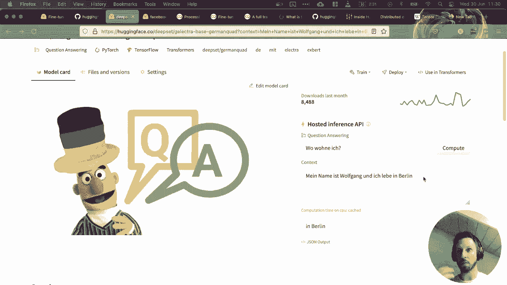

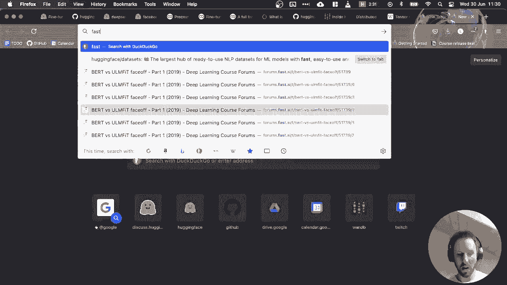

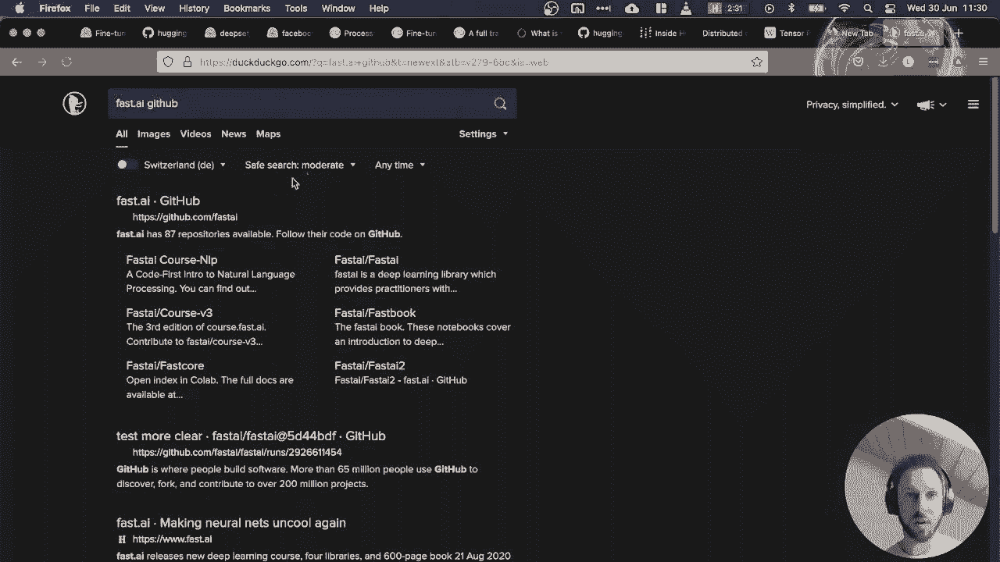

optimizer = AdamW(model.parameters(), lr=5e-5)
num_epochs = 3
num_training_steps = num_epochs * len(train_dataloader)
lr_scheduler = get_scheduler(
    "linear",
    optimizer=optimizer,
    num_warmup_steps=0,
    num_training_steps=num_training_steps,
)

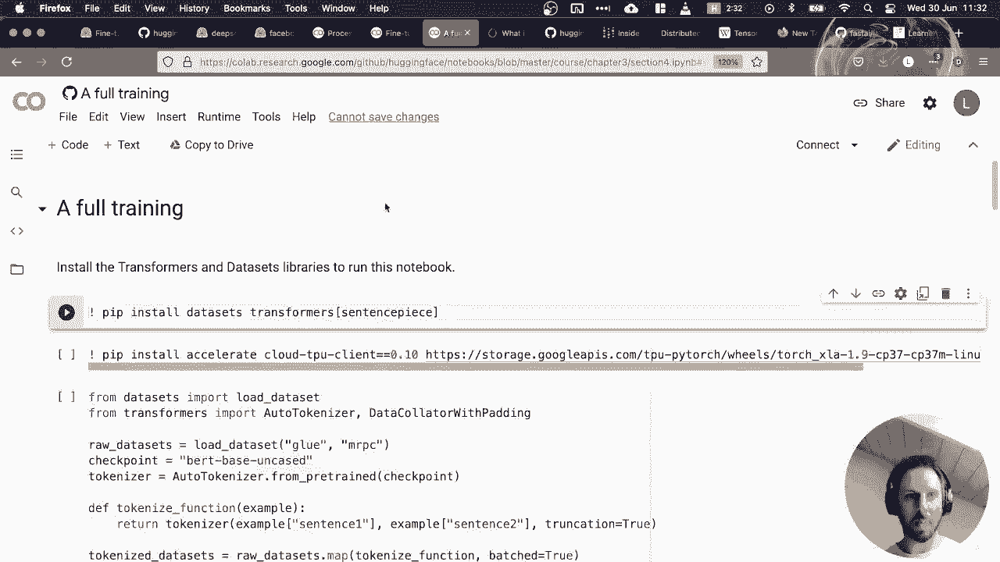

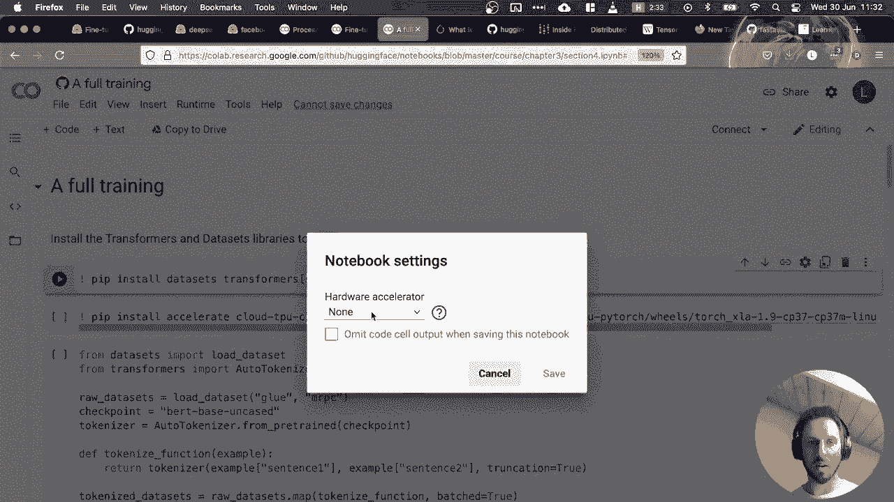

device = torch.device("cuda") if torch.cuda.is_available() else torch.device("cpu")
model.to(device)

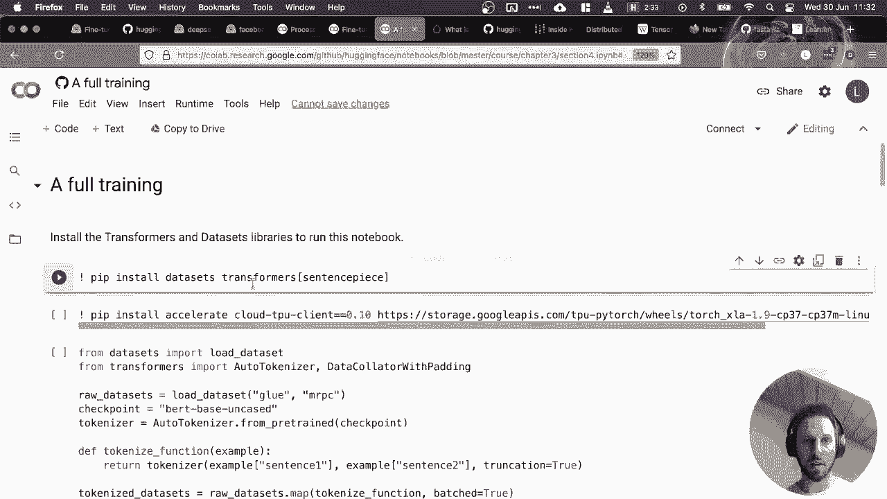

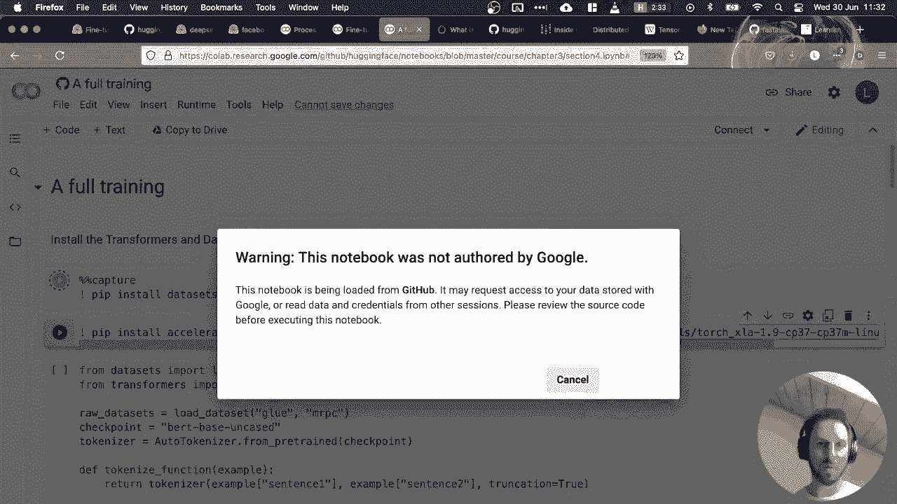

model.train()
for epoch in range(num_epochs):
    for batch in train_dataloader:
        batch = {k: v.to(device) for k, v in batch.items()}
        outputs = model(**batch)
        loss = outputs.loss
        loss.backward()

        optimizer.step()
        lr_scheduler.step()
        optimizer.zero_grad()
```

### 使用 Accelerate 进行分布式训练

`accelerate` 库的核心思想是：**只需添加几行代码，就能让您的训练循环适应任何分布式设置**。

首先安装并配置 `accelerate`：
```bash
pip install accelerate
# 在终端运行配置问卷
accelerate config
```

然后修改训练循环：

```python
from accelerate import Accelerator
from transformers import AdamW, AutoModelForSequenceClassification, get_scheduler

accelerator = Accelerator()

model = AutoModelForSequenceClassification.from_pretrained(checkpoint, num_labels=2)
optimizer = AdamW(model.parameters(), lr=3e-5)

# 使用 accelerator.prepare 准备模型、数据加载器、优化器
train_dataloader, eval_dataloader, model, optimizer = accelerator.prepare(
    train_dataloader, eval_dataloader, model, optimizer
)

num_epochs = 3
num_training_steps = num_epochs * len(train_dataloader)
lr_scheduler = get_scheduler(
    "linear",
    optimizer=optimizer,
    num_warmup_steps=0,
    num_training_steps=num_training_steps,
)

model.train()
for epoch in range(num_epochs):
    for batch in train_dataloader:
        # 注意：不再需要手动将数据移动到设备上
        outputs = model(**batch)
        loss = outputs.loss
        # 使用 accelerator.backward
        accelerator.backward(loss)

        optimizer.step()
        lr_scheduler.step()
        optimizer.zero_grad()
```
关键改动：
1.  初始化 `Accelerator` 对象。
2.  使用 `accelerator.prepare()` 包装模型、数据加载器和优化器。
3.  将 `loss.backward()` 替换为 `accelerator.backward(loss)`。
4.  无需手动管理设备（如 `.to(device)`）。

`accelerate` 会自动处理多 GPU 或 TPU 环境下的数据分发、梯度同步等复杂操作。

---

## 📝 总结与后续步骤

本节课中我们一起学习了 Hugging Face 生态系统中模型训练的核心工作流：

1.  **数据处理**：使用 `datasets` 库加载和预处理数据，特别是利用 `map` 函数进行高效的分词操作。
2.  **高效训练**：使用 `Trainer` API 快速构建和训练模型，并通过定义 `compute_metrics` 函数来跟踪评估指标。
3.  **深入原理**：通过编写自定义 PyTorch 训练循环，理解了 `Trainer` 背后的基本步骤。
4.  **分布式训练**：介绍了 `accelerate` 库，它能够以最小的代码改动将自定义训练循环扩展到多 GPU 或 TPU 环境。

**建议的后续练习**：
*   尝试在 Hugging Face Hub 上寻找新的文本分类数据集（如 `corera` 重复问题检测数据集），并复现整个训练流程。
*   在 Google Colab 上尝试使用免费的 TPU 资源，通过 `accelerate` 库加速你的训练。
*   探索 `TrainingArguments` 中的其他参数，如学习率调度、权重衰减、日志策略等，以优化模型性能。

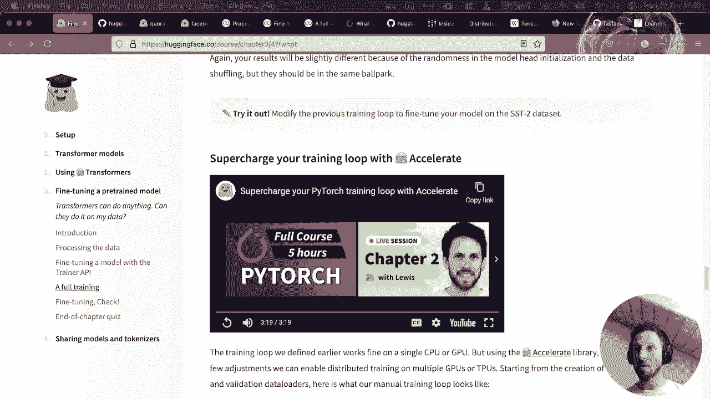


通过掌握这些工具，你将能够高效地针对各种 NLP 任务进行模型微调和实验。