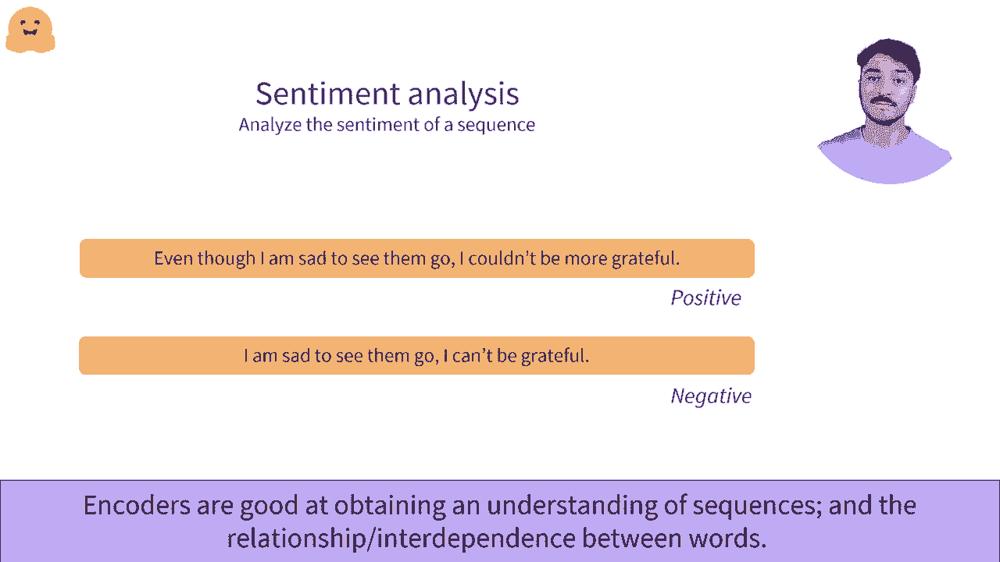

# Transformers原理细节及NLP任务应用！P5：L1.5- Transformer：编码器 🧠

在本节课中，我们将要学习Transformer架构中的编码器部分。我们将了解其工作原理、核心输出以及它在自然语言处理任务中的典型应用场景。

---

## 编码器架构概述

一个流行的独立编码器架构例子是BERT，它是该类型中最受欢迎的模型。我们将通过一个小例子来理解它的工作流程：使用三个单词“欢迎来到纽约”作为输入，并将它们通过编码器传递。

---

## 编码器的输出：上下文向量

编码器将输入单词转换为数值序列。这个数值表示也可以称为特征向量或特征张量。

深入研究这个表示，它包含每个通过编码器传递的单词的一个向量。每个向量都是所讨论单词的数值表示。该向量的维度由模型的架构定义，对于基础BERT模型，它是**768**。

这些表示包含了单词在特定上下文中的值。例如，分配给“来到”这个词的向量，不仅代表“来到”本身，还考虑了其周围的单词“欢迎”和“纽约”。这就是我们所说的**上下文**。

它为给定上下文的单词输出一个值。因此，这是一个**上下文化的值**。可以说，这个768维的向量在文本中承载了单词的语义。这是通过**自注意力机制**实现的。自注意力机制关联序列中不同位置的单词，以计算该序列的整体表示。

这意味着单词的最终表示受到了序列中其他单词的影响。我们在这里不会深入自注意力的数学细节。

---

## 编码器的应用场景

编码器可以作为独立模型在多种任务中使用。例如，BERT就是一个著名的独立基准模型。在发布时，它在许多任务上达到了最先进的水平。

编码器的核心优势在于，它能提取携带序列有意义信息的向量。然后，这个向量可以由后续的神经网络层进行处理，以完成具体任务。

以下是编码器表现出色的几个例子：

### 1. 掩蔽语言建模
这是预测序列中被隐藏词语的任务。例如，在句子“My name is Silva.”中，我们隐藏了“name”这个词。BERT被训练用于预测序列中的这类隐藏词。

编码器在此场景中表现出色，因为**双向上下文信息**至关重要。如果没有右侧的单词“is Silva”，模型很难准确识别出“name”是正确答案。编码器需要对整个序列有良好的理解。

### 2. 序列分类
情感分析是序列分类的一个典型例子。模型的目标是识别整个序列的情感倾向。

它可以用于给评论打分（例如1到5星），或简单地将序列分类为“正面”或“负面”。例如，给定以下两个序列：
*   “这部电影一点也不差，实际上很棒！”
*   “这部电影一点也不棒，实际上很差！”

虽然这两个序列包含大量相同的单词，但意义完全相反。一个优秀的编码器模型能够抓住这种基于上下文和词序的细微差异。

---

## 总结

本节课中，我们一起学习了Transformer编码器。我们了解到，编码器能够将输入文本转换为包含丰富上下文信息的向量表示。这种表示对于理解单词在句子中的真实含义至关重要。我们看到，编码器特别擅长需要理解整个序列上下文的任务，例如**掩蔽语言建模**和**序列分类**（如情感分析）。在接下来的课程中，我们将继续探索Transformer的其他组成部分。