# Transformers 原理细节及NLP任务应用！P9：L2.2- 管道函数内部会发生什么？(TensorFlow) 🔍


## 概述

在本节课中，我们将深入探讨 `transformers` 库中 `pipeline` 函数的工作原理。我们将以情感分析管道为例，详细拆解其内部处理流程，了解一段文本是如何从原始句子转化为最终的情感标签和置信度分数的。

## 管道处理流程概览

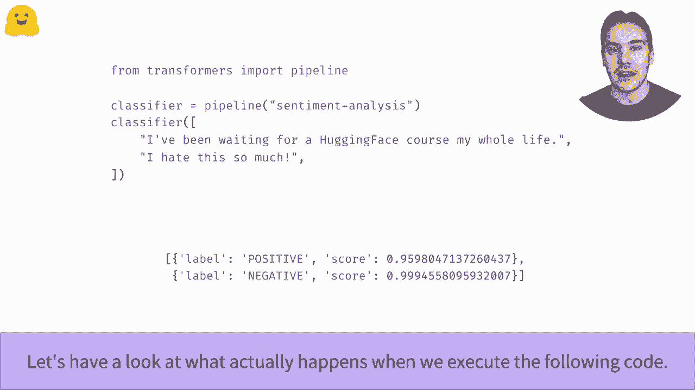

正如我们在之前的管道视频中所见，`pipeline` 函数内部主要包含三个阶段。首先，使用标记器将文本转化为模型可以理解的数字。然后，这些数字被输入模型进行计算，得到原始输出。最后，后处理步骤将这些原始输出转化为人类可读的分类标签和得分。


接下来，让我们逐一详细查看这三个步骤，并学习如何在 `transformers` 库中手动复现它们。

## 第一步：标记化 (Tokenization)

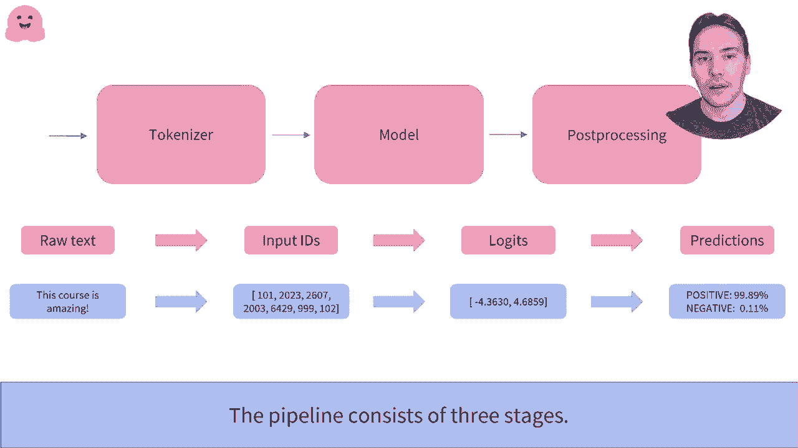


标记化是将原始文本转化为模型输入的关键步骤。这个过程包含几个子步骤。

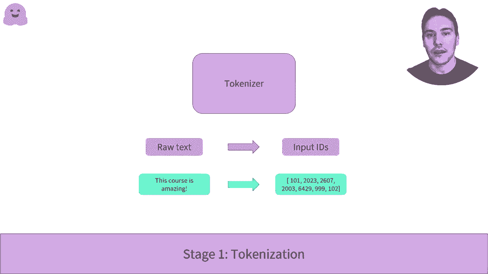

以下是标记化的主要流程：

1.  **分词**：文本被拆分成称为“标记”的小块。这些标记可以是单词、词的一部分或标点符号。
2.  **添加特殊标记**：标记器会添加一些模型所期望的特殊标记。例如，对于分类任务，模型通常期望在句子的开头有一个 `[CLS]` 标记，在结尾有一个 `[SEP]` 标记。
3.  **映射为ID**：标记器将每个标记与预训练模型词汇表中的唯一ID进行匹配。


### 代码实现

要加载标记器，`transformers` 库提供了 `AutoTokenizer` API。

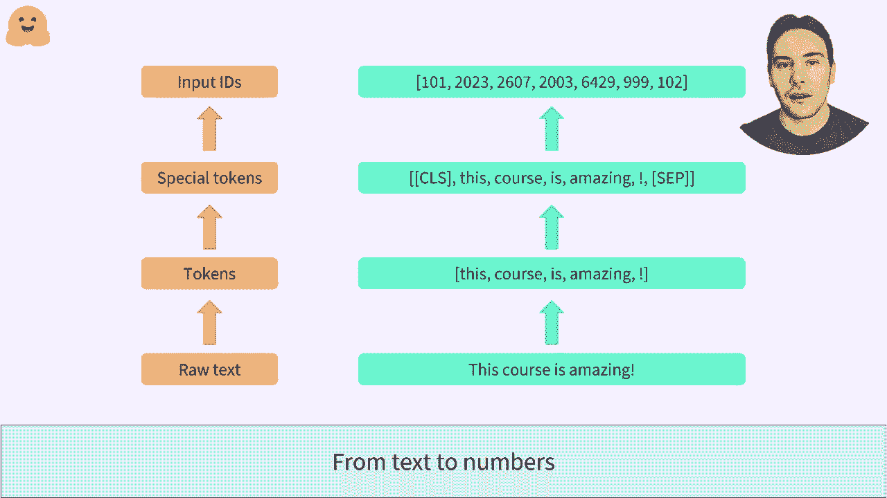

```python
from transformers import AutoTokenizer

# 加载与预训练模型关联的标记器
checkpoint = “distilbert-base-uncased-finetuned-sst-2-english”
tokenizer = AutoTokenizer.from_pretrained(checkpoint)

# 准备输入句子
sentences = [“I’ve been waiting for a HuggingFace course my whole life.”,
             “I hate this so much!”]

# 对句子进行标记化
model_inputs = tokenizer(sentences,
                         padding=True,        # 填充较短的句子
                         truncation=True,     # 截断超过模型长度的句子
                         return_tensors=“tf”) # 返回TensorFlow张量
```

查看 `model_inputs` 的结果，我们会得到一个包含两个键的字典：

*   **`input_ids`**：包含两个句子中所有标记对应的ID。填充的部分用 `0` 表示。
*   **`attention_mask`**：指示哪些位置是真实标记（值为 `1`），哪些是填充标记（值为 `0`）。模型在计算时会忽略填充部分。


## 第二步：模型推理 (Model Inference)

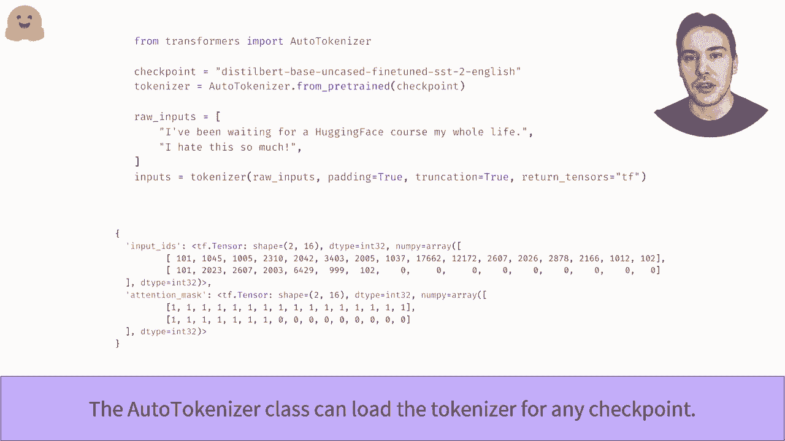

上一节我们介绍了如何将文本转化为模型输入。本节中，我们来看看如何将这些输入传递给模型并获得输出。

与标记器类似，我们使用 `AutoModel` API 来加载模型。`from_pretrained` 方法会下载并缓存模型的配置和预训练权重。


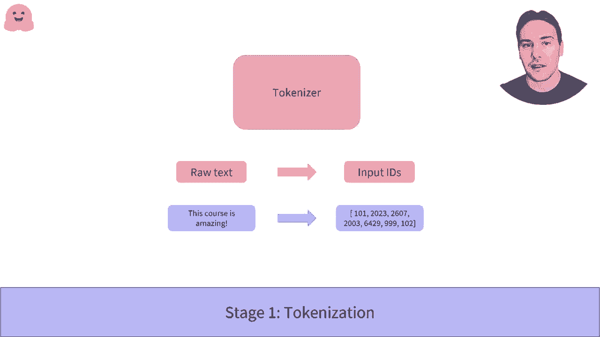

### 基础模型输出


```python
from transformers import AutoModel

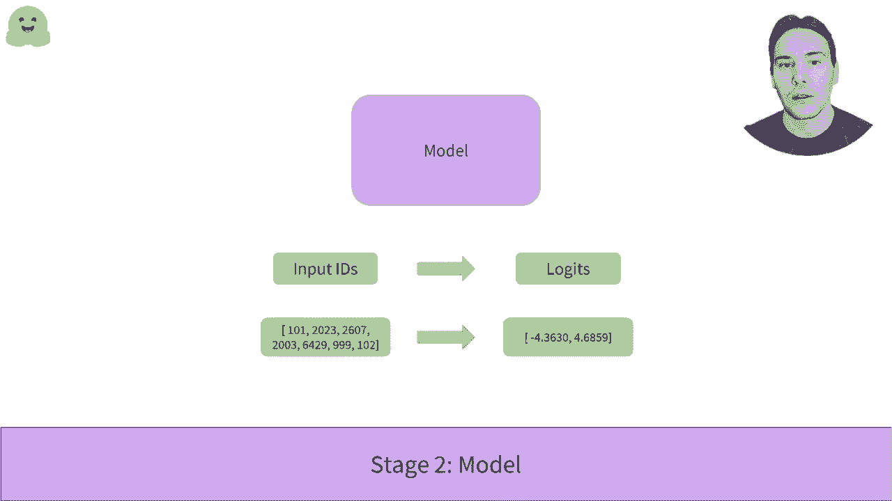

model = AutoModel.from_pretrained(checkpoint)
outputs = model(model_inputs)
```

`AutoModel` 仅实例化模型的主体部分（即去除预训练任务头部后的模型）。它的输出是一个高维张量，表示句子的抽象特征。对于分类任务，这个输出不能直接使用。例如，输出形状可能是 `(2, 16, 768)`，表示两个句子，每个句子有16个标记，每个标记的特征维度是768。


### 分类模型输出

为了获得与分类问题直接相关的输出，我们需要使用 `AutoModelForSequenceClassification` 类。它在基础模型之上添加了一个分类头。

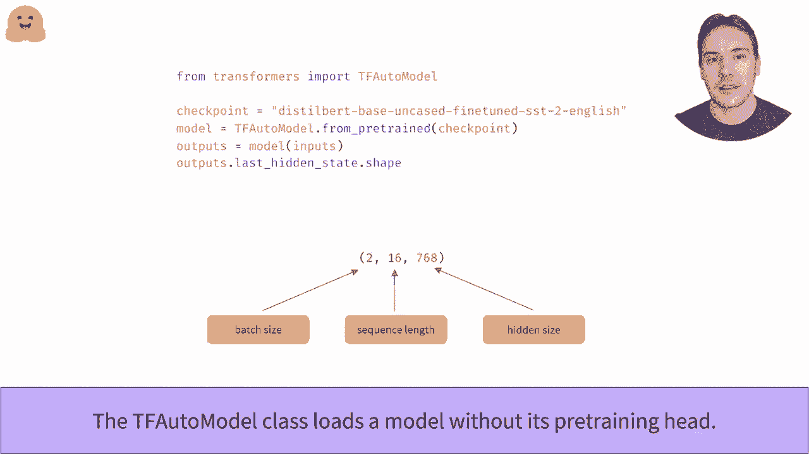

```python
from transformers import TFAutoModelForSequenceClassification

model = TFAutoModelForSequenceClassification.from_pretrained(checkpoint)
outputs = model(model_inputs)
```

现在，`outputs.logits` 的形状是 `(2, 2)`，对应两个句子和两个可能的标签（例如，消极和积极）。这些输出值称为 **logits**，它们还不是概率，因为它们的总和不为1。


## 第三步：后处理 (Post-processing)

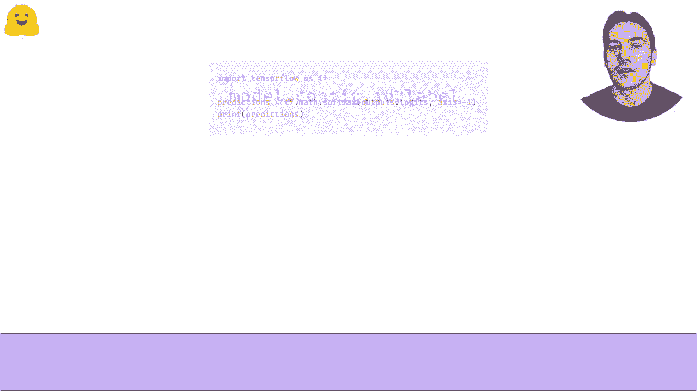

前面我们得到了模型的原始 logits 输出。本节是最后一步，我们将把这些 logits 转化为最终的概率和标签。

后处理主要包含两个步骤：

1.  **转换为概率**：对 logits 应用 **softmax** 函数，将其转换为概率。Softmax 确保所有输出值为正数，且总和为1。
    ```python
    import tensorflow as tf
    predictions = tf.nn.softmax(outputs.logits, axis=-1)
    ```
2.  **映射标签**：将概率索引映射到对应的标签名称。这可以通过模型配置中的 `id2label` 字段获得。
    ```python
    model.config.id2label
    # 输出可能为：{0: ‘NEGATIVE’, 1: ‘POSITIVE’}
    ```
    索引 `0` 对应消极标签，索引 `1` 对应积极标签。


至此，我们就完成了整个流程：`pipeline` 函数根据这些概率选择得分最高的标签，并返回标签及其对应的置信度分数。

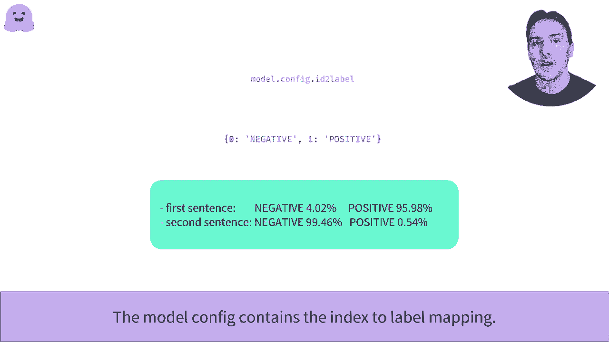

## 总结


在本节课中，我们一起学习了 `transformers` 库 `pipeline` 函数背后的完整流程。我们将其拆解为三个核心步骤：

1.  **标记化**：使用 `AutoTokenizer` 将文本转化为数字ID和注意力掩码。
2.  **模型推理**：使用 `TFAutoModelForSequenceClassification` 加载带有分类头的模型，并输入标记化后的数据得到 logits。
3.  **后处理**：对 logits 应用 softmax 函数得到概率，并通过 `id2label` 映射获得最终的人类可读标签。

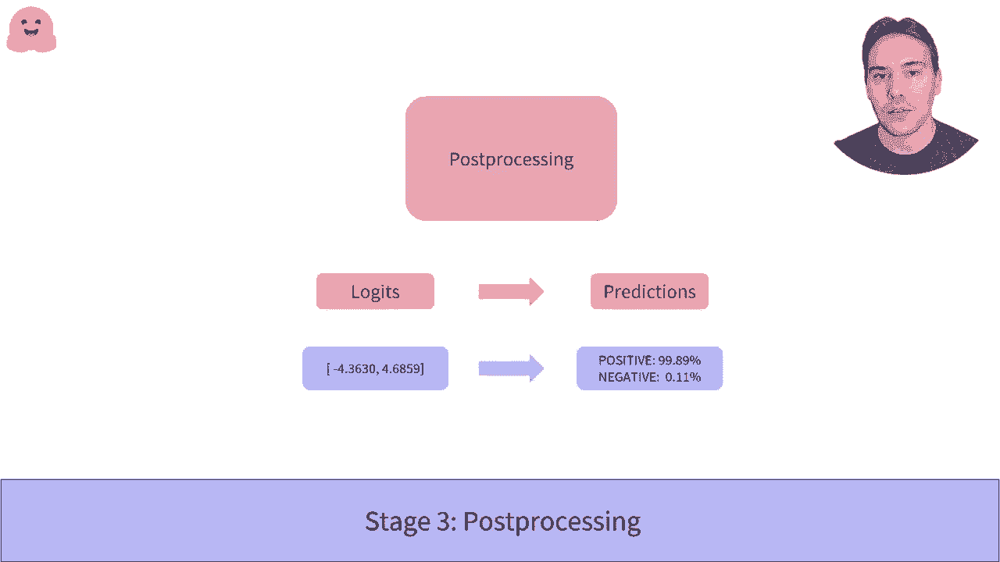

理解了每个步骤的工作原理后，你就可以灵活地调整和组合这些组件，以满足特定的项目需求，而不仅仅是使用封装好的 `pipeline` 函数。

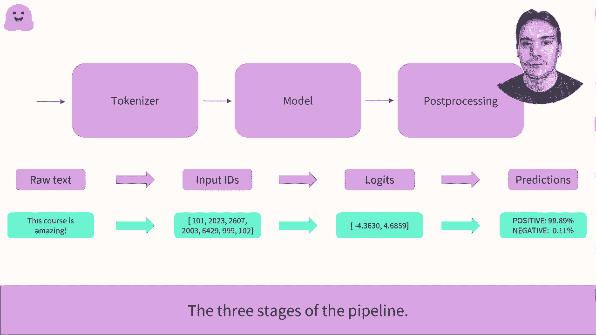


