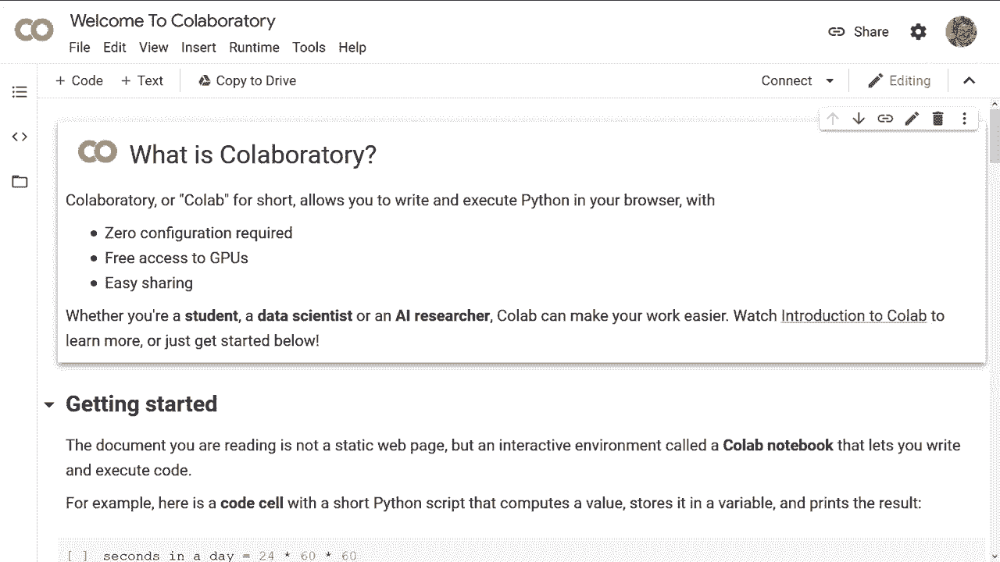
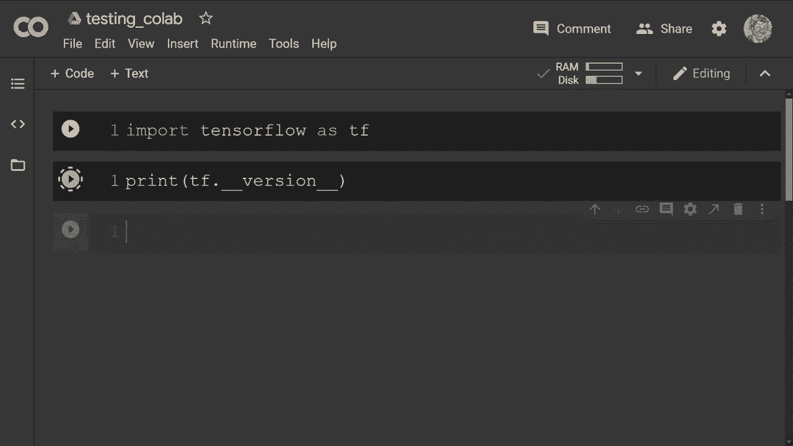
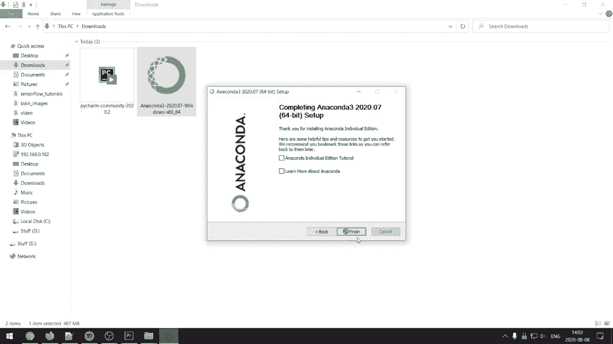
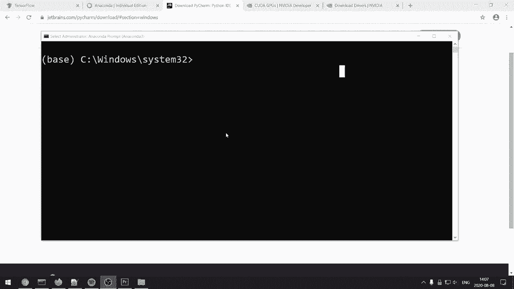
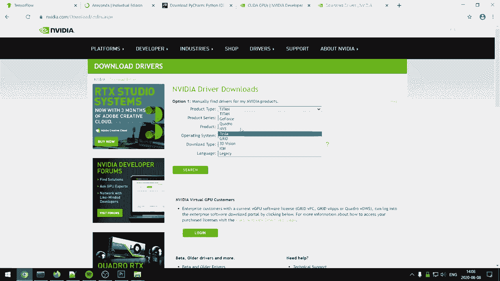
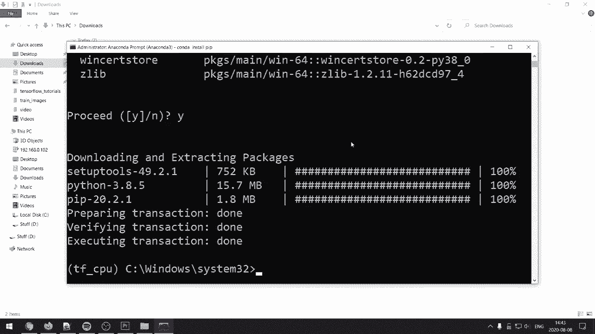
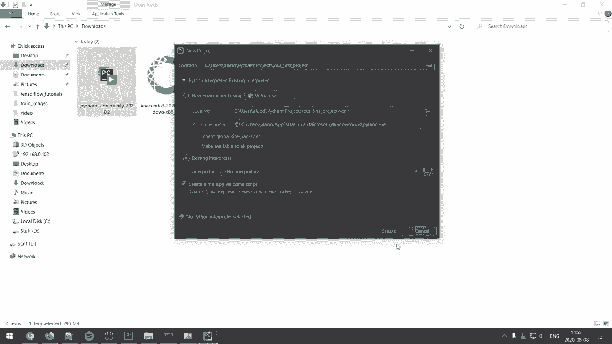
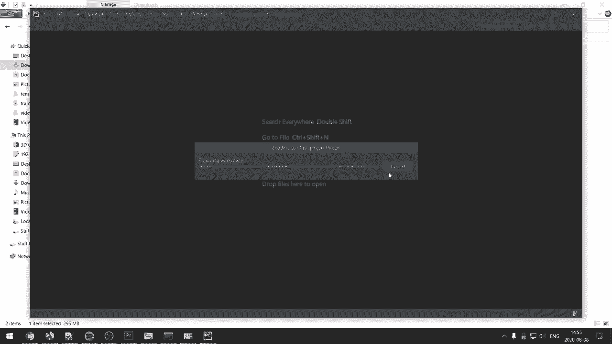
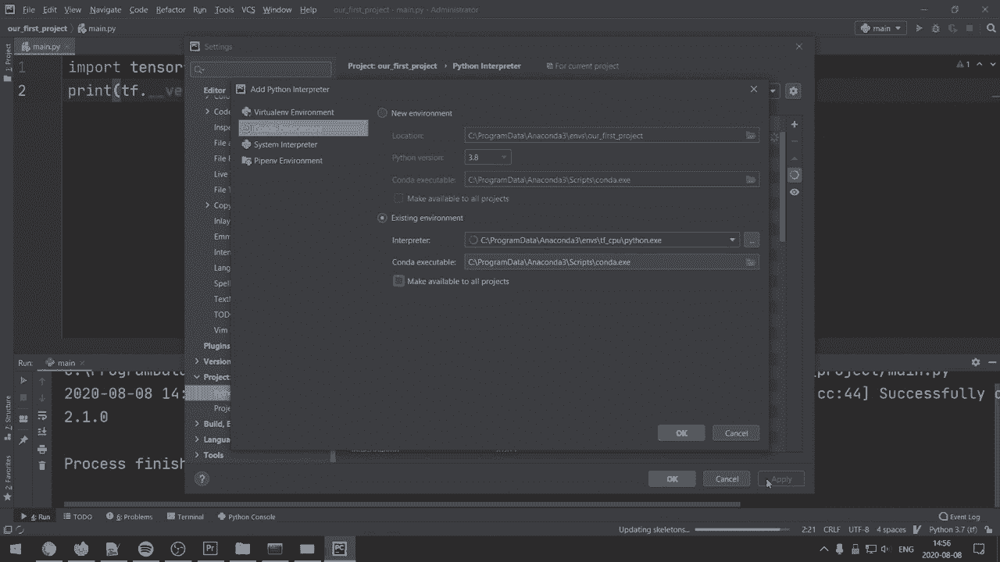
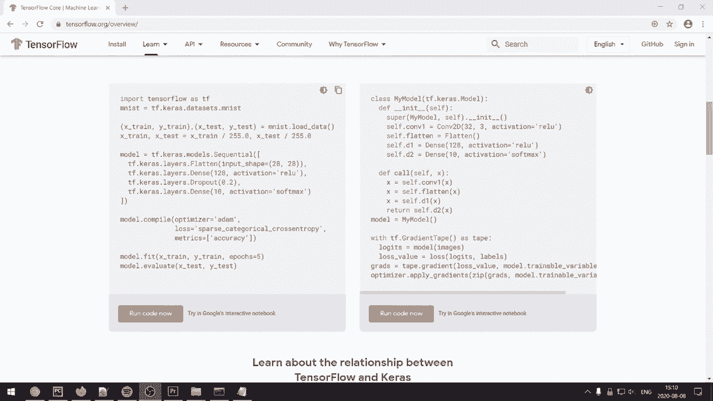

# TensorFlow 教程 P1：L1 - 安装和设置深度学习环境 (Anaconda 和 PyCharm) 🚀


在本节课中，我们将学习如何为 TensorFlow 深度学习项目搭建开发环境。我们将介绍两种主要方法：使用无需安装的 Google Colab，以及在本地计算机上通过 Anaconda 和 PyCharm 进行安装和配置。课程目标是确保你能顺利开始 TensorFlow 编程。

---

## 课程概述与前提

观看并完成本系列教程后，你将能够建立坚实的 TensorFlow 基础，并准备好开展自己的项目。

建议你具备以下基础知识：
*   **Python 编程**：了解基础语法。
*   **线性代数**：理解向量、矩阵等基本概念。
*   **深度学习理论**：了解神经网络的基本原理。

如果你对某些主题不熟悉，我会在视频描述中推荐相关学习资源，以便你可以提前补充知识。

---



## 方法一：使用 Google Colab（无需安装）

在开始本地安装之前，最简单的方法是使用 **Google Colab**。你无需在电脑上安装任何软件。

以下是使用 Colab 的步骤：
1.  打开视频描述中的 Colab 链接。
2.  界面由代码单元格组成。
3.  在单元格中，你可以直接导入 TensorFlow 并开始编码。

例如，你可以执行以下代码来验证安装：
```python
import tensorflow as tf
print(tf.__version__)
```
执行后，你将看到当前可用的最新 TensorFlow 版本。



如果 Colab 暂时无法使用，你可以将其作为备选方案。

---



## 方法二：本地安装（Anaconda + PyCharm）

为了获得更好的开发体验，建议在本地计算机上安装 TensorFlow。我将展示一个相对简单的设置方法，适用于 GPU 和 CPU。

首先，你需要下载两个必要的软件，所有链接均在视频描述中提供。



### 步骤 1：下载必要软件

以下是需要下载的软件列表：
1.  **Anaconda**：用于创建和管理 Python 环境。
    *   访问 Anaconda 官网，根据你的操作系统（如 64 位 Windows）下载对应的安装程序。
2.  **PyCharm**：推荐的代码编辑器。
    *   访问 PyCharm 官网，下载免费的 **Community（社区）** 版本。

### 步骤 2：安装 Anaconda

下载完成后，我们首先安装 Anaconda。



安装过程如下：
1.  以管理员身份运行安装程序。
2.  在安装向导中，保持所有默认选项。
3.  依次点击 **Next（下一步）**、**I Agree（我同意）**、**Next（下一步）**、**Install（安装）**。
4.  安装完成后，点击 **Next（下一步）**、**Finish（完成）**。

### 步骤 3：创建 TensorFlow 环境

安装好 Anaconda 后，我们需要创建一个独立的 Python 环境来安装 TensorFlow。Anaconda 允许你创建多个环境，每个环境可以拥有不同版本的软件包。

创建环境前，请根据你的硬件情况选择对应命令。

**选项 A：为 GPU 创建环境（推荐）**

如果你的显卡支持 CUDA 并已安装驱动程序，请使用此选项以获得更快的训练速度。
1.  打开 Anaconda Prompt（Anaconda 命令行）。
2.  输入以下命令创建名为 `tf_gpu` 的环境并安装 TensorFlow-GPU：
    ```bash
    conda create --name tf_gpu tensorflow-gpu
    ```
3.  输入 `y` 确认安装。该命令会自动下载 TensorFlow、CUDA 工具包和 cuDNN 库，确保版本兼容。

**选项 B：为 CPU 创建环境**

如果你的计算机没有 NVIDIA GPU 或不想使用 GPU，请使用此选项。
1.  打开 Anaconda Prompt。
2.  输入以下命令创建名为 `tf_cpu` 的环境：
    ```bash
    conda create --name tf_cpu python=3.8
    ```
3.  激活该环境：
    ```bash
    conda activate tf_cpu
    ```
4.  使用 pip 安装 TensorFlow CPU 版本：
    ```bash
    pip install tensorflow
    ```



### 步骤 4：安装并配置 PyCharm

接下来，我们安装 PyCharm 并将其配置为使用我们刚创建的 Conda 环境。

安装过程如下：
1.  运行 PyCharm 安装程序。
2.  在安装向导中，保持默认设置，依次点击 **Next（下一步）**。
3.  建议勾选 **“Create Desktop shortcut（创建桌面快捷方式）”** 和 **“Add launchers dir to the PATH（将启动器目录添加到 PATH）”**。
4.  点击 **Install（安装）**，完成后运行 PyCharm。

首次运行 PyCharm 时，可能会提示你导入设置，选择不导入即可。

### 步骤 5：在 PyCharm 中配置 Python 解释器

最后一步是将我们创建的 Conda 环境设置为 PyCharm 项目的解释器。



配置步骤如下：
1.  在 PyCharm 欢迎界面，点击 **Create New Project（创建新项目）**。
2.  为项目命名（例如 `my_first_tf_project`）。
3.  在 **“Python Interpreter（Python 解释器）”** 部分，点击下拉菜单旁的 **“...”** 按钮。
4.  选择 **“Conda Environment（Conda 环境）”**。
5.  选择 **“Existing environment（现有环境）”**。
6.  在路径中，找到并选择你之前创建的环境（例如 `tf_gpu` 或 `tf_cpu`）。
7.  勾选 **“Make available to all projects（可用于所有项目）”**。
8.  点击 **OK（确定）**，然后点击 **Create（创建）**。



如果无法在下拉菜单中找到环境，你可以通过以下路径手动添加：
*   进入 **File（文件）** -> **Settings（设置）**（Windows/Linux）或 **PyCharm** -> **Preferences（偏好设置）**（macOS）。
*   进入 **Project: [你的项目名]** -> **Python Interpreter（Python 解释器）**。
*   点击齿轮图标，选择 **Add（添加）**。
*   后续步骤与上述第 4-8 步相同。

### 步骤 6：验证安装

环境配置完成后，你可以在 PyCharm 中创建一个新的 Python 文件（例如 `main.py`），输入以下代码进行验证：
```python
import tensorflow as tf
print(tf.__version__)
```
运行该文件，如果成功输出 TensorFlow 版本号（例如 `2.1.0` 或更高），则说明安装和配置成功。

---

## 总结与下节预告



本节课中，我们一起学习了如何搭建 TensorFlow 开发环境。我们介绍了两种主要途径：便捷的 Google Colab 和功能更强大的本地 Anaconda + PyCharm 组合。重点掌握了使用 Conda 创建独立环境、安装 TensorFlow（GPU/CPU 版本）以及在 PyCharm 中配置对应解释器的完整流程。

如果你在安装过程中遇到任何问题，请在评论区留言，我会尽力提供帮助。



安装环境是万里长征的第一步。话不多说，在下一个视频中，我们将真正开始编写 TensorFlow 代码，期待在那里与你相见！