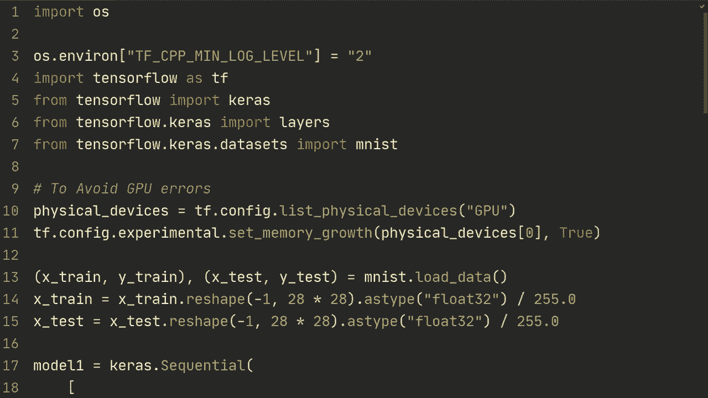
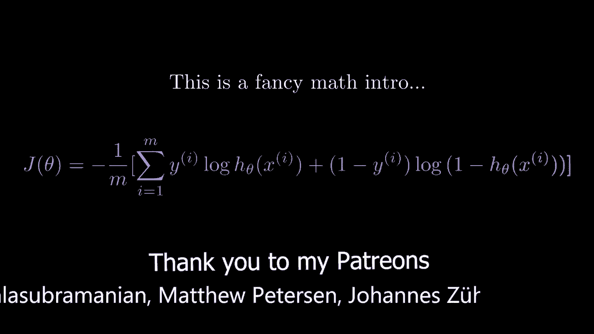
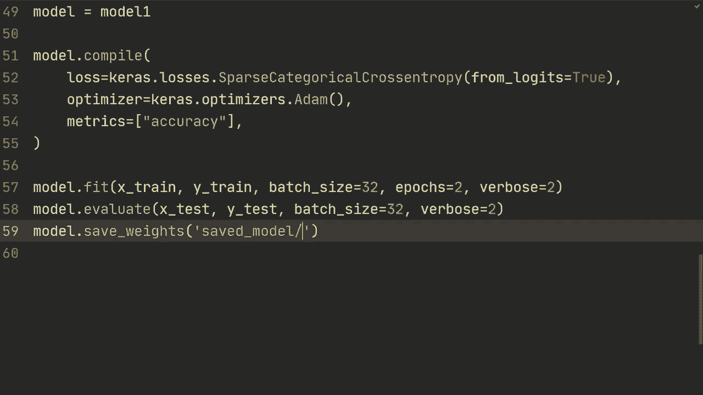
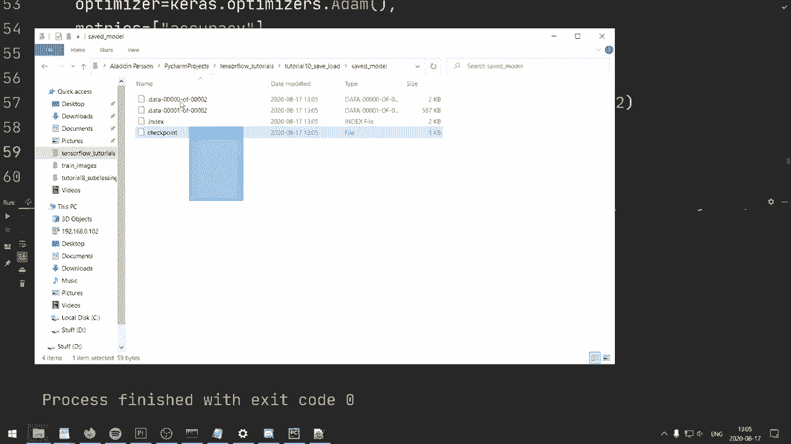
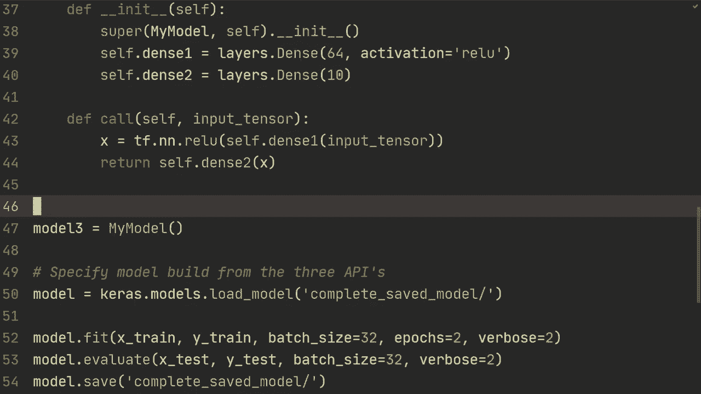

# TensorFlow 教程 P10：L10 - 保存和加载模型 💾

在本节课中，我们将学习如何保存和加载训练好的TensorFlow模型。这包括保存模型的权重，以及保存整个模型（称为序列化）。掌握这些技能对于模型复用、部署和继续训练至关重要。



---



## 概述

模型训练完成后，我们通常希望保存其成果，以便未来使用或部署。TensorFlow提供了两种主要方式：
1.  **保存和加载模型权重**：仅保存模型的参数。
2.  **保存和加载整个模型（序列化）**：保存模型架构、权重、训练配置和优化器状态。

接下来，我们将通过示例代码详细讲解这两种方法。

---

## 准备工作

在开始之前，我们需要导入必要的库并准备数据与模型。以下是示例代码，我们创建了三个结构相同但构建方式不同的模型。

```python
import tensorflow as tf
from tensorflow import keras as ks
import numpy as np

# 加载MNIST数据集
(x_train, y_train), (x_test, y_test) = ks.datasets.mnist.load_data()
x_train, x_test = x_train / 255.0, x_test / 255.0

# 使用顺序API创建模型
model1 = ks.Sequential([
    ks.layers.Flatten(input_shape=(28, 28)),
    ks.layers.Dense(64, activation='relu'),
    ks.layers.Dense(64, activation='relu'),
    ks.layers.Dense(10)
])

# 使用函数式API创建相同结构的模型
inputs = ks.Input(shape=(28, 28))
x = ks.layers.Flatten()(inputs)
x = ks.layers.Dense(64, activation='relu')(x)
x = ks.layers.Dense(64, activation='relu')(x)
outputs = ks.layers.Dense(10)(x)
model2 = ks.Model(inputs=inputs, outputs=outputs)

# 使用子类化API创建模型
class MyModel(ks.Model):
    def __init__(self):
        super(MyModel, self).__init__()
        self.flatten = ks.layers.Flatten()
        self.d1 = ks.layers.Dense(64, activation='relu')
        self.d2 = ks.layers.Dense(64, activation='relu')
        self.d3 = ks.layers.Dense(10)

    def call(self, x):
        x = self.flatten(x)
        x = self.d1(x)
        x = self.d2(x)
        return self.d3(x)

model3 = MyModel()
```

---

## 1. 保存与加载模型权重

上一节我们准备好了模型，本节中我们来看看如何仅保存和加载模型的权重。这种方法只存储模型的参数，不包含模型结构等信息。

### 1.1 保存权重

训练模型后，使用 `model.save_weights()` 方法将权重保存到指定目录。

```python
# 编译并训练模型
model1.compile(optimizer='adam',
               loss=tf.keras.losses.SparseCategoricalCrossentropy(from_logits=True),
               metrics=['accuracy'])
model1.fit(x_train, y_train, epochs=1)



# 评估模型
test_loss, test_acc = model1.evaluate(x_test, y_test, verbose=2)
print(f'\n初始测试准确率：{test_acc}')



# 保存模型权重
model1.save_weights('./save_weights/my_model_weights')
```
运行后，会在 `./save_weights/` 文件夹下生成保存权重的文件。

### 1.2 加载权重

要加载权重，需要先创建一个结构完全相同的模型，然后使用 `model.load_weights()` 方法。

```python
# 创建一个结构相同的新模型
new_model = ks.Sequential([
    ks.layers.Flatten(input_shape=(28, 28)),
    ks.layers.Dense(64, activation='relu'),
    ks.layers.Dense(64, activation='relu'),
    ks.layers.Dense(10)
])
new_model.compile(optimizer='adam',
                  loss=tf.keras.losses.SparseCategoricalCrossentropy(from_logits=True),
                  metrics=['accuracy'])

# 加载之前保存的权重
new_model.load_weights('./save_weights/my_model_weights')

# 评估加载权重后的模型
test_loss, test_acc = new_model.evaluate(x_test, y_test, verbose=2)
print(f'\n加载权重后的测试准确率：{test_acc}')
```
此时，新模型的准确率应与保存前模型的准确率一致，表明权重加载成功。

**重要提示**：权重文件与模型架构紧密绑定。你不能将在顺序API模型上保存的权重加载到功能API或子类化创建的模型上，反之亦然。加载权重的模型结构必须与保存时完全相同。

---

## 2. 保存与加载整个模型（序列化）

了解了权重的保存后，我们来看看更强大的功能：保存整个模型。这种方法会将模型架构、权重、训练配置（如损失函数、优化器、指标）以及优化器的状态全部保存下来。

### 2.1 保存整个模型

使用 `model.save()` 方法可以将整个模型序列化并保存。

```python
# 保存整个模型
model1.save('./saved_model/my_full_model')
```
此命令会创建一个 `my_full_model` 文件夹，其中包含了模型的所有信息。这种格式称为 **TensorFlow SavedModel** 格式，是TensorFlow 2.x的默认格式。

### 2.2 加载整个模型

加载保存的完整模型非常简单，使用 `keras.models.load_model()` 函数即可。

```python
# 加载整个模型
loaded_full_model = ks.models.load_model('./saved_model/my_full_model')

# 可以直接评估或继续训练，无需重新编译
test_loss, test_acc = loaded_full_model.evaluate(x_test, y_test, verbose=2)
print(f'\n加载完整模型后的测试准确率：{test_acc}')

# 可以继续训练
loaded_full_model.fit(x_train, y_train, epochs=1)
```
加载后的模型已经包含了编译信息，因此可以直接用于评估、预测或继续训练。优化器的状态（如Adam优化器的动量）也被保留了下来。

### 2.3 关于保存格式

TensorFlow支持两种主要的保存格式：
*   **TensorFlow SavedModel 格式（默认）**：一个包含多个文件的目录。这是TensorFlow 2.x的推荐格式，支持跨平台部署（如TensorFlow.js, TensorFlow Lite）。
*   **HDF5 格式（.h5文件）**：一个单一的文件。这是Keras早期的格式。

你可以通过指定路径后缀来选择格式：
```python
# 保存为HDF5格式
model1.save('my_model.h5')

# 加载HDF5格式模型
model_from_h5 = ks.models.load_model('my_model.h5')
```
对于使用子类化API创建的模型，使用SavedModel格式通常更简单可靠。若使用HDF5格式保存子类化模型，可能需要额外实现 `get_config` 和 `from_config` 方法。

---

## 总结

在本节课中，我们一起学习了TensorFlow模型持久化的核心技能：

1.  **保存/加载模型权重**：使用 `save_weights()` 和 `load_weights()`。这种方法轻量，但要求加载时模型架构必须与保存时完全一致。
2.  **保存/加载整个模型**：使用 `save()` 和 `load_model()`。这是功能最完整的方法，保存了架构、权重、编译配置和优化器状态，便于模型的部署、分享和继续训练。



**核心公式与代码回顾**：
*   保存权重：`model.save_weights(‘path/to/weights’)`
*   加载权重：`model.load_weights(‘path/to/weights’)`
*   保存模型：`model.save(‘path/to/model’)`
*   加载模型：`keras.models.load_model(‘path/to/model’)`

掌握这些操作，你就能有效地管理训练好的模型，为后续的模型评估、部署和产品化打下坚实基础。