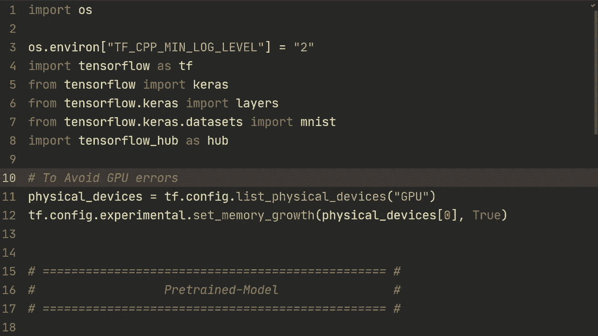
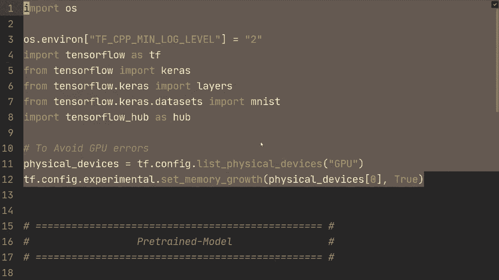
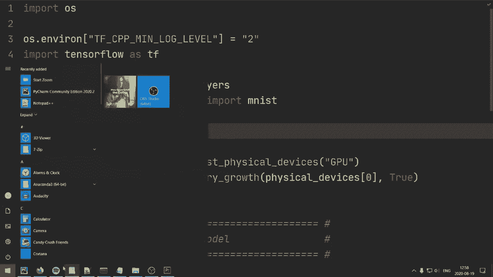
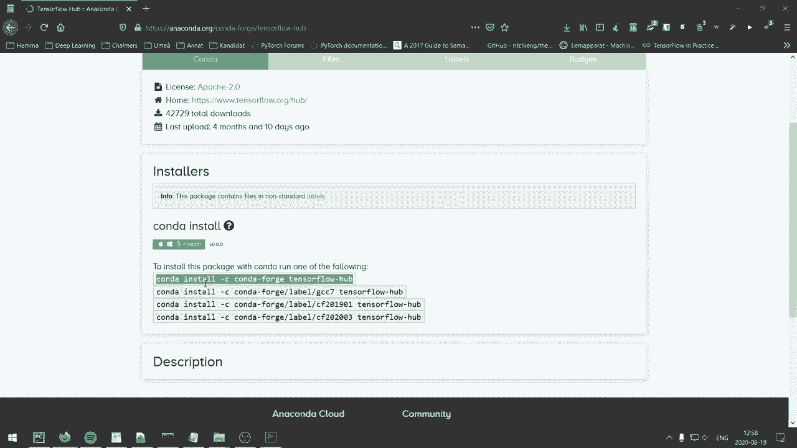
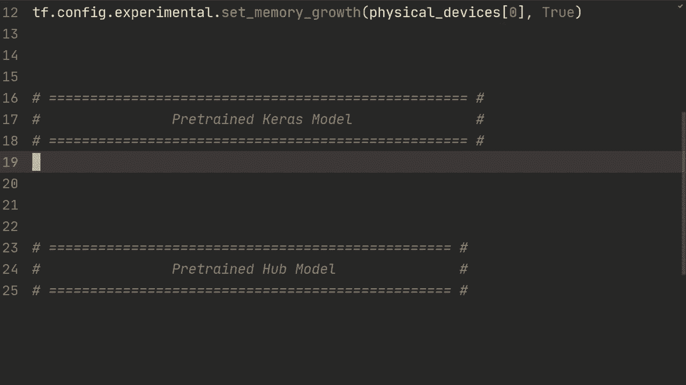
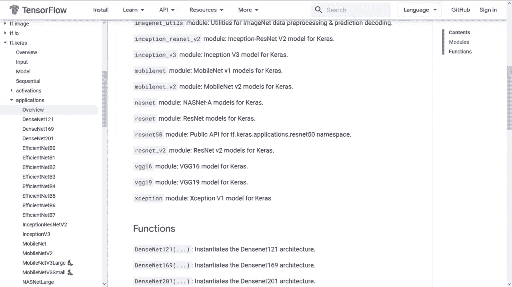
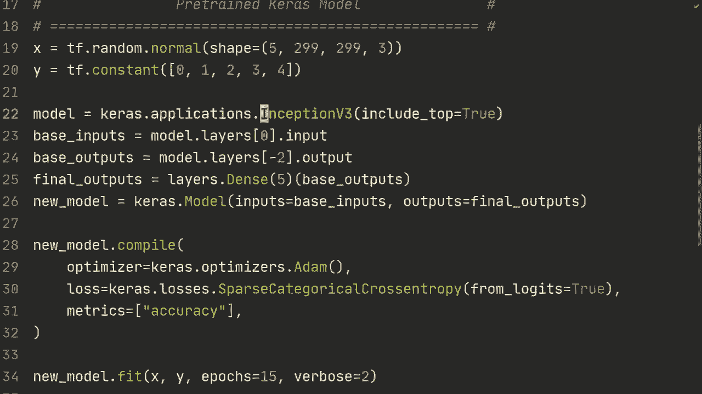
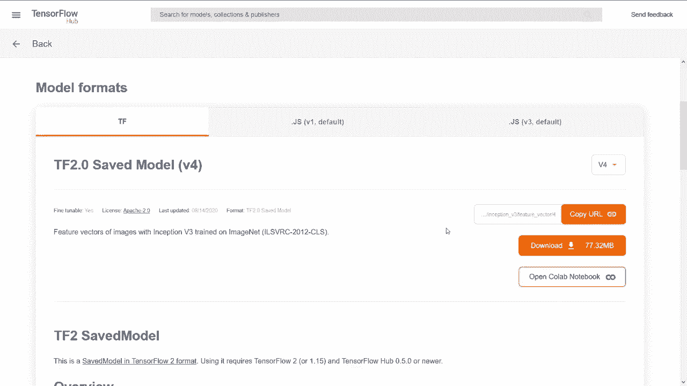
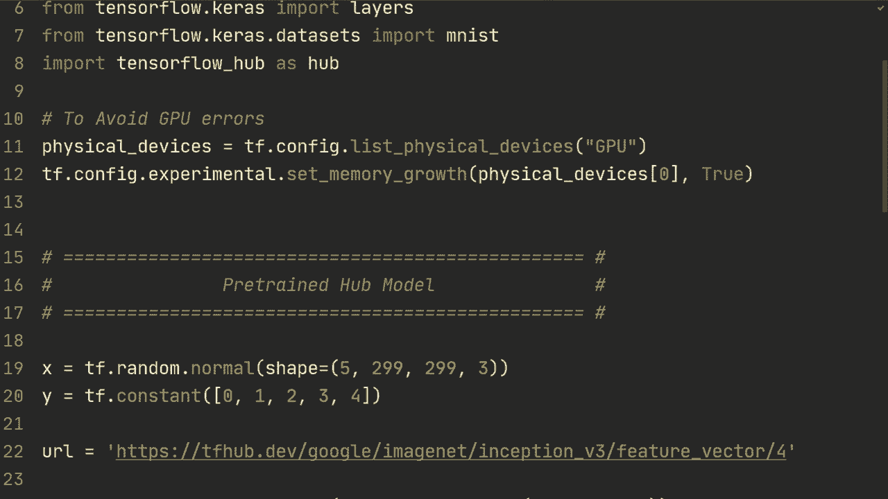

# TensorFlow 教程 P11：🚀 迁移学习、微调与 TensorFlow Hub




在本节课中，我们将学习如何使用预训练模型进行迁移学习。主要内容包括：加载并修改已有的预训练模型、使用Keras内置的预训练模型、以及从TensorFlow Hub加载模型。我们还将学习如何冻结模型层以进行微调，从而加快训练速度并提升性能。

---

## 1. 准备工作与环境配置



上一节我们介绍了课程概述，本节中我们来看看如何配置环境以使用预训练模型。





首先，你需要安装 `tensorflow-hub` 库。如果你使用 Conda，可以通过搜索 `Conda TensorFlow Hub` 找到安装命令。如果你使用 Pip，则直接运行以下命令：

```python
pip install tensorflow-hub
```

安装完成后，你就可以在代码中导入并使用它了。

---

## 2. 使用已有的预训练模型

现在，我们来看看如何使用一个你已经训练好或从其他地方获取的预训练模型。

假设我们有一个在MNIST数据集上训练过的模型。以下是加载和使用该模型的基本步骤：

1.  **加载模型**：使用 `tf.keras.models.load_model` 加载你的模型文件。
2.  **查看模型结构**：使用 `model.summary()` 查看模型的所有层。
3.  **修改模型以适应新任务**：在迁移学习中，我们通常保留模型的大部分层（特征提取器），只替换最后的分类层。

以下是具体操作的代码示例。我们假设原模型有1000个输出节点（对应ImageNet），但我们的新任务（MNIST）只需要10个类别。

```python
import tensorflow as tf

# 1. 加载预训练模型
pretrained_model = tf.keras.models.load_model(‘your_model_path.h5’)

# 2. 查看模型结构
print(pretrained_model.summary())

# 3. 构建新模型：保留除最后一层外的所有层
base_input = pretrained_model.layers[0].input  # 获取原模型的输入
base_output = pretrained_model.layers[-2].output  # 获取倒数第二层的输出（移除原最后一层）

# 4. 添加新的输出层
final_output = tf.keras.layers.Dense(10, activation=‘softmax’)(base_output)

# 5. 定义新模型
new_model = tf.keras.Model(inputs=base_input, outputs=final_output)

# 6. 查看新模型结构
print(new_model.summary())
```

通过这种方式，我们创建了一个新模型，它使用了预训练模型的特征提取能力，并针对新任务（10分类）调整了输出层。

---

## 3. 冻结层与微调

在迁移学习中，我们通常不希望重新训练整个庞大的模型，因为这会非常耗时，并且可能导致在小型新数据集上过拟合。因此，我们需要“冻结”预训练模型的层。

**冻结层**意味着在训练过程中，这些层的权重不会被更新。我们通常只训练新添加的层。

以下是冻结层的两种方法：

**方法一：冻结整个基础模型**
```python
# 将基础模型（pretrained_model）的所有层设置为不可训练
for layer in pretrained_model.layers:
    layer.trainable = False
```
**方法二：冻结特定层**
```python
# 例如，只冻结前5层
for layer in pretrained_model.layers[:5]:
    layer.trainable = False
```

冻结层后，再进行编译和训练，训练速度会显著提升，因为需要计算梯度和更新的参数大大减少。

---

## 4. 使用Keras内置的预训练模型

Keras Applications模块提供了许多著名的、在ImageNet上预训练好的模型，如InceptionV3、ResNet50等，我们可以直接导入使用。



以下是使用Keras内置模型的步骤：



1.  **导入模型**：从 `tensorflow.keras.applications` 中导入所需模型，并设置 `include_top=False` 以移除顶部的全连接分类层。
2.  **添加自定义层**：在基础模型之上，构建适合自己任务的新分类头。
3.  **编译与训练**：像训练普通模型一样进行编译和拟合。

```python
import tensorflow as tf
from tensorflow.keras.applications import InceptionV3

# 1. 加载预训练的InceptionV3模型，不包括顶部分类层
base_model = InceptionV3(weights=‘imagenet’, include_top=False, input_shape=(299, 299, 3))

# 2. 添加自定义层
x = base_model.output
x = tf.keras.layers.GlobalAveragePooling2D()(x)
x = tf.keras.layers.Dense(128, activation=‘relu’)(x)
predictions = tf.keras.layers.Dense(5, activation=‘softmax’)(x) # 假设新任务有5个类别

# 3. 定义最终模型
model = tf.keras.Model(inputs=base_model.input, outputs=predictions)

# 4. （可选）冻结基础模型层
base_model.trainable = False

# 5. 编译模型
model.compile(optimizer=‘adam’, loss=‘sparse_categorical_crossentropy’, metrics=[‘accuracy’])

# 6. 训练模型（此处使用随机数据演示）
import numpy as np
X = np.random.randn(5, 299, 299, 3) # 5个随机图像
y = np.array([0, 1, 2, 3, 4]) # 5个标签
model.fit(X, y, epochs=15, verbose=2)
```

---

## 5. 使用TensorFlow Hub模型

TensorFlow Hub是一个预训练模型的仓库，提供了更多样化的模型。使用方式与Keras Applications类似。

以下是使用TensorFlow Hub模型的步骤：

1.  **在TF Hub网站找到模型**：浏览 [tfhub.dev](https://tfhub.dev)，找到需要的模型（例如Inception V3的特征向量版本）。
2.  **复制模型URL**。
3.  **在代码中加载模型**：使用 `hub.KerasLayer` 加载模型。

```python
import tensorflow as tf
import tensorflow_hub as hub

# 1. 指定模型URL
model_url = “https://tfhub.dev/google/imagenet/inception_v3/feature_vector/4"





# 2. 将Hub模型包装为一个Keras层
base_model = hub.KerasLayer(model_url, input_shape=(299, 299, 3))

# 3. 构建顺序模型
model = tf.keras.Sequential([
    base_model,
    tf.keras.layers.Dense(128, activation=‘relu’),
    tf.keras.layers.Dense(5, activation=‘softmax’) # 5个输出类别
])

# 4. （可选）冻结Hub模型层
base_model.trainable = False

# 5. 编译和训练
model.compile(optimizer=‘adam’, loss=‘sparse_categorical_crossentropy’, metrics=[‘accuracy’])
model.fit(X, y, epochs=15, verbose=2) # 使用之前的随机数据
```

---

## 总结

本节课中我们一起学习了迁移学习的核心概念和实操方法：

1.  **核心思想**：利用在大数据集上预训练好的模型，通过**修改输出层**和**冻结部分层**，快速适配到新的、数据量可能较小的任务上。
2.  **三种使用方式**：
    *   加载自己的 `.h5` 模型文件进行修改。
    *   使用 `tf.keras.applications` 中的内置模型。
    *   从 **TensorFlow Hub** 加载更丰富的社区模型。
3.  **关键技术**：通过设置 `layer.trainable = False` 来**冻结层**，可以大幅提升训练效率，并防止过拟合。
4.  **工作流程**：加载基础模型 -> 修改模型结构（通常替换最后一层）-> （可选）冻结基础层 -> 编译 -> 在新数据上训练（微调）。



掌握迁移学习能让你站在巨人的肩膀上，利用现有的强大模型快速解决实际问题，是深度学习实践中一项非常重要的技能。