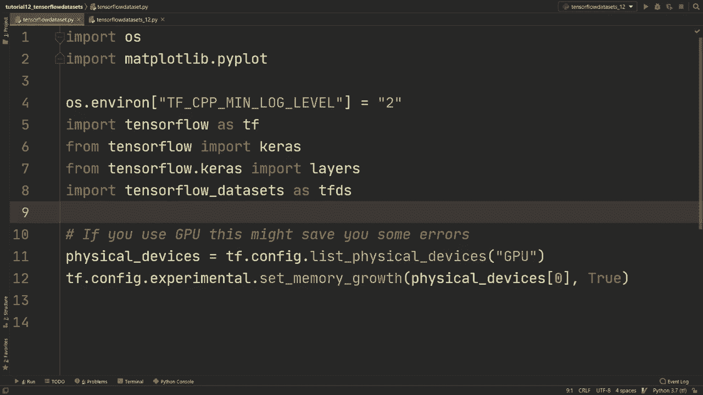
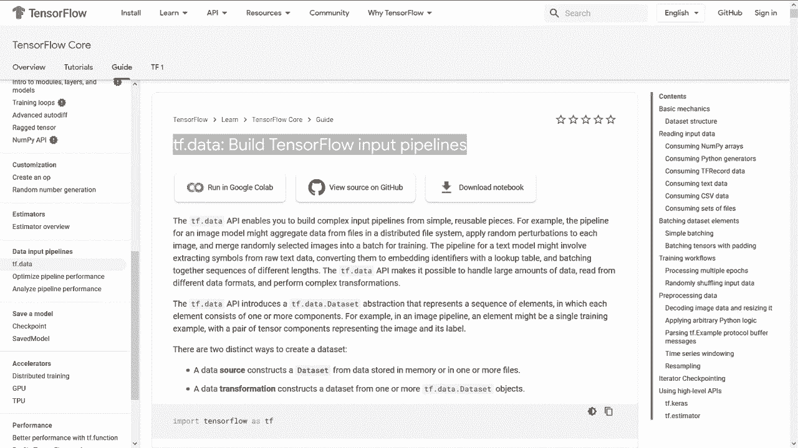
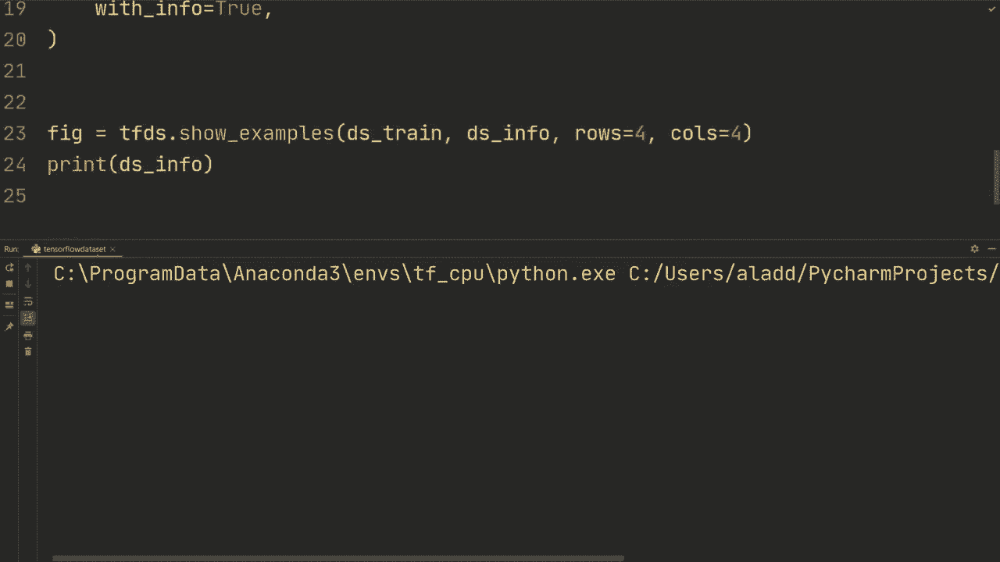
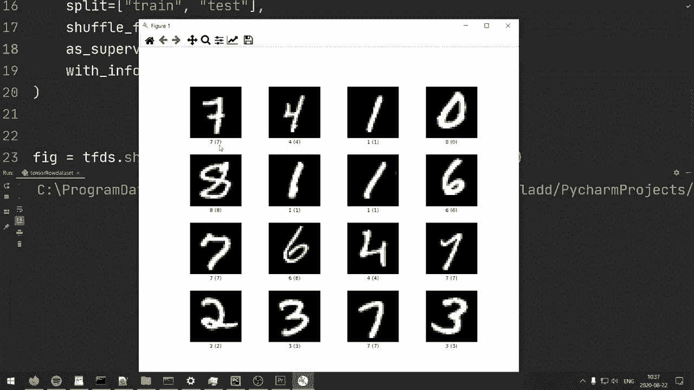
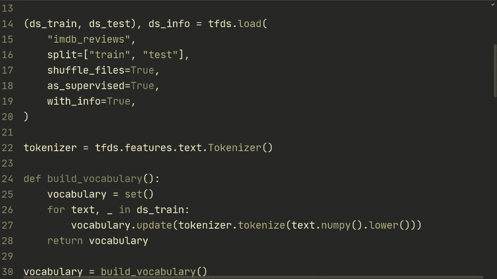

# TensorFlow 教程 P12：📚 TensorFlow 数据集 (TFDS)




在本节课中，我们将学习如何使用 TensorFlow 数据集 (TFDS) 来加载、预处理和高效地加载数据。我们将通过图像（MNIST）和文本（IMDB 评论）两个具体示例，演示 TFDS 的核心用法。

TensorFlow 数据集是一个高层封装器，它让加载常用的公开数据集变得非常简单。它内部使用 `tf.data` API 来构建高效的数据管道。虽然本课主要使用 TFDS，但学到的数据预处理和加载模式，在后续使用 `tf.data` 处理自定义数据时同样适用。



---

## 1. 🖼️ 加载与预处理图像数据 (MNIST)

上一节我们介绍了 TFDS 的基本概念。本节中，我们来看看如何加载经典的 MNIST 手写数字数据集并进行预处理。

首先，确保已安装 TensorFlow 数据集库。

```python
# 安装命令
# pip install tensorflow-datasets
```

以下是加载和预处理 MNIST 数据集的完整步骤。

```python
import tensorflow as tf
import tensorflow_datasets as tfds

# 1. 加载 MNIST 数据集
(ds_train, ds_test), ds_info = tfds.load(
    'mnist',
    split=['train', 'test'],  # 指定训练集和测试集
    shuffle_files=True,       # 打乱文件顺序
    as_supervised=True,       # 返回 (image, label) 元组格式
    with_info=True            # 同时返回数据集信息
)

# 打印数据集信息
print(ds_info)
```





加载后，我们需要对数据进行归一化和流水线优化。

以下是构建数据预处理管道的步骤：

1.  **定义归一化函数**：将像素值从 [0, 255] 缩放到 [0, 1]。
2.  **应用映射**：使用 `.map()` 将函数应用到每个样本。
3.  **缓存数据**：使用 `.cache()` 加速数据读取。
4.  **打乱数据**：使用 `.shuffle()` 打乱训练数据顺序。
5.  **分批**：使用 `.batch()` 创建数据批次。
6.  **预取**：使用 `.prefetch()` 让数据加载与模型训练重叠进行。

```python
# 2. 定义预处理函数
def normalize_img(image, label):
    """将图像归一化到 [0, 1] 范围"""
    image = tf.cast(image, tf.float32) / 255.
    return image, label

# 3. 为训练集构建高效数据管道
AUTOTUNE = tf.data.experimental.AUTOTUNE
BATCH_SIZE = 64

ds_train = ds_train.map(normalize_img, num_parallel_calls=AUTOTUNE)
ds_train = ds_train.cache()
ds_train = ds_train.shuffle(ds_info.splits['train'].num_examples)
ds_train = ds_train.batch(BATCH_SIZE)
ds_train = ds_train.prefetch(AUTOTUNE)

# 4. 为测试集构建数据管道（无需打乱）
ds_test = ds_test.map(normalize_img, num_parallel_calls=AUTOTUNE)
ds_test = ds_test.batch(BATCH_SIZE)
ds_test = ds_test.prefetch(AUTOTUNE)
```

现在，我们可以用处理好的数据来训练一个简单的卷积神经网络模型。

```python
# 5. 构建一个简单的 CNN 模型
model = tf.keras.Sequential([
    tf.keras.layers.Conv2D(32, 3, activation='relu', input_shape=(28, 28, 1)),
    tf.keras.layers.Flatten(),
    tf.keras.layers.Dense(10)
])

# 6. 编译并训练模型
model.compile(
    optimizer=tf.keras.optimizers.Adam(0.001),
    loss=tf.keras.losses.SparseCategoricalCrossentropy(from_logits=True),
    metrics=['accuracy']
)

model.fit(ds_train, epochs=5)
model.evaluate(ds_test)
```

---

## 2. 📝 加载与预处理文本数据 (IMDB)

上一节我们处理了图像数据。本节中，我们转向文本数据，以 IMDB 电影评论情感分析数据集为例，学习文本的预处理流程。

文本预处理通常包括分词和数字化两个关键步骤。

```python
# 1. 加载 IMDB 数据集
(ds_train, ds_test), ds_info = tfds.load(
    'imdb_reviews',
    split=['train', 'test'],
    shuffle_files=True,
    as_supervised=True,
    with_info=True
)

# 查看一条数据样例
for text, label in ds_train.take(1):
    print(text.numpy()[:100], label.numpy())
```

接下来，我们需要构建词汇表并将文本转换为模型可读的数字序列。

以下是构建文本预处理管道的步骤：

1.  **构建词汇表**：从训练数据中收集所有单词。
2.  **创建编码器**：使用 `tfds.features.text.TokenTextEncoder` 将单词转换为索引。
3.  **定义编码函数**：将字符串文本编码为整数序列。
4.  **构建数据管道**：应用编码、缓存、打乱、分批和填充。

```python
# 2. 构建词汇表
tokenizer = tfds.features.text.Tokenizer()
vocabulary_set = set()

for text, _ in ds_train:
    tokens = tokenizer.tokenize(text.numpy().lower())
    vocabulary_set.update(tokens)

# 3. 创建编码器
encoder = tfds.features.text.TokenTextEncoder(
    list(vocabulary_set),
    lowercase=True
)

# 4. 定义将文本编码为序列的函数
def encode(text_tensor, label):
    encoded_text = encoder.encode(text_tensor.numpy())
    return encoded_text, label

# 5. 将 Python 函数包装为 TensorFlow 图操作
def encode_map_fn(text, label):
    encoded_text, label = tf.py_function(
        encode,
        inp=[text, label],
        Tout=(tf.int64, tf.int64)
    )
    encoded_text.set_shape([None])  # 序列长度可变
    label.set_shape([])
    return encoded_text, label

# 6. 为训练集构建数据管道
AUTOTUNE = tf.data.experimental.AUTOTUNE
BATCH_SIZE = 32

ds_train = ds_train.map(encode_map_fn, num_parallel_calls=AUTOTUNE)
ds_train = ds_train.cache()
ds_train = ds_train.shuffle(10000)
# 使用 padded_batch 处理变长序列
ds_train = ds_train.padded_batch(BATCH_SIZE, padded_shapes=([None], []))
ds_train = ds_train.prefetch(AUTOTUNE)

# 7. 为测试集构建数据管道
ds_test = ds_test.map(encode_map_fn, num_parallel_calls=AUTOTUNE)
ds_test = ds_test.padded_batch(BATCH_SIZE, padded_shapes=([None], []))
ds_test = ds_test.prefetch(AUTOTUNE)
```

最后，我们构建一个简单的模型来处理这些序列数据。模型使用嵌入层将单词索引转换为向量，并通过全局池化层得到固定长度的表示。

```python
# 8. 构建处理序列的模型
model = tf.keras.Sequential([
    # 告诉模型忽略用于填充的索引0
    tf.keras.layers.Masking(mask_value=0),
    # 嵌入层，将单词索引转换为密集向量
    tf.keras.layers.Embedding(input_dim=len(vocabulary_set) + 2, output_dim=32),
    # 对序列维度进行全局平均池化
    tf.keras.layers.GlobalAveragePooling1D(),
    tf.keras.layers.Dense(64, activation='relu'),
    # 二分类输出层
    tf.keras.layers.Dense(1)
])

# 9. 编译并训练模型（二分类使用 binary_crossentropy）
model.compile(
    optimizer=tf.keras.optimizers.Adam(3e-4, clipnorm=1.),
    loss=tf.keras.losses.BinaryCrossentropy(from_logits=True),
    metrics=['accuracy']
)

model.fit(ds_train, epochs=1, verbose=2)
model.evaluate(ds_test)
```

---

## 3. ✅ 总结

本节课中我们一起学习了 TensorFlow 数据集 (TFDS) 的核心用法。

*   **对于图像数据**（如 MNIST），我们学习了如何加载数据集、归一化像素值，并使用 `.map()`, `.cache()`, `.shuffle()`, `.batch()`, `.prefetch()` 等方法构建一个高效的数据输入管道。
*   **对于文本数据**（如 IMDB），我们学习了更复杂的流程，包括构建词汇表、使用 `TokenTextEncoder` 进行分词和数字化、处理变长序列的填充批处理 (`padded_batch`)，以及构建一个包含嵌入层和池化层的简单文本分类模型。



TFDS 为我们提供了便捷的数据访问方式，而其背后基于 `tf.data` 的管道构建思想，是处理任何机器学习数据（包括自定义数据）的关键。掌握这些模式，将帮助你为模型准备高质量且高效的数据流。