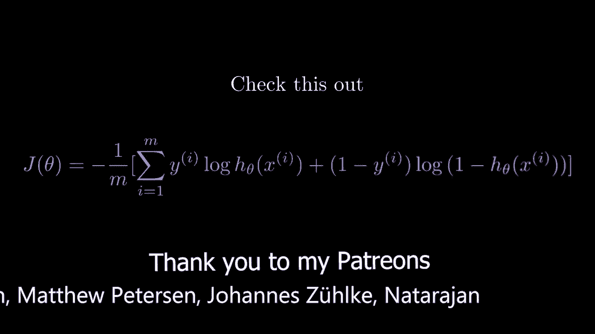
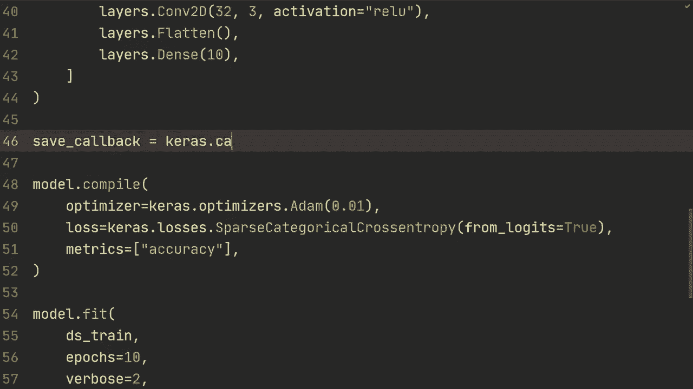
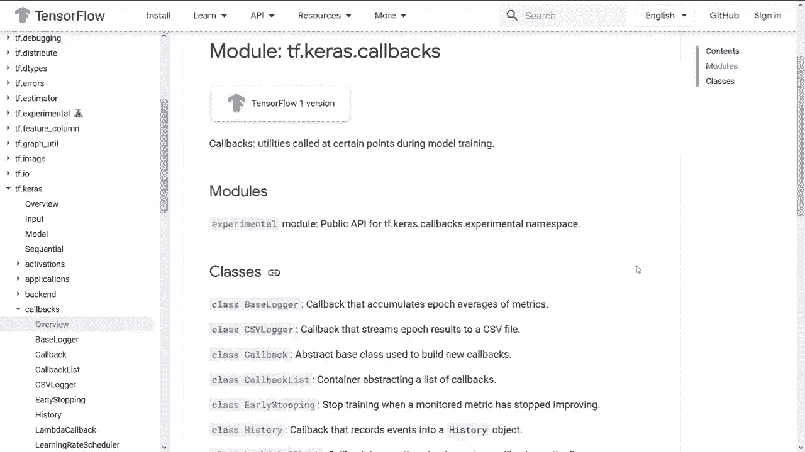
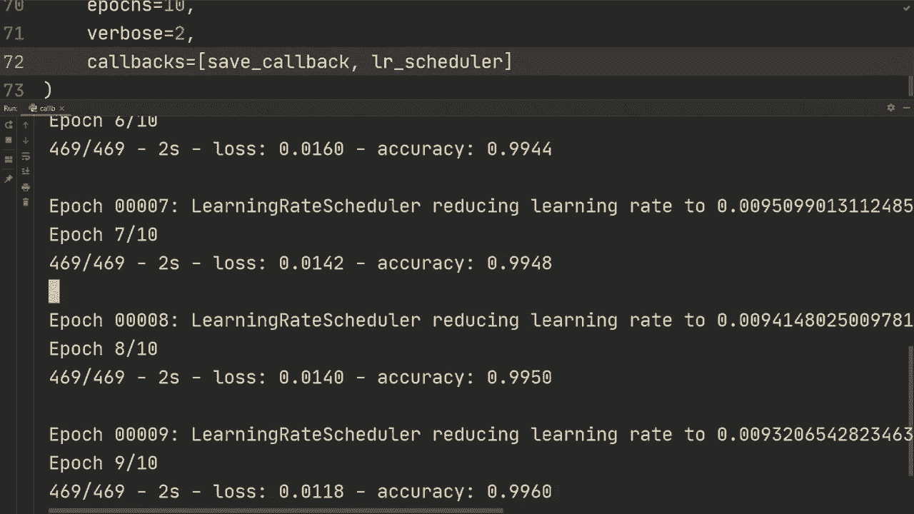
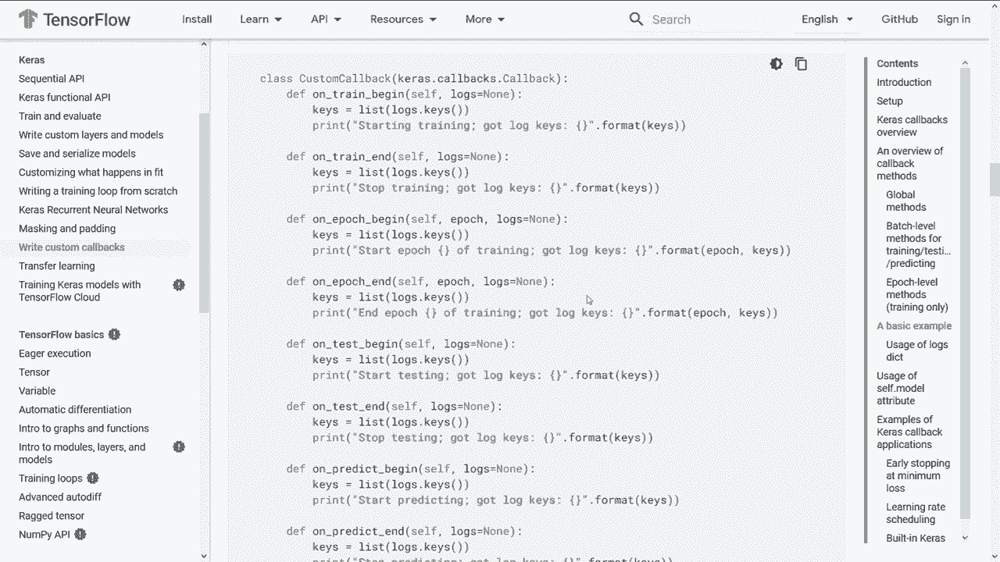
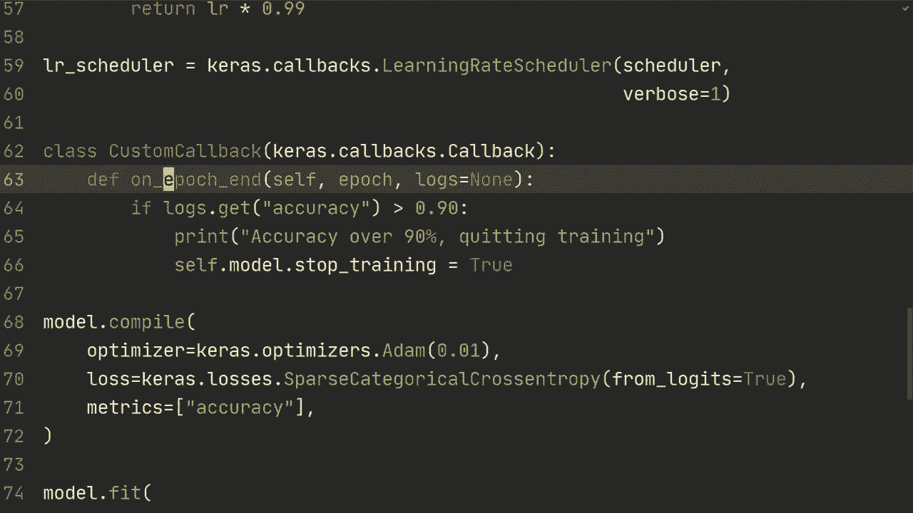

# TensorFlow 教程 P14：使用 Keras 回调与编写自定义回调 🎛️



在本节课中，我们将学习如何使用 Keras 回调（Callbacks）来自定义模型在训练或评估期间的行为，并了解如何创建自己的自定义回调。回调是一种强大的工具，允许你在训练过程的特定时刻执行代码，例如保存模型、调整学习率或在满足条件时提前停止训练。

## 概述与准备工作

首先，我们快速回顾一下代码的初始设置。这部分内容在之前的教程中已经熟悉，主要包括数据加载和模型构建。

```python
import tensorflow as tf

# 加载 MNIST 数据集
(x_train, y_train), (x_test, y_test) = tf.keras.datasets.mnist.load_data()

# 数据预处理：归一化、缓存、打乱、分批、预取
def preprocess(image, label):
    image = tf.cast(image, tf.float32) / 255.0
    return image, label

train_dataset = tf.data.Dataset.from_tensor_slices((x_train, y_train))
train_dataset = train_dataset.map(preprocess).cache().shuffle(10000).batch(32).prefetch(tf.data.AUTOTUNE)

# 创建一个简单的模型
model = tf.keras.Sequential([
    tf.keras.layers.Conv2D(32, (3, 3), activation='relu', input_shape=(28, 28, 1)),
    tf.keras.layers.Flatten(),
    tf.keras.layers.Dense(10, activation='softmax')
])





# 编译模型
model.compile(optimizer='adam',
              loss='sparse_categorical_crossentropy',
              metrics=['accuracy'])
```

## 使用内置回调：模型检查点

上一节我们完成了模型和数据的基本设置。本节中，我们来看看如何使用 `ModelCheckpoint` 回调在训练过程中自动保存模型。

以下是使用 `ModelCheckpoint` 回调的步骤：

1.  从 `tf.keras.callbacks` 导入 `ModelCheckpoint`。
2.  创建回调实例，并指定保存路径、监控的指标等参数。
3.  在 `model.fit()` 中通过 `callbacks` 参数传入回调列表。

```python
from tensorflow.keras.callbacks import ModelCheckpoint

# 创建 ModelCheckpoint 回调
save_callback = ModelCheckpoint(
    filepath='checkpoints/model_epoch_{epoch:02d}',  # 保存路径，{epoch}会被替换
    save_weights_only=True,  # 只保存模型权重
    monitor='accuracy',      # 监控验证准确率（如有验证集，通常用`val_accuracy`）
    save_best_only=False     # 保存每一个epoch的模型，设为True则只保存最佳模型
)

# 开始训练，传入回调
history = model.fit(
    train_dataset,
    epochs=5,
    callbacks=[save_callback]  # 将回调放入列表
)
```

运行此代码后，会在 `checkpoints/` 文件夹下生成每个训练周期（epoch）保存的模型权重文件。

## 使用内置回调：学习率调度器

除了保存模型，回调还可以用于动态调整学习率。接下来，我们学习如何使用 `LearningRateScheduler` 回调。

首先，我们需要定义一个调度函数，该函数接收当前 `epoch` 索引和当前学习率作为输入，并返回一个新的学习率。



```python
from tensorflow.keras.callbacks import LearningRateScheduler

# 定义学习率调度函数
def scheduler(epoch, lr):
    if epoch < 2:
        return lr  # 前两个epoch保持学习率不变
    else:
        return lr * 0.99  # 从第三个epoch开始，每个epoch学习率衰减1%



# 创建 LearningRateScheduler 回调
lr_scheduler_callback = LearningRateScheduler(scheduler, verbose=1)

# 在训练时同时使用多个回调
history = model.fit(
    train_dataset,
    epochs=5,
    callbacks=[save_callback, lr_scheduler_callback]  # 在列表中添加学习率调度器
)
```

设置 `verbose=1` 后，控制台会打印每次学习率变化的信息。

## 创建自定义回调

我们已经了解了如何使用内置回调。现在，让我们探索更强大的功能：创建自定义回调。这允许你完全按照自己的需求定义在训练特定阶段（如每个批次或每个周期开始/结束时）执行的操作。

要创建自定义回调，需要继承 `tf.keras.callbacks.Callback` 基类，并重写其方法。常用的方法包括：
*   `on_train_begin`, `on_train_end`
*   `on_epoch_begin`, `on_epoch_end`
*   `on_batch_begin`, `on_batch_end`
*   `on_test_begin`, `on_test_end` (在评估时调用)
*   `on_predict_begin`, `on_predict_end` (在预测时调用)

以下是一个简单的自定义回调示例，它在每个训练周期结束时检查准确率，并在准确率超过 90% 时停止训练：

```python
class CustomCallback(tf.keras.callbacks.Callback):
    def on_epoch_end(self, epoch, logs=None):
        # `logs` 是一个字典，包含当前周期的损失和指标
        keys = list(logs.keys())
        print(f"Epoch {epoch+1} 结束。可用的日志键: {keys}")

        # 获取当前训练准确率
        current_accuracy = logs.get('accuracy')
        # 如果有验证集，则使用 `val_accuracy`
        # current_accuracy = logs.get('val_accuracy')

        # 如果准确率超过90%，则停止训练
        if current_accuracy is not None and current_accuracy > 0.90:
            print(f'\n准确率已达到 {current_accuracy*100:.2f}%，超过90%，停止训练。')
            self.model.stop_training = True

# 使用自定义回调
custom_cb = CustomCallback()
history = model.fit(
    train_dataset,
    epochs=10,
    callbacks=[save_callback, lr_scheduler_callback, custom_cb]
)
```

在这个例子中，`logs` 字典包含了训练损失 (`loss`) 和你在 `model.compile()` 中指定的所有指标（如 `accuracy`）。如果提供了验证数据，还会包含 `val_loss` 和 `val_accuracy` 等。

## 总结

本节课中我们一起学习了 Keras 回调的核心用法：
1.  **回调的作用**：回调是自定义和扩展模型训练、评估、预测过程行为的强大工具。
2.  **使用内置回调**：我们实践了 `ModelCheckpoint`（用于保存模型）和 `LearningRateScheduler`（用于动态调整学习率）这两个常用回调。
3.  **创建自定义回调**：通过继承 `tf.keras.callbacks.Callback` 类并重写其方法（如 `on_epoch_end`），我们可以实现满足特定需求的逻辑，例如根据指标提前停止训练。



通过灵活运用回调，你可以更精细地控制训练流程，实现模型自动化管理、超参数动态调整和训练过程监控等高级功能。建议你查阅 [TensorFlow 官方回调指南](https://www.tensorflow.org/guide/keras/custom_callback) 以了解更多细节和高级用例。