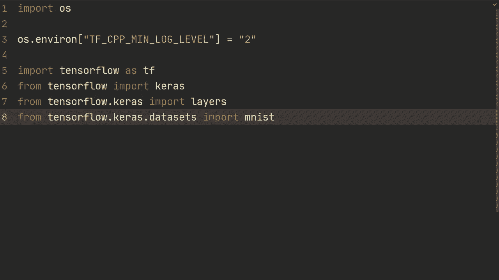
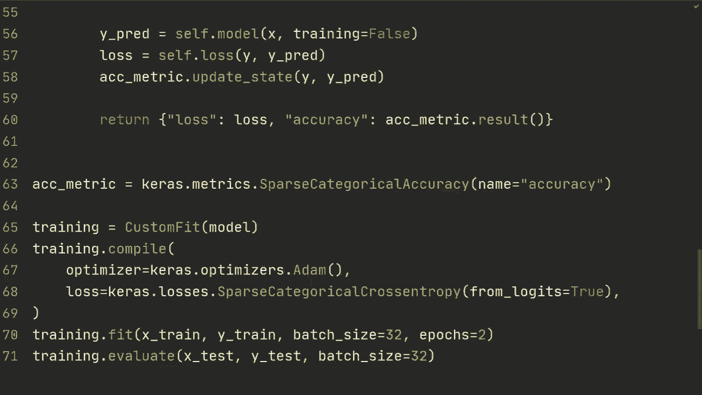

# TensorFlow 教程 P15：🚀 自定义模型与拟合

在本节课中，我们将学习如何构建更灵活的训练循环。到目前为止，我们一直在使用 `model.fit()` 方法。虽然这个方法很方便，但有时我们需要更多的控制权。本节课将探索如何通过自定义 `model.fit()` 的行为来获得这种灵活性。




## 📦 数据准备与模型构建

首先，我们进行一些基本的导入并加载 MNIST 数据集。我们不会处理复杂的问题，而是专注于展示自定义训练循环的通用结构。

以下是数据加载和预处理的步骤：
*   加载 `xtrain`, `ytrain`, `xtest`, `ytest`。
*   将 `xtrain` 重塑为 `(-1, 28, 28, 1)` 的形状，以添加通道维度。
*   将数据类型转换为 `float32`。
*   通过除以 255 对像素值进行归一化。

接着，我们构建一个简单的卷积神经网络模型。

```python
import tensorflow as tf
from tensorflow import keras as ks

# 加载并预处理数据
(xtrain, ytrain), (xtest, ytest) = ks.datasets.mnist.load_data()
xtrain = xtrain.reshape(-1, 28, 28, 1).astype('float32') / 255.0
xtest = xtest.reshape(-1, 28, 28, 1).astype('float32') / 255.0

# 构建模型
model = ks.Sequential([
    ks.layers.Input(shape=(28, 28, 1)),
    ks.layers.Conv2D(64, 3, padding='same', activation='relu'),
    ks.layers.MaxPooling2D(),
    ks.layers.Flatten(),
    ks.layers.Dense(10)
])
```

## 🛠️ 创建自定义模型类

上一节我们准备好了数据和基础模型，本节中我们来看看如何创建一个自定义的模型类来覆盖标准的训练行为。

我们将创建一个继承自 `keras.Model` 的类 `CustomFit`。这个类的核心是定义我们自己的训练步骤。

```python
class CustomFit(ks.Model):
    def __init__(self, model):
        super().__init__()
        self.model = model
        # 初始化一个准确率指标
        self.accuracy_metric = ks.metrics.SparseCategoricalAccuracy(name='accuracy')
```

## ⚙️ 定义训练步骤

在自定义模型类中，最关键的部分是定义 `train_step` 方法。这个方法将在每次调用 `model.fit()` 时执行，它定义了前向传播、损失计算和反向传播的完整流程。

以下是 `train_step` 方法的具体步骤：
1.  从输入数据 `data` 中解包出特征 `x` 和标签 `y`。
2.  使用 `tf.GradientTape()` 上下文管理器记录前向传播操作，以便计算梯度。
3.  在 `tape` 上下文中进行前向传播，得到预测值 `y_pred`。
4.  计算损失值 `loss`。
5.  计算损失相对于模型可训练参数的梯度。
6.  使用优化器应用这些梯度，更新模型参数。
7.  更新并返回评估指标（如损失和准确率）。

```python
    def train_step(self, data):
        x, y = data
        with tf.GradientTape() as tape:
            # 前向传播
            y_pred = self.model(x, training=True)
            # 计算损失
            loss = self.compiled_loss(y, y_pred)
        # 计算梯度
        grads = tape.gradient(loss, self.model.trainable_variables)
        # 应用梯度，更新权重
        self.optimizer.apply_gradients(zip(grads, self.model.trainable_variables))
        # 更新编译时传入的指标状态
        self.compiled_metrics.update_state(y, y_pred)
        # 返回指标结果
        return {m.name: m.result() for m in self.metrics}
```

## 🔧 自定义编译方法

有时，我们可能希望完全控制模型的编译过程，而不仅仅是训练步骤。为此，我们可以覆盖 `compile` 方法。

在自定义的 `compile` 方法中，我们手动设置优化器和损失函数，并初始化我们自己的度量指标。

```python
    def compile(self, optimizer, loss):
        # 调用父类的compile，但可以不传入metrics
        super().compile(optimizer=optimizer, loss=loss)
        # 或者完全自定义，例如：
        self.optimizer = optimizer
        self.loss = loss
        self.accuracy_metric = ks.metrics.SparseCategoricalAccuracy(name='accuracy')
```

如果使用完全自定义的编译，那么在 `train_step` 中计算损失和更新指标的方式也需要相应调整。

```python
    def train_step(self, data):
        x, y = data
        with tf.GradientTape() as tape:
            y_pred = self.model(x, training=True)
            # 使用自定义的损失函数
            loss = self.loss(y, y_pred)
        grads = tape.gradient(loss, self.model.trainable_variables)
        self.optimizer.apply_gradients(zip(grads, self.model.trainable_variables))
        # 手动更新自定义的准确率指标
        self.accuracy_metric.update_state(y, y_pred)
        # 返回自定义的指标字典
        return {'loss': loss, 'accuracy': self.accuracy_metric.result()}
```

## 📊 定义评估步骤

为了使 `model.evaluate()` 也能正常工作，我们需要定义 `test_step` 方法。评估步骤比训练步骤简单，因为它不涉及梯度计算和参数更新。

以下是 `test_step` 方法的关键点：
*   同样进行前向传播，但将 `training` 参数设为 `False`，这会影响如 Dropout、BatchNormalization 等层的行为。
*   计算损失和指标。
*   返回指标结果。

```python
    def test_step(self, data):
        x, y = data
        # 评估模式下的前向传播
        y_pred = self.model(x, training=False)
        loss = self.compiled_loss(y, y_pred)
        # 更新评估指标
        self.compiled_metrics.update_state(y, y_pred)
        return {m.name: m.result() for m in self.metrics}
```

## 🚀 使用自定义模型进行训练与评估

现在，我们可以实例化我们的自定义模型，并使用熟悉的 `.compile()` 和 `.fit()` API 进行训练和评估，但其内部行为已由我们自定义。

```python
# 实例化自定义模型
custom_model = CustomFit(model)

# 编译模型
custom_model.compile(optimizer='adam',
                     loss=ks.losses.SparseCategoricalCrossentropy(from_logits=True),
                     metrics=['accuracy'])

# 训练模型
custom_model.fit(xtrain, ytrain, batch_size=32, epochs=2)

# 评估模型
test_results = custom_model.evaluate(xtest, ytest, batch_size=32)
print(f"Test loss: {test_results[0]}, Test accuracy: {test_results[1]}")
```

## 📝 总结



本节课中我们一起学习了如何通过子类化 `keras.Model` 并覆盖 `train_step` 和 `test_step` 方法来创建自定义的训练循环。这种方法在标准 `model.fit()` 无法满足需求时（例如，实现复杂的损失函数、多任务学习或研究性算法）提供了极大的灵活性。核心在于理解梯度记录、前向/反向传播以及指标更新的流程，从而能够精确控制模型的训练行为。