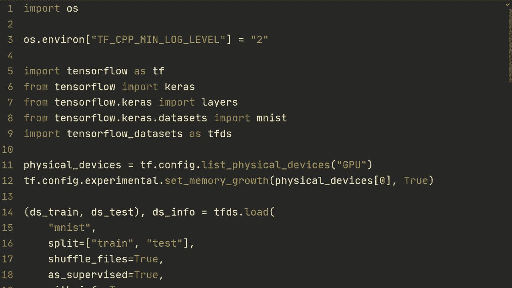
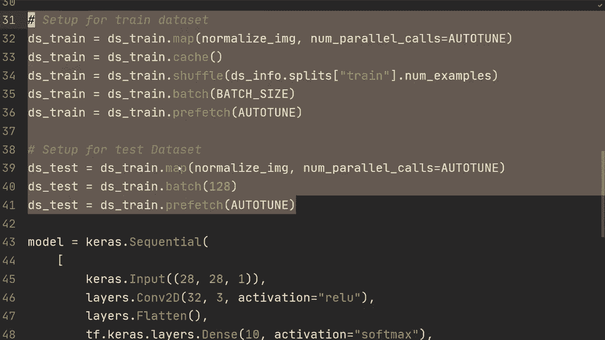
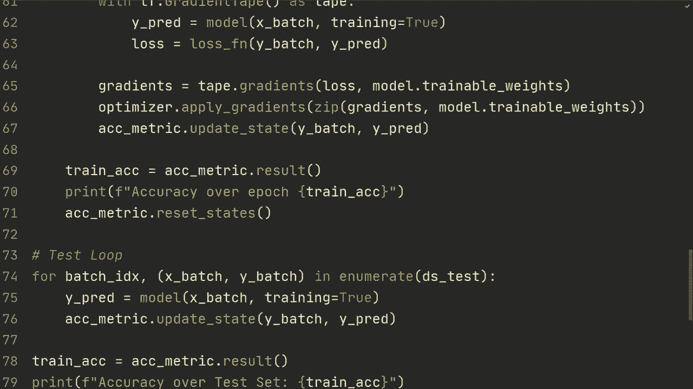
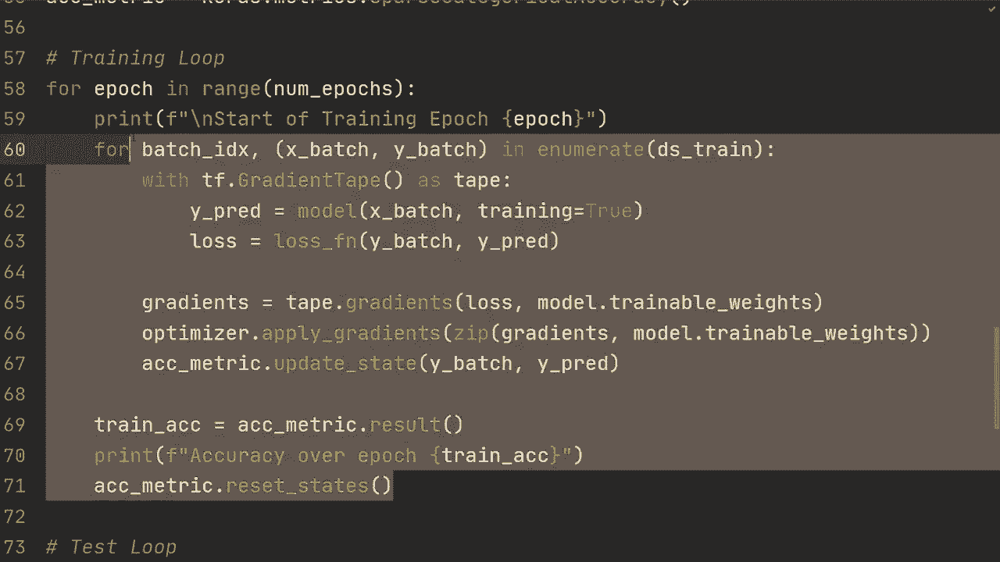
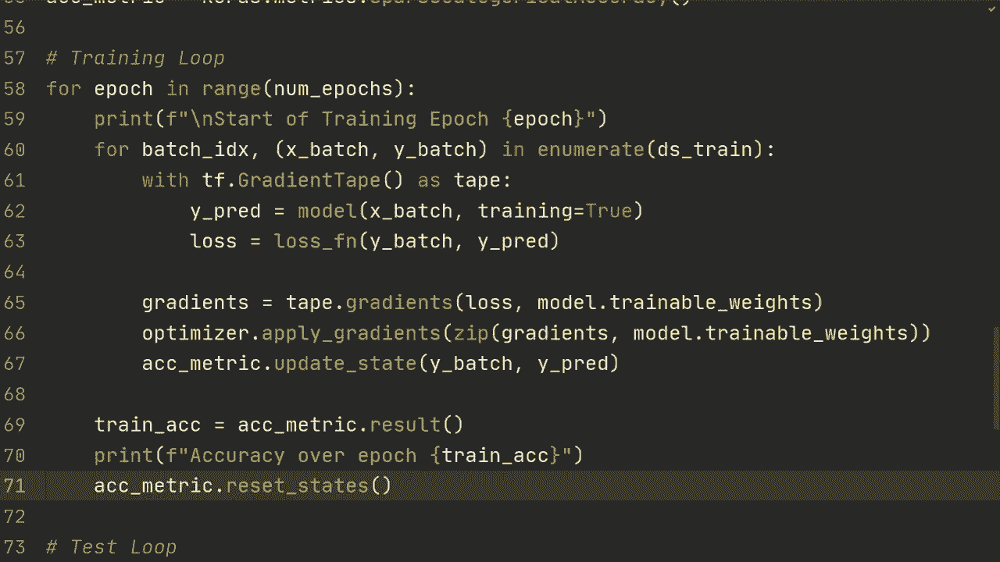

# TensorFlow 教程 P16：🚀 自定义训练循环




在本节课中，我们将学习如何从零开始实现一个自定义的训练循环。这意味着我们将不再使用 `model.fit()` 这种高级API，而是手动控制训练过程的每一步，包括前向传播、损失计算、反向传播和参数更新。这种方法能让你更深入地理解训练过程，并且在实现一些复杂模型（如GAN）时更为灵活。

---

## 📦 准备工作

首先，我们需要导入必要的库并准备数据。我们将使用 TensorFlow Datasets 加载 MNIST 数据集，并定义一个简单的模型。

```python
import tensorflow as tf
import tensorflow_datasets as tfds

# 加载 MNIST 数据集
(ds_train, ds_test), ds_info = tfds.load(
    'mnist',
    split=['train', 'test'],
    shuffle_files=True,
    as_supervised=True,
    with_info=True,
)



# 定义一个标准化图像的函数
def normalize_img(image, label):
    return tf.cast(image, tf.float32) / 255., label

# 应用预处理并批处理数据
ds_train = ds_train.map(normalize_img).batch(128)
ds_test = ds_test.map(normalize_img).batch(128)

# 定义一个简单的模型
model = tf.keras.Sequential([
    tf.keras.layers.Conv2D(32, 3, activation='relu', input_shape=(28, 28, 1)),
    tf.keras.layers.Flatten(),
    tf.keras.layers.Dense(10, activation='softmax')
])
```

---

## 🎯 设置评估指标与优化器

在开始训练之前，我们需要定义一个指标来评估模型性能，并选择一个优化器来更新模型权重。

```python
# 设置准确率作为评估指标
accuracy_metric = tf.keras.metrics.SparseCategoricalAccuracy()

# 选择优化器
optimizer = tf.keras.optimizers.Adam()
```

---

## 🔄 实现训练循环

上一节我们准备好了数据和模型组件，本节中我们来看看如何构建核心的训练循环。我们将手动遍历数据集的每一个批次，完成前向传播、计算损失、反向传播和参数更新。

以下是训练循环的步骤：

1.  循环遍历设定的训练周期数。
2.  在每个周期内，遍历训练数据集的所有批次。
3.  使用 `tf.GradientTape` 记录前向传播操作，以计算梯度。
4.  计算预测值和损失。
5.  计算梯度并使用优化器更新模型权重。
6.  更新并打印评估指标。

```python
# 设置训练周期数
epochs = 5

for epoch in range(epochs):
    print(f'\n开始训练周期 {epoch + 1}')

    # 遍历训练数据集的每一个批次
    for batch_idx, (x_batch, y_batch) in enumerate(ds_train):
        # 在梯度带内记录前向传播过程
        with tf.GradientTape() as tape:
            # 前向传播，得到预测值
            y_pred = model(x_batch, training=True)
            # 计算损失
            loss = tf.keras.losses.sparse_categorical_crossentropy(y_batch, y_pred)

        # 计算损失关于模型可训练权重的梯度
        gradients = tape.gradient(loss, model.trainable_weights)
        # 使用优化器应用梯度，更新权重
        optimizer.apply_gradients(zip(gradients, model.trainable_weights))

        # 更新准确率指标
        accuracy_metric.update_state(y_batch, y_pred)

    # 计算并打印当前周期的训练准确率
    train_acc = accuracy_metric.result()
    print(f'周期 {epoch + 1} 训练准确率: {train_acc:.4f}')

    # 重置指标状态，为下一个周期做准备
    accuracy_metric.reset_states()
```

---

## 🧪 实现测试循环

训练完成后，我们需要在测试集上评估模型的性能。测试循环与训练循环类似，但不需要计算梯度和更新权重。

以下是测试循环的步骤：

1.  遍历测试数据集的所有批次。
2.  进行前向传播得到预测值。
3.  更新评估指标。
4.  计算并输出最终的测试准确率。

```python
print("\n开始在测试集上评估模型...")



# 遍历测试数据集的每一个批次
for x_batch, y_batch in ds_test:
    # 前向传播（无需记录梯度）
    y_pred = model(x_batch, training=False)
    # 更新准确率指标
    accuracy_metric.update_state(y_batch, y_pred)



# 计算并打印测试准确率
test_acc = accuracy_metric.result()
print(f'测试集准确率: {test_acc:.4f}')

# 重置指标状态
accuracy_metric.reset_states()
```

---

## 💡 总结与扩展

本节课中我们一起学习了如何手动实现 TensorFlow 的自定义训练循环。我们拆解了训练过程的每一步：数据准备、前向传播、损失计算、反向传播和参数更新，并分别实现了训练和测试循环。



这个基本框架虽然简单，但它是理解更复杂训练模式（如生成对抗网络）的基础。你可以将上述代码封装进函数，以便更灵活地调用和管理。通过掌握自定义训练循环，你获得了对模型训练过程更精细的控制能力。