# TensorFlow 图像处理教程 P18：L18 - 图像的自定义数据集 📸

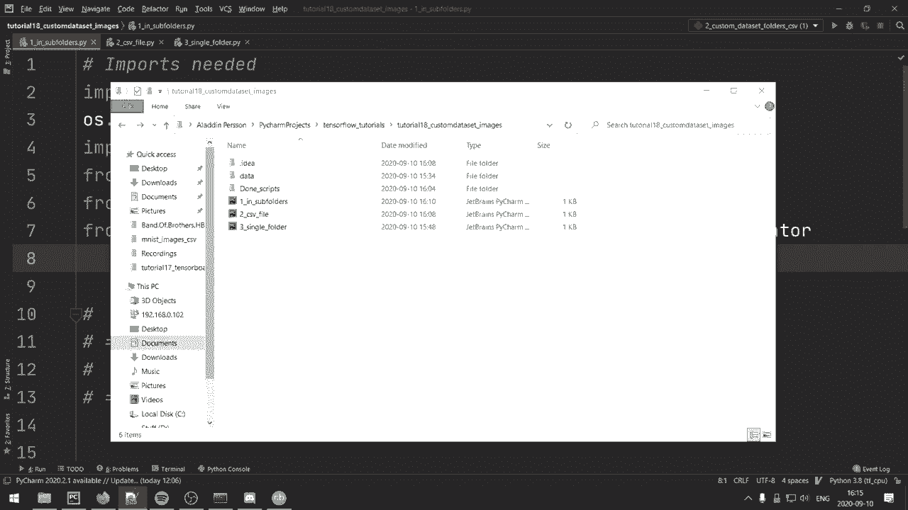

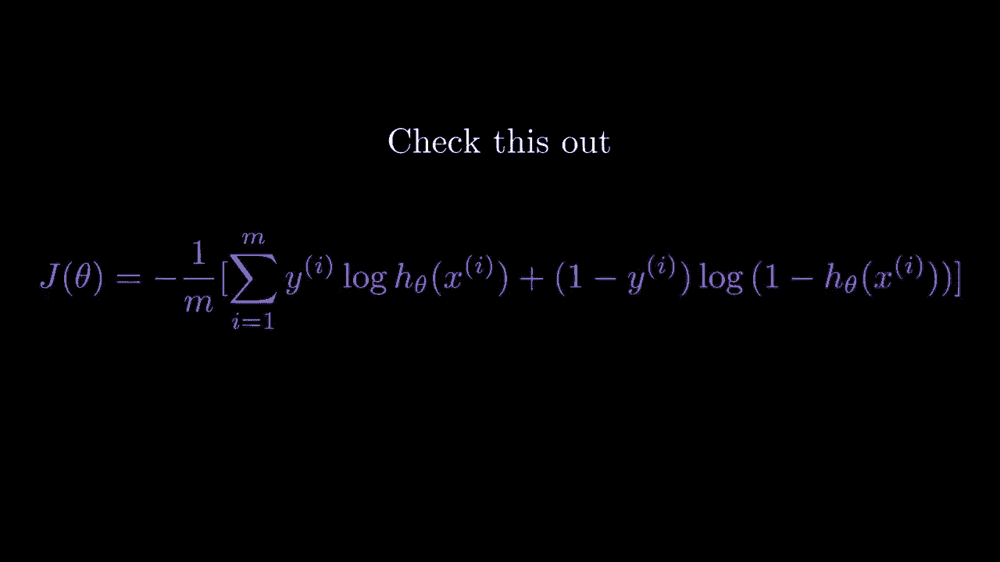

在本节课中，我们将学习三种高效加载自定义图像数据集的方法。无论你的数据是来自网络爬取还是自行创建，这些方法都能帮助你根据数据集的不同结构，选择最便捷的加载方式。

## 概述 📋

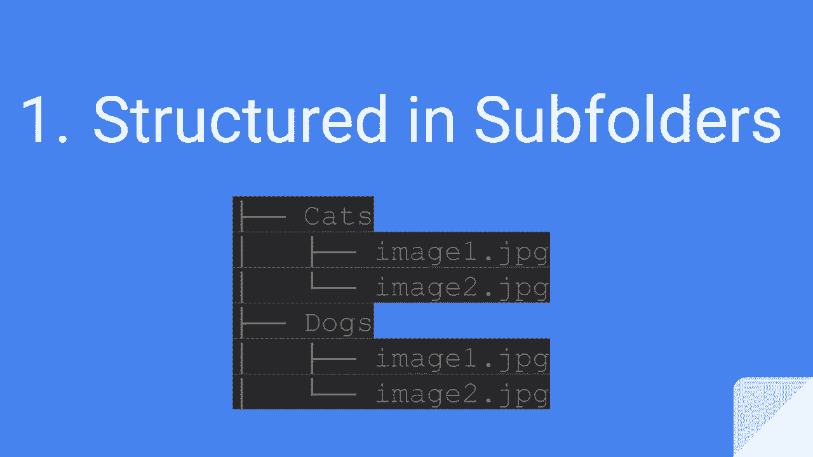

加载自定义图像数据是深度学习项目中的常见任务。我们将探讨三种主流方法，分别适用于不同的数据组织格式：按子文件夹分类、使用CSV文件索引以及从单一文件夹中解析文件名。每种方法都将通过代码示例进行详细说明。

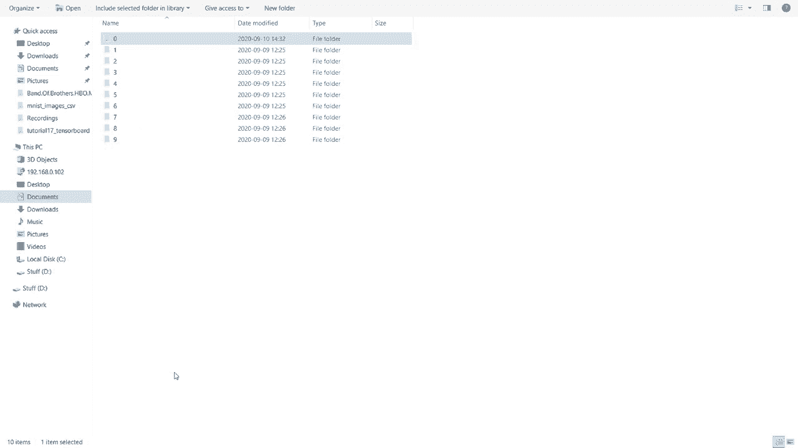

---

## 方法一：按子文件夹组织数据 📁

当你的数据集结构清晰，每个类别的图像都存放在独立的子文件夹中时，这种方法非常高效。例如，数字0-9的图像分别存放在名为“0”、“1”...“9”的文件夹里。

以下是加载此类数据的关键步骤。

### 使用 `image_dataset_from_directory` 加载

首先，我们导入必要的库并设置基本参数。

```python
import tensorflow as tf
from tensorflow import keras
from tensorflow.keras import layers

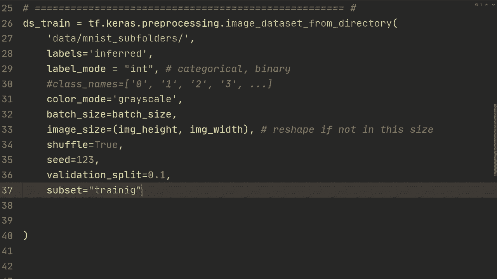

# 设置参数
image_height = 28
image_width = 28
batch_size = 2
```

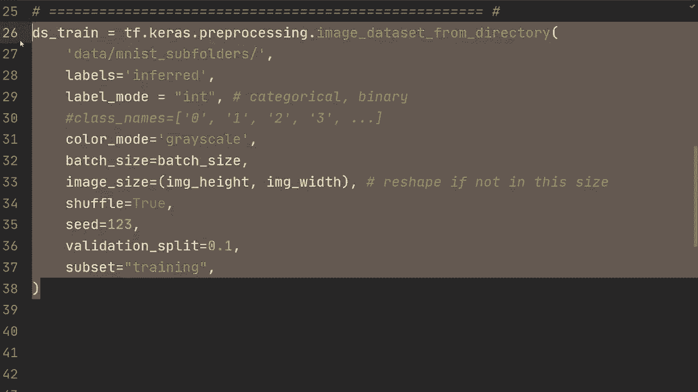

接下来，我们使用 `tf.keras.utils.image_dataset_from_directory` 函数来创建数据集。该函数会自动根据子文件夹名称推断标签。

```python
# 创建训练数据集
ds_train = tf.keras.utils.image_dataset_from_directory(
    directory='data/mnist_subfolders/',  # 数据所在根目录
    labels='inferred',                    # 从子文件夹名推断标签
    label_mode='int',                     # 标签为整数形式
    color_mode='grayscale',               # 灰度图像
    batch_size=batch_size,
    image_size=(image_height, image_width),
    shuffle=True,
    seed=123,                             # 设置随机种子以保证可复现性
    validation_split=0.1,                 # 10%的数据用作验证集
    subset='training'                     # 指定当前加载的是训练子集
)

# 创建验证数据集
ds_validation = tf.keras.utils.image_dataset_from_directory(
    directory='data/mnist_subfolders/',
    labels='inferred',
    label_mode='int',
    color_mode='grayscale',
    batch_size=batch_size,
    image_size=(image_height, image_width),
    shuffle=True,
    seed=123,
    validation_split=0.1,
    subset='validation'                   # 指定当前加载的是验证子集
)
```

### 数据增强与模型训练

创建数据集后，我们可以方便地应用数据增强并训练模型。

```python
# 定义一个简单的数据增强函数
def augment(image, label):
    image = tf.image.random_brightness(image, max_delta=0.2)  # 随机调整亮度
    return image, label

# 将增强函数映射到训练数据集
ds_train = ds_train.map(augment)

# 定义一个简单的模型用于演示
model = keras.Sequential([
    layers.Flatten(input_shape=(28, 28, 1)),
    layers.Dense(128, activation='relu'),
    layers.Dense(10, activation='softmax')
])

# 编译模型
model.compile(optimizer='adam',
              loss='sparse_categorical_crossentropy',
              metrics=['accuracy'])

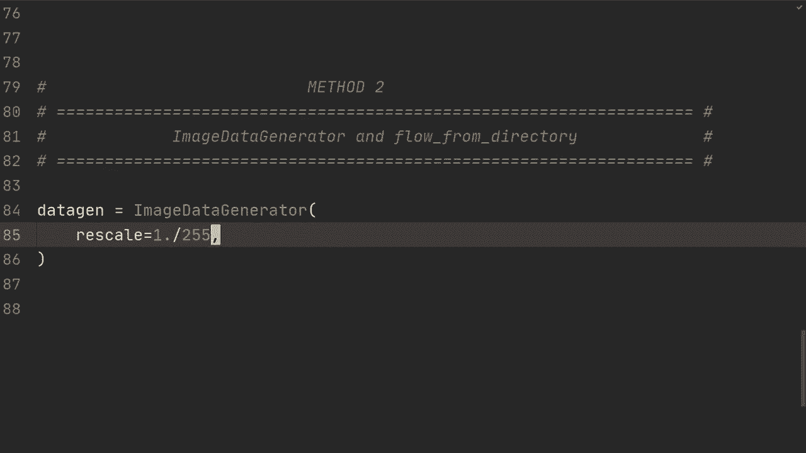

# 训练模型
model.fit(ds_train, validation_data=ds_validation, epochs=10)
```

---

## 方法二：使用 `ImageDataGenerator` 与目录流 📂

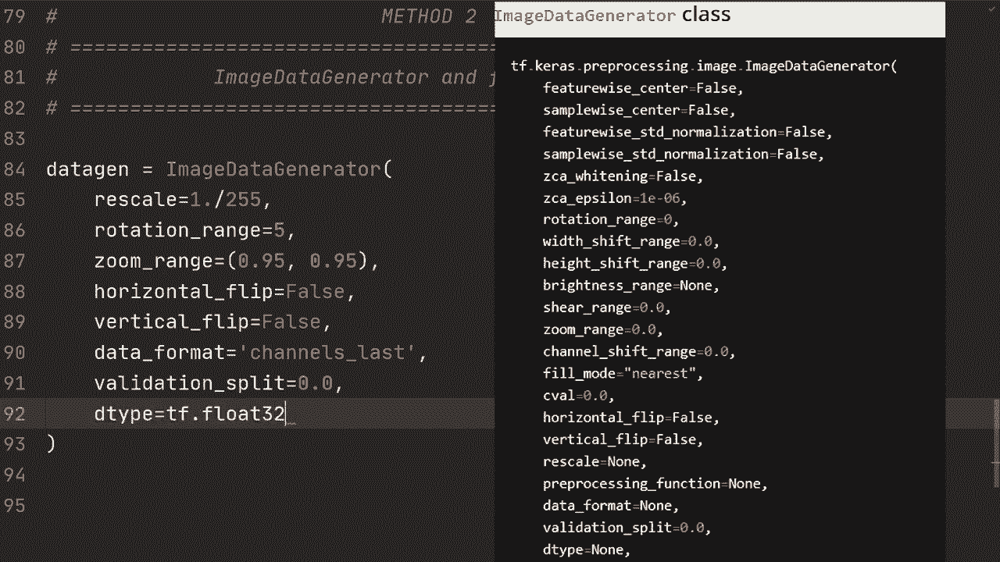

上一节我们介绍了使用内置API直接加载数据集。本节中我们来看看另一种传统但灵活的方法：使用 `ImageDataGenerator` 从目录流式读取数据。这种方法在Keras的早期版本中非常流行，允许在数据加载时进行复杂的实时增强。

以下是配置数据生成器的步骤。

首先，我们创建一个 `ImageDataGenerator` 实例，并在其中定义预处理和数据增强参数。

```python
from tensorflow.keras.preprocessing.image import ImageDataGenerator

# 创建ImageDataGenerator，定义预处理和增强
datagen = ImageDataGenerator(
    rescale=1./255,                # 将像素值归一化到[0,1]
    rotation_range=20,             # 随机旋转角度范围
    width_shift_range=0.1,         # 随机水平平移范围
    height_shift_range=0.1,        # 随机垂直平移范围
    zoom_range=0.1,                # 随机缩放范围
    horizontal_flip=False,         # 不进行水平翻转（对于数字识别不适用）
    validation_split=0.1,          # 验证集分割比例
    dtype=tf.float32
)
```

接着，我们使用生成器的 `flow_from_directory` 方法创建训练和验证数据流。

```python
# 创建训练数据流
train_generator = datagen.flow_from_directory(
    directory='data/mnist_subfolders/',
    target_size=(image_height, image_width),
    color_mode='grayscale',
    batch_size=batch_size,
    class_mode='sparse',           # 生成整数标签
    shuffle=True,
    seed=123,
    subset='training'
)

# 创建验证数据流（通常验证集不需要数据增强）
validation_datagen = ImageDataGenerator(rescale=1./255, validation_split=0.1)
validation_generator = validation_datagen.flow_from_directory(
    directory='data/mnist_subfolders/',
    target_size=(image_height, image_width),
    color_mode='grayscale',
    batch_size=batch_size,
    class_mode='sparse',
    shuffle=False,                 # 验证集通常不进行打乱
    seed=123,
    subset='validation'
)
```

使用生成器进行训练时，需要手动计算每个epoch的步数（steps_per_epoch）。

```python
# 计算每个epoch的步数
steps_per_epoch = train_generator.samples // batch_size
validation_steps = validation_generator.samples // batch_size

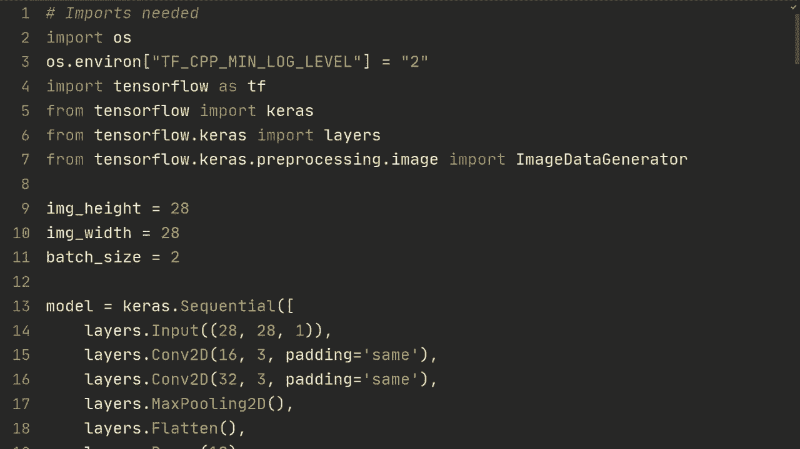

# 使用fit方法训练模型
model.fit(
    train_generator,
    steps_per_epoch=steps_per_epoch,
    validation_data=validation_generator,
    validation_steps=validation_steps,
    epochs=10
)
```

---

## 方法三：使用CSV文件或文件名解析索引数据 📄

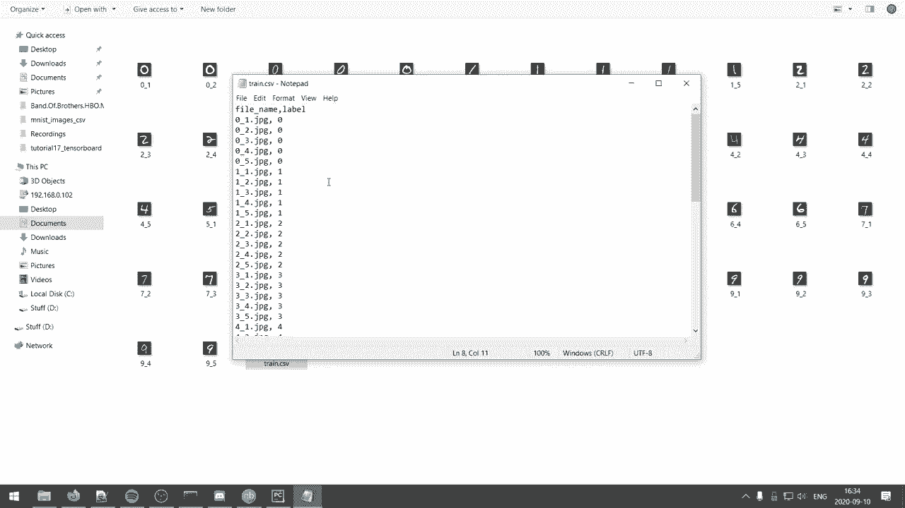

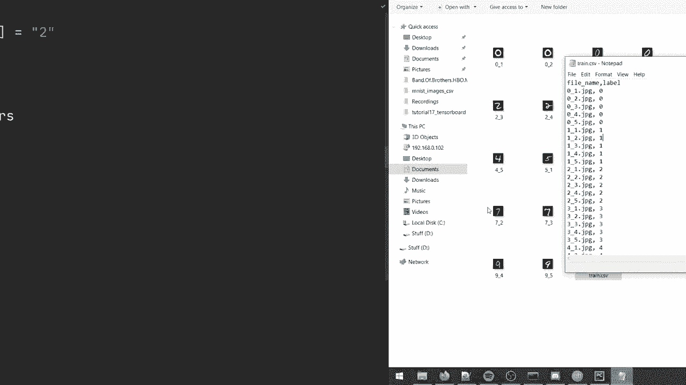

如果你的所有图像都存放在一个文件夹中，并通过一个CSV文件或特定的文件名格式来关联图像和标签，那么这种方法非常适合你。

### 情况A：使用CSV文件

假设有一个 `train.csv` 文件，包含 `filename` 和 `label` 两列。

以下是加载步骤。

首先，使用Pandas读取CSV文件。

```python
import pandas as pd

# 读取CSV文件
df = pd.read_csv('data/mnist_images_csv/train.csv')

# 获取文件路径和标签列表
file_paths = df['filename'].apply(lambda x: f'data/mnist_images/{x}').tolist()
labels = df['label'].tolist()
```

然后，使用 `tf.data.Dataset.from_tensor_slices` 创建数据集，并定义一个函数来读取和预处理图像。

```python
# 创建TensorFlow数据集
ds = tf.data.Dataset.from_tensor_slices((file_paths, labels))

# 定义图像读取和预处理函数
def read_and_preprocess(image_path, label):
    image = tf.io.read_file(image_path)
    image = tf.image.decode_jpeg(image, channels=1)  # 解码JPEG图像，灰度图所以channels=1
    image = tf.image.resize(image, [image_height, image_width])
    image = tf.cast(image, tf.float32) / 255.0  # 归一化
    return image, label

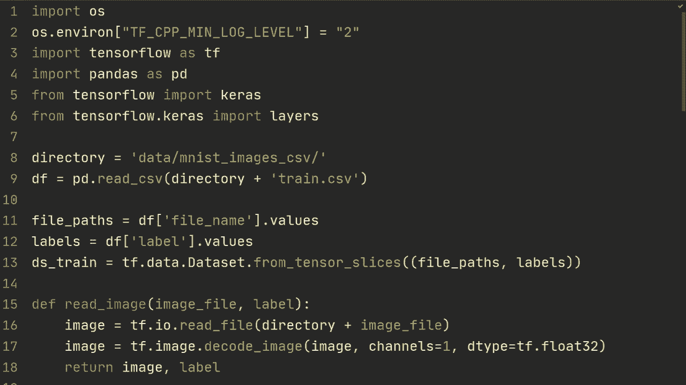

# 应用函数并批处理数据
ds_train = ds.map(read_and_preprocess).batch(batch_size)
```


### 情况B：从文件名解析标签

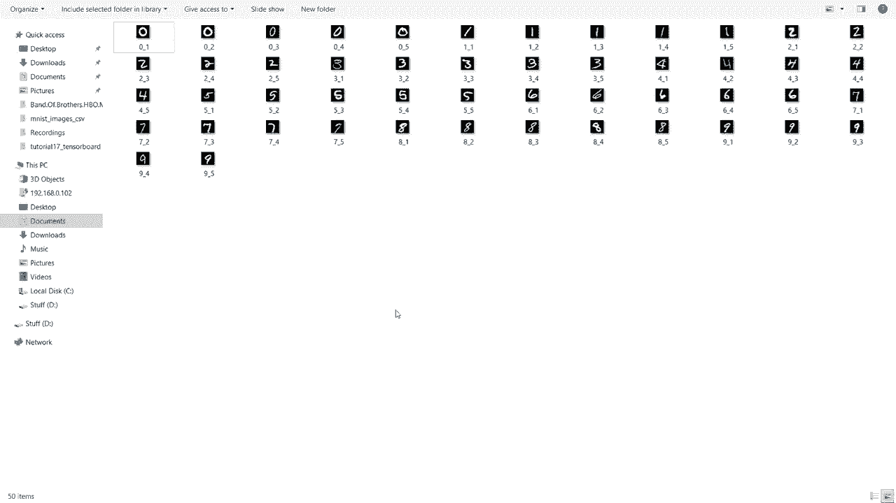

如果图像文件名本身就包含了标签信息（例如 `0_001.jpeg` 表示数字‘0’），我们可以直接从文件名中提取标签。

以下是实现方法。

使用 `tf.data.Dataset.list_files` 获取所有文件路径，然后编写一个解析函数。

```python
import pathlib

# 获取目录下所有.jpeg文件路径
data_dir = pathlib.Path('data/mnist_images/')
ds = tf.data.Dataset.list_files(str(data_dir / '*.jpeg'))

# 定义处理函数，从文件路径中解析标签
def process_path(file_path):
    # 读取图像
    image = tf.io.read_file(file_path)
    image = tf.image.decode_jpeg(image, channels=1)
    image = tf.image.resize(image, [image_height, image_width])
    image = tf.cast(image, tf.float32) / 255.0

    # 从文件路径中解析标签：假设文件名为 “0_001.jpeg”
    parts = tf.strings.split(file_path, sep='/')
    filename = parts[-1]                     # 获取文件名，如 “0_001.jpeg”
    label_str = tf.strings.split(filename, sep='_')[0]  # 分割并取第一部分 “0”
    label = tf.strings.to_number(label_str, out_type=tf.int64)  # 转换为整数
    return image, label

# 应用处理函数并批处理
ds_train = ds.map(process_path).batch(batch_size)
```

创建数据集后，模型的编译和训练过程与之前的方法完全一致。

```python
model.compile(optimizer='adam',
              loss='sparse_categorical_crossentropy',
              metrics=['accuracy'])
model.fit(ds_train, epochs=10)
```

---

## 总结 🎯

本节课中我们一起学习了三种在TensorFlow中加载自定义图像数据集的方法：

1.  **按子文件夹组织**：使用 `tf.keras.utils.image_dataset_from_directory`，适合结构最规整的数据，自动化程度高。
2.  **使用生成器与目录流**：使用 `ImageDataGenerator.flow_from_directory`，提供更细粒度的实时数据增强控制。
3.  **使用CSV或文件名解析**：使用 `tf.data.Dataset` API 配合自定义解析函数，灵活性最高，能处理非标准结构的数据。

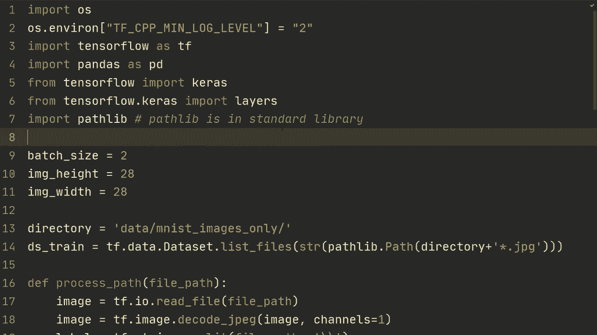


每种方法都有其适用场景，你可以根据自己数据集的具体格式和项目需求选择最合适的一种。掌握这些方法将为你处理各种真实世界图像数据打下坚实基础。