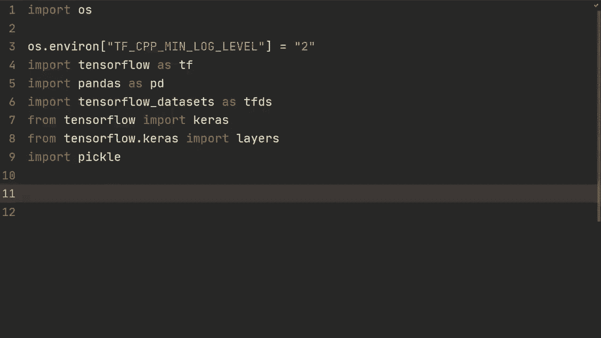
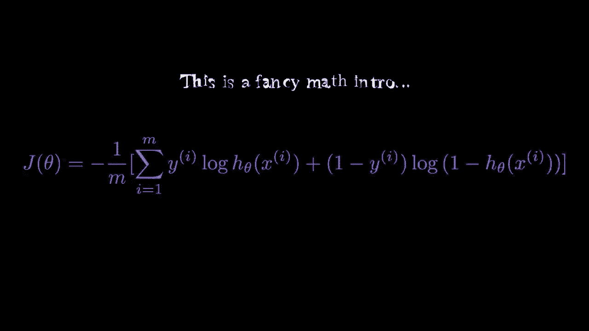
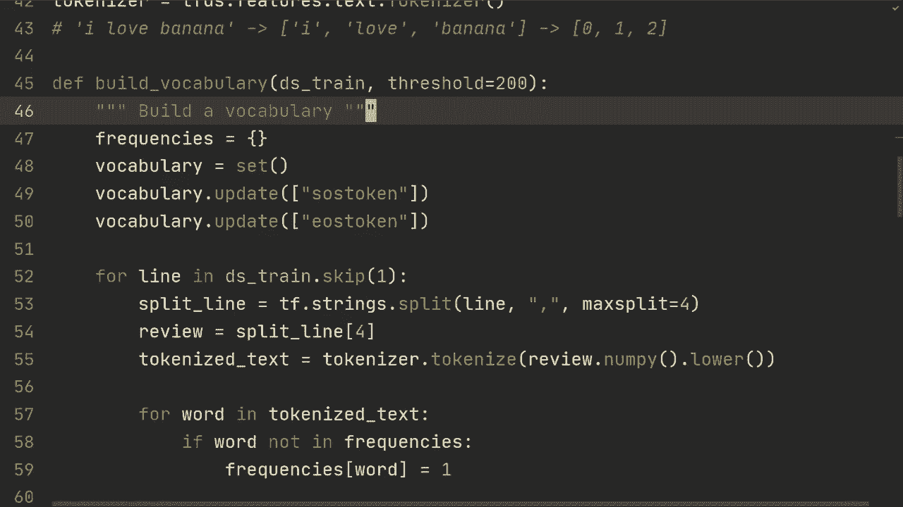
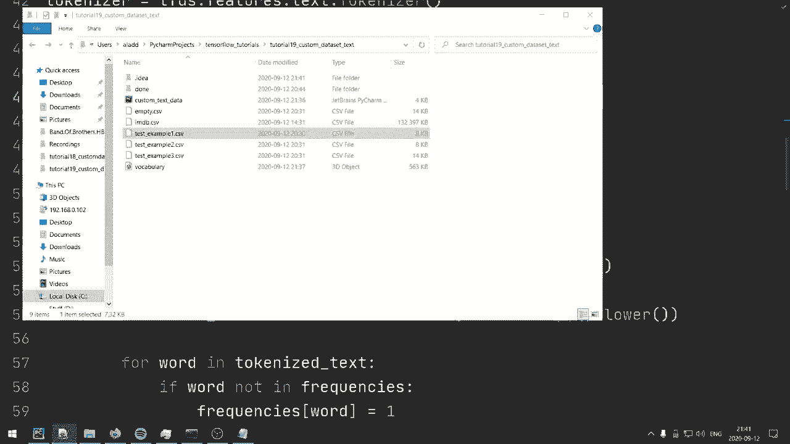
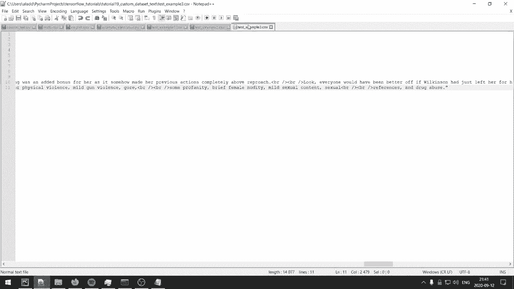
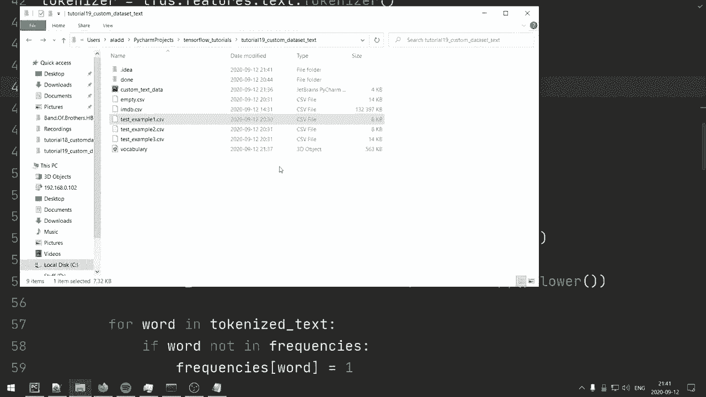
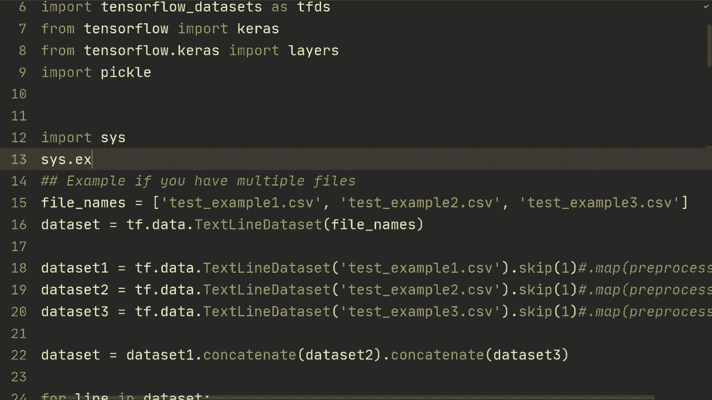
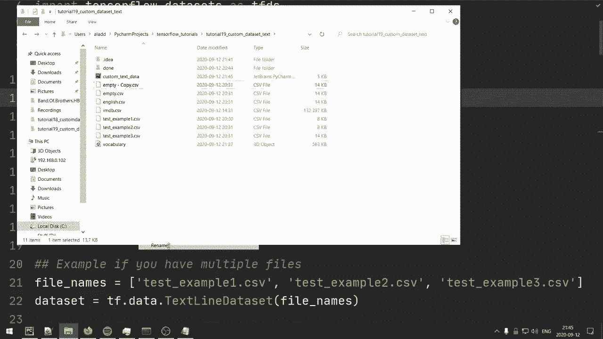
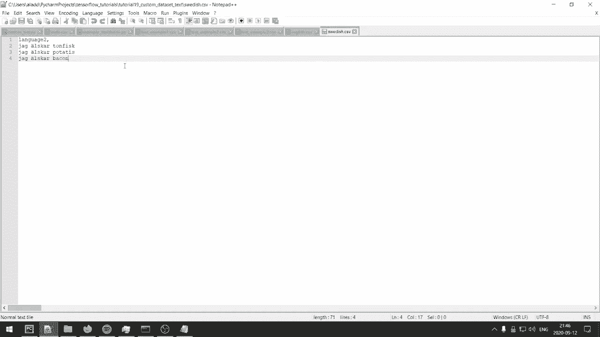
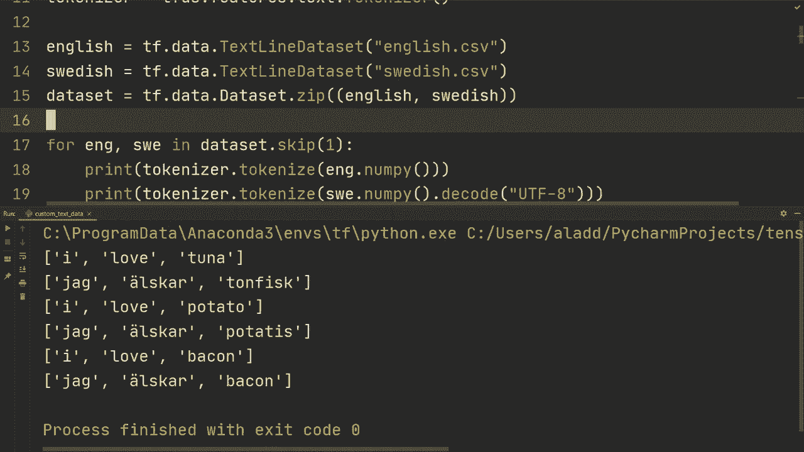

# TensorFlow 教程 P19：使用 TextLineDataset 自定义文本数据集 📚

在本节课中，我们将学习如何使用 TensorFlow 的 `TextLineDataset` 来加载和处理自定义的文本数据集。我们将以一个电影评论情感分析数据集为例，完整演示从数据加载、清洗、词汇表构建到模型训练的全过程。



---



## 概述

我们将处理一个包含电影评论和情感标签（正面/负面）的 CSV 文件。数据集中还包含“训练集/测试集”标识以及一些无监督的评论。我们的目标是学会如何过滤、预处理这类文本数据，并将其转换为可以输入神经网络模型的格式。

---

## 1. 加载原始数据

首先，我们使用 `tf.data.TextLineDataset` 加载包含所有数据的 CSV 文件。

```python
ds_train = tf.data.TextLineDataset('imdb.csv')
ds_test = tf.data.TextLineDataset('imdb.csv')
```

如你所见，这个文件同时包含了训练集和测试集的样本。接下来，我们需要将它们分开。

---

## 2. 过滤训练集和测试集

上一节我们加载了原始数据，本节中我们来看看如何根据数据中的标识来分离训练集和测试集。

我们需要定义一个过滤函数。由于 CSV 中的评论本身可能包含逗号，我们在分割行时需指定 `max_split` 参数，以避免错误地分割评论文本。

以下是过滤训练集的函数：

```python
def filter_train(line):
    split_line = tf.strings.split(line, sep=',', maxsplit=4)
    data_belonging = split_line[1]  # 标识属于‘train’或‘test’
    sentiment_class = split_line[2] # 标识情感为‘pos’, ‘neg’或‘unsupervised’
    # 保留训练集且非无监督的样本
    return tf.logical_and(
        tf.equal(data_belonging, 'train'),
        tf.not_equal(sentiment_class, 'unsupervised')
    )
```

然后，我们对数据集应用这个过滤器：

```python
ds_train = ds_train.filter(filter_train)
```

同理，我们可以定义 `filter_test` 函数来过滤测试集。请注意，在实际项目中，将数据提前分割成独立的文件通常更高效。

---

## 3. 构建词汇表

在将文本输入模型之前，我们需要将单词转换为数字索引。为此，首先要构建一个词汇表。

我们将创建一个函数，遍历训练集，统计词频，并将出现次数超过一定阈值的词加入词汇表。

```python
import tensorflow_datasets as tfds

def build_vocabulary(dataset, threshold=200):
    tokenizer = tfds.features.text.Tokenizer()
    frequencies = {}
    vocab = set(['<SOS>', '<EOS>', '<UNK>'])  # 添加特殊标记

    for line in dataset.skip(1):  # 跳过标题行
        split_line = tf.strings.split(line, sep=',', maxsplit=4)
        review_text = split_line[4].numpy().decode('utf-8').lower()
        tokens = tokenizer.tokenize(review_text)

        for word in tokens:
            frequencies[word] = frequencies.get(word, 0) + 1
            if frequencies[word] == threshold:
                vocab.add(word)
    return list(vocab)
```

构建词汇表可能比较耗时，因此我们通常会将结果保存下来：

```python
import pickle
vocab = build_vocabulary(ds_train)
with open('vocab.pkl', 'wb') as f:
    pickle.dump(vocab, f)
```

---

## 4. 文本编码与数据管道构建

有了词汇表之后，我们就可以创建编码器，将文本字符串转换为数字序列。

```python
encoder = tfds.features.text.TokenTextEncoder(
    vocab_list=vocab,
    oov_token='<UNK>',
    lowercase=True,
    tokenizer=tfds.features.text.Tokenizer()
)
```

接下来，我们定义一个完整的映射函数，它处理每一行原始数据，输出编码后的文本和对应的数字标签。

```python
def encode_map_fn(line):
    split_line = tf.strings.split(line, sep=',', maxsplit=4)
    label_str = split_line[2]
    review = '<SOS> ' + split_line[4] + ' <EOS>'

    # 将标签转换为数字：正面为1，负面为0
    label = tf.cond(
        tf.equal(label_str, 'pos'),
        lambda: tf.constant(1, dtype=tf.int32),
        lambda: tf.constant(0, dtype=tf.int32)
    )
    # 编码文本
    encoded_text = encoder.encode(review.numpy().decode('utf-8'))
    return encoded_text, label
```

为了使这个函数能在 TensorFlow 计算图中运行，我们需要使用 `tf.py_function` 进行包装，并指定输出的形状和类型。

```python
def tf_encode_map_fn(line):
    encoded_text, label = tf.py_function(
        encode_map_fn, [line], [tf.int64, tf.int32]
    )
    encoded_text.set_shape([None])  # 文本序列长度可变
    label.set_shape([])             # 标签是单个标量
    return encoded_text, label
```

现在，我们可以将整个数据管道组装起来，包括打乱、批处理和填充。

```python
AUTOTUNE = tf.data.experimental.AUTOTUNE

ds_train = (ds_train
            .map(tf_encode_map_fn, num_parallel_calls=AUTOTUNE)
            .cache()
            .shuffle(5000)
            .padded_batch(32, padded_shapes=([None], []))
           )

ds_test = (ds_test
           .map(tf_encode_map_fn, num_parallel_calls=AUTOTUNE)
           .padded_batch(32, padded_shapes=([None], []))
          )
```

---

## 5. 创建并训练模型

数据准备就绪后，我们可以创建一个简单的模型进行情感分类。

```python
model = tf.keras.Sequential([
    tf.keras.layers.Embedding(input_dim=len(vocab), output_dim=64),
    tf.keras.layers.GlobalAveragePooling1D(),
    tf.keras.layers.Dense(1, activation='sigmoid')
])

model.compile(
    loss='binary_crossentropy',
    optimizer='adam',
    metrics=['accuracy']
)



model.fit(ds_train, validation_data=ds_test, epochs=15)
```



---





## 6. 处理其他数据结构的思路

每个数据集的结构都可能不同。以下是处理几种常见情况的思路。

### 情况一：数据分散在多个CSV文件中

如果你的数据分布在多个结构相同的文件中，可以一次性加载它们。

```python
file_pattern = ['data_part1.csv', 'data_part2.csv', 'data_part3.csv']
dataset = tf.data.TextLineDataset(file_pattern)
```

### 情况二：多个文件需要分别预处理



如果多个文件结构不同，需要分别处理后再合并。



```python
ds1 = tf.data.TextLineDataset('file1.csv').map(preprocess1)
ds2 = tf.data.TextLineDataset('file2.csv').map(preprocess2)
combined_dataset = ds1.concatenate(ds2)
```



### 情况三：处理平行语料（如翻译数据集）

对于像“英语-瑞典语”这样的平行语料，可以分别加载后使用 `zip` 方法配对。

```python
english_ds = tf.data.TextLineDataset('english.tsv')
swedish_ds = tf.data.TextLineDataset('swedish.tsv')
parallel_dataset = tf.data.Dataset.zip((english_ds, swedish_ds))
```

之后，你需要为每种语言分别构建词汇表和编码器，并进行填充批次等操作，以用于训练像序列到序列这样的模型。

---

## 总结



本节课中我们一起学习了如何使用 TensorFlow 的 `TextLineDataset` 加载自定义文本数据。我们涵盖了从数据过滤、词汇表构建、文本编码到构建完整数据管道的核心步骤。虽然每个数据集的结构各异，但这里介绍的原则和方法可以灵活应用到你的具体项目中，帮助你高效地处理文本数据并输入模型进行训练。