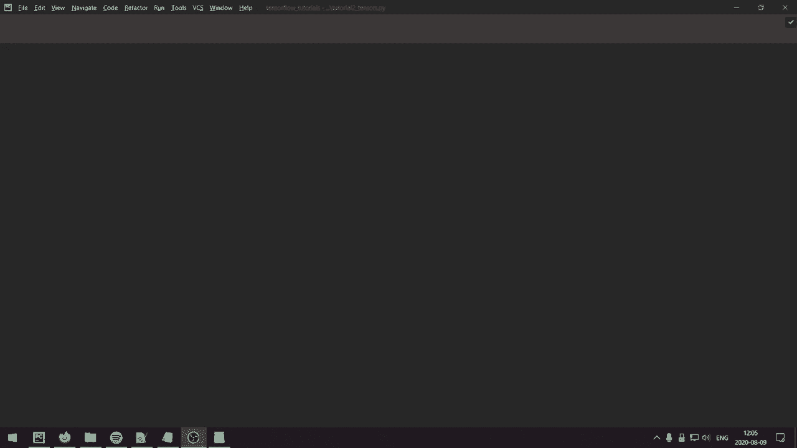
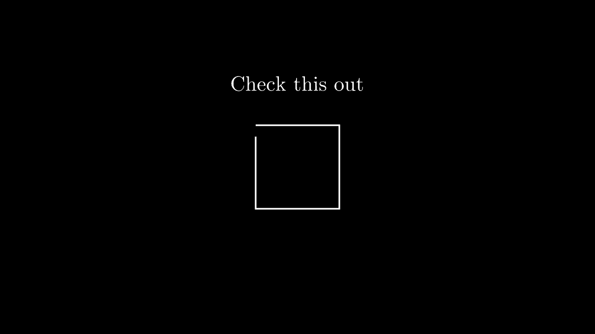
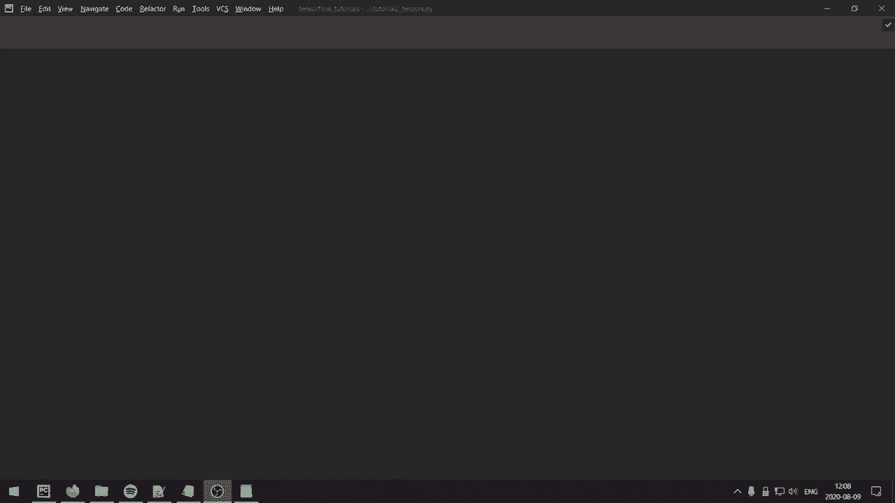
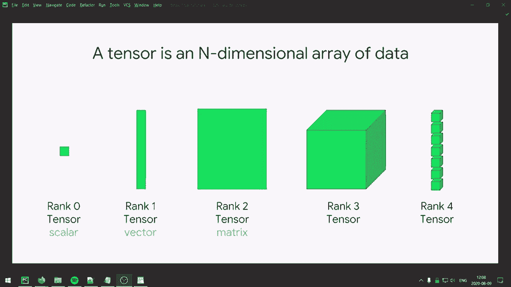
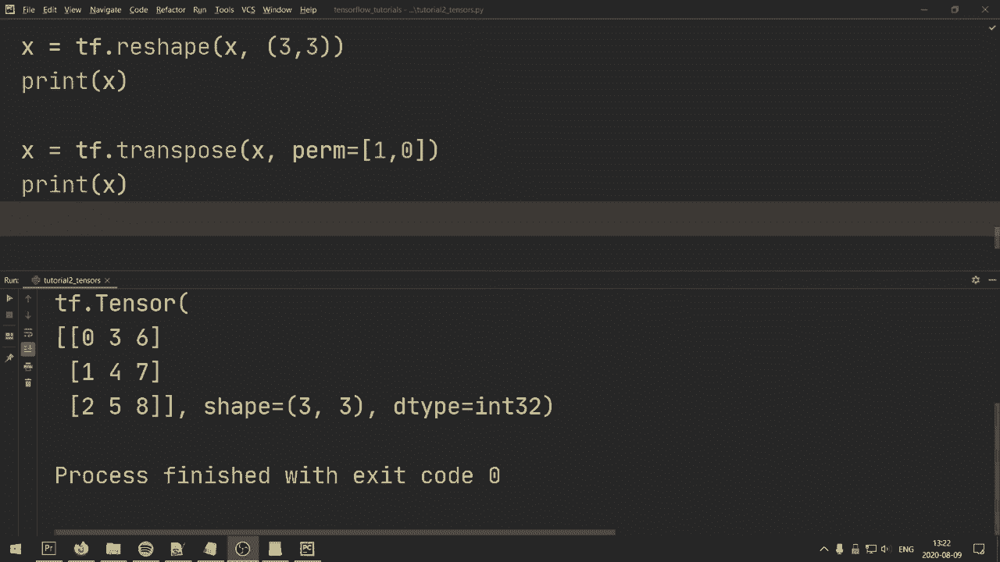

# TensorFlow 教程 P2：L2- 张量基础 🧮





在本节课中，我们将学习深度学习库的基本构件——张量。我们将从张量的定义开始，逐步介绍如何在 TensorFlow 中创建、操作、索引和重塑张量。这些知识是构建更复杂神经网络模型的基础。

## 什么是张量？🤔



从编程的角度来看，**张量**本质上是一个可以在 GPU 上运行的多维数组。从数学的角度来看，张量是标量、向量和矩阵的推广。例如：
*   向量是一个**一维张量**。
*   矩阵是一个**二维张量**。



上一节我们介绍了张量的基本概念，本节中我们来看看如何在 TensorFlow 中创建张量。

## 张量的创建与初始化 🏗️

以下是几种在 TensorFlow 中创建张量的常见方法。

### 使用 `tf.constant` 创建常量张量

我们可以使用 `tf.constant` 函数来创建具有固定值的张量。

```python
import tensorflow as tf

# 创建一个标量（0维张量）
scalar = tf.constant(4)
print(scalar)  # tf.Tensor(4, shape=(), dtype=int32)

# 创建一个形状为 (1, 1) 的二维张量（仍表示一个标量）
scalar_matrix = tf.constant(4, shape=(1, 1))
print(scalar_matrix)  # tf.Tensor([[4]], shape=(1, 1), dtype=int32)

# 创建一个 2x3 的矩阵（二维张量）
matrix = tf.constant([[1, 2, 3], [4, 5, 6]])
print(matrix)
# tf.Tensor(
# [[1 2 3]
#  [4 5 6]], shape=(2, 3), dtype=int32)
```

### 使用特定函数初始化张量

TensorFlow 提供了多种便捷函数来初始化具有特定模式的张量。

```python
# 创建一个 3x3 的全1矩阵
ones_tensor = tf.ones((3, 3))
print(ones_tensor)

# 创建一个 2x3 的全0矩阵
zeros_tensor = tf.zeros((2, 3))
print(zeros_tensor)

# 创建一个 3x3 的单位矩阵
identity_matrix = tf.eye(3)
print(identity_matrix)
```

### 从分布中生成随机张量

我们也可以从特定分布中生成随机值来初始化张量。

```python
# 从均值为0，标准差为1的正态分布中生成一个 3x3 矩阵
normal_tensor = tf.random.normal((3, 3), mean=0, stddev=1)
print(normal_tensor)

# 从0到1的均匀分布中生成一个长度为3的向量
uniform_tensor = tf.random.uniform((1, 3), minval=0, maxval=1)
print(uniform_tensor)
```

### 创建序列张量

类似于 Python 的 `range` 函数，TensorFlow 可以创建序列张量。

```python
# 创建一个从0到8的向量（不包含9）
range_tensor = tf.range(9)
print(range_tensor)  # tf.Tensor([0 1 2 3 4 5 6 7 8], shape=(9,), dtype=int32)

# 创建一个从1开始，到10结束（不包含），步长为2的向量
step_range_tensor = tf.range(start=1, limit=10, delta=2)
print(step_range_tensor)  # tf.Tensor([1 3 5 7 9], shape=(5,), dtype=int32)
```

### 数据类型转换

张量有特定的数据类型（dtype），我们可以使用 `tf.cast` 进行转换。

```python
# 创建一个整数张量
int_tensor = tf.constant([1, 2, 3], dtype=tf.int32)
# 将其转换为 float64 类型
float_tensor = tf.cast(int_tensor, dtype=tf.float64)
print(float_tensor.dtype)  # <dtype: 'float64'>
```

了解了如何创建张量后，接下来我们学习如何对它们进行数学运算。

## 张量的数学运算 ➕➖✖️➗

TensorFlow 支持丰富的逐元素和矩阵运算。

### 基本算术运算

以下是逐元素加、减、乘、除的示例。

```python
x = tf.constant([1, 2, 3])
y = tf.constant([9, 8, 7])

# 加法
z1 = tf.add(x, y)  # 使用函数
z2 = x + y         # 使用运算符（更简便）
print(z2)  # tf.Tensor([10 10 10], shape=(3,), dtype=int32)

# 减法
z_sub = x - y
print(z_sub)  # tf.Tensor([-8 -6 -4], shape=(3,), dtype=int32)

# 乘法（逐元素）
z_mul = x * y
print(z_mul)  # tf.Tensor([ 9 16 21], shape=(3,), dtype=int32)

# 除法（逐元素）
z_div = x / y
print(z_div)  # tf.Tensor([0.11111111 0.25       0.42857143], shape=(3,), dtype=float64)
```

### 点积与矩阵乘法

```python
# 点积（两个向量的内积）
dot_product = tf.tensordot(x, y, axes=1)
print(dot_product)  # tf.Tensor(46, shape=(), dtype=int32)
# 手动计算：1*9 + 2*8 + 3*7 = 46

# 矩阵乘法
matrix_a = tf.random.normal((2, 3))
matrix_b = tf.random.normal((3, 4))
# 方法一：使用函数
matmul1 = tf.matmul(matrix_a, matrix_b)
# 方法二：使用 @ 运算符（Python 3.5+）
matmul2 = matrix_a @ matrix_b
print(matmul1.shape, matmul2.shape)  # (2, 4) (2, 4)
```

### 其他运算

```python
# 逐元素指数运算
z_exp = x ** 5
print(z_exp)  # tf.Tensor([  1  32 243], shape=(3,), dtype=int32)

# 求和（可指定维度）
sum_all = tf.reduce_sum(x)  # 所有元素求和
print(sum_all)  # tf.Tensor(6, shape=(), dtype=int32)
```

掌握了张量的运算，我们来看看如何访问和提取张量中的特定部分。

## 张量的索引与切片 🔪

索引和切片操作允许我们访问张量的子集。

### 一维张量（向量）的索引

```python
x = tf.constant([0, 1, 1, 2, 3, 1, 2, 3])

# 获取所有元素
print(x[:])  # 等同于 print(x)

# 获取索引1（包含）到末尾的元素
print(x[1:])  # tf.Tensor([1 1 2 3 1 2 3], shape=(7,), dtype=int32)

# 获取索引1（包含）到3（不包含）的元素
print(x[1:3])  # tf.Tensor([1 1], shape=(2,), dtype=int32)

# 获取所有元素，但步长为2（跳过间隔元素）
print(x[::2])  # tf.Tensor([0 1 3 2], shape=(4,), dtype=int32)

# 逆序获取所有元素
print(x[::-1])  # tf.Tensor([3 2 1 3 2 1 1 0], shape=(8,), dtype=int32)
```

### 使用 `tf.gather` 收集特定索引

```python
# 收集索引为0和3的元素
indices = tf.constant([0, 3])
gathered = tf.gather(x, indices)
print(gathered)  # tf.Tensor([0 2], shape=(2,), dtype=int32)
```

### 多维张量（矩阵）的索引

对于多维张量，使用逗号分隔不同维度的索引。

```python
x = tf.constant([[1, 2],
                 [3, 4],
                 [5, 6]])  # 一个 3x2 的矩阵

# 获取第一行（索引0）的所有列
print(x[0, :])  # tf.Tensor([1 2], shape=(2,), dtype=int32)

# 获取前两行（索引0和1）的所有列
print(x[0:2, :])  # 或 x[:2, :]
# tf.Tensor(
# [[1 2]
#  [3 4]], shape=(2, 2), dtype=int32)
```

最后，我们学习如何改变张量的形状，这在数据预处理和模型层间连接时非常有用。

## 张量的重塑与转置 🔄

### 使用 `tf.reshape` 改变形状

`tf.reshape` 函数可以在不改变数据的前提下，重新排列张量的维度。

```python
# 创建一个包含9个元素的向量
x = tf.range(9)  # shape: (9,)
print(x)

# 重塑为一个 3x3 的矩阵
x_reshaped = tf.reshape(x, (3, 3))
print(x_reshaped)
# tf.Tensor(
# [[0 1 2]
#  [3 4 5]
#  [6 7 8]], shape=(3, 3), dtype=int32)
```

### 使用 `tf.transpose` 进行转置

转置操作会交换张量的维度。对于矩阵，就是行变列，列变行。

```python
# 对上面重塑的 3x3 矩阵进行转置
x_transposed = tf.transpose(x_reshaped)
print(x_transposed)
# tf.Tensor(
# [[0 3 6]
#  [1 4 7]
#  [2 5 8]], shape=(3, 3), dtype=int32)
```

对于更高维度的张量，可以使用 `perm` 参数指定维度的新顺序。

## 总结 📝

本节课中我们一起学习了 TensorFlow 中张量的核心知识：
1.  **张量的定义**：多维数组，是标量、向量和矩阵的推广。
2.  **张量的创建**：使用 `tf.constant`、`tf.ones`、`tf.zeros`、`tf.random` 系列函数以及 `tf.range` 来初始化张量。
3.  **张量的运算**：包括逐元素的加（`+`）、减（`-`）、乘（`*`）、除（`/`），以及点积（`tf.tensordot`）和矩阵乘法（`tf.matmul` 或 `@`）。
4.  **张量的索引**：使用 Python 切片语法和 `tf.gather` 函数来访问张量的特定部分。
5.  **张量的重塑**：使用 `tf.reshape` 改变形状，使用 `tf.transpose` 进行转置。



这些操作是使用 TensorFlow 进行深度学习编程的基础。在下一个教程中，我们将运用这些知识开始构建基本的神经网络模型。