# TensorFlow 教程 P20：皮肤癌分类项目 🧬

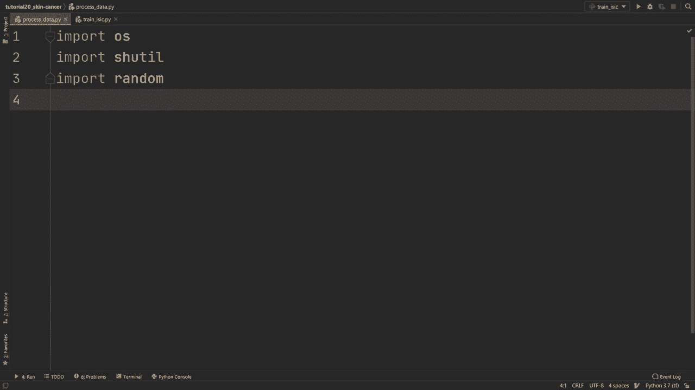

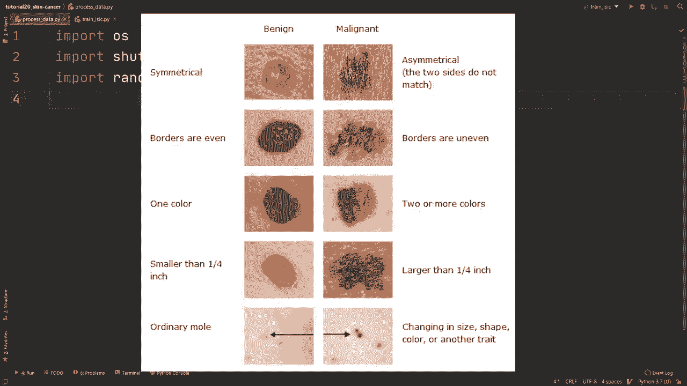

## 概述
在本节课中，我们将通过一个完整的项目示例，学习如何使用 TensorFlow 构建一个能够对皮肤病变图像进行分类的神经网络模型，以判断其是良性还是恶性。我们将涵盖数据处理、模型构建、训练、评估以及结果分析的全过程。

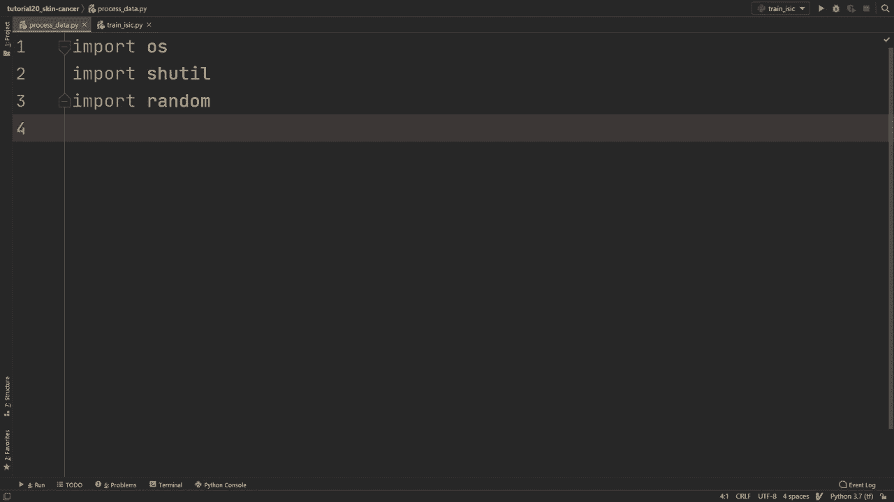


---

## 数据获取与准备

上一节我们介绍了项目的目标，本节中我们来看看如何获取和准备数据。

所有项目的第一步都是获取数据。经过搜索，我们找到了名为 ISIC 的数据集。以下是下载和准备数据的步骤：

1.  访问 ISIC 挑战赛网站，输入邮箱地址以下载数据。
2.  下载完成后，会获得一个包含 JPEG 格式图像的文件夹，以及一个记录了图像文件名、病变是否为恶性（0代表良性，1代表恶性）、年龄、性别和位置的 CSV 文件。
3.  本项目将使用 25,000 张带有标签的训练图像，并将其划分为训练集、验证集和测试集，而忽略额外的元数据（如年龄、性别）。

为了便于使用 TensorFlow 的 `ImageDataGenerator`，我们需要将图像按类别整理到特定的文件夹结构中。以下是创建数据处理脚本的步骤：

```python
import os
import shutil
import random
import numpy as np

# 设置随机种子以确保结果可复现
random.seed(1)
np.random.seed(1)

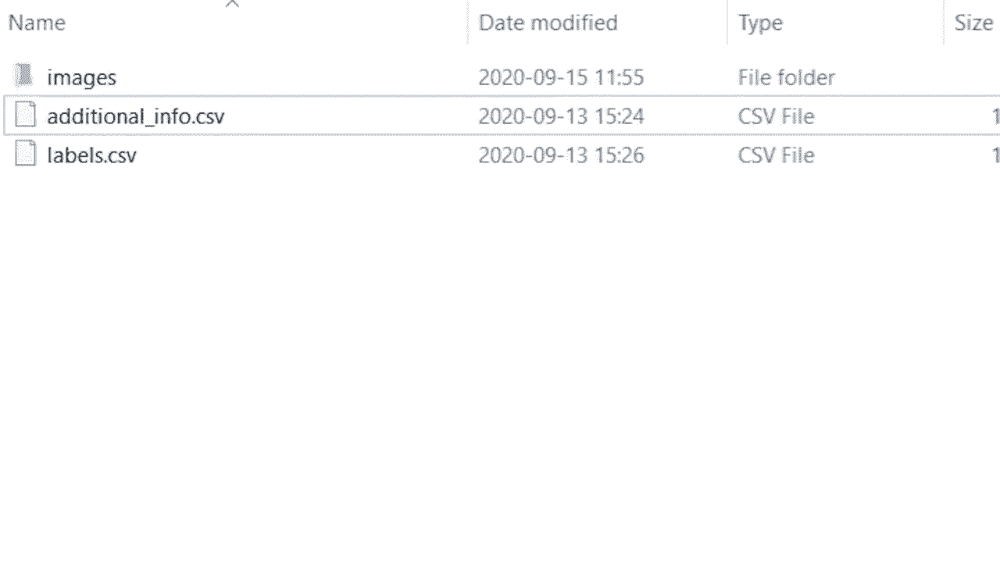

# 定义路径
image_dir = 'ISIC/images/'
data_dir = 'data/'
train_dir = os.path.join(data_dir, 'train')
test_dir = os.path.join(data_dir, 'test')
val_dir = os.path.join(data_dir, 'validation')

# 创建文件夹结构
for split in [train_dir, test_dir, val_dir]:
    for class_name in ['benign', 'malignant']:
        os.makedirs(os.path.join(split, class_name), exist_ok=True)

# 初始化计数器
train_examples = test_examples = val_examples = 0

# 读取标签文件
with open('ISIC/labels.csv', 'r') as f:
    lines = f.readlines()[1:]  # 跳过标题行
    for line in lines:
        parts = line.strip().split(',')
        image_file = parts[0]
        label = int(float(parts[1]))  # 0: 良性, 1: 恶性

        # 随机分配数据到训练集、验证集或测试集 (80%/10%/10%)
        rand_num = random.uniform(0, 1)
        if rand_num < 0.8:
            split_folder = train_dir
            train_examples += 1
        elif rand_num < 0.9:
            split_folder = val_dir
            val_examples += 1
        else:
            split_folder = test_dir
            test_examples += 1

        # 确定目标类别文件夹
        class_folder = 'benign' if label == 0 else 'malignant'
        src_path = os.path.join(image_dir, image_file + '.JPEG')
        dst_path = os.path.join(split_folder, class_folder, image_file + '.JPEG')

        # 复制文件
        shutil.copy(src_path, dst_path)

print(f'训练集样本数: {train_examples}')
print(f'验证集样本数: {val_examples}')
print(f'测试集样本数: {test_examples}')
```

运行此脚本后，数据将被整理到 `data/` 目录下，结构如下：
```
data/
├── train/
│   ├── benign/
│   └── malignant/
├── validation/
│   ├── benign/
│   └── malignant/
└── test/
    ├── benign/
    └── malignant/
```

---

## 模型构建与训练

现在数据已经准备就绪，接下来我们构建并训练一个卷积神经网络模型。

我们将使用一个预训练模型（NASNetMobile）作为特征提取器，并在其顶部添加一个全连接层用于二分类。以下是构建和编译模型的步骤：

```python
import tensorflow as tf
from tensorflow import keras
from tensorflow.keras import layers
import tensorflow_hub as hub

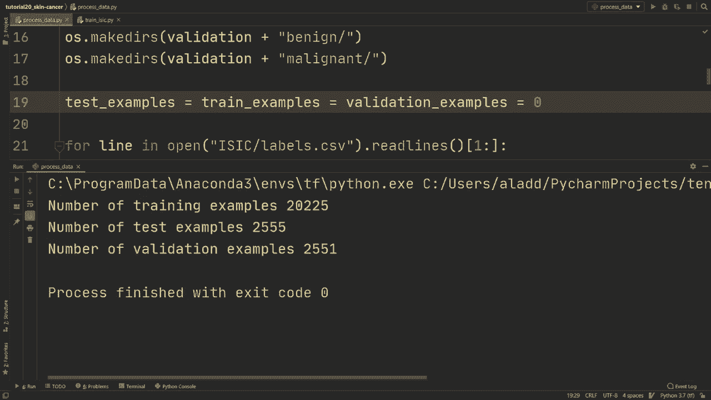

# 参数设置
IMG_HEIGHT = IMG_WIDTH = 224
BATCH_SIZE = 32
train_examples = 20225
val_examples = 2555

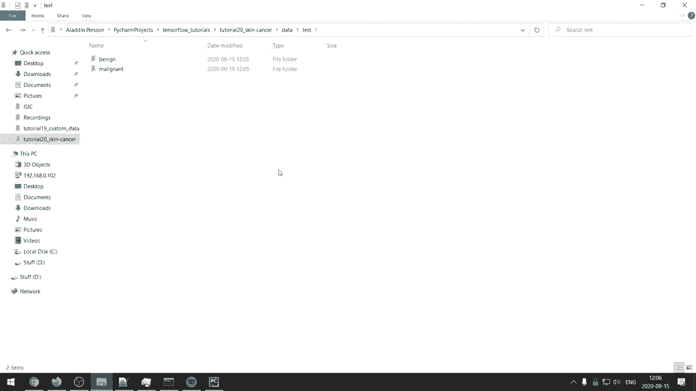

# 构建模型
model = keras.Sequential([
    # 使用 TensorFlow Hub 上的预训练 NASNetMobile
    hub.KerasLayer("https://tfhub.dev/google/imagenet/nasnet_mobile/feature_vector/4",
                   trainable=True),
    # 输出层，使用 sigmoid 激活函数进行二分类
    layers.Dense(1, activation='sigmoid')
])

# 编译模型
model.compile(
    optimizer=keras.optimizers.Adam(learning_rate=3e-4),
    loss='binary_crossentropy',
    metrics=[
        keras.metrics.BinaryAccuracy(name='accuracy'),
        keras.metrics.Precision(name='precision'),
        keras.metrics.Recall(name='recall'),
        keras.metrics.AUC(name='auc')
    ]
)
print(model.summary())
```

接下来，我们使用 `ImageDataGenerator` 来加载数据并进行数据增强（仅对训练集）。数据增强有助于提高模型的泛化能力。

```python
from tensorflow.keras.preprocessing.image import ImageDataGenerator

# 训练数据生成器（包含数据增强）
train_datagen = ImageDataGenerator(
    rescale=1./255,
    rotation_range=15,
    width_shift_range=0.05,
    height_shift_range=0.05,
    horizontal_flip=True,
    vertical_flip=True,
    dtype=tf.float32
)

# 验证和测试数据生成器（仅重缩放）
val_test_datagen = ImageDataGenerator(rescale=1./255, dtype=tf.float32)

# 创建数据流
train_generator = train_datagen.flow_from_directory(
    'data/train/',
    target_size=(IMG_HEIGHT, IMG_WIDTH),
    batch_size=BATCH_SIZE,
    class_mode='binary',
    shuffle=True,
    seed=1
)

validation_generator = val_test_datagen.flow_from_directory(
    'data/validation/',
    target_size=(IMG_HEIGHT, IMG_WIDTH),
    batch_size=BATCH_SIZE,
    class_mode='binary',
    shuffle=False
)

test_generator = val_test_datagen.flow_from_directory(
    'data/test/',
    target_size=(IMG_HEIGHT, IMG_WIDTH),
    batch_size=BATCH_SIZE,
    class_mode='binary',
    shuffle=False
)
```

现在，我们可以开始训练模型。我们将使用 `ModelCheckpoint` 回调来保存训练过程中最好的模型。

```python
# 训练模型
history = model.fit(
    train_generator,
    steps_per_epoch=train_examples // BATCH_SIZE,
    epochs=10,  # 可以增加周期数以获得更好性能
    validation_data=validation_generator,
    validation_steps=val_examples // BATCH_SIZE,
    callbacks=[
        keras.callbacks.ModelCheckpoint('isic_model.h5', save_best_only=True)
    ]
)
```

---

## 模型评估与指标分析

在训练过程中，我们观察到模型在训练集上的准确率迅速提升，但这可能具有误导性，因为数据集存在严重的类别不平衡（良性样本远多于恶性样本）。因此，我们需要使用更全面的指标进行评估。

上一节我们训练了模型，本节中我们来看看如何更准确地评估其性能。

对于不平衡分类问题，精确度（Precision）、召回率（Recall）和 AUC（Area Under the ROC Curve）是比单纯准确率更可靠的指标。我们已经在模型编译时添加了这些指标。

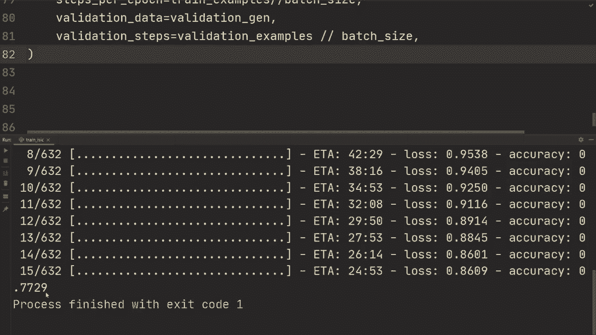

现在，我们在独立的测试集上评估最终模型，并绘制 ROC 曲线来可视化模型性能。


```python
import numpy as np
import matplotlib.pyplot as plt
from sklearn.metrics import roc_curve

# 加载已保存的最佳模型
model = keras.models.load_model('isic_model.h5')

# 在测试集上评估
test_results = model.evaluate(test_generator, verbose=2)
print(f"测试集损失: {test_results[0]:.4f}")
print(f"测试集准确率: {test_results[1]:.4f}")
print(f"测试集精确度: {test_results[2]:.4f}")
print(f"测试集召回率: {test_results[3]:.4f}")
print(f"测试集AUC: {test_results[4]:.4f}")

# 绘制 ROC 曲线
def plot_roc_curve(labels, data_generator):
    # 获取测试集所有标签和预测
    all_labels = []
    batch_count = 0
    for images, labels_batch in data_generator:
        all_labels.extend(labels_batch)
        batch_count += 1
        if batch_count >= len(data_generator):
            break
    all_labels = np.array(all_labels)

    # 获取预测概率
    predictions = model.predict(data_generator)

    # 计算 ROC 曲线
    fpr, tpr, _ = roc_curve(all_labels, predictions)

    # 绘图
    plt.figure(figsize=(8, 6))
    plt.plot(fpr * 100, tpr * 100, label=f'Model (AUC = {test_results[4]:.2f})')
    plt.plot([0, 100], [0, 100], 'k--', label='Random Guess')
    plt.xlabel('假阳性率 (%)')
    plt.ylabel('真阳性率 (%)')
    plt.title('ROC 曲线')
    plt.legend()
    plt.grid(True)
    plt.show()

# 为测试集绘制 ROC 曲线
plot_roc_curve(None, test_generator)
```

运行上述代码后，我们将得到模型在测试集上的各项指标以及 ROC 曲线图。例如，我们可能得到类似以下的结果：
*   准确率：~90%
*   精确度：~73%
*   召回率：~54%
*   AUC：~0.87

ROC 曲线下的面积（AUC）为 0.87，表明模型具有良好的区分能力。

---

## 结果分析与改进方向

我们的模型在测试集上取得了约 87% 的 AUC 分数。然而，值得注意的是，原始的 ISIC 挑战赛的优胜模型 AUC 分数可达 95% 以上。

我们的模型与顶尖结果存在差距，可能原因包括：
1.  **数据使用**：我们只使用了部分训练数据（25k张），而官方挑战可能使用了更多数据或额外的元数据。
2.  **模型架构**：我们使用了轻量级的 NASNetMobile，更强大的模型（如 EfficientNet）可能表现更好。
3.  **训练技巧**：更复杂的数据增强、类别权重调整、更精细的超参数调优和学习率调度可能提升性能。
4.  **集成方法**：结合多个模型的预测结果。

对于实际应用，特别是医疗领域，高召回率（尽可能找出所有癌症病例）可能比高精确度更重要，这需要在损失函数或模型选择上进行权衡。

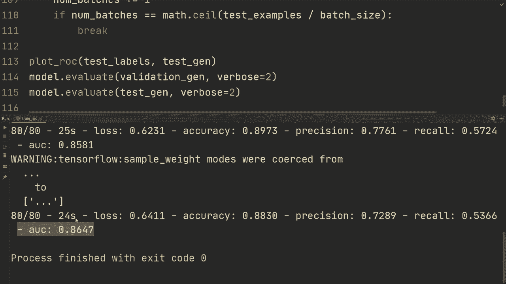

---

## 总结

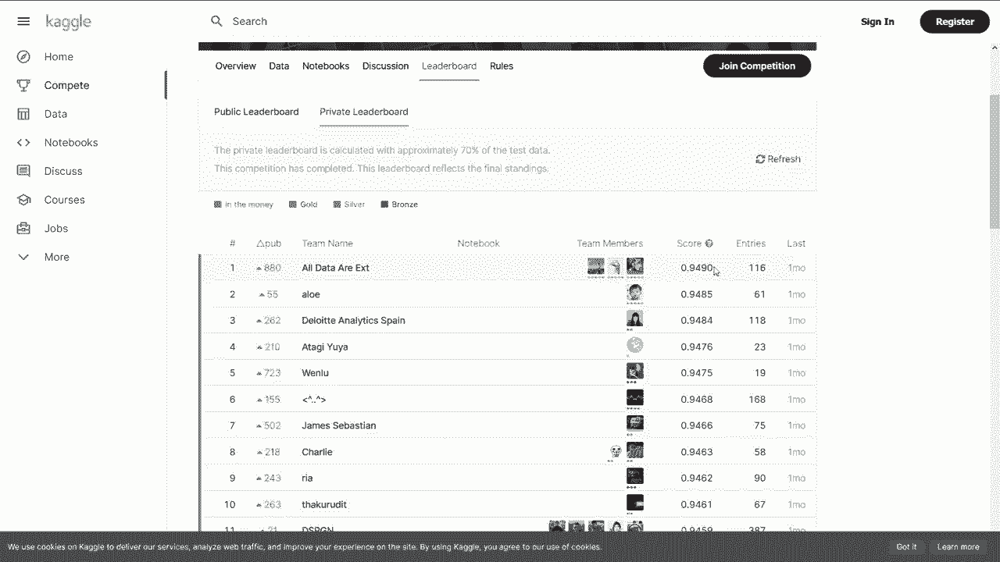

本节课中我们一起学习了如何完成一个完整的 TensorFlow 图像分类项目：

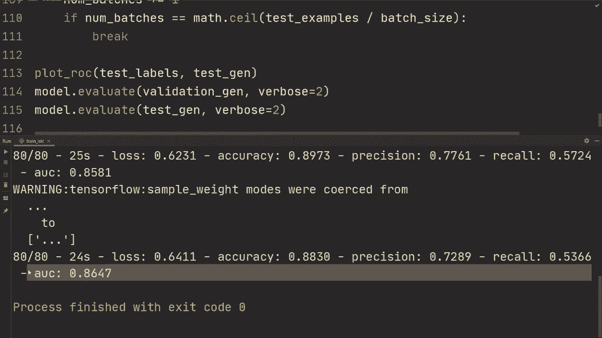

1.  **数据准备**：我们学习了如何下载、解析 ISIC 皮肤癌数据集，并将其划分为训练集、验证集和测试集，并组织成 TensorFlow 所需的目录结构。
2.  **模型构建**：我们利用 TensorFlow Hub 的预训练模型（NASNetMobile）快速构建了一个迁移学习模型，并为其添加了自定义的输出层。
3.  **训练与评估**：我们使用 `ImageDataGenerator` 进行数据加载和增强，训练了模型，并针对类别不平衡问题，采用了精确度、召回率、AUC 等多个指标进行综合评估。
4.  **结果分析**：我们评估了模型性能，绘制了 ROC 曲线，并与官方基准进行了对比，讨论了可能的改进方向。

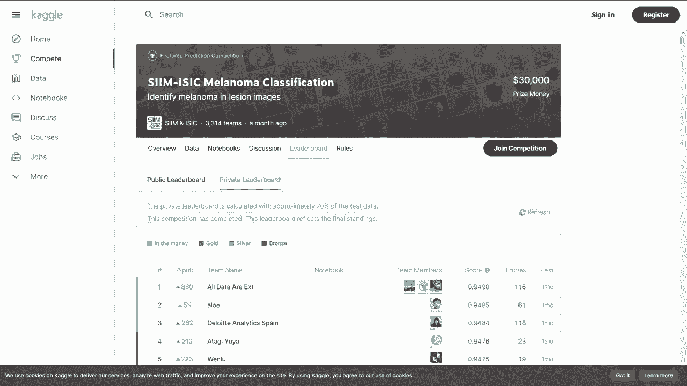

通过这个项目，你将掌握使用 TensorFlow 解决实际图像分类问题的基本流程，并具备进一步探索和优化模型的能力。