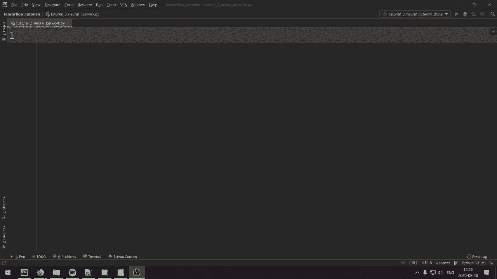
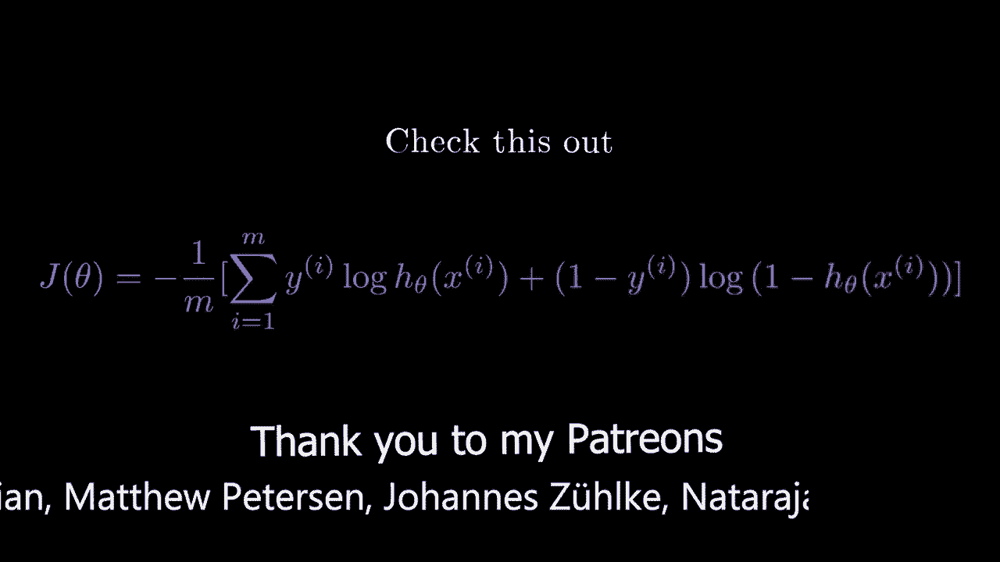
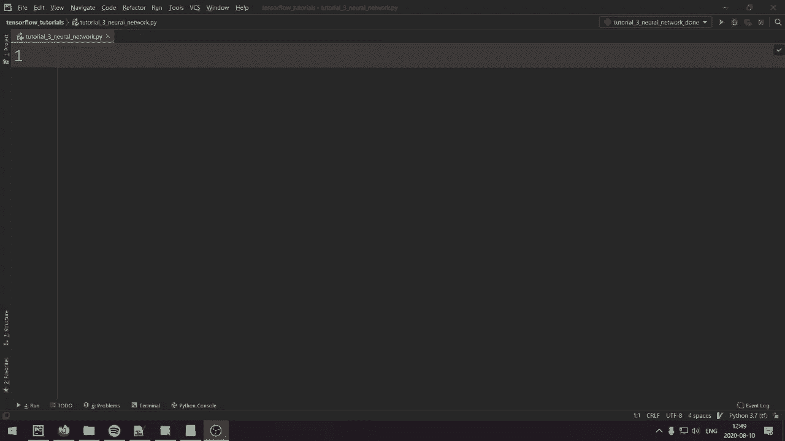
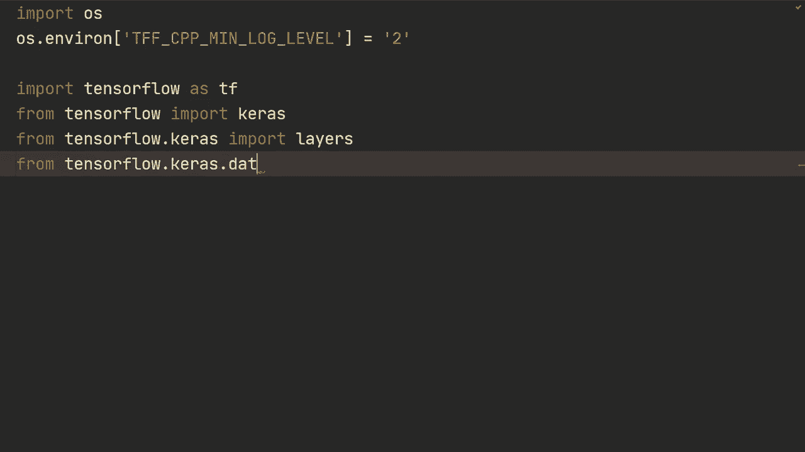
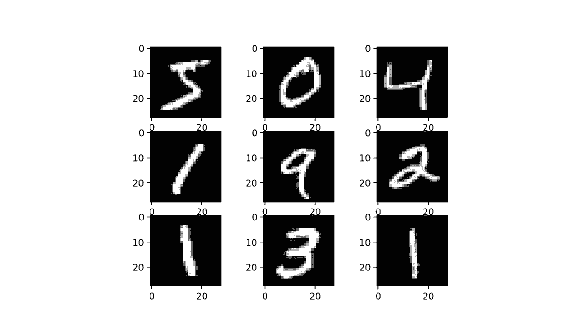
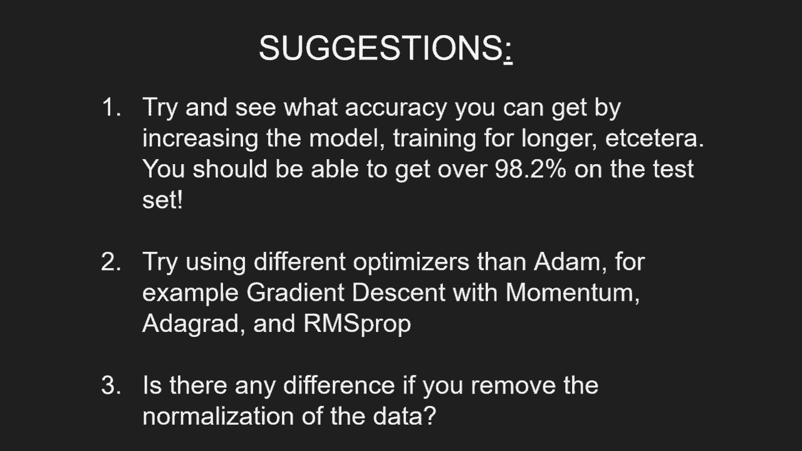

# TensorFlow 教程 P3：使用顺序与函数式API构建神经网络 🧠





在本节课中，我们将学习如何使用TensorFlow的高级API——Keras，来构建两种不同类型的神经网络模型：顺序模型和函数式模型。我们将以经典的MNIST手写数字识别任务为例，从数据加载、预处理到模型构建、训练和评估，完整地走一遍流程。

---

## 导入必要的库与设置环境




首先，我们需要导入TensorFlow和Keras，并进行一些环境设置，以便专注于代码本身。

```python
import os
os.environ['TF_CPP_MIN_LOG_LEVEL'] = '2'  # 仅显示错误信息，忽略常规信息

import tensorflow as tf
from tensorflow import keras
from tensorflow.keras import layers
from tensorflow.keras.datasets import mnist
```

---

## 加载与预处理数据

我们将使用MNIST数据集。它包含60,000张训练图像和10,000张测试图像，每张图像是28x28像素的灰度图，代表0到9的数字。





以下是加载和预处理数据的步骤：

```python
# 加载数据
(x_train, y_train), (x_test, y_test) = mnist.load_data()

# 打印原始数据形状
print(x_train.shape)  # (60000, 28, 28)
print(y_train.shape)  # (60000,)

# 数据预处理
# 1. 将图像从二维展平为一维 (28*28 = 784)
x_train = x_train.reshape(-1, 784)
x_test = x_test.reshape(-1, 784)

# 2. 将数据类型转换为float32以优化计算
x_train = x_train.astype('float32')
x_test = x_test.astype('float32')

# 3. 将像素值从[0, 255]归一化到[0, 1]区间，以加速训练
x_train = x_train / 255.0
x_test = x_test / 255.0
```

---

## 使用顺序API构建模型

顺序API是Keras中最简单直观的模型构建方式，它允许我们按顺序逐层堆叠网络层。它非常适合构建单输入、单输出的线性模型。

我们将构建一个包含两个隐藏层和一个输出层的基本全连接神经网络。

```python
# 方法一：在Sequential构造函数中直接传入层列表
model = keras.Sequential([
    layers.Dense(512, activation='relu', input_shape=(784,)),
    layers.Dense(256, activation='relu'),
    layers.Dense(10)  # 输出层，10个节点对应10个数字类别
])

# 编译模型：配置学习过程
model.compile(
    loss=keras.losses.SparseCategoricalCrossentropy(from_logits=True),
    optimizer=keras.optimizers.Adam(learning_rate=0.001),
    metrics=['accuracy']
)

# 查看模型结构摘要
model.summary()
```

**模型编译参数解释：**
*   **损失函数 (`loss`)**：`SparseCategoricalCrossentropy` 适用于整数标签（如0,1,2...）。`from_logits=True` 表示模型输出层没有使用`softmax`激活，损失函数内部会先应用`softmax`。
*   **优化器 (`optimizer`)**：`Adam` 是一种常用的自适应学习率优化算法。
*   **评估指标 (`metrics`)**：`accuracy` 用于在训练和评估时跟踪分类准确率。

---

## 训练与评估顺序模型

配置好模型后，我们就可以使用训练数据来训练它，并在测试集上评估其性能。

```python
# 训练模型
model.fit(x_train, y_train, batch_size=32, epochs=5, verbose=True)

# 在测试集上评估模型
test_loss, test_acc = model.evaluate(x_test, y_test, batch_size=32, verbose=True)
print(f"测试集准确率: {test_acc:.4f}")
```

---

## 使用函数式API构建模型

上一节我们介绍了简单易用的顺序模型。本节中我们来看看更灵活的函数式API。当模型需要处理多个输入、多个输出，或者具有复杂的拓扑结构（如残差连接）时，函数式API是更好的选择。

函数式API通过显式定义输入和输出来构建模型。

```python
# 1. 定义输入层
inputs = keras.Input(shape=(784,))

# 2. 使用函数式语法连接各层
x = layers.Dense(512, activation='relu', name='first_layer')(inputs)
x = layers.Dense(256, activation='relu', name='second_layer')(x)

# 3. 定义输出层（这次使用softmax激活）
outputs = layers.Dense(10, activation='softmax')(x)

# 4. 创建模型
model = keras.Model(inputs=inputs, outputs=outputs)

# 5. 编译模型（注意：由于输出层使用了softmax，from_logits应设为False或省略）
model.compile(
    loss=keras.losses.SparseCategoricalCrossentropy(from_logits=False),
    optimizer=keras.optimizers.Adam(learning_rate=0.001),
    metrics=['accuracy']
)

# 查看模型结构
model.summary()

# 训练与评估（与顺序模型相同）
model.fit(x_train, y_train, batch_size=32, epochs=5, verbose=True)
test_loss, test_acc = model.evaluate(x_test, y_test, batch_size=32, verbose=True)
print(f"测试集准确率: {test_acc:.4f}")
```

---

## 模型调试技巧

在构建更复杂的网络时，查看中间层的输出是重要的调试手段。以下是如何提取特定层输出的方法：

```python
# 假设我们有一个训练好的模型 `model`
# 方法一：通过层索引获取
intermediate_layer_model = keras.Model(inputs=model.input,
                                       outputs=model.layers[-2].output)  # 获取倒数第二层的输出
intermediate_output = intermediate_layer_model.predict(x_train[:10])
print(intermediate_output.shape)

# 方法二：通过层名称获取（如果创建时指定了name）
# 获取名为 'second_layer' 的层的输出
feature_model = keras.Model(inputs=model.input,
                            outputs=model.get_layer('second_layer').output)
features = feature_model.predict(x_train)
print(features.shape)

# 获取所有层的输出
all_layer_outputs = [layer.output for layer in model.layers]
for i, output in enumerate(all_layer_outputs):
    print(f"第{i}层输出形状: {output.shape}")
```

---

## 练习与建议

为了加深理解，你可以尝试以下练习：

*   **调整模型**：尝试增加隐藏层的节点数或层数，或者增加训练的周期数(`epochs`)，观察测试准确率是否能超过98.1%。
*   **更换优化器**：尝试使用不同的优化器，如带动量的随机梯度下降(`SGD`)、`RMSprop`，并与`Adam`的结果进行比较。
*   **对比数据预处理**：尝试不进行数据归一化（即不除以255），观察训练速度和最终准确率有何变化。

---

## 总结

本节课中我们一起学习了使用TensorFlow Keras构建神经网络的核心方法：
1.  **顺序API (`Sequential`)**：通过简单堆叠层来构建线性模型，适合快速原型开发。
2.  **函数式API (`Model`)**：通过定义输入和输出来构建模型，提供了处理复杂模型结构的灵活性。
3.  我们完成了从数据加载、预处理、模型构建、编译、训练到评估的完整流程。
4.  还介绍了一些实用的模型调试技巧，如查看模型摘要和提取中间层特征。



在接下来的课程中，我们将利用函数式API的灵活性，构建更复杂的模型，例如卷积神经网络(CNN)。