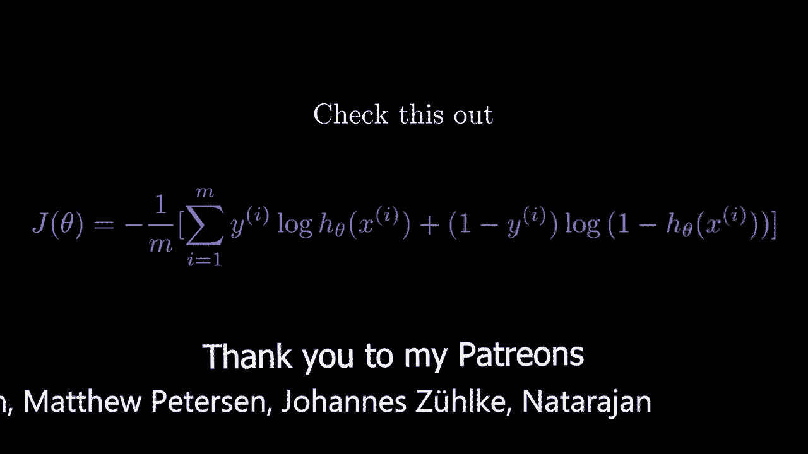
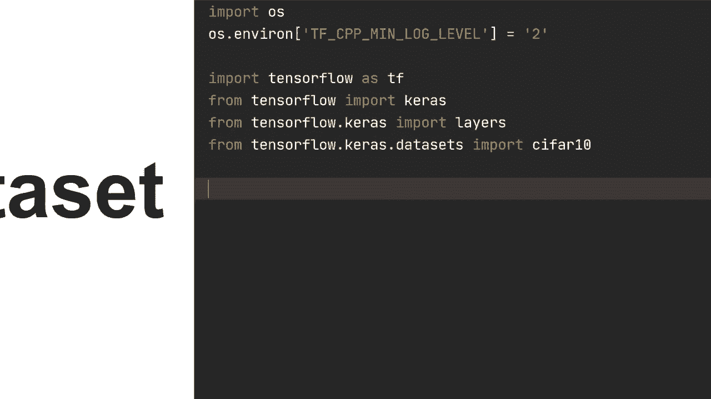
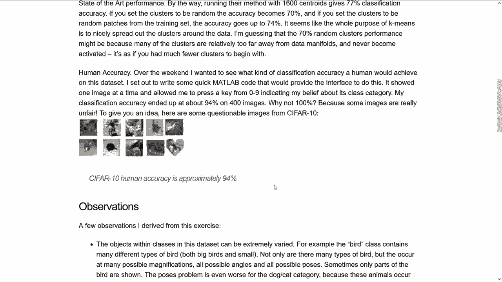
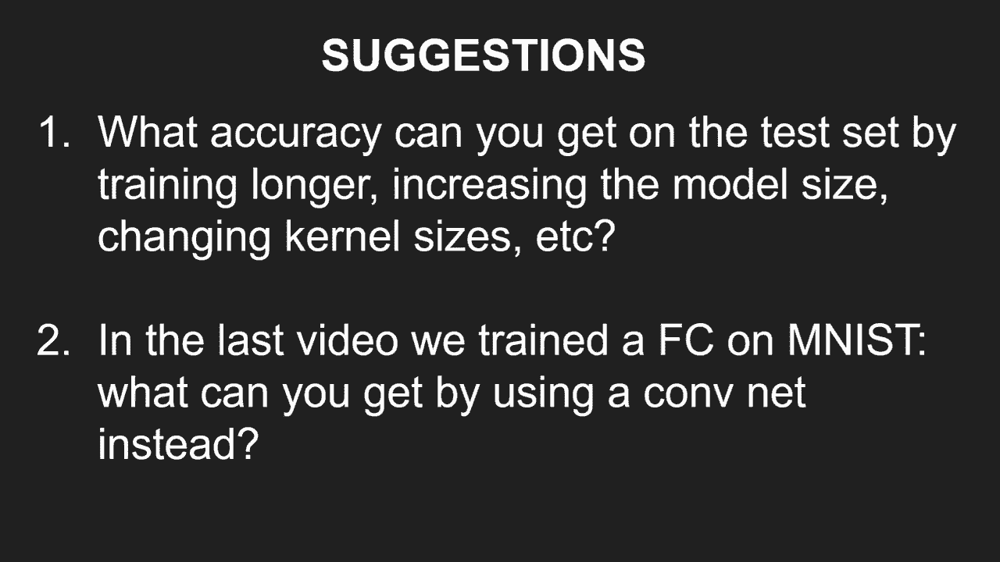

# TensorFlow 教程 P4：使用顺序与函数式API构建卷积神经网络 🧠



在本节课中，我们将学习如何使用TensorFlow的两种主要API——顺序API和函数式API——来构建一个卷积神经网络。我们将使用CIFAR-10数据集，这是一个包含10个类别的自然图像数据集。通过本教程，你将掌握构建、编译和训练一个基本CNN模型的完整流程。

---

## 环境设置与数据准备



首先，我们需要导入必要的库并设置环境，然后加载和预处理CIFAR-10数据集。

```python
import os
os.environ['TF_CPP_MIN_LOG_LEVEL'] = '2'  # 忽略TensorFlow的一些信息性消息

import tensorflow as tf
from tensorflow import keras as ks
from tensorflow.keras import layers
from tensorflow.keras.datasets import cifar10
```



CIFAR-10数据集包含60,000张32x32像素的彩色图像，分为10个类别。其中50,000张用于训练，10,000张用于测试。

以下是加载并预处理数据的代码：

```python
# 加载数据
(x_train, y_train), (x_test, y_test) = cifar10.load_data()

# 将数据类型转换为float32以提高计算效率，并进行归一化
x_train = x_train.astype('float32') / 255.0
x_test = x_test.astype('float32') / 255.0
```

通过除以255，我们将像素值归一化到0到1之间，这有助于模型训练的稳定性和收敛速度。

---

## 使用顺序API构建CNN

上一节我们准备好了数据，本节中我们来看看如何使用更直观的顺序API来构建模型。顺序API允许我们以层叠的方式逐层定义网络。

我们将构建一个包含卷积层、池化层和全连接层的简单CNN。

```python
model = ks.Sequential([
    # 第一个卷积块
    layers.Conv2D(32, kernel_size=3, padding='valid', activation='relu', input_shape=(32, 32, 3)),
    layers.MaxPooling2D(pool_size=(2, 2)),

    # 第二个卷积块
    layers.Conv2D(64, kernel_size=3, padding='valid', activation='relu'),
    layers.MaxPooling2D(pool_size=(2, 2)),

    # 第三个卷积块
    layers.Conv2D(128, kernel_size=3, padding='valid', activation='relu'),

    # 展平层，为全连接层准备数据
    layers.Flatten(),

    # 全连接层
    layers.Dense(64, activation='relu'),
    # 输出层，10个类别
    layers.Dense(10)
])
```

以下是模型中各层作用的简要说明：
*   **Conv2D**: 执行卷积操作，提取图像特征。参数`32`、`64`、`128`代表输出通道数。
*   **MaxPooling2D**: 执行最大池化操作，降低特征图的空间维度，增强特征并减少计算量。
*   **Flatten**: 将多维特征图展平为一维向量，以便输入全连接层。
*   **Dense**: 全连接层，用于最终的分类决策。

接下来，我们编译模型，指定损失函数、优化器和评估指标。

```python
model.compile(
    loss=ks.losses.SparseCategoricalCrossentropy(from_logits=True),
    optimizer=ks.optimizers.Adam(learning_rate=3e-4),
    metrics=['accuracy']
)
```

现在，我们可以开始训练模型并在测试集上评估其性能。

```python
# 训练模型
history = model.fit(x_train, y_train, batch_size=64, epochs=10, verbose=2)

# 评估模型
test_loss, test_acc = model.evaluate(x_test, y_test, batch_size=64, verbose=2)
print(f"测试准确率: {test_acc:.4f}")
```

这个简单的模型在10个训练周期后，在测试集上达到了约68%的准确率。这表明模型有学习能力，但仍有很大的提升空间。

---

## 使用函数式API构建更高级的CNN

上一节我们使用顺序API构建了一个基础CNN，本节中我们来看看如何使用更灵活的函数式API来构建模型，并引入批归一化层以提升训练效果。

函数式API允许我们创建具有多输入、多输出或共享层的复杂模型结构。

以下是使用函数式API定义模型的代码：

```python
def create_model():
    # 定义输入层
    inputs = ks.Input(shape=(32, 32, 3))
    x = inputs

    # 第一个卷积块（含批归一化）
    x = layers.Conv2D(32, 3)(x)
    x = layers.BatchNormalization()(x)
    x = layers.Activation('relu')(x)
    x = layers.MaxPooling2D(2)(x)

    # 第二个卷积块（含批归一化）
    x = layers.Conv2D(64, 5, padding='same')(x)
    x = layers.BatchNormalization()(x)
    x = layers.Activation('relu')(x)

    # 第三个卷积块（含批归一化）
    x = layers.Conv2D(128, 3)(x)
    x = layers.BatchNormalization()(x)
    x = layers.Activation('relu')(x)

    # 展平并连接全连接层
    x = layers.Flatten()(x)
    x = layers.Dense(64, activation='relu')(x)

    # 输出层
    outputs = layers.Dense(10)(x)

    # 创建模型
    model = ks.Model(inputs=inputs, outputs=outputs)
    return model

# 实例化模型
my_model = create_model()
```

请注意我们添加的**批归一化层**。它的作用是在每一层激活之前，对输入进行归一化处理（减去均值，除以标准差），这可以显著加快深度网络的训练速度，并具有一定的正则化效果。

编译和训练这个模型的过程与顺序模型完全一致。

```python
my_model.compile(
    loss=ks.losses.SparseCategoricalCrossentropy(from_logits=True),
    optimizer=ks.optimizers.Adam(learning_rate=3e-4),
    metrics=['accuracy']
)

# 训练并评估
history_func = my_model.fit(x_train, y_train, batch_size=64, epochs=10, verbose=2)
test_loss_func, test_acc_func = my_model.evaluate(x_test, y_test, batch_size=64, verbose=2)
print(f"函数式API模型测试准确率: {test_acc_func:.4f}")
```

加入批归一化后，模型在训练集上的准确率提升更快（可能达到93%左右），但测试集准确率可能提升不大甚至略有下降。这通常是**过拟合**的迹象，即模型过于擅长记忆训练数据，而未能很好地泛化到新数据。

---

## 总结与练习建议

本节课中我们一起学习了使用TensorFlow的顺序API和函数式API构建卷积神经网络。我们使用CIFAR-10数据集实践了从数据加载、预处理、模型构建、编译到训练评估的完整流程，并了解了批归一化层的作用。

为了巩固所学知识，建议你尝试以下练习：

*   **调整超参数**：尝试修改模型结构（如层数、通道数、卷积核大小）、优化器学习率或训练周期数，观察它们对模型在测试集上准确率的影响。
*   **挑战MNIST数据集**：将本课中学到的CNN结构应用于之前课程中使用的MNIST手写数字数据集，并与全连接网络的结果进行对比。
*   **探索正则化方法**：针对函数式API模型中出现的过拟合现象，研究并尝试添加Dropout层、L2权重正则化或使用数据增强等技术来改善模型的泛化能力。



通过动手实践这些练习，你将更深入地理解卷积神经网络的工作原理及其在图像分类任务中的应用。