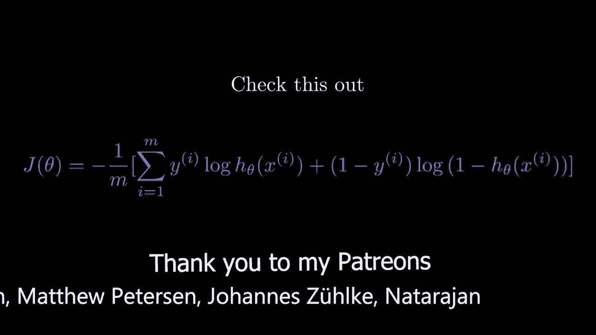
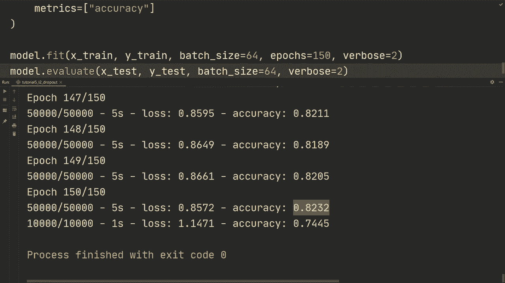

# TensorFlow 教程 P5：L5 - 使用 L2 和 Dropout 添加正则化 🛡️




在本节课中，我们将学习如何为神经网络模型添加正则化，以减少过拟合现象。我们将重点介绍两种常用方法：L2正则化和Dropout。

在上一个视频中，我们构建了一个简单的卷积神经网络。训练时，我们发现训练准确率与测试准确率之间存在较大差距。这种情况被定义为模型对训练数据过拟合。减少过拟合的方法统称为正则化。

有多种正则化方法，例如减少模型容量、添加L2正则化、Dropout、早停或数据增强。本系列教程将在最后探索所有这些方法。本节课，我们将专注于如何在模型中实现L2正则化和Dropout。

## 导入必要的模块

首先，我们需要从TensorFlow导入层模块，并引入正则化器。

```python
from tensorflow.keras import layers, regularizers
```

## 为模型添加L2正则化

L2正则化需要为模型的每一层单独添加。为了简化操作，我们将各层的填充（padding）方式均设置为 `same`。

以下是添加L2正则化的步骤：

1.  在卷积层或全连接层中，设置 `kernel_regularizer` 参数。
2.  使用 `regularizers.l2()` 并指定正则化权重（例如 0.01）。

以下是为各层添加L2正则化的示例代码：

```python
# 示例：为卷积层添加L2正则化
x = layers.Conv2D(32, (3, 3), padding='same', kernel_regularizer=regularizers.l2(0.01))(input_tensor)
x = layers.Activation('relu')(x)
x = layers.BatchNormalization()(x)

# 为后续层重复此过程
x = layers.Conv2D(64, (3, 3), padding='same', kernel_regularizer=regularizers.l2(0.01))(x)
x = layers.Activation('relu')(x)
x = layers.BatchNormalization()(x)

# 为全连接层同样添加L2正则化
x = layers.Dense(128, kernel_regularizer=regularizers.l2(0.01))(x)
x = layers.Activation('relu')(x)
x = layers.BatchNormalization()(x)
```

## 在模型中添加Dropout层

Dropout通过在训练过程中随机“丢弃”一部分神经元连接来防止过拟合。我们通常在层与层之间插入Dropout层。

添加Dropout的步骤如下：

1.  使用 `layers.Dropout()` 层。
2.  指定丢弃率（rate），例如 0.5 表示随机丢弃50%的连接。

以下是添加Dropout层的示例，我们将其插入到全连接层之间：

```python
# 在全连接层后添加Dropout层
x = layers.Dense(128, kernel_regularizer=regularizers.l2(0.01))(x)
x = layers.Activation('relu')(x)
x = layers.BatchNormalization()(x)

# 添加Dropout层
x = layers.Dropout(0.5)(x)

# 继续下一层
x = layers.Dense(num_classes, activation='softmax')(x)
```

## 批量归一化的正则化效果

需要指出的是，我们在模型中使用的批量归一化（Batch Normalization）层，除了能加速训练和稳定学习过程，也具有一定的正则化效果。因此，当前模型实际上结合了三种正则化手段：L2、Dropout和批量归一化。

## 训练模型并观察效果

使用Dropout等正则化方法时，训练时间通常会延长，因为每个训练批次中都有部分连接被禁用。因此，我们将训练周期（epochs）从100次增加到150次。

训练完成后，我们观察到训练准确率约为82%，测试集准确率约为74.5%。与上一个视频的结果（训练准确率93%，测试准确率72%）相比，虽然训练准确率有所下降，但训练准确率与测试准确率之间的差距显著缩小。这表明模型的泛化能力得到了改善，过拟合现象减轻。



## 总结

本节课中，我们一起学习了如何为TensorFlow神经网络模型添加正则化来对抗过拟合。我们具体实践了两种方法：

1.  **L2正则化**：通过向层的 `kernel_regularizer` 参数添加 `regularizers.l2(weight)` 来实现，对权重进行惩罚。
2.  **Dropout**：通过插入 `layers.Dropout(rate)` 层来实现，在训练时随机丢弃神经元连接。


我们还了解到，批量归一化层也附带正则化效果。虽然添加正则化可能会增加训练时间并降低训练集上的准确率，但它能有效提升模型在未见数据（测试集）上的表现，即泛化能力。

本节课内容相对简单直接，演示了添加L2和Dropout的基本步骤。在未来的教程中，我们将探索更多正则化技术。