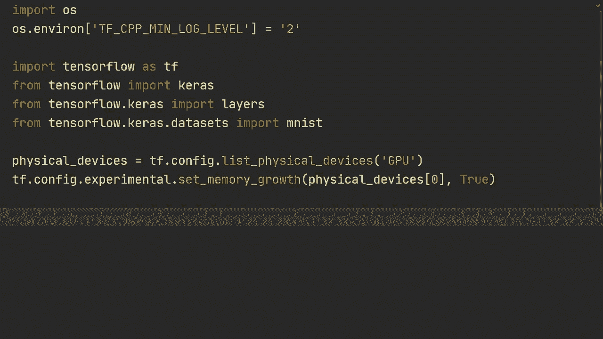
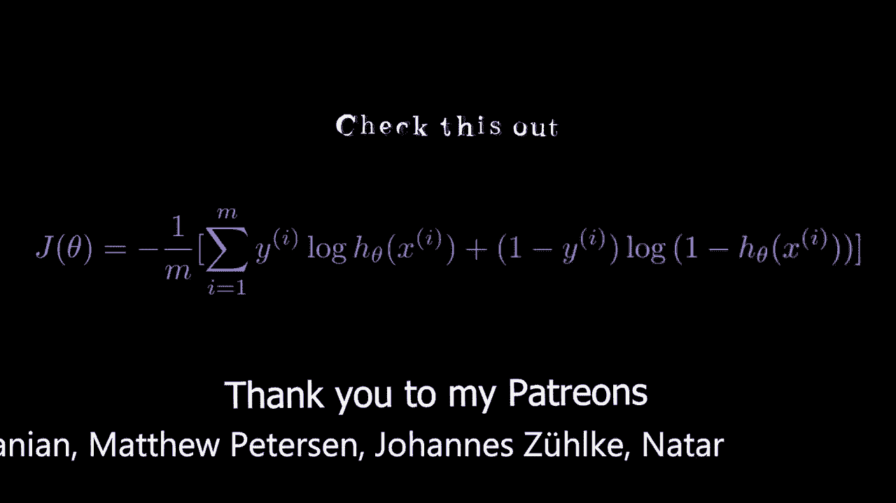
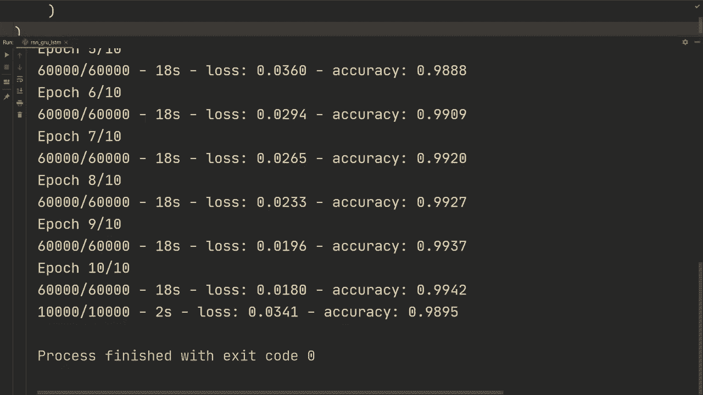

# TensorFlow 教程 P6：L6 - RNN、GRU、LSTM 和双向性 🧠




在本节课中，我们将学习如何在 TensorFlow 中实现循环神经网络（RNN）、门控循环单元（GRU）和长短期记忆网络（LSTM）。我们还会探讨如何为这些网络添加双向性。我们将使用 MNIST 手写数字数据集作为示例，虽然这不是循环神经网络的最佳应用场景，但它能帮助我们清晰地理解这些模型的基本构建方法。



---

## 1. 环境准备与数据加载

首先，我们需要导入必要的库并加载数据。以下代码设置了 TensorFlow 环境并加载了 MNIST 数据集。

```python
import os
os.environ['TF_CPP_MIN_LOG_LEVEL'] = '2'  # 忽略部分 TensorFlow 日志信息
import tensorflow as tf
from tensorflow import keras
from tensorflow.keras import layers

# 加载 MNIST 数据集
(X_train, y_train), (X_test, y_test) = keras.datasets.mnist.load_data()

# 将数据类型转换为 float32 以节省计算资源，并进行归一化处理
X_train = X_train.astype('float32') / 255.0
X_test = X_test.astype('float32') / 255.0
```

在上面的代码中，我们加载了数据，并将像素值从 0-255 的整数范围归一化到 0-1 的浮点数范围，这有助于模型训练。

---

## 2. 理解数据与模型输入

MNIST 图像是 28x28 像素的灰度图。对于循环神经网络，我们将每个时间步的输入视为图像的一行像素。因此，一个样本将被视为一个长度为 28 的时间序列，每个时间步的输入是一个包含 28 个像素值的向量。

需要明确的是，处理图像数据通常使用卷积神经网络（CNN）效果更好。我们在此使用 RNN 系列模型主要是为了演示其实现方法。

---

## 3. 构建简单的 RNN 模型

现在，我们开始构建第一个模型——一个简单的两层 RNN。

```python
# 使用 Keras Sequential API 构建模型
model = keras.Sequential([
    # 第一层 SimpleRNN，设置 return_sequences=True 以连接下一层 RNN
    layers.SimpleRNN(512, return_sequences=True, activation='relu', input_shape=(None, 28)),
    # 第二层 SimpleRNN，不返回序列，只输出最后一个时间步的隐藏状态
    layers.SimpleRNN(512, activation='relu'),
    # 输出层，10个节点对应10个数字类别
    layers.Dense(10)
])

# 打印模型结构摘要
model.summary()
```

**模型结构说明**：
*   第一层 `SimpleRNN` 有 512 个单元，`return_sequences=True` 确保它输出每个时间步的隐藏状态，以供下一层 RNN 使用。
*   第二层 `SimpleRNN` 没有设置 `return_sequences=True`，因此它只输出处理完整个序列后的最终隐藏状态。
*   最后的 `Dense` 层将这个隐藏状态映射到 10 个类别的输出。

---

## 4. 编译与训练模型

构建好模型后，我们需要编译它，指定损失函数、优化器和评估指标，然后在数据上进行训练。

```python
# 编译模型
model.compile(
    loss=keras.losses.SparseCategoricalCrossentropy(from_logits=True), # 输出层未使用 softmax
    optimizer=keras.optimizers.Adam(learning_rate=0.001),
    metrics=['accuracy']
)

# 在训练集上训练模型
model.fit(X_train, y_train, batch_size=64, epochs=10, verbose=2)

# 在测试集上评估模型
test_loss, test_acc = model.evaluate(X_test, y_test, batch_size=64, verbose=2)
print(f"测试集准确率: {test_acc}")
```

运行 10 个周期后，该简单 RNN 模型在测试集上能达到接近 98% 的准确率。请注意，RNN 的默认激活函数是 `tanh`，我们在此例中使用了 `relu`。

---

## 5. 构建 GRU 模型

门控循环单元（GRU）是 RNN 的一种变体，它通过门控机制更好地捕捉长期依赖关系。在 TensorFlow 中，将 `SimpleRNN` 层替换为 `GRU` 层非常简单。

```python
# 构建 GRU 模型，单元数减少到 256 以加快演示速度
gru_model = keras.Sequential([
    layers.GRU(256, return_sequences=True, activation='tanh', input_shape=(None, 28)),
    layers.GRU(256, activation='tanh'),
    layers.Dense(10)
])

# 编译与训练（代码同上）
gru_model.compile(...)
gru_model.fit(...)
gru_model.evaluate(...)
```

使用两层 GRU（每层 256 个单元）并在 10 个周期后，模型在测试集上的准确率接近 99%，性能优于之前的简单 RNN。

---

## 6. 构建 LSTM 模型

长短期记忆网络（LSTM）是另一种广泛使用的 RNN 变体。其构建方式与 GRU 类似。

```python
# 构建 LSTM 模型
lstm_model = keras.Sequential([
    layers.LSTM(256, return_sequences=True, activation='tanh', input_shape=(None, 28)),
    layers.LSTM(256, activation='tanh'),
    layers.Dense(10)
])

# 编译与训练（代码同上）
lstm_model.compile(...)
lstm_model.fit(...)
lstm_model.evaluate(...)
```

在此示例中，LSTM 的表现与 GRU 相当，测试准确率也接近 99%。GRU 和 LSTM 的性能通常相似，LSTM 在某些任务上可能略有优势。

---

## 7. 添加双向性

双向循环网络让模型在每个时间步不仅能获取过去的信息，还能获取未来的信息。在 TensorFlow 中，使用 `Bidirectional` 包装器可以轻松实现。

```python
# 构建双向 LSTM 模型
bidirectional_lstm_model = keras.Sequential([
    # 用 Bidirectional 包装 LSTM 层
    layers.Bidirectional(layers.LSTM(256, return_sequences=True, activation='tanh'), input_shape=(None, 28)),
    layers.Bidirectional(layers.LSTM(256, activation='tanh')),
    layers.Dense(10)
])

# 打印模型摘要，注意参数数量会翻倍
bidirectional_lstm_model.summary()

# 编译与训练（代码同上）
bidirectional_lstm_model.compile(...)
bidirectional_lstm_model.fit(...)
bidirectional_lstm_model.evaluate(...)
```

**关键点**：当使用 `Bidirectional` 包装器时，例如包装一个 256 单元的 LSTM，实际输出的特征维度会变为 512（前向 256 + 后向 256）。在这个 MNIST 示例中，双向性并未显著提升性能，但对于许多序列任务（如自然语言处理），使用双向层是一个很好的默认选择。

---

## 总结



本节课中，我们一起学习了如何在 TensorFlow 中实现三种主要的循环神经网络：**SimpleRNN**、**GRU** 和 **LSTM**。我们了解了如何通过 `return_sequences` 参数来堆叠多层 RNN，以及如何使用 `Bidirectional` 包装器来构建能同时利用过去和未来信息的双向网络。虽然我们使用图像数据作为序列输入进行演示，但这些代码框架完全适用于文本、时间序列等真正的序列数据。对于更复杂的真实数据，还需要考虑填充（Padding）和掩码（Masking）等技术，我们将在后续课程中探讨。