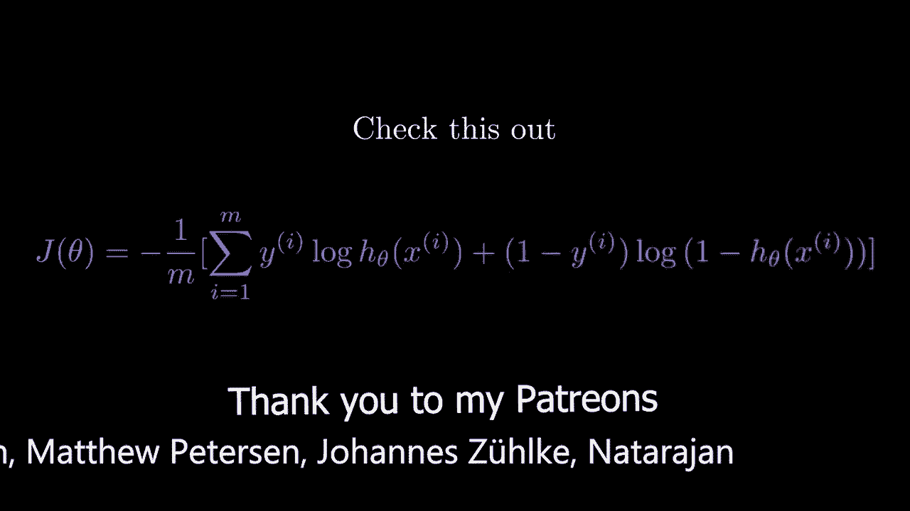
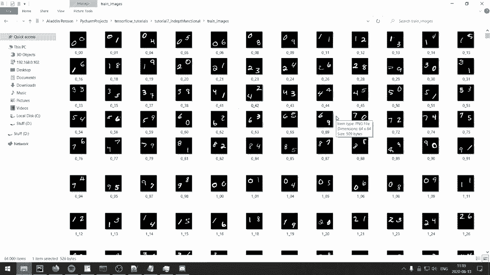
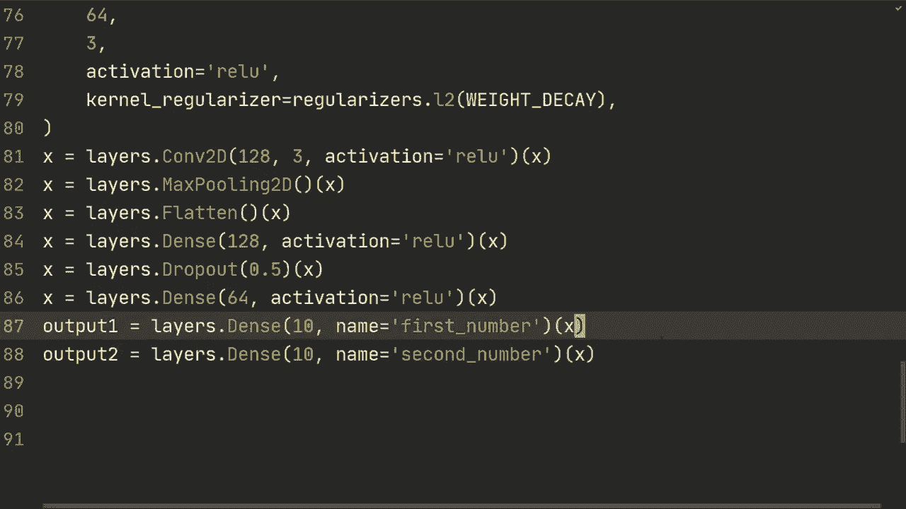
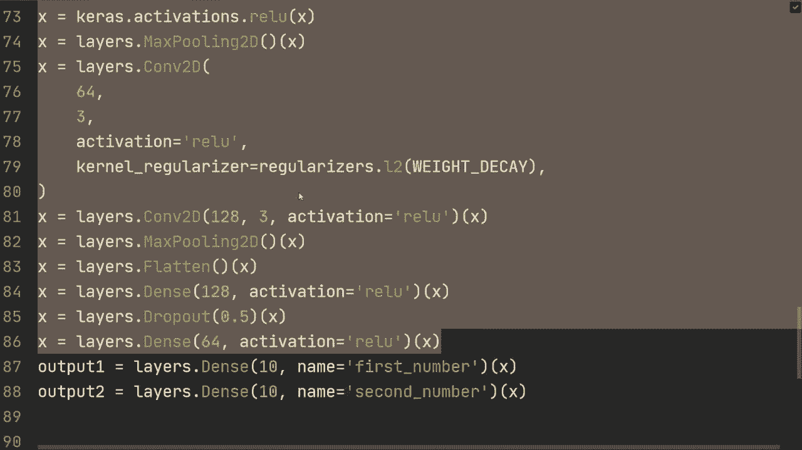
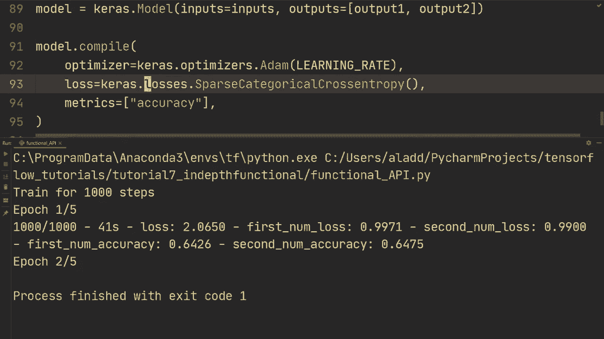

# TensorFlow 教程 P7：🚀 函数式 API 更深入示例



在本节课中，我们将学习如何使用 TensorFlow 的函数式 API 构建一个处理多输出任务的神经网络模型。我们将通过一个具体的例子——识别一张图片中的两个手写数字——来展示函数式 API 在顺序模型无法胜任的场景下的强大之处。

---

## 概述与背景

在之前的课程中，我们介绍了顺序模型和函数式 API 的基本用法。然而，之前的示例实际上都可以用顺序模型完成。本节我们将探讨一个必须使用函数式 API 的场景：构建一个具有**多个输出**的模型。我们将使用修改版的 MNIST 数据集，其中每个样本包含两个数字，目标是同时识别出这两个数字。

## 1. 准备数据与环境



首先，我们需要导入必要的库并设置一些超参数。数据加载部分在本教程中不是重点，我们会使用一段预设代码来完成。

```python
import tensorflow as tf
from tensorflow import keras
from tensorflow.keras import layers, regularizers
import pandas as pd

# 设置超参数
BATCH_SIZE = 64
WEIGHT_DECAY = 0.001
LEARNING_RATE = 0.001
```

以下是加载数据的代码（具体数据加载细节将在后续课程中详解）：

```python
# 假设数据已通过 pandas 从 CSV 文件加载，并转换为 tf.data.Dataset 格式
# 此处为示意代码
def load_data():
    # ... 数据加载逻辑 ...
    return train_dataset, test_dataset

train_dataset, test_dataset = load_data()
```

## 2. 构建多输出模型

上一节我们介绍了函数式 API 的基础，本节中我们来看看如何用它构建一个具有两个分支输出的模型。关键在于定义多个输出层，并将它们与同一个输入连接起来。

首先，我们定义模型的输入层。输入是 64x64 像素的灰度图像。

```python
inputs = keras.Input(shape=(64, 64, 1))
x = inputs
```

接着，我们构建一个卷积神经网络作为共享的特征提取器。

```python
# 第一个卷积块
x = layers.Conv2D(32, 3, padding='same', kernel_regularizer=regularizers.l2(WEIGHT_DECAY))(x)
x = layers.BatchNormalization()(x)
x = layers.Activation('relu')(x)

# 第二个卷积块
x = layers.Conv2D(64, 3, padding='same', kernel_regularizer=regularizers.l2(WEIGHT_DECAY))(x)
x = layers.BatchNormalization()(x)
x = layers.Activation('relu')(x)
x = layers.MaxPooling2D()(x)

# 第三个卷积块
x = layers.Conv2D(64, 3, padding='same', kernel_regularizer=regularizers.l2(WEIGHT_DECAY))(x)
x = layers.Activation('relu')(x)

# 第四个卷积块
x = layers.Conv2D(128, 3, padding='same', kernel_regularizer=regularizers.l2(WEIGHT_DECAY))(x)
x = layers.Activation('relu')(x)
x = layers.MaxPooling2D()(x)

# 展平并接入全连接层
x = layers.Flatten()(x)
x = layers.Dense(128, activation='relu')(x)
x = layers.Dropout(0.5)(x)
x = layers.Dense(64, activation='relu')(x)
```

现在，我们从共享的特征 `x` 中分出两个独立的输出层，分别预测第一个和第二个数字。

```python
# 第一个数字的输出分支
digit1_output = layers.Dense(10, activation='softmax', name='digit1')(x)





# 第二个数字的输出分支
digit2_output = layers.Dense(10, activation='softmax', name='digit2')(x)
```

最后，我们使用 `keras.Model` 将输入和两个输出定义为一个完整的模型。

```python
model = keras.Model(inputs=inputs, outputs=[digit1_output, digit2_output])
```

## 3. 编译与训练模型

模型构建完成后，我们需要编译它。对于多输出模型，我们需要为每个输出指定损失函数和评估指标。

以下是编译模型的步骤：

```python
model.compile(
    optimizer=keras.optimizers.Adam(learning_rate=LEARNING_RATE),
    loss={
        'digit1': 'sparse_categorical_crossentropy',
        'digit2': 'sparse_categorical_crossentropy'
    },
    metrics=['accuracy']
)
```

现在，我们可以使用准备好的数据对模型进行训练。

```python
# 假设 train_dataset 已准备好
history = model.fit(
    train_dataset,
    epochs=5,
    validation_data=test_dataset,
    verbose=2
)
```

## 4. 评估与结果分析

训练完成后，我们评估模型在测试集上的性能。

```python
test_results = model.evaluate(test_dataset, verbose=2)
print(f"测试集损失: {test_results[0]}")
print(f"第一个数字准确率: {test_results[3]}")
print(f"第二个数字准确率: {test_results[4]}")
```

在本例的初步训练中，模型在训练集上对两个数字的识别准确率均达到约 96%。在测试集上，第一个数字的准确率约为 90%，第二个数字约为 83%。这表明模型具备同时处理多任务的能力，但可能存在过拟合或第二个任务更复杂的情况。

一个实用的技巧是，可以为两个输出指定同一个损失函数名称，编译器会自动将其应用于所有同名输出，从而使代码更简洁。

```python
# 更简洁的损失函数指定方式
model.compile(
    optimizer='adam',
    loss='sparse_categorical_crossentropy',  # 自动应用于所有输出
    metrics=['accuracy']
)
```

## 总结



本节课中我们一起学习了 TensorFlow 函数式 API 的一个关键应用：构建多输出神经网络模型。我们通过一个识别双数字图片的例子，演示了如何从单一输入创建共享特征层，并分支为两个独立的输出。这种方法在需要模型同时完成多项预测任务时非常有用，是顺序模型无法替代的。记住，函数式 API 的核心优势在于其构建复杂模型拓扑结构的灵活性。