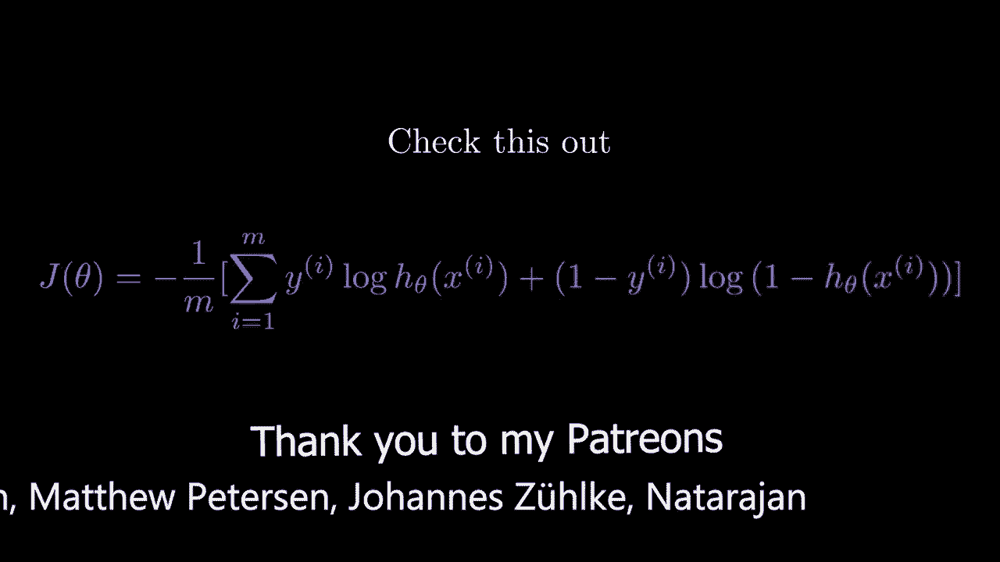
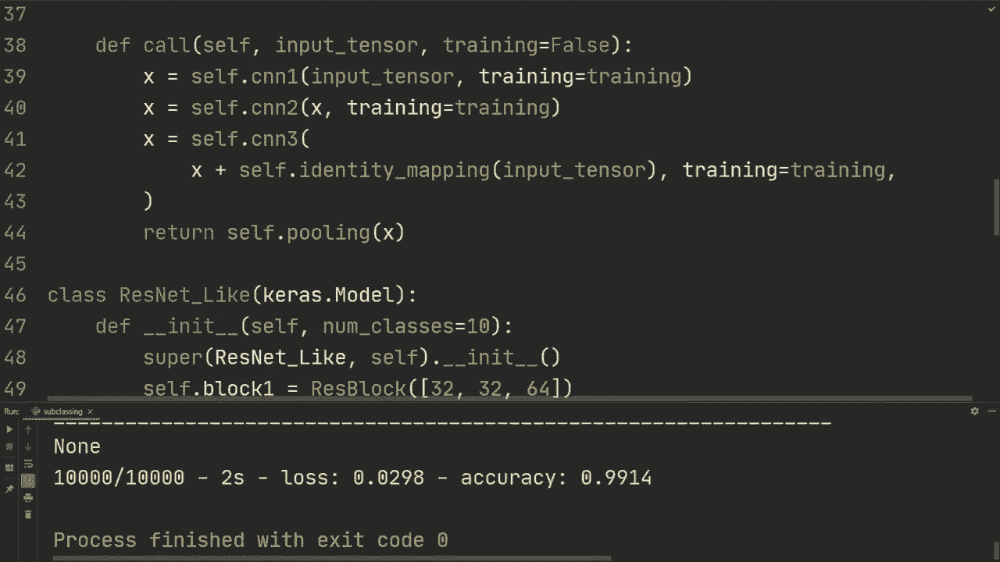

# TensorFlow 教程 P8：使用 Keras 进行模型子类化 🧱



在本节课中，我们将学习如何使用 Keras 的模型子类化（Model Subclassing）方法来构建深度学习模型。这是一种极其灵活的方法，允许你像使用 PyTorch 一样，以面向对象的方式自定义模型的每一层和前向传播逻辑。

---

## 概述

到目前为止，我们已经接触了两种构建模型的方法：**顺序 API**（简单但灵活性小）和**函数式 API**（提供了更多灵活性）。本节课，我们将迈出下一步，学习最灵活的构建方法——**模型子类化**。我们将通过创建一个可复用的卷积块、一个残差块，并最终构建一个类 ResNet 的模型来掌握这一方法。

---

## 环境准备与数据加载

首先，我们导入必要的库并加载 MNIST 数据集。这些步骤与之前的课程类似。

```python
import os
os.environ['TF_CPP_MIN_LOG_LEVEL'] = '3'  # 忽略 TensorFlow 信息消息
import tensorflow as tf
from tensorflow import keras
from tensorflow.keras import layers

# 加载 MNIST 数据集
(x_train, y_train), (x_test, y_test) = keras.datasets.mnist.load_data()

# 数据预处理：调整形状、转换数据类型、归一化
x_train = x_train.reshape(-1, 28, 28, 1).astype('float32') / 255.0
x_test = x_test.reshape(-1, 28, 28, 1).astype('float32') / 255.0
```

---

## 构建可复用的卷积块 (CNN Block)

上一节我们完成了数据准备。本节中，我们来看看如何创建一个可复用的基础构建块。

假设我们需要多次使用“卷积层 -> 批归一化 -> ReLU激活”这个结构。为了避免重复代码，我们可以将其封装成一个类。

以下是 `CNNBlock` 类的定义：

```python
class CNNBlock(layers.Layer):
    def __init__(self, out_channels, kernel_size=3):
        super(CNNBlock, self).__init__()
        self.conv = layers.Conv2D(out_channels, kernel_size, padding='same')
        self.bn = layers.BatchNormalization()

    def call(self, input_tensor, training=False):
        x = self.conv(input_tensor)
        x = self.bn(x, training=training)
        x = tf.nn.relu(x)
        return x
```

**代码解释**：
*   `__init__` 方法：初始化时定义该块所包含的层（Conv2D 和 BatchNormalization）。
*   `call` 方法：定义了数据的前向传播路径。`training` 参数用于控制批归一化层在训练和评估模式下的不同行为。

现在，我们可以像使用标准 Keras 层一样，在顺序模型中轻松使用这个块：

```python
model = keras.Sequential([
    CNNBlock(32),
    CNNBlock(64),
    CNNBlock(128),
    layers.Flatten(),
    layers.Dense(10)
])
```

我们可以编译并训练这个模型，其效果与手动堆叠各层相同，但代码更加简洁。

---

## 构建残差块 (ResBlock)

学会了创建基础块后，我们可以构建更复杂的结构。本节我们将创建一个类似 ResNet 中使用的残差块（ResBlock）。

残差块的核心思想是引入“跳跃连接”（skip connection），将输入直接加到某一层的输出上，这有助于解决深层网络中的梯度消失问题。

以下是 `ResBlock` 类的定义：

```python
class ResBlock(layers.Layer):
    def __init__(self, channels):
        super(ResBlock, self).__init__()
        # 创建三个 CNNBlock
        self.cnn1 = CNNBlock(channels[0])
        self.cnn2 = CNNBlock(channels[1])
        self.cnn3 = CNNBlock(channels[2])
        # 跳跃连接中的 1x1 卷积，用于调整通道数
        self.identity_mapping = layers.Conv2D(channels[1], kernel_size=1, padding='same')
        self.pool = layers.MaxPool2D()

    def call(self, input_tensor, training=False):
        x = self.cnn1(input_tensor, training=training)
        x = self.cnn2(x, training=training)
        x = self.cnn3(x, training=training)
        # 跳跃连接：将原始输入调整通道后加到中间结果上
        identity = self.identity_mapping(input_tensor, training=training)
        x = x + identity
        x = self.pool(x)
        return x
```

**核心概念**：跳跃连接的公式可以表示为：
`输出 = F(x) + x`
其中 `F(x)` 代表残差块中学到的变换，`x` 是恒等映射（identity mapping）。在我们的实现中，使用 1x1 卷积来确保 `x` 的通道数与 `F(x)` 匹配。

---

## 构建完整的子类化模型 (ResNet)

现在，我们有了强大的基础块和残差块。本节我们将把这些组件组装成一个完整的、继承自 `keras.Model` 的模型。

继承 `keras.Model`（而非 `layers.Layer`）可以让我们的模型自动拥有 `.fit()`, `.evaluate()`, `.summary()` 等便捷方法。

以下是自定义 `ResNet` 模型类的定义：

```python
class ResNet(keras.Model):
    def __init__(self, num_classes=10):
        super(ResNet, self).__init__()
        # 使用三个不同配置的残差块
        self.block1 = ResBlock([32, 32, 64])
        self.block2 = ResBlock([128, 128, 256])
        self.block3 = ResBlock([128, 256, 512])
        # 全局平均池化层，替代 Flatten
        self.pool = layers.GlobalAveragePooling2D()
        # 分类层
        self.classifier = layers.Dense(num_classes)

    def call(self, input_tensor, training=False):
        x = self.block1(input_tensor, training=training)
        x = self.block2(x, training=training)
        x = self.block3(x, training=training)
        x = self.pool(x)
        x = self.classifier(x)
        return x

    # 为了能正确显示模型摘要（summary），可以定义 build_graph 方法
    def build_graph(self, input_shape):
        input_ = tf.keras.Input(shape=input_shape)
        return tf.keras.Model(inputs=[input_], outputs=self.call(input_))
```

**代码解释**：
*   在 `__init__` 中，我们组合了之前定义好的模块。
*   `call` 方法清晰地定义了数据从输入到输出的完整路径。
*   `build_graph` 是一个实用方法，它能帮助我们正确打印出模型各层的输出形状。

现在，我们可以实例化、编译和训练这个模型：

```python
# 实例化模型
model = ResNet(num_classes=10)

# 编译模型
model.compile(optimizer='adam',
              loss=keras.losses.SparseCategoricalCrossentropy(from_logits=True),
              metrics=['accuracy'])

# 训练模型
model.fit(x_train, y_train, batch_size=64, epochs=20, verbose=2)

# 评估模型
test_loss, test_acc = model.evaluate(x_test, y_test, verbose=2)
print(f'\n测试准确率: {test_acc}')
```

使用子类化方法，我们构建了一个参数量超过300万的深层网络。经过训练，该模型在 MNIST 测试集上可以达到约 **99.1%** 的准确率。这种方法的最大优势在于其**极高的灵活性**和**代码的模块化**。你可以轻松插入打印语句进行调试，或者实现任何你能想象到的复杂网络结构。

---

## 总结

本节课中，我们一起学习了 Keras 模型子类化的强大功能：

1.  **创建自定义层**：我们通过继承 `layers.Layer` 类，封装了 `CNNBlock`，实现了代码的复用。
2.  **构建复杂模块**：我们利用基础块构建了带有跳跃连接的 `ResBlock`，模仿了 ResNet 的核心思想。
3.  **组装完整模型**：我们通过继承 `keras.Model` 类，将多个模块组合成最终的 `ResNet` 模型，并享受了内置训练/评估流程的便利。



模型子类化提供了无与伦比的灵活性，让你能够以面向对象和极其直观的方式构建复杂的神经网络架构，特别适合研究性工作和实现非标准模型结构。在接下来的课程中，我们还将探索如何使用子类化创建更底层的自定义层。