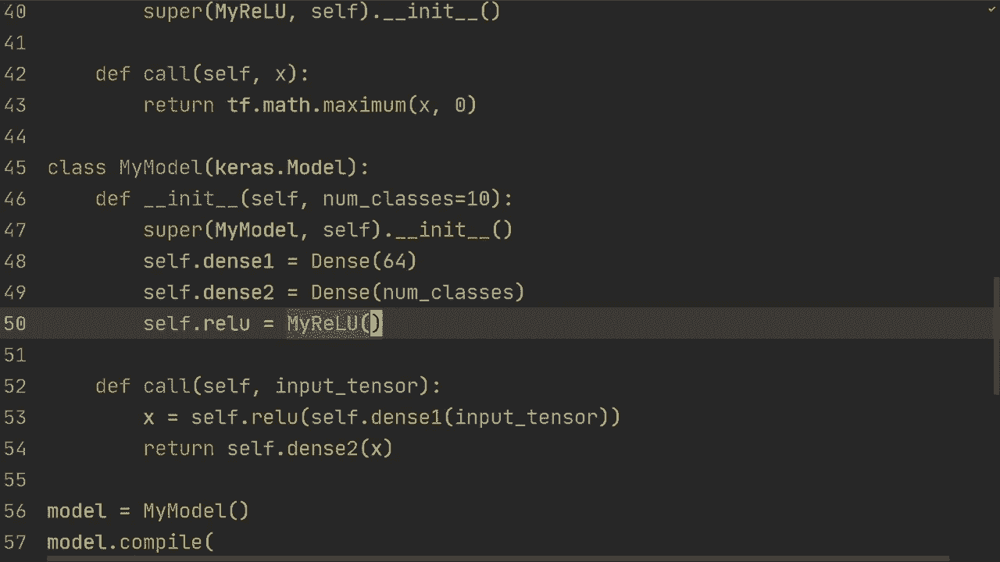

# TensorFlow 教程 P9：L9- 自定义图层 🧱


在本节课中，我们将学习如何创建自定义的神经网络层。通过子类化 `tf.keras.layers.Layer`，我们可以构建完全由自己定义的层，从而更深入地理解模型的内部工作机制。

## 概述

在前面的课程中，我们学习了如何使用模型子类化来构建灵活的模型。本节课，我们将更进一步，学习如何从零开始创建自定义的层，包括一个全连接层（Dense Layer）和一个激活函数层（ReLU）。我们将看到如何定义层的参数（如权重和偏置）以及前向传播的逻辑。

---

## 回顾：使用子类化构建自定义模型

上一节我们介绍了如何使用模型子类化。本节中，我们来看看如何在此基础上创建自定义层。首先，让我们快速回顾一个使用内置层构建的简单自定义模型。

```python
import tensorflow as tf
from tensorflow import keras

# 避免GPU相关错误
physical_devices = tf.config.list_physical_devices('GPU')
if physical_devices:
    tf.config.experimental.set_memory_growth(physical_devices[0], True)

# 加载MNIST数据
(x_train, y_train), (x_test, y_test) = keras.datasets.mnist.load_data()
x_train, x_test = x_train / 255.0, x_test / 255.0
x_train = x_train.reshape(-1, 784)
x_test = x_test.reshape(-1, 784)

# 自定义模型类
class MyModel(keras.Model):
    def __init__(self, num_classes=10):
        super(MyModel, self).__init__()
        self.dense1 = keras.layers.Dense(64)
        self.dense2 = keras.layers.Dense(num_classes)

    def call(self, inputs):
        x = self.dense1(inputs)
        x = tf.nn.relu(x)
        return self.dense2(x)

# 构建、编译和训练模型
model = MyModel()
model.compile(loss=keras.losses.SparseCategoricalCrossentropy(from_logits=True),
              optimizer='adam',
              metrics=['accuracy'])
model.fit(x_train, y_train, epochs=5, validation_data=(x_test, y_test))
```

这个模型工作得很好，但它使用的是TensorFlow内置的 `Dense` 层和 `tf.nn.relu` 函数。接下来，我们将学习如何自己创建这些层。

---

## 创建自定义全连接层（Dense Layer）

现在，我们将创建一个自定义的全连接层。这个层需要完成两件事：在初始化时创建可训练的权重和偏置，并在前向传播时执行矩阵乘法和加法。

以下是创建自定义 `Dense` 层的步骤：

1.  继承 `keras.layers.Layer` 类。
2.  在 `__init__` 方法中定义层的基本属性（如输出单元数）。
3.  使用 `build` 方法根据输入形状创建权重。这是一种“惰性”创建参数的方式，使我们无需在初始化时指定输入维度。
4.  在 `call` 方法中定义前向传播逻辑。

```python
class Dense(keras.layers.Layer):
    def __init__(self, units):
        super(Dense, self).__init__()
        self.units = units  # 定义层的输出单元数

    def build(self, input_shape):
        # 根据输入形状创建权重矩阵 W 和偏置向量 b
        # input_shape[-1] 是输入的最后一个维度（即特征数）
        self.W = self.add_weight(name='W',
                                 shape=(input_shape[-1], self.units),
                                 initializer='random_normal',
                                 trainable=True)
        self.b = self.add_weight(name='b',
                                 shape=(self.units,),
                                 initializer='zeros',
                                 trainable=True)

    def call(self, inputs):
        # 前向传播：y = inputs * W + b
        return tf.matmul(inputs, self.W) + self.b
```

现在，我们可以在自定义模型中使用这个层：

```python
class MyModelWithCustomDense(keras.Model):
    def __init__(self, num_classes=10):
        super(MyModelWithCustomDense, self).__init__()
        self.dense1 = Dense(64)  # 使用自定义Dense层
        self.dense2 = Dense(num_classes)

    def call(self, inputs):
        x = self.dense1(inputs)
        x = tf.nn.relu(x)
        return self.dense2(x)
```

---

## 创建自定义激活函数层（ReLU Layer）

除了全连接层，我们也可以将激活函数封装成一个自定义层。虽然通常我们使用函数式API，但将其定义为层可以保持代码风格的一致性。

以下是创建一个简单的 `MyReLU` 层的方法：

```python
class MyReLU(keras.layers.Layer):
    def __init__(self):
        super(MyReLU, self).__init__()

    def call(self, inputs):
        # ReLU 激活函数：f(x) = max(0, x)
        return tf.math.maximum(inputs, 0)
```

现在，我们可以用自定义的 `Dense` 层和 `MyReLU` 层来构建一个完整的模型：

```python
class FullyCustomModel(keras.Model):
    def __init__(self, num_classes=10):
        super(FullyCustomModel, self).__init__()
        self.dense1 = Dense(64)
        self.relu = MyReLU()  # 使用自定义ReLU层
        self.dense2 = Dense(num_classes)

    def call(self, inputs):
        x = self.dense1(inputs)
        x = self.relu(x)  # 应用自定义ReLU
        return self.dense2(x)

# 使用完全自定义的模型进行训练
custom_model = FullyCustomModel()
custom_model.compile(loss=keras.losses.SparseCategoricalCrossentropy(from_logits=True),
                     optimizer='adam',
                     metrics=['accuracy'])
custom_model.fit(x_train, y_train, epochs=5, validation_data=(x_test, y_test))
```

---

## 总结

本节课中，我们一起学习了如何创建自定义的TensorFlow层。

*   我们首先回顾了使用模型子类化构建网络的方法。
*   接着，我们深入探讨了如何通过子类化 `keras.layers.Layer` 来创建自定义层。
*   我们实现了一个自定义的 `Dense` 层，它能够惰性地根据输入形状创建权重和偏置。
*   最后，我们还创建了一个自定义的 `MyReLU` 激活函数层。



通过自己构建这些基础组件，你能够更深刻地理解神经网络层的内部工作原理，并且有能力为更复杂的任务设计专属的层结构。你可以尝试在此基础上构建卷积层、循环层或任何你需要的特殊层。