# PyTorch 入门教程 P1：🚀 PyTorch 简介


在本节课中，我们将学习 PyTorch 的基本概念、核心组件及其生态系统。我们将从张量开始，逐步了解自动微分、模型构建、数据加载、训练循环以及模型部署。

---

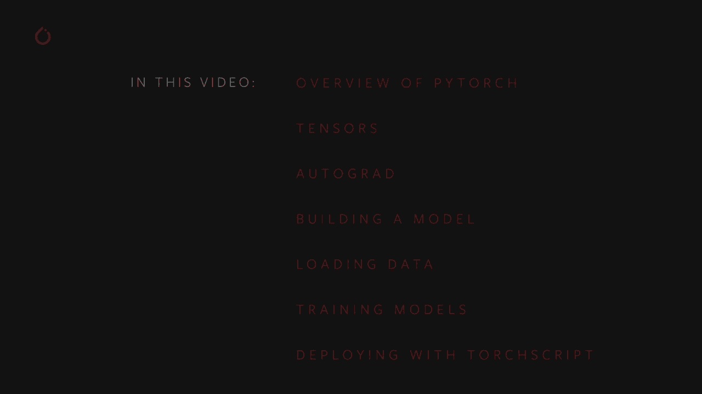

## 📦 安装与环境准备

在开始之前，你需要安装 PyTorch 和 torchvision 以跟随本教程的演示和练习。

如果你尚未安装最新版本的 PyTorch，请访问 [PyTorch.org](https://pytorch.org)。首页提供了一个安装向导。

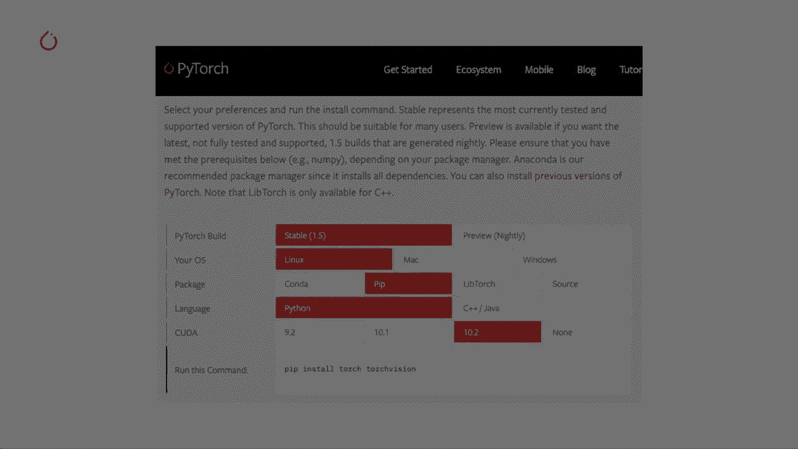

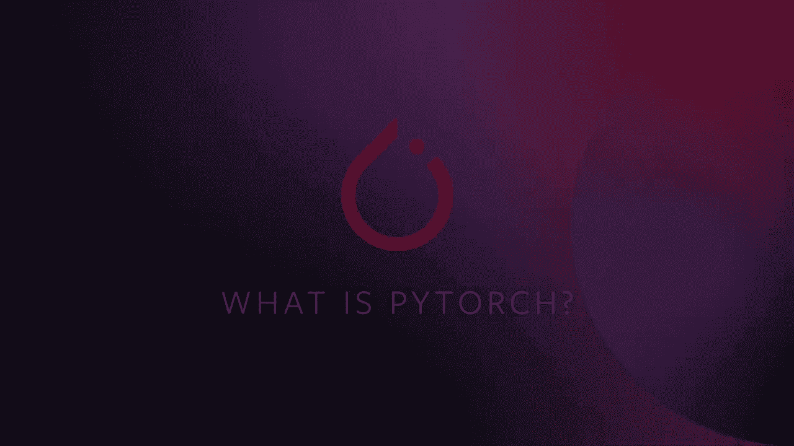

以下是两个重要注意事项：
1.  Mac 系统不提供 CUDA 支持，因此无法使用 GPU 加速。
2.  如果你在配备一个或多个 NVIDIA CUDA 兼容 GPU 的 Linux 或 Windows 机器上工作，请确保安装的 CUDA 工具包版本与机器上的 CUDA 驱动程序版本匹配。

---

## 🤔 什么是 PyTorch？

PyTorch 是一个开源的机器学习框架，旨在加速从研究原型到生产部署的路径。

具体来说：
*   **PyTorch 是机器学习软件**：它包含构建和部署机器学习应用程序的完整工具包，包括神经网络层、激活函数和基于梯度的优化器等深度学习基本元素。
*   **支持硬件加速**：它可以在 NVIDIA GPU 上进行硬件加速。
*   **丰富的库生态系统**：它拥有与计算机视觉（torchvision）、文本、自然语言处理和音频应用相关的库。
*   **快速迭代**：你可以在常规 Python 环境中工作，无需学习新的领域特定语言来构建计算图。
*   **灵活的自动微分**：PyTorch 的自动微分引擎（autograd）通过单个函数调用处理模型的反向传播，无论计算路径如何，都提供了无与伦比的模型设计灵活性。
*   **企业级工具**：例如 TorchScript（用于创建可序列化和可优化的模型）、TorchServe（模型服务解决方案）以及多种模型量化选项。
*   **免费开源**：PyTorch 是免费的开源软件，拥有活跃的社区贡献。

PyTorch 的开源特性催生了一个丰富的社区项目生态系统，支持从随机过程到基于图的神经网络等各种用例。其社区庞大且不断增长，拥有超过 1200 名全球贡献者，研究论文引用年增长率超过 50%。

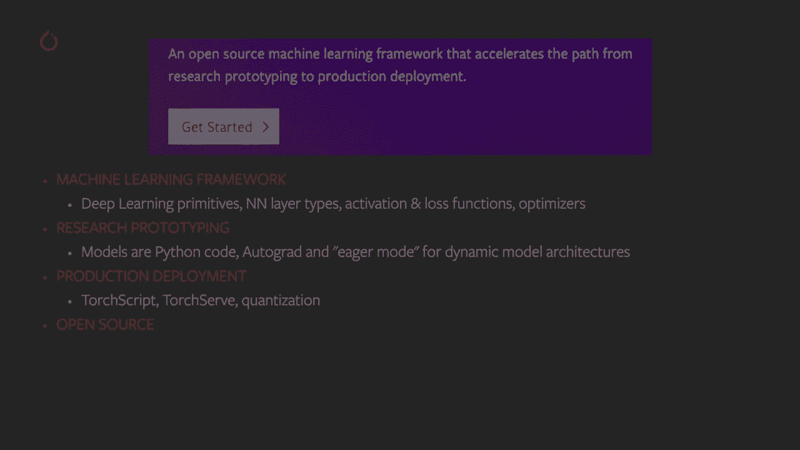

许多顶级公司和项目都基于 PyTorch 构建，例如：
*   **AllenNLP**：专注于自然语言处理的开源深度学习研究库。
*   **fast.ai**：简化了使用现代最佳实践进行快速、准确的神经网络训练。
*   **Classy Vision**：用于图像和视频分类的端到端框架。
*   **Captum**：帮助你理解和解释模型行为的开源可扩展库。

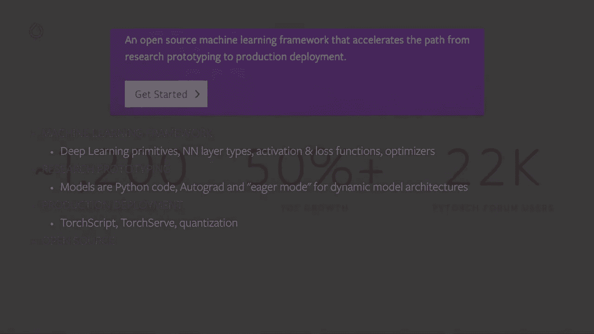

---

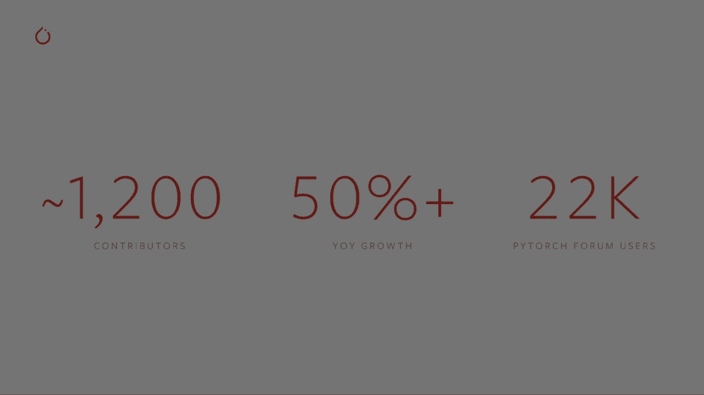

## 🔢 张量：PyTorch 的核心

张量是你在 PyTorch 中进行所有操作的核心数据结构。你的模型、输入、输出和学习权重都以张量的形式存在。

在这个上下文中，张量可以被理解为**多维数组**，但附带了许多额外的特性。PyTorch 张量支持超过 300 种数学和逻辑操作。尽管你通过 Python API 访问张量，但计算实际上是在为 CPU 和 GPU 优化的编译 C++ 代码中执行的。


上一节我们介绍了 PyTorch 的概览，本节中我们来看看其核心数据结构——张量的基本操作。

以下是 PyTorch 中一些典型的张量操作示例：


首先，导入 PyTorch：
```python
import torch
```

**创建张量**
```python
# 创建一个 5行3列 的二维张量，并用零填充
zeros_tensor = torch.zeros(5, 3)
print(zeros_tensor)
print(zeros_tensor.dtype) # 默认数据类型为 torch.float32
```
```python
# 创建一个充满 1 的张量，并指定数据类型为 16 位整数
int_tensor = torch.ones(5, 3, dtype=torch.int16)
print(int_tensor)
```

**随机初始化**
通常会使用特定的随机种子来初始化学习权重，以确保结果可重现。
```python
# 设置随机种子
torch.manual_seed(1729)
random1 = torch.rand(2, 3)
print(random1)

# 生成第二个随机张量（预期与第一个不同）
random2 = torch.rand(2, 3)
print(random2)

# 重新设置相同的种子，生成第三个随机张量（预期与第一个相同）
torch.manual_seed(1729)
random3 = torch.rand(2, 3)
print(random3)
# random1 和 random3 相同，random2 不同
```

**算术操作**
相似形状的张量可以进行按元素操作，标量与张量的操作会分布到张量的每个元素上。
```python
# 创建张量
ones = torch.ones(2, 2)
twos = torch.ones(2, 2) * 2
# 按元素相加
threes = ones + twos
print(threes)
print(threes.shape) # 形状与输入相同

# 尝试不同形状的张量相加会引发错误
a = torch.rand(2, 3)
b = torch.rand(3, 2)
# result = a + b # 这会引发 RuntimeError
```

**数学与统计操作**
PyTorch 张量支持丰富的数学操作。
```python
x = torch.rand(5, 5) * 2 - 1 # 值在 -1 到 1 之间
print(x)
print(torch.abs(x))   # 绝对值
print(torch.asin(x))  # 反正弦
print(torch.det(x))   # 行列式（仅方阵）
print(x.mean())       # 均值
print(x.std())        # 标准差
print(x.min())        # 最小值
```

关于 PyTorch 张量的更多功能，包括如何为 GPU 并行计算设置它们，我们将在后续教程中深入讨论。

---

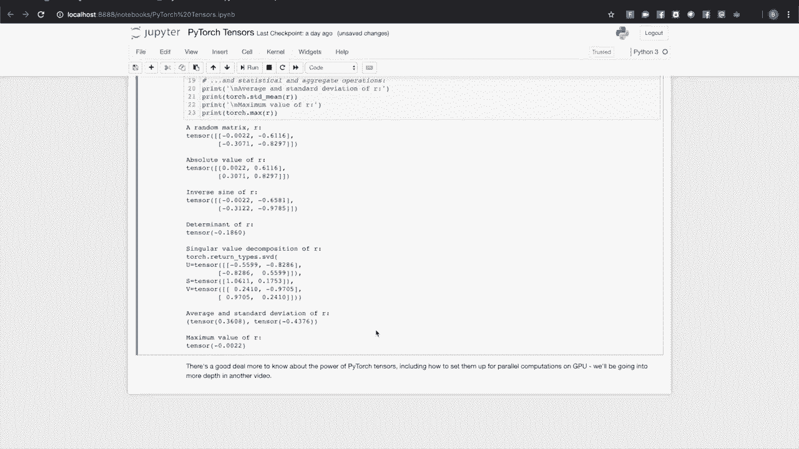

## 🤖 自动微分（Autograd）

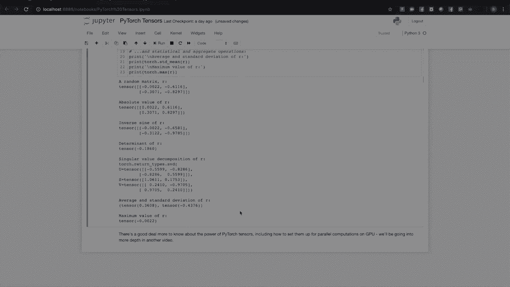

作为对自动微分的介绍，我们来考虑一次单一训练迭代的基本机制。我们将使用一个简单的循环神经网络（RNN）作为例子。

过程如下：
1.  我们有四个张量：输入 `X`、隐藏状态 `H`，以及两组学习权重 `W_x` 和 `W_h`。
2.  将权重与各自的张量相乘：`i2h = torch.mm(W_x, X)`， `h2h = torch.mm(W_h, H)`。
3.  将两个结果相加：`combined = i2h + h2h`。
4.  将结果通过激活函数（如 `tanh`）：`next_h = torch.tanh(combined)`。
5.  计算损失：`loss = criterion(next_h, target)`。

在训练循环中，我们需要计算损失相对于模型每个参数的梯度，并利用这些梯度来调整权重以减少损失。即使对于这个小模型，也需要计算大量导数。

好消息是，在 PyTorch 中，你可以用一行代码完成反向传播：`loss.backward()`。每个由计算生成的张量都记录了自己的计算历史（例如，`i2h` 知道它来自 `W_x` 和 `X` 的矩阵乘法）。这种历史跟踪使得 `backward()` 方法能够快速计算模型学习所需的梯度。

这种机制即使在具有决策分支和循环的复杂模型中也同样有效，计算历史会跟踪特定输入在模型中所走的路径，并正确计算梯度。

在后续教程中，我们将展示更多使用 autograd 的技巧，例如使用分析器、计算二阶导数，以及如何在不需要时关闭 autograd。

---

## 🏗️ 构建 PyTorch 模型

到目前为止，我们讨论了张量和自动微分。现在，让我们看看模型在代码中是什么样子。我们将构建并运行一个简单的模型来感受一下。

首先，导入必要的模块：
```python
import torch
import torch.nn as nn
import torch.nn.functional as F
```

我们将构建一个类似 LeNet-5 的卷积神经网络，它是最早的卷积神经网络之一，用于识别手写数字。

模型结构简述：
*   **C1**：卷积层，扫描输入图像以识别学习到的特征。
*   **S2**：下采样层（池化）。
*   **C3**：另一个卷积层，扫描 C1 的激活图以寻找特征组合。
*   **S4**：另一个下采样层。
*   **F5, F6**：全连接层，将最终的激活图分类为 10 个数字类别之一。

以下是如何在代码中实现这个网络：
```python
class LeNet(nn.Module):
    def __init__(self):
        super(LeNet, self).__init__()
        # 定义网络层
        self.conv1 = nn.Conv2d(1, 6, 5)  # 输入通道1，输出通道6，卷积核5x5
        self.conv2 = nn.Conv2d(6, 16, 5) # 输入通道6，输出通道16，卷积核5x5
        self.fc1 = nn.Linear(16 * 5 * 5, 120) # 全连接层
        self.fc2 = nn.Linear(120, 84)
        self.fc3 = nn.Linear(84, 10)

    def forward(self, x):
        # 定义前向传播路径
        x = F.max_pool2d(F.relu(self.conv1(x)), (2, 2))
        x = F.max_pool2d(F.relu(self.conv2(x)), 2)
        x = x.view(-1, self.num_flat_features(x)) # 展平
        x = F.relu(self.fc1(x))
        x = F.relu(self.fc2(x))
        x = self.fc3(x)
        return x

    def num_flat_features(self, x):
        size = x.size()[1:] # 获取除批次维度外的所有维度
        num_features = 1
        for s in size:
            num_features *= s
        return num_features
```

这是一个典型的 PyTorch 模型结构：
1.  它继承自 `nn.Module`。
2.  `__init__` 方法中构建了组成计算图的层。
3.  `forward` 方法是实际计算发生的地方，输入通过网络层传递以生成输出（预测）。

现在，让我们实例化模型并通过它运行一个输入：
```python
# 实例化模型
net = LeNet()
print(net) # 打印模型结构，查看层和参数

# 创建一个虚拟输入（单张 32x32 灰度图像，加上批次维度）
input = torch.randn(1, 1, 32, 32) # 形状：(批次大小, 通道数, 高, 宽)
print('输入形状:', input.shape)

# 进行推断
output = net(input)
print('输出形状:', output.shape)
print('输出值（未训练）:', output)
```
由于模型尚未经过训练，输出中不应期望看到有意义的信号。注意输入和输出都有一个批次维度。如果传入一个包含 16 个实例的批次，输入形状将是 `(16, 1, 32, 32)`，输出形状将是 `(16, 10)`。

---

## 📂 使用数据集和数据加载器

我们已经了解了如何构建模型，但模型需要数据来训练。我们需要一种方法来批量提供数据。这就是 PyTorch 的 `Dataset` 和 `DataLoader` 类发挥作用的地方。

以下是它们的基本用法：
```python
import torch
import torchvision
import torchvision.transforms as transforms
import matplotlib.pyplot as plt

# 定义数据变换：将图像转换为张量并标准化
transform = transforms.Compose([
    transforms.ToTensor(),
    transforms.Normalize((0.5,), (0.5,)) # 对于单通道图像，均值和标准差设为0.5
])

# 创建训练数据集（这里以 CIFAR-10 为例，实际是彩色图像）
# 注意：首次运行需要下载，可能需要一些时间
trainset = torchvision.datasets.CIFAR10(root='./data', train=True,
                                        download=True, transform=transform)

# 创建数据加载器
trainloader = torch.utils.data.DataLoader(trainset, batch_size=4,
                                          shuffle=True, num_workers=2)

# 可视化一个批次的数据
def imshow(img):
    img = img / 2 + 0.5 # 反标准化
    npimg = img.numpy()
    plt.imshow(np.transpose(npimg, (1, 2, 0)))
    plt.show()

# 获取一个批次的数据
dataiter = iter(trainloader)
images, labels = next(dataiter)

# 显示图像
imshow(torchvision.utils.make_grid(images))
print('标签: ', ' '.join(f'{labels[j]}' for j in range(4)))
```

说明：
*   **`Dataset`**：封装了对数据的访问。PyTorch 提供了许多内置数据集（如 `CIFAR10`），你也可以创建自定义数据集子类。
*   **`DataLoader`**：负责将数据集提供的张量组织成批次，并支持随机打乱、多进程加载等。
*   **`transforms`**：提供了一系列对数据（尤其是图像）进行预处理的变换，如裁剪、旋转、标准化等。

---

## 🏋️ 训练模型：组合所有部分

现在，我们将把张量、自动微分、模型构建和数据加载结合起来，看看模型是如何训练的。

我们将使用一个调整后的 LeNet 变体来处理 CIFAR-10 数据集（3 通道彩色图像）。

以下是训练循环的关键步骤：
```python
import torch.optim as optim

# 假设 net 是我们的模型（例如上述 LeNet 的彩色图像版本）
criterion = nn.CrossEntropyLoss() # 损失函数：交叉熵损失
optimizer = optim.SGD(net.parameters(), lr=0.001, momentum=0.9) # 优化器：随机梯度下降

# 训练循环
for epoch in range(2):  # 遍历数据集两次
    running_loss = 0.0
    for i, data in enumerate(trainloader, 0):
        # 获取输入
        inputs, labels = data

        # 1. 梯度清零
        optimizer.zero_grad()

        # 2. 前向传播：获取预测
        outputs = net(inputs)

        # 3. 计算损失
        loss = criterion(outputs, labels)

        # 4. 反向传播：计算梯度
        loss.backward()

        # 5. 优化器更新权重
        optimizer.step()

        # 打印统计信息
        running_loss += loss.item()
        if i % 2000 == 1999: # 每2000个小批次打印一次
            print(f'[{epoch + 1}, {i + 1:5d}] loss: {running_loss / 2000:.3f}')
            running_loss = 0.0

print('训练完成')
```

训练循环解析：
1.  **梯度清零 (`zero_grad`)**：在每个批次开始时，必须清除上一批次计算的梯度，否则梯度会累积。
2.  **前向传播**：将输入数据通过模型，得到预测输出。
3.  **计算损失**：使用损失函数比较预测输出和真实标签。
4.  **反向传播 (`backward`)**：自动计算损失相对于模型参数的梯度。
5.  **优化器步进 (`step`)**：优化器利用计算出的梯度更新模型权重，以减少损失。

训练完成后，我们需要在测试集上评估模型，以检查其是否发生了泛化学习，而不是仅仅记忆训练数据（过拟合）。
```python
correct = 0
total = 0
with torch.no_grad(): # 评估时不需要计算梯度
    for data in testloader:
        images, labels = data
        outputs = net(images)
        _, predicted = torch.max(outputs.data, 1)
        total += labels.size(0)
        correct += (predicted == labels).sum().item()

print(f'测试集准确率: {100 * correct / total:.2f}%')
```
一个高于随机猜测（对于10类问题是10%）的准确率表明模型确实学到了一些通用的模式。

---

## 🚀 使用 TorchScript 部署模型

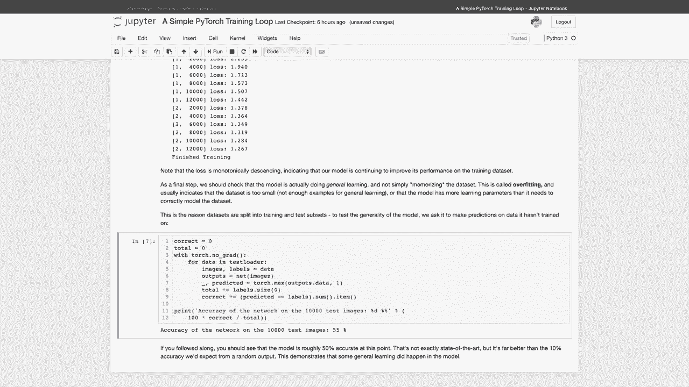

当你花费时间构建和训练了一个模型后，通常希望将其部署到生产环境中。如果你追求高性能，可能希望在不依赖 Python 解释器的情况下运行模型。PyTorch 为此提供了 **TorchScript**。

TorchScript 是 Python 的一个静态、高性能的子集。将模型转换为 TorchScript 后，模型的动态和 Python 特性得以保留，控制流和 Python 数据结构（如列表、字典）仍然可用。

**将模型转换为 TorchScript**
```python
# 假设 `net` 是我们训练好的模型
scripted_model = torch.jit.script(net) # 或者使用 torch.jit.trace 对于没有控制流的模型
# 保存模型
scripted_model.save("lenet_scripted.pt")
```
只需一行代码，你就可以将 Python 模型转换为 TorchScript。序列化版本包含了模型计算图和学习权重的所有信息。

**加载和执行 TorchScript 模型**
```python
# 在 Python 中加载
loaded_model = torch.jit.load("lenet_scripted.pt")
output = loaded_model(input)

# 也可以在 C++ 运行时中加载，以消除对 Python 的依赖
```
TorchScript 旨在被 PyTorch 的即时编译器（JIT）使用，JIT 会进行运行时优化（如操作重排序和层融合），以最大化模型在 CPU 或 GPU 上的性能。

在后续教程中，我们将更详细地讨论 TorchScript、部署的最佳实践以及 TorchServe（PyTorch 的模型服务解决方案）。

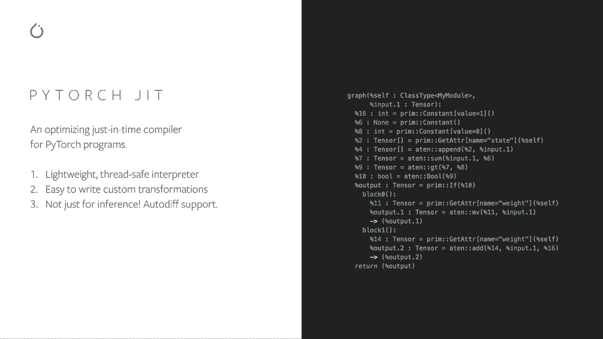

---

## 📝 总结

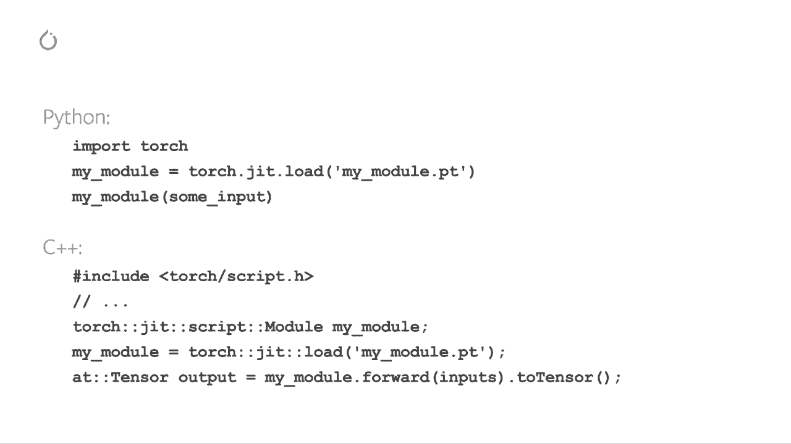

在本节课中，我们一起学习了 PyTorch 的基础知识：

1.  **PyTorch 简介**：了解了其作为开源机器学习框架的特性、优势及丰富的生态系统。
2.  **张量**：掌握了 PyTorch 核心数据结构的基本创建和操作。
3.  **自动微分 (Autograd)**：理解了其如何自动计算梯度，为模型训练提供支持。
4.  **模型构建**：学习了如何通过继承 `nn.Module` 类来定义自己的神经网络模型。
5.  **数据加载**：使用了 `Dataset` 和 `DataLoader` 来高效地组织和批处理训练数据。
6.  **训练循环**：将损失函数、优化器和训练步骤组合起来，完成了模型的完整训练流程。
7.  **模型部署**：初步了解了如何使用 TorchScript 将模型序列化，为生产环境部署做准备。

我们使用的模型和数据集相对简单，但 PyTorch 的能力足以支撑大型企业中的复杂应用，如语言翻译、视频内容描述和语音合成等