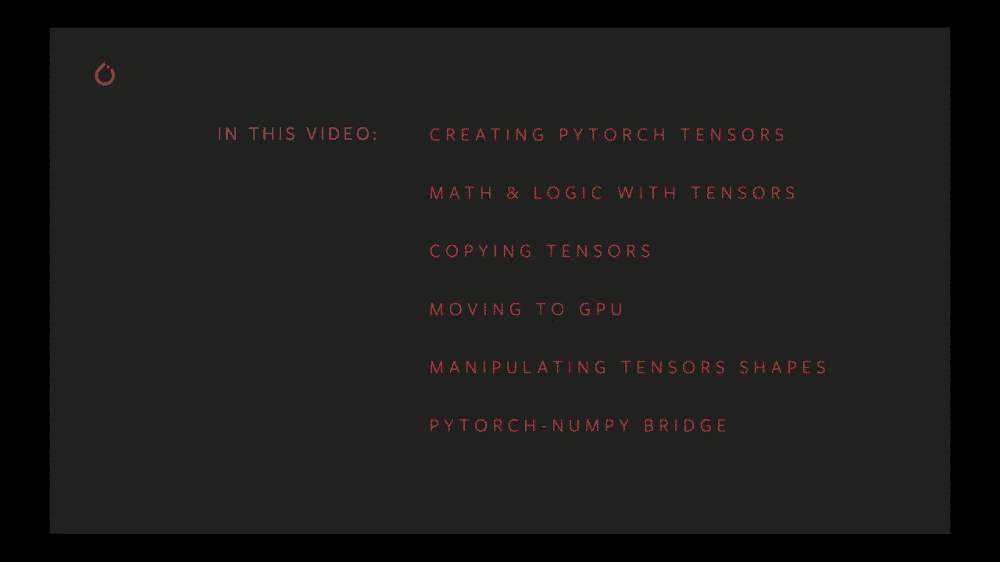
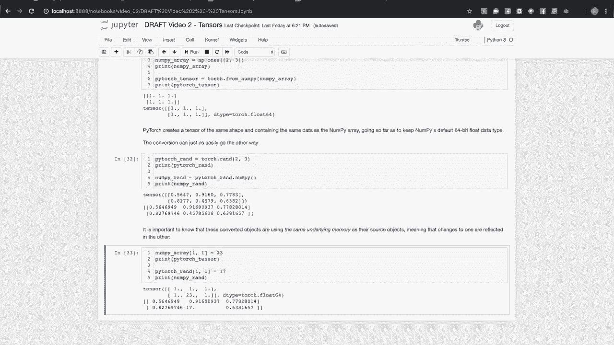

# PyTorch 入门课程 P2：📚 PyTorch 张量简介

在本节课中，我们将深入探讨 PyTorch 的核心数据结构——张量。我们将学习如何创建张量、进行数学运算、复制数据、利用 GPU 加速以及调整张量形状。理解张量是掌握 PyTorch 进行深度学习的关键第一步。



## 概述

在 PyTorch 深度学习模型中，所有的数据输入、输出和学习权重都仅以张量的形式表达。张量是一种可以包含浮点数、整数或布尔数据的多维数组。本节课程将详细介绍张量的基本操作。

## 1. 创建张量 🛠️

我们将要讨论的第一件事是创建张量。PyTorch 提供了多种工厂方法来创建张量，可以带有或不带有初始值。

### 基本创建方法

以下是创建张量的最简单方法，使用 `torch.empty` 调用。`torch` 模块有多个工厂方法，可以让你以有或没有初始值以及你需要的任何数据类型创建张量。

```python
import torch
import math

# 分配张量的最基本方式，torch.empty 将创建一个三行四列的张量。
x = torch.empty(3, 4)
print(x)
```
当你运行这个单元时，你可能会看到输出中出现随机的值，这是因为 `torch.empty` 仅分配内存，而不写入任何值。

### 关于维度的术语说明

有时当我们有一维张量时，我们会称之为向量。二维张量通常被称为矩阵。任何更大的张量我们都称为张量。

### 带初始值的创建方法

更常见的是，你会希望用一些值来初始化你的张量。常见情况是全零、全一或随机值。`torch` 模块为所有这些情况提供了工厂方法。

```python
# 创建一个充满零的二行三列张量
zeros_tensor = torch.zeros(2, 3)
print(zeros_tensor)

# 创建一个充满一的二行三列张量
ones_tensor = torch.ones(2, 3)
print(ones_tensor)

# 创建一个充满 0 到 1 之间随机值的张量
torch.manual_seed(1729) # 设置随机种子以确保结果可重复
random_tensor = torch.rand(2, 3)
print(random_tensor)
```
用随机值初始化张量（例如你的模型学习权重）是很常见的，但通常你会希望你的结果是可重复的。`torch.manual_seed()` 可以重新初始化伪随机数生成器，确保依赖随机数的相同计算能提供相同的结果。

### 根据现有张量形状创建

我迄今为止在 `torch` 模块上展示的所有工厂方法都有相应的方法，后面加上下划线。当你将张量作为参数传递给 `empty` 或 `zeros` 时，使用这些其他方法，你将得到一个根据你的指定初始化的张量，但它的形状与作为参数传入的张量相同。

```python
some_tensor = torch.rand(2, 2, 3)
print(f"原始张量形状: {some_tensor.shape}")

# 创建形状相同但内容不同的张量
zeros_like = torch.zeros_like(some_tensor)
ones_like = torch.ones_like(some_tensor)
rand_like = torch.rand_like(some_tensor)

print(zeros_like.shape) # 输出: torch.Size([2, 2, 3])
```
当我们想要找出张量的形状时，我们总是可以查询其 `shape` 属性。这将给我们返回一个维度及其范围的列表。

### 从数据直接创建

创建张量的最后一种方法是直接从 Python 集合中指定其数据。

```python
# 从列表创建
data_list = [[1, 2], [3, 4]]
tensor_from_list = torch.tensor(data_list)
print(tensor_from_list)

# 从元组创建
data_tuple = ((1.0, 2.0), (3.0, 4.0))
tensor_from_tuple = torch.tensor(data_tuple)
print(tensor_from_tuple)
```
`torch.tensor` 创建了数据的副本。知道 Python 列表的底层内存表示与张量的底层内存表示是不同的是很重要的。因此，在以这种方式创建新的张量并用数据初始化时，我们总是复制那些数据。

### 指定数据类型

张量可以有浮点、整数或布尔底层数据类型。指定数据类型的最简单方法是在创建时进行。

```python
# 创建 int16 和 float64 张量
int_tensor = torch.ones((2,2), dtype=torch.int16)
float_tensor = torch.randn((2,2), dtype=torch.float64)

print(int_tensor)
print(float_tensor)
```
我们还可以使用 `.to()` 方法改变张量的数据类型或将其移动到所需数据类型的新张量。

```python
b = torch.rand(2,2)
print(b.dtype) # 默认是 torch.float32

c = b.to(torch.int32) # 转换为整数，注意这是截断转换
print(c)
print(c.dtype)
```
你可以使用的数据类型有布尔值、五种整数类型和四种浮点数类型。

---

上一节我们介绍了如何创建各种张量，本节中我们来看看如何对它们进行数学和逻辑运算。

## 2. 张量运算 ➕➖✖️➗

首先让我们看看基本的算术运算，以及如何让张量与标量交互。

### 张量与标量运算

```python
# 创建一个满是零的张量，并将整数 1 加到其中
a = torch.zeros(2, 2)
b = a + 1
print(b) # 张量中的每个零都加上了 1

# 其他运算
c = a * 3
d = a - 2
e = a ** 2 # 指数运算
print(c, d, e)

# 运算可以链式进行
f = torch.ones(2,2)
g = f + 2 * 3 / 4
print(g)
```
对于整数或浮点幂，因为张量和标量之间的二元运算会输出与最初相同形状的张量，你可以直观地将这些算术运算链接在一起。

### 张量与张量运算

用两个张量执行相同的算术运算行为是你所期望的那样。

```python
# 创建两个相同形状的张量
a = torch.full((2,2), 2.0)
b = torch.tensor([[1,2],[3,4]], dtype=torch.float32)

# 逐元素运算
c = a + b # 加法
d = a * b # 乘法
e = a ** b # 指数运算 (2^1, 2^2, 2^3, 2^4)

print(c)
print(d)
print(e)
```
数学运算将在每个张量的对应元素之间逐元素执行，因为它们具有相同的形状。这里一个关键点是，我们在这些张量二元操作的示例中展示的所有张量都是相同形状的。

```python
# 尝试对不同形状的张量进行操作会出错
a = torch.ones(2,3)
b = torch.ones(3,2)
# c = a + b # 这会引发 RuntimeError
```

### 广播机制

有一个重要且有用的例外，那就是我们所称的广播。广播是一种在具有特定相似形状的张量之间执行操作的方法。

```python
# 广播示例
random_tensor = torch.rand(2, 4)
multiplier = torch.tensor([[1, 2, 3, 4]]) # 形状 (1, 4)

result = random_tensor * multiplier # 广播发生
print("随机张量:")
print(random_tensor)
print("\n广播乘法结果:")
print(result)
```
在这里的单元中，那个一行四列的张量与随机张量的每个两行四列逐元素相乘。这是深度学习中的一个重要操作。一个常见的例子是使用输入批次。

广播有一些规则。第一个是不能有空张量，因此每个张量必须至少有一个维度。然后，在你想对其执行操作的两个张量的维度和范围之间有一些规则：当我们从最后一个维度到第一个维度比较两个张量的维度大小时，必须要么每个维度相等，要么其中一个维度的大小为1，或者在一个张量中该维度不存在。

```python
# 广播规则示例
A = torch.ones(4, 3, 2) # 形状 (4, 3, 2)
B = torch.rand(3, 2)    # 形状 (3, 2)
C = A * B               # 可以广播，B 被看作 (1, 3, 2)
print(C.shape) # torch.Size([4, 3, 2])

D = torch.rand(3, 1)    # 形状 (3, 1)
E = A * D               # 可以广播，D 被看作 (1, 3, 1) -> (4, 3, 2)?
# 实际上，D(3,1) 对 A(4,3,2) 的最后一个维度是1，第二个维度匹配，第一个维度在D中缺失。
# 输出形状为 (4, 3, 2)
F = A * D
print(F.shape) # torch.Size([4, 3, 2])

# 打破规则的例子
G = torch.rand(2,)
# H = A * G # 错误：最后维度不匹配 (2 vs 3)
```
如果你对更多细节感兴趣，建议阅读 PyTorch 关于广播的文档。

---

了解了基本运算后，我们来看看 PyTorch 提供的更丰富的数学函数库。

## 3. 更多数学与线性代数操作 📐

PyTorch 张量有超过 300 种数学操作可以执行，这里是一些主要类别的例子。

### 通用数学函数

```python
# 元素级数学函数
a = torch.tensor([-2.5, 3.1, 0.0, -4.8])

print(torch.abs(a))   # 绝对值
print(torch.ceil(a))  # 向上取整
print(torch.floor(a)) # 向下取整
print(torch.clamp(a, min=-2, max=2)) # 钳制函数，限制在[-2, 2]之间

# 三角函数
angles = torch.tensor([0, math.pi/4, math.pi/2])
sines = torch.sin(angles)
arcsines = torch.asin(sines)
print("角度:", angles)
print("正弦:", sines)
print("反正弦:", arcsines)
```

### 比较与逻辑操作

```python
# 比较操作
a = torch.tensor([1, 2, 3, 4])
b = torch.tensor([1, 3, 2, 4])
print(torch.eq(a, b)) # 相等性测试，返回布尔张量

# 按位操作（整数张量）
x = torch.tensor([5, 9], dtype=torch.int32) # 二进制 0101, 1001
y = torch.tensor([3, 7], dtype=torch.int32) # 二进制 0011, 0111
print(torch.bitwise_xor(x, y)) # 异或: 0110 (6), 1110 (14)
```

### 归约操作

```python
# 归约操作 - 将张量减少为标量或更低维度
t = torch.tensor([[1, 2, 3],
                  [4, 5, 6]])

print(torch.max(t))        # 最大值 -> 张量(6.)
print(torch.max(t).item()) # 提取标量值 -> 6

print(torch.mean(t.float())) # 均值，注意类型转换
print(torch.std(t.float()))  # 标准差
print(torch.prod(t))         # 所有元素乘积
print(torch.unique(torch.tensor([1,3,2,3,1]))) # 唯一元素
```

### 线性代数操作

线性代数是深度学习中很多工作的核心。因此有很多向量、矩阵和线性代数操作。

```python
# 向量叉积
x_unit = torch.tensor([1., 0., 0.])
y_unit = torch.tensor([0., 1., 0.])
cross_product = torch.cross(y_unit, x_unit) # y 叉乘 x
print("叉积 (y × x):", cross_product) # 应为负 Z 单位向量 [0., 0., -1.]

# 矩阵乘法
mat_a = torch.randn(3, 4)
mat_b = torch.eye(4) * 3 # 3倍单位矩阵
mat_c = torch.matmul(mat_a, mat_b) # 或使用 @ 运算符: mat_a @ mat_b
print("随机矩阵 A:")
print(mat_a)
print("\nA 乘以 3I 的结果 (应为 A*3):")
print(mat_c)

# 奇异值分解 (SVD)
U, S, V = torch.svd(torch.randn(5, 3))
print(f"U 形状: {U.shape}, S 形状: {S.shape}, V 形状: {V.shape}")
```
这只是与 PyTorch 张量相关的 300 多个数学和逻辑操作中的一小部分。建议查看文档以了解完整的清单。

---

在进行复杂计算时，管理内存和中间结果很重要。接下来我们看看如何优化这些操作。

## 4. 原地操作与内存优化 💾

有时候如果你正在进行两个张量的计算，你会说它们是某种中间值。当你完成时，你可能不需要那些中间值。能够回收内存是一个不错的优化。

### 原地操作

像 `sin` 这样的函数会返回一个新张量。带下划线的方法（如 `sin_`）意味着你正在就地修改作为参数传入的张量。

```python
# 非原地操作
a = torch.tensor([0., math.pi/2, math.pi])
b = torch.sin(a) # 创建新张量
print("a (未改变):", a)
print("b (新张量):", b)

# 原地操作
c = torch.tensor([0., math.pi/2, math.pi])
c.sin_() # 原地修改 c
print("c (已改变):", c)
```
如果你想对二元算术运算执行此操作，有一些函数的行为与二元 PyTorch 操作符类似。

```python
a = torch.ones(2, 2)
b = torch.full((2,2), 2.)

print("操作前 a:", a)
a.add_(b) # 原地加法，相当于 a += b
print("操作后 a:", a)

b.mul_(b) # 原地平方，相当于 b = b * b
print("操作后 b:", b)
```
请注意，这些就地算术函数是 torch 张量对象的方法，而不是像许多其他函数一样附加到 `torch` 模块。

### 使用 `out` 参数

还有另一种选择，可以将计算结果放入一个已经分配的现有张量中。许多方法和函数都有一个 `out` 参数，可以让你指定一个张量来接收输出。

```python
a = torch.rand(2,2)
b = torch.rand(2,2)
c = torch.zeros(2,2)

id_before = id(c)
result = torch.matmul(a, b, out=c) # 结果存入 c
id_after = id(c)

print("c 的内容 (不再是零):")
print(c)
print(f"\nc 的 ID 改变了吗? {id_before == id_after}") # 应为 True
print(f"result 是 c 吗? {result is c}") # 应为 True
```
只要 `out` 张量与输出具有相同的形状，并且数据类型匹配输出的数据类型，则可以在不分配新内存的情况下发生这种情况。这也适用于创建调用。

---

了解了如何操作张量后，我们来看看如何正确地复制它们，这在构建复杂模型时很重要。

## 5. 复制张量 📋

张量就像 Python 中的任何对象，这意味着如果你将其赋值给一个变量，那么该变量只是对象的标签，而不是创建对象的副本。

```python
# 简单赋值是引用，不是复制
a = torch.ones(2, 2)
b = a # b 是 a 的另一个标签，指向同一对象
print("初始 a:", a)
print("初始 b:", b)

a[0,0] = 99 # 通过 a 修改
print("\n修改后 a:", a)
print("修改后 b:", b) # b 也改变了！
print(f"a is b? {a is b}") # True
```

### 使用 `clone` 方法

如果你需要数据的单独副本会怎样？这可能发生在你构建一个具有多个计算路径的复杂模型时。在这种情况下，你会使用 `clone` 方法。

```python
a = torch.ones(2, 2)
b = a.clone() # 创建真正的副本

print(f"a is b? {a is b}") # False，不同对象
print(f"a 等于 b? {torch.equal(a, b)}") # True，内容相同

a[0,0] = 99 # 修改 a
print("\n修改后 a:", a)
print("修改后 b:", b) # b 没有改变！
```
有一件重要的事情需要注意，使用 `clone` 时，如果你的源张量启用了 autograd（自动梯度计算），那么该张量的克隆也会启用。我们将在关于 autograd 的视频中更深入地讨论这个问题。

### 分离计算图

也许你正在进行一个计算，既不需要跟踪原始张量也不需要跟踪其克隆。在这种情况下，只要源张量关闭了 autograd，你就可以继续。还有第三种情况，假设你在模型的前向函数中执行一些计算，其中所有内容默认情况下都开启了梯度跟踪，但是你想在中间提取一些值来生成指标。你希望这些与正在处理的数据分开。

```python
# 创建一个需要梯度的张量
a = torch.rand(2, 2, requires_grad=True)
print("a 的 requires_grad:", a.requires_grad)

# 克隆会保留梯度历史
b = a.clone()
print("b 的 requires_grad:", b.requires_grad)

# 分离后克隆不会保留梯度历史
c = a.detach().clone()
print("c 的 requires_grad:", c.requires_grad)

# detach 本身不改变原张量
print("detach 后 a 的 requires_grad:", a.requires_grad) # 仍为 True
```

---

PyTorch 的一个核心优势是硬件加速。接下来我们看看如何利用 GPU 来加速计算。



## 6. GPU 加速 🚀

如果你有兼容的 NVIDIA GPU 和已安装的驱动程序，你可以显著加速训练和推理的性能。到目前为止，我们所做的一切都是在 CPU 上。默认情况下，当你创建一个张量时，它