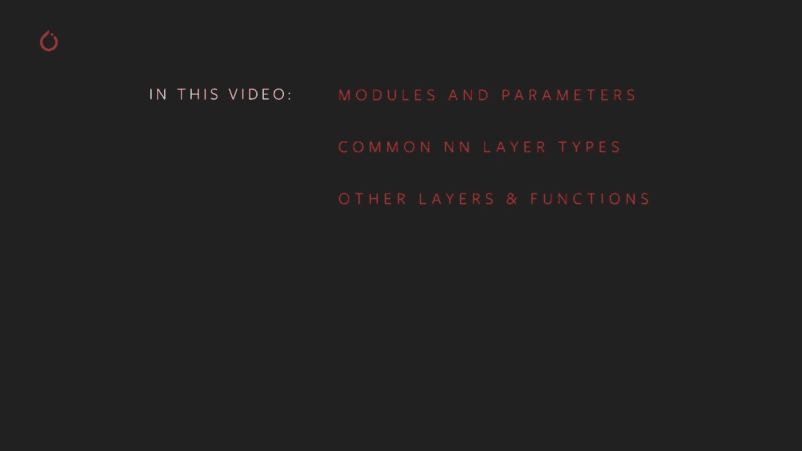
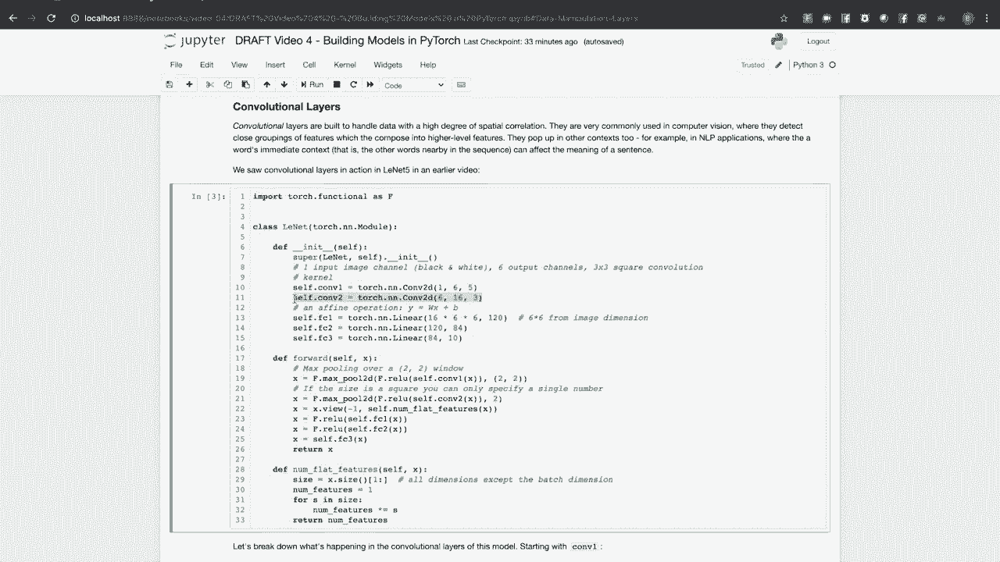
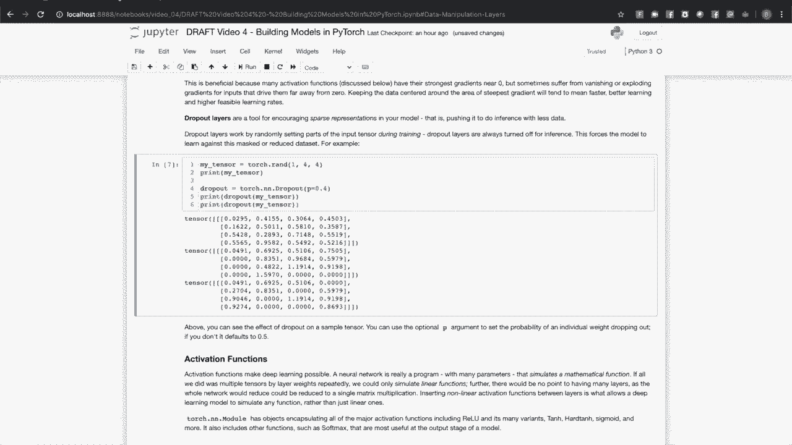
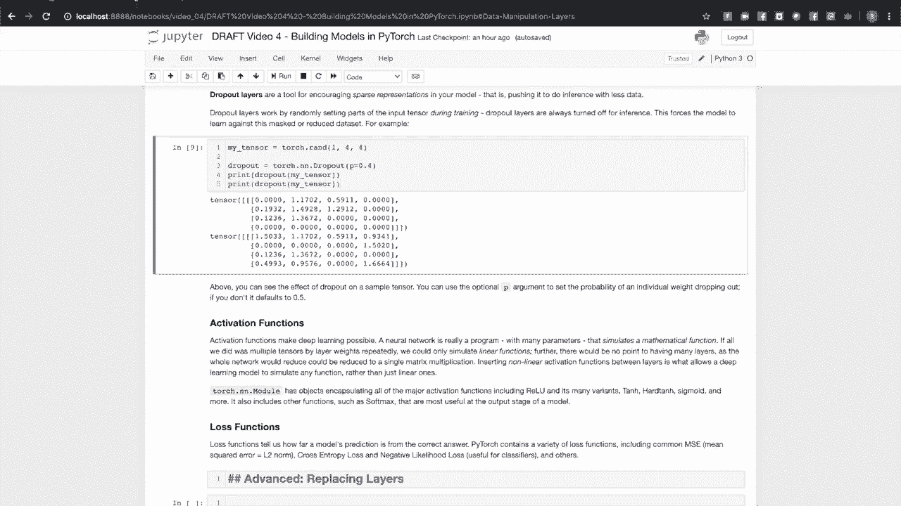

# 课程4：使用 PyTorch 构建模型 🧠

在本节课中，我们将学习如何使用 PyTorch 的核心组件来构建机器学习模型。我们将重点介绍 `torch.nn.Module` 和 `Parameter` 类，它们分别用于封装模型结构和学习权重。此外，我们还将探讨常见的神经网络层类型、循环神经网络、Transformer 网络、其他功能层以及损失函数。

## 核心概念：Module 与 Parameter



在 PyTorch 中，构建模型主要围绕 `torch.nn.Module` 和 `Parameter` 这两个类展开。

`Module` 类用于封装模型及其组件，例如神经网络层。`Parameter` 类是 `torch.Tensor` 的子类，专门用于表示模型需要学习的权重。当我们将一个 `Parameter` 对象分配为 `Module` 的属性时，该参数会自动与该模块注册。

如果将一个 `Module` 子类的实例作为另一个 `Module` 的属性，那么被包含模块的所有参数也会自动注册到外层模块中。这确保了模型能够管理其所有子组件的参数。

为了更好地理解，让我们看一个简单的模型示例。

```python
import torch
import torch.nn as nn
import torch.nn.functional as F

class TinyModel(nn.Module):
    def __init__(self):
        super(TinyModel, self).__init__()
        self.linear1 = nn.Linear(4, 10)
        self.linear2 = nn.Linear(10, 2)

    def forward(self, x):
        x = self.linear1(x)
        x = F.relu(x)
        x = self.linear2(x)
        return F.log_softmax(x, dim=1)
```

这个模型展示了一个典型的 PyTorch 模型结构。首先，它继承自 `torch.nn.Module`。`__init__` 方法定义了模型的结构，即组成它的层。`forward` 方法则描述了如何将这些层组合起来进行计算。

当我们创建这个模型的实例并打印时，它会显示其包含的层以及注册的顺序。

```python
tinymodel = TinyModel()
print(tinymodel)
```

我们也可以单独打印某一层，例如 `linear2`，来查看其描述。

```python
print(tinymodel.linear2)
```

由于 `TinyModel` 和 `nn.Linear` 都是 `nn.Module` 的子类，我们可以通过 `.parameters()` 方法访问它们的参数。

```python
print(list(tinymodel.parameters()))
print(list(tinymodel.linear2.parameters()))
```

可以看到，`linear2` 层的参数与整个模型参数列表中的最后一部分是相同的。这是因为模型会递归地注册其所有子模块的参数。这一点至关重要，因为在训练时，我们需要将所有参数传递给优化器进行更新。

## 常见神经网络层类型

PyTorch 提供了封装现代机器学习模型中常用层类型的类。

### 线性层（全连接层）

最基本的类型是全连接层或线性层，我们在上面的例子中已经见过。在这种层中，每个输入都会影响每个输出，因此被称为“全连接”。这种影响的程度由层的权重决定。

如果一个线性层有 M 个输入和 N 个输出，那么它的权重将是一个 M x N 的矩阵。

```python
lin = nn.Linear(3, 2)  # 3个输入，2个输出
x = torch.rand(1, 3)   # 随机输入向量
y = lin(x)              # 输出向量
print(y)
```

输出 `y` 是通过矩阵乘法 `x @ weight.T + bias` 计算得到的。当我们打印参数时，可以看到它们设置了 `requires_grad=True`，这意味着它们会跟踪计算历史以便计算梯度。

`Parameter` 是 `torch.Tensor` 的子类，但其默认将 `requires_grad` 设置为 `True` 的行为与普通张量不同。

线性层在深度学习模型中应用广泛，你经常会在分类模型的最后几层看到它们。

### 卷积层

卷积层旨在处理在空间上高度相关的数据，在计算机视觉模型中非常常见。它们可以检测输入中相邻的、有趣的特征簇，并将其组合成更大的特征或识别物体。它们也出现在其他领域，如自然语言处理（NLP）中，因为一个词的意图常常受到其周围词的影响。

在之前的课程中，我们见过 LeNet-5 模型。让我们更仔细地看看它的构建方式。

LeNet-5 旨在接收 32x32 像素的黑白手写数字图像块，并根据所代表的数字进行分类。观察其第一个卷积层：

```python
conv1 = nn.Conv2d(1, 6, 5)
```

第一个参数 `1` 是输入通道数（黑白图像只有一个通道）。第二个参数 `6` 是该层要学习的特征数量。第三个参数 `5` 是卷积核的大小，可以将其视为一个在输入上滑动的窗口，用于收集特征。

该卷积层的输出是一个“激活图”，这是一个空间图，显示了它在输入中发现特定特征的位置。

第二个卷积层类似，它将第一个层的输出作为输入：

```python
conv2 = nn.Conv2d(6, 16, 3)
```

它的第一个参数是 `6`，因为第一个卷积层输出了 6 个特征。我们要求这一层学习 16 种不同的特征，这些特征是通过组合第一层的特征生成的。我们使用大小为 3 的窗口进行卷积。



在第二个卷积层将特征组合成更高级别的激活图后，输出被传递给一组线性层作为分类器。最后一层有 10 个输出，表示输入代表 0-9 这 10 个数字中某一个的概率。


PyTorch 为一维、二维和三维输入提供了卷积层（`nn.Conv1d`, `nn.Conv2d`, `nn.Conv3d`）。还有更多可选参数，如步幅（stride）和填充（padding），可以在官方文档中查找。

## 循环神经网络与 Transformer 网络

上一节我们介绍了处理空间数据的卷积层，本节我们来看看处理序列数据的网络。

### 循环神经网络

循环神经网络（RNN）专为处理序列数据而设计，例如自然语言句子中的单词序列或仪器的实时测量序列。RNN 通过维护一个“隐藏状态”来实现这一点，该状态充当对序列中已观察内容的记忆。

RNN 层或其变体（如长短期记忆网络 LSTM 和门控循环单元 GRU）的内部结构相当复杂，超出了本视频的范围。但我们可以通过一个基于 LSTM 的词性标注器来展示其实际应用。

```python
class LSTMTagger(nn.Module):
    def __init__(self, embedding_dim, hidden_dim, vocab_size, tagset_size):
        super(LSTMTagger, self).__init__()
        self.hidden_dim = hidden_dim
        self.word_embeddings = nn.Embedding(vocab_size, embedding_dim)
        self.lstm = nn.LSTM(embedding_dim, hidden_dim)
        self.hidden2tag = nn.Linear(hidden_dim, tagset_size)

    def forward(self, sentence):
        embeds = self.word_embeddings(sentence)
        lstm_out, _ = self.lstm(embeds.view(len(sentence), 1, -1))
        tag_space = self.hidden2tag(lstm_out.view(len(sentence), -1))
        tag_scores = F.log_softmax(tag_space, dim=1)
        return tag_scores
```

构造函数有四个参数：`vocab_size`（词汇表大小）、`tagset_size`（标签集大小）、`embedding_dim`（词嵌入维度）和 `hidden_dim`（LSTM 隐藏层维度）。

`nn.Embedding` 层将单词的索引（代表一个独热向量）映射到低维的嵌入空间。LSTM 层处理嵌入序列并产生输出。最后的线性层作为分类器，应用 `log_softmax` 将输出转换为归一化的对数概率。

### Transformer 网络

Transformer 是一种基于自注意力机制的神经网络架构，在自然语言处理领域取得了巨大成功（例如 BERT 模型）。关于 Transformer 架构的详细讨论相对复杂，但 PyTorch 提供了 `nn.Transformer` 类，允许你定义 Transformer 模型的整体参数。

```python
transformer_model = nn.Transformer(nhead=16, num_encoder_layers=12)
```

你可以指定编码器和解码器的层数、注意力头的数量等。PyTorch 还提供了封装 Transformer 各个组件的类，如编码器（`nn.TransformerEncoder`）、解码器（`nn.TransformerDecoder`）及其组成层。

## 其他层与功能

除了学习层，模型中还需要一些执行重要功能的非学习层。


### 池化层


一个例子是最大池化（`nn.MaxPool2d`）及其对应物最小池化。这些函数通过将单元分组，并将该组输入单元的最大值（或最小值）分配给输出单元，来减少张量的尺寸。

```python
pool = nn.MaxPool2d(2, stride=2)
input = torch.randn(1, 1, 6, 6)
output = pool(input)
print(output.size())  # 输出尺寸会变小
```

### 归一化层

归一化层（如 `nn.BatchNorm2d`）会对一个层的输出进行重新中心化和归一化，然后再将其输入到下一个层。对中间张量进行中心化和缩放有许多好处，例如允许使用更高的学习率，并缓解梯度消失或爆炸问题。

```python
batchnorm = nn.BatchNorm1d(5)
input = torch.randn(2, 5) * 20 + 15  # 创建均值为15的输入
output = batchnorm(input)
print(output.mean())  # 输出均值应接近0
```

许多激活函数在输入接近 0 时梯度最陡。保持数据围绕这个区域中心化可以加速学习。

### Dropout 层

Dropout 层（`nn.Dropout`）是一种用于鼓励模型学习稀疏表示的工具，迫使模型用更少的数据进行推理。它在训练期间随机将输入张量的部分元素设置为 0。在推理（评估）时，Dropout 层会被关闭。

```python
dropout = nn.Dropout(p=0.4)
input = torch.randn(5)
output1 = dropout(input)
output2 = dropout(input)  # 两次前向传播会得到不同的掩码
print(output1)
print(output2)
```

## 激活函数与损失函数

构建模型的最后两个关键成分是激活函数和损失函数。

### 激活函数

激活函数是使深度学习能够模拟非线性关系的关键。如果只堆叠线性层，无论堆叠多少层，最终都可以简化为单个矩阵乘法，这意味着只能模拟线性方程。



通过在层之间插入非线性激活函数，我们使模型能够模拟复杂的非线性方程。


`torch.nn` 模块提供了所有主要的激活函数：

```python
relu = nn.ReLU()
tanh = nn.Tanh()
sigmoid = nn.Sigmoid()
```

常见的激活函数包括多种变体的 ReLU、Tanh、Hardtanh、Sigmoid 等。还有一些函数在模型输出阶段最有用，例如 `nn.Softmax`。

### 损失函数

损失函数用于衡量模型预测与真实标签之间的差距，是训练过程中优化的目标。PyTorch 提供了多种常见的损失函数：

```python
# 均方误差损失 (MSE)，常用于回归任务
mse_loss = nn.MSELoss()

# 交叉熵损失，常用于分类任务
ce_loss = nn.CrossEntropyLoss()

# 负对数似然损失 (NLL)，常与 LogSoftmax 输出配合使用
nll_loss = nn.NLLLoss()
```

## 总结

在本节课中，我们一起学习了使用 PyTorch 构建模型的核心知识。

我们首先了解了 `nn.Module` 和 `Parameter` 这两个基础类，它们是定义和管理模型结构的基石。接着，我们探索了多种神经网络层，包括处理全连接数据的**线性层**、处理空间数据的**卷积层**、处理序列数据的**循环神经网络（如LSTM）** 以及强大的 **Transformer 网络**。

此外，我们还介绍了**池化层**、**归一化层**和 **Dropout 层**等重要的功能层，它们对于提升模型性能和训练稳定性至关重要。最后，我们讨论了赋予模型非线性能力的**激活函数**和用于指导模型优化的**损失函数**。



掌握这些组件及其协作方式，是使用 PyTorch 灵活构建各类机器学习模型的关键一步。