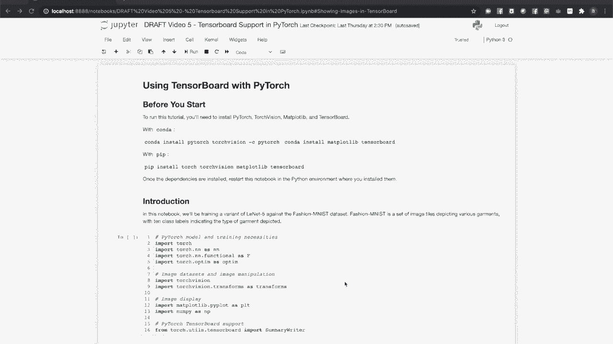
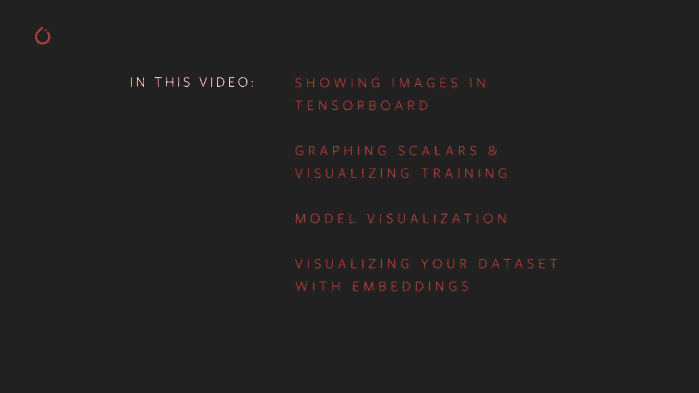
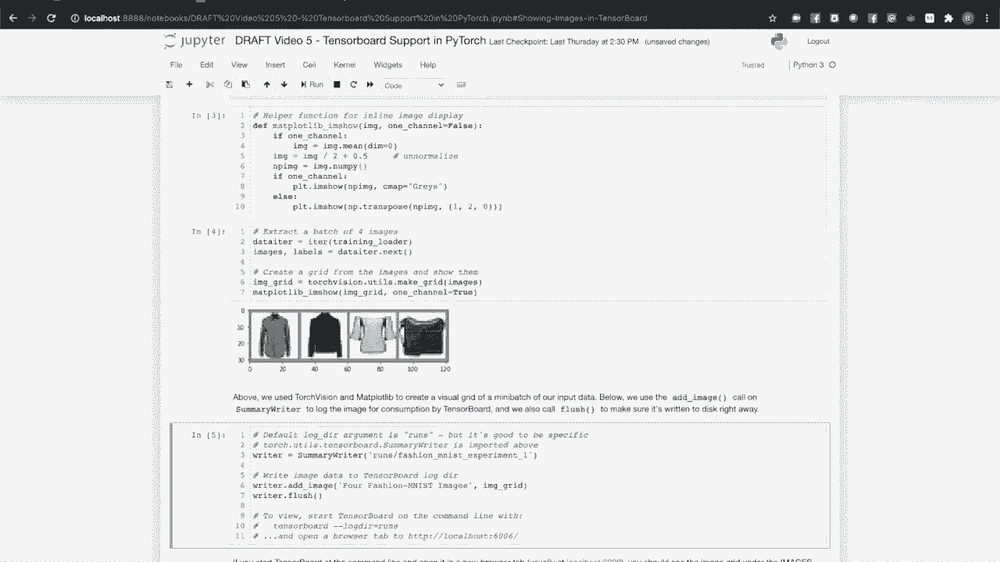
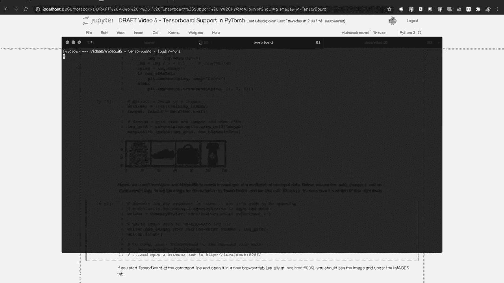
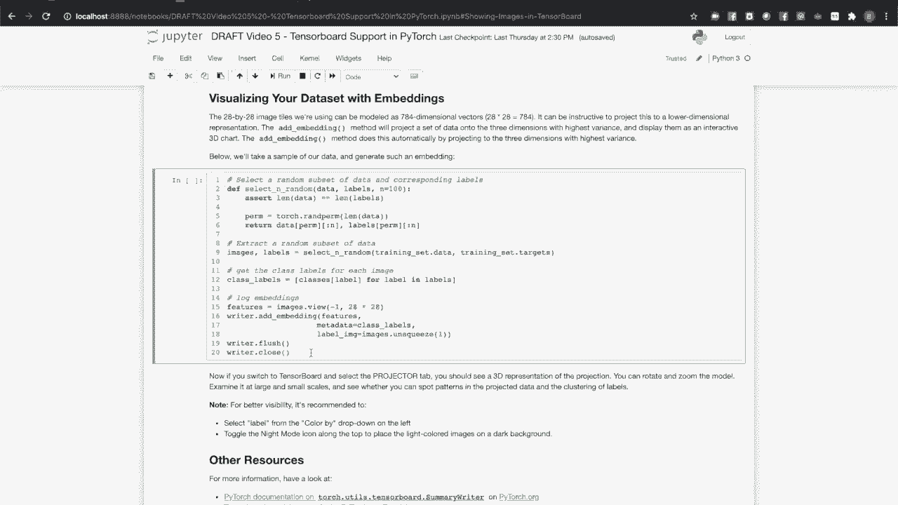
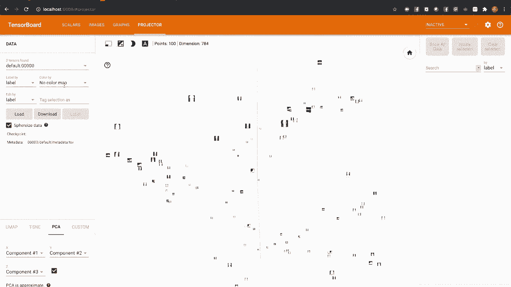
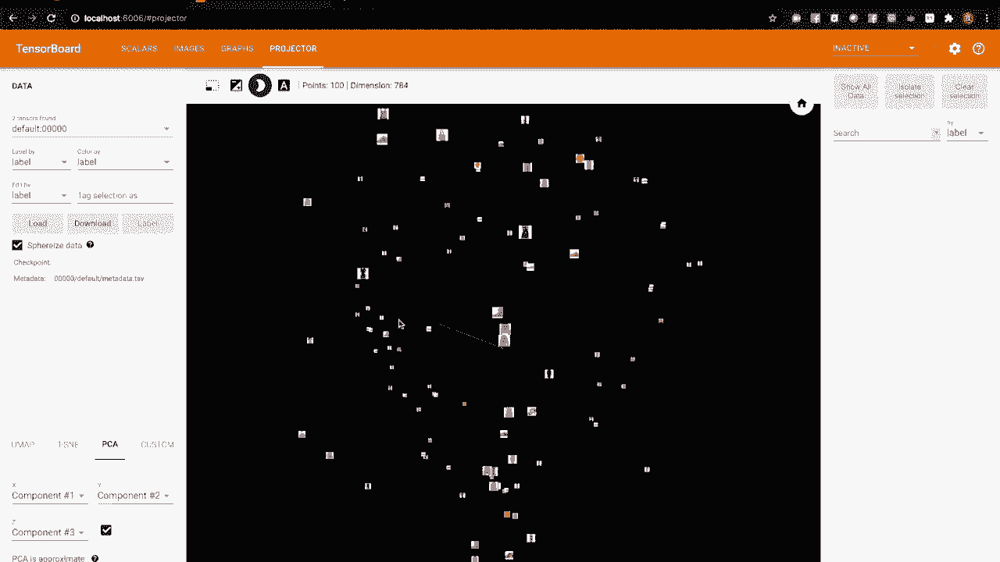
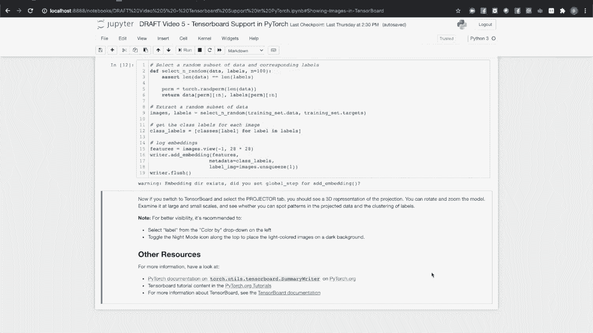

# PyTorch 入门课程 P5：📊 PyTorch TensorBoard 支持

在本节课中，我们将学习如何在 PyTorch 中使用 TensorBoard 来可视化训练过程、模型结构和数据。我们将通过一个识别服装类型的神经网络项目，实践如何安装依赖、记录数据、启动 TensorBoard 并解读各种可视化图表。



## 环境设置与数据准备

在开始之前，你需要设置一个 Python 环境，并安装最新版本的 PyTorch 和 TensorBoard。我们将使用 Matplotlib 来处理图像。安装完成后，你可以在配套的笔记本环境中运行本教程的代码。

我们将使用 Fashion MNIST 数据集，它包含按服装类型分类的小图像。我们的模型将是一个适配了该数据集的 LeNet-5 版本。



首先，导入必要的库，包括 `torch.utils.tensorboard` 中的 `SummaryWriter` 类。这个类封装了 PyTorch 对 TensorBoard 的支持，是与 TensorBoard 交互的主要接口。

在将数据输入模型之前进行可视化是一个好习惯，尤其是在计算机视觉任务中。因此，我们先来设置数据集。

以下是设置数据集的步骤：

1.  使用 Torchvision 下载训练集和验证集。
2.  为每个数据集分割设置数据加载器。
3.  定义我们要分类的服装类别。



接下来，我们可视化数据集中的一些样本。使用迭代器提取一些数据实例，并创建一个 Matplotlib 辅助函数将它们批量显示在一个网格中。



那么，如何将这些图像添加到 TensorBoard 呢？只需一行代码即可将图像写入日志目录。请注意，我们还调用了 `SummaryWriter` 对象的 `flush()` 方法，以确保所有记录的内容都已写入磁盘。

```python
# 示例：将图像网格添加到 TensorBoard
writer.add_image(‘fashion_mnist_images’, img_grid)
writer.flush()
```

现在，切换到终端并启动 TensorBoard 服务。访问命令行提供的 URL，你可以在 “Images” 标签页下看到我们添加的图像，标题包含我们保存时应用的标签。

## 监控训练过程

上一节我们介绍了如何可视化原始数据，本节中我们来看看如何使用 TensorBoard 监控和评估训练过程。我们将定期绘制累积的训练损失，并与在验证集上测量的损失进行比较。

这里简要说明一下验证集的作用：它类似于考试，用于检验模型是否真正学会了泛化，而不是仅仅记住了训练数据（即过拟合）。

让我们建立一个包含验证检查的训练循环，并绘制结果。在训练循环中，我们累积模型预测的损失，并每训练一定步数后报告一次。同时，我们也会定期在验证集上检查损失。

为了在同一个图表中跟踪和比较这两个不同的指标，我们将使用 `SummaryWriter` 的 `add_scalars()` 方法。这个方法允许我们添加一个包含多个标量值的字典，每个值都有不同的标签，在图表上显示为不同的线条。

运行训练循环后，切换到 TensorBoard 查看 “Scalars” 标签页。我们可以看到训练损失单调下降，这表明训练是有效的。验证曲线与训练曲线是否良好收敛，可以帮助我们判断是否存在过拟合。

## 可视化模型结构

接下来，我们使用 TensorBoard 来更好地理解模型内部结构以及数据是如何流动的。为此，我们将使用 `SummaryWriter` 的 `add_graph()` 方法。该方法的参数是模型本身和一个用于追踪数据流的示例输入。

运行代码后，切换到 TensorBoard 的 “Graphs” 标签页。你会看到一个展示模型整体数据流的图：输入从一侧进入，输出从另一侧提交。

当然，我们希望看到更多细节。可以通过双击图中的模型节点来展开。在这里，我们可以看到包含所有层的详细计算图，以及指示数据流向的箭头。请注意，由于模型复用了同一个最大池化对象，图中可能会显示循环结构，但实际的代码流程是线性的。

## 探索数据嵌入

我们已经使用 TensorBoard 显示了数据样本的可视化。但如何可视化整个数据集在高维空间中的关系呢？嵌入是一种将高维数据映射到低维空间的技术。

例如，在自然语言处理中，独热编码的单词可以被映射到一个低维空间，语义相近的单词会聚集在一起。在我们的案例中，28x28的图像可以视为784维的向量。



我们可以使用 `SummaryWriter` 的 `add_embedding()` 方法，将数据投影到一个交互式的3D可视化中。以下代码用于选择数据的随机样本，进行标记和投影。同样，我们使用 `flush()` 方法确保数据写入磁盘。




```python
# 示例：添加嵌入投影
writer.add_embedding(features, metadata=class_labels, label_img=images)
writer.flush()
```

切换到 TensorBoard，在 “Projector” 标签页中可以看到新生成的3D嵌入可视化。缩小视图，你可能会看到一些大型结构或弧线。放大这些结构，可以发现它们聚集了相同类型的服装。你可以尝试放大自己数据的样本，观察不同类型服装在这个3D投影中形成的聚集模式。



## 总结与进一步学习

本节课中，我们一起学习了如何在 PyTorch 项目中集成和使用 TensorBoard。我们实践了可视化训练数据、监控训练与验证损失、查看模型计算图以及探索高维数据嵌入。

有关 PyTorch 对 TensorBoard 支持的更多信息，你可以访问以下资源：
*   PyTorch 官方文档中关于 `torch.utils.tensorboard.SummaryWriter` 的部分。
*   PyTorch 官网教程区关于使用 TensorBoard 的教程。
*   TensorBoard 自身的官方文档，以获取更详细的功能介绍。



如果你想深入了解 `SummaryWriter` 在背后是如何工作的，这些资源将非常有帮助。