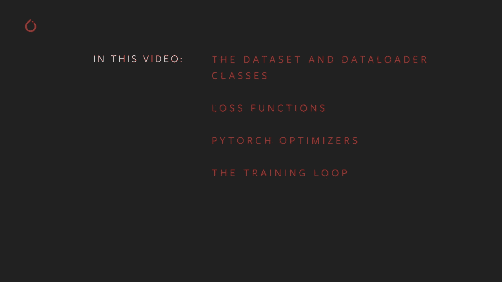
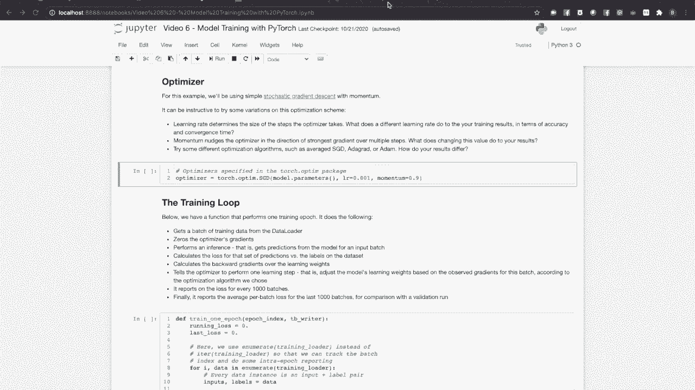
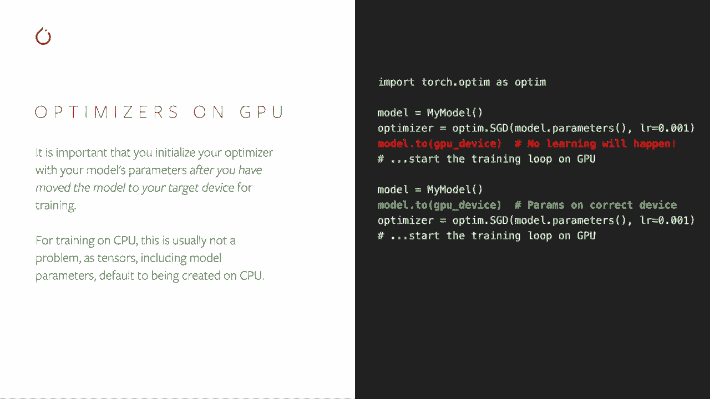
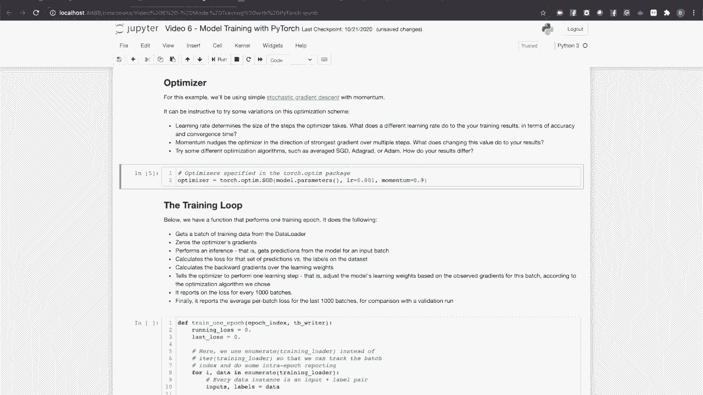
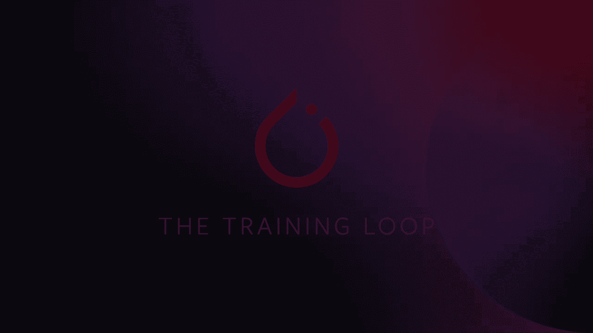
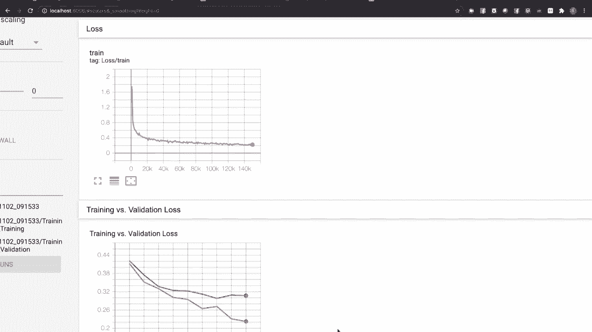
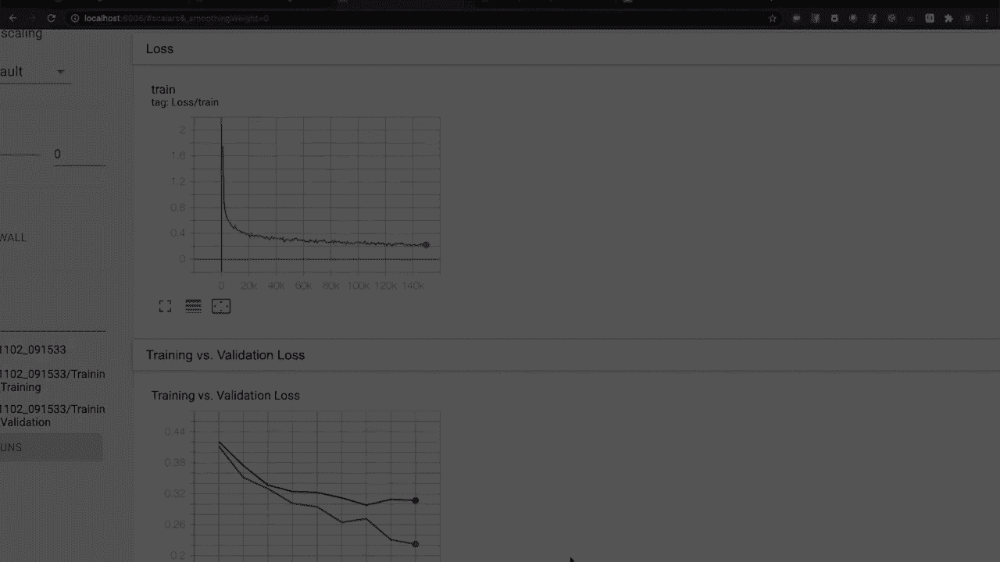
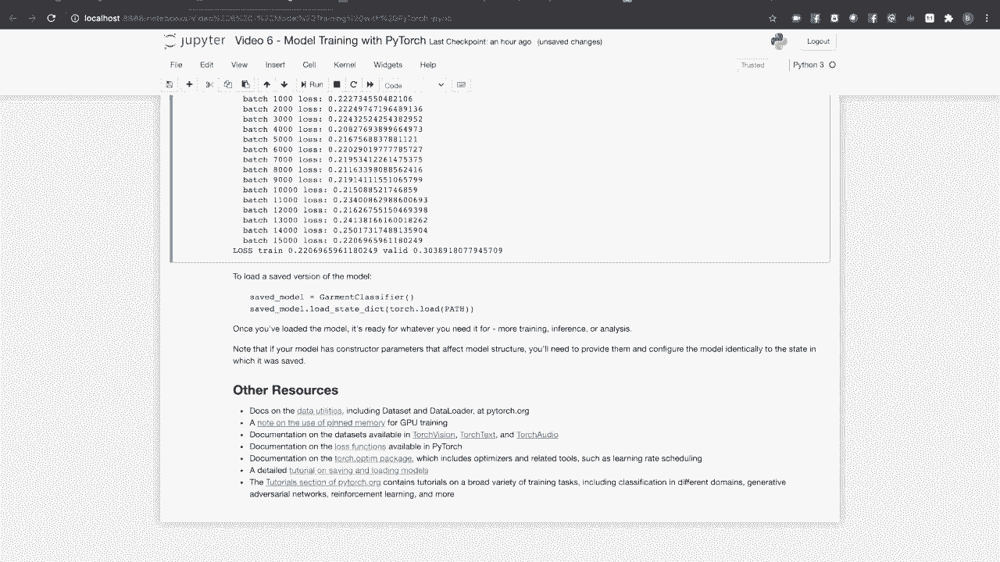

# PyTorch 入门教程 P6：使用 PyTorch 进行训练 🚀

在本节课中，我们将学习 PyTorch 模型训练的核心流程。我们将从数据处理开始，了解如何准备和加载数据，然后介绍损失函数和优化器的作用，最后将所有部分组合成一个完整的训练循环。

---

## 概述 📋

在之前的课程中，我们学习了如何使用 `torch.nn` 模块构建神经网络，以及自动梯度计算和 TensorBoard 可视化的基础知识。本节课，我们将为你的工具库添加新工具。我们将熟悉数据集和数据加载器的抽象，了解它们如何简化训练循环中的数据供给过程。我们将讨论特定损失函数及其适用场景，查看 PyTorch 优化器如何根据损失函数调整模型权重。最后，我们将看到所有这些组件如何协同工作，构成一个完整的 PyTorch 训练循环。



---

## 数据处理：数据集与数据加载器 📊

在 PyTorch 中，高效的数据处理通过两个主要类实现：`Dataset` 和 `DataLoader`。

`Dataset` 负责从你的数据中访问和处理单个样本。PyTorch 领域 API（如 TorchVision、TorchText）提供了许多现成的数据集，你也可以通过子类化 `Dataset` 父类来创建自己的数据集。

`DataLoader` 从数据集中提取样本，可以自动进行，也可以使用自定义的采样器。它将数据收集成批次并返回，供训练循环使用。`DataLoader` 可以与各种类型的数据集配合使用。

PyTorch 的领域 API（TorchVision、TorchText 和 TorchAudio）提供了一系列开源的、带标签的数据集，可能对你的训练任务有用。

*   **TorchVision** 包含广泛的用于分类、目标检测和分割的带标签数据集。它还包含便利类，如 `ImageFolder` 和 `DatasetFolder`，使你能够轻松地从文件系统中的图像或其他数据创建数据集。
*   **TorchText** 提供了用于各种分类、翻译和分析任务的带标签数据集。
*   **TorchAudio** 提供了用于转录和音乐类型检测的带标签数据集。

有关这些类的更多详细信息，请参阅官方文档。

### 创建自定义数据集

大多数情况下，你知道数据集的大小，并且能够访问任意单个样本。在这种情况下，创建数据集非常简单：只需子类化 `torch.utils.data.Dataset` 并重写两个方法。

*   `__len__` 方法返回数据集中的项目数量。
*   `__getitem__` 方法通过键（通常是索引）访问数据样本。

如果键是顺序整数索引，你的数据集子类将与默认的 `DataLoader` 配置一起工作。如果你使用其他类型的键（如字符串或文件路径），则需要使用自定义采样器类来配置 `DataLoader`。有关此高级技术的更多详细信息，请查看文档。

如果你在运行时不知道数据集的大小（例如，使用实时流数据作为输入），则需要子类化 `torch.utils.data.IterableDataset`。为此，你需要重写 `IterableDataset` 父类的 `__iter__` 方法。请注意，处理多个工作线程请求 `IterableDataset` 的数据样本时，需要做一些额外工作。文档中有示例代码演示这一点。

当你创建自己的数据集时，通常希望将其拆分为训练集、验证集和测试集。`torch.utils.data.random_split` 函数允许你轻松做到这一点。

### 配置数据加载器

创建 `DataLoader` 时，唯一必需的构造函数参数是 `dataset`。最常见的可选参数如下：

*   `batch_size`：设置训练批次中的样本数量。确定最佳批次大小是一个复杂话题。常见值是 4 或 16 的倍数，但最佳大小取决于你的处理器架构、可用内存以及对训练收敛的影响。
*   `shuffle`：通过索引排列随机化样本的顺序。对于训练，通常设置为 `True`，以确保模型的训练不依赖于数据的顺序。对于验证、测试和推理，可以保留默认值 `False`。
*   `num_workers`：设置并行拉取数据样本的线程数量。理想的工作线程数量需要通过实验确定，这取决于你本地机器的配置以及单个数据样本的访问时间。

其他 `DataLoader` 配置参数适用于更高级的情况，例如索引不是顺序整数，或者对于由实时数据流支持的 `IterableDataset`。与往常一样，请查看文档以获取更多详细信息。

### 使用 GPU 加速数据传输

如果你在训练过程中需要将数据批次转移到 GPU，推荐使用**固定内存缓冲区**。这意味着张量底层的内存缓冲区位于页面锁定内存中，这使得主机到 GPU 的数据传输更快。`DataLoader` 类通过在创建时设置 `pin_memory=True` 使这一过程变得简单。关于这一重要最佳实践的说明链接自本视频附带的交互式笔记本。

### 实践：Fashion-MNIST 数据集

在本视频中，我们将使用 Fashion-MNIST 数据集，其中包含服装图像，每张图像标记为 10 个类别之一。

以下代码将创建单独的训练集和验证集 `Dataset` 对象，并下载图像和标签（如果需要）。接着，它将创建适当配置的 `DataLoader`。注意，验证集我们不打乱顺序。我们还将定义要训练的类别标签，并报告数据集的大小。

```python
# 示例代码：创建 Fashion-MNIST 数据集和数据加载器
import torch
from torchvision import datasets, transforms

# 定义数据转换
transform = transforms.Compose([
    transforms.ToTensor(),
    transforms.Normalize((0.5,), (0.5,))
])

# 下载并加载训练集和测试集
trainset = datasets.FashionMNIST('~/.pytorch/F_MNIST_data/', download=True, train=True, transform=transform)
trainloader = torch.utils.data.DataLoader(trainset, batch_size=64, shuffle=True, num_workers=2)

testset = datasets.FashionMNIST('~/.pytorch/F_MNIST_data/', download=True, train=False, transform=transform)
testloader = torch.utils.data.DataLoader(testset, batch_size=64, shuffle=False, num_workers=2)

# 类别标签
class_names = ['T-shirt/top', 'Trouser', 'Pullover', 'Dress', 'Coat',
               'Sandal', 'Shirt', 'Sneaker', 'Bag', 'Ankle boot']

print(f'训练集大小: {len(trainset)}')
print(f'测试集大小: {len(testset)}')
```

我们将遵循可视化数据加载器输出的做法，以确保它符合我们的预期。通过检查，我们确认图片和标签已正确加载。

---

## 损失函数 ⚖️

PyTorch 包含一系列适用于多种任务的常用损失函数。

*   `nn.MSELoss`（均方误差损失）适用于回归任务。
*   `nn.KLDivLoss`（Kullback-Leibler 散度）用于比较连续概率分布。
*   `nn.BCELoss`（二元交叉熵损失）用于二分类任务。
*   `nn.CrossEntropyLoss`（交叉熵损失）用于多类分类任务。

所有损失函数都用于比较模型的输出与某些标签或期望值。

在这个分类任务中，我们将使用 `CrossEntropyLoss`。我们将以无参数的方式调用它的构造函数，但这个特定的损失函数可以配置为重新缩放单个类别的权重、在计算损失时忽略某些类别等。请查看文档以获取详细信息。

以下单元展示了如何创建损失函数，生成一些虚拟的输出和期望值，并计算损失。

```python
import torch.nn as nn



# 创建损失函数
loss_fn = nn.CrossEntropyLoss()

# 创建一些虚拟数据
# outputs: 模型输出 (batch_size=4, num_classes=10)
# labels: 真实标签 (batch_size=4)
outputs = torch.randn(4, 10)
labels = torch.tensor([1, 5, 3, 7])

# 计算损失
loss = loss_fn(outputs, labels)
print(f'批次损失: {loss.item()}')
```



请注意，损失函数将返回整个批次的单个标量值。

---

## 优化器 🔧

PyTorch 优化器执行根据损失函数的梯度反向传播来更新模型权重的任务。关于反向梯度计算的更多信息，请参见本系列之前的视频。

PyTorch 提供多种优化算法，包括随机梯度下降（SGD）、Adam、LBFGS 等，以及用于进一步优化的工具，如学习率调度器。优化算法的全部范围超出了本视频的范围，但我们将讨论大多数 PyTorch 优化器共有的一些特性。



第一个共性是所有优化器必须使用模型参数进行初始化。最好的方法是调用模型对象的 `.parameters()` 方法，如下所示。这些参数是必需的，因为它们是在训练过程中会被更新的权重。



```python
import torch.optim as optim

# 假设我们有一个模型 `model`
optimizer = optim.SGD(model.parameters(), lr=0.001, momentum=0.9)
```

这引出了使用 PyTorch 优化器时的一个重要点：**确保你的模型参数存储在正确的设备上**。如果你在 GPU 上进行训练，必须在初始化优化器之前将模型参数移动到 GPU 内存中。如果不这样做，损失将不会随时间减少，因为优化器将更新错误副本的模型参数。

大多数基于梯度的优化器具有以下参数的某种组合：

*   **学习率 (`lr`)**：决定了优化器所采取的更新步长大小。
*   **动量 (`momentum`)**：使得优化器在最近几个时间步骤中朝着改进最显著的方向采取稍微更大的步骤，有助于加速收敛并减少振荡。
*   **权重衰减 (`weight_decay`)**：即 L2 正则化项，可以鼓励权重变小，有助于避免过拟合。

其他参数通常是特定于算法的系数或权重。

对于我们的例子，我们将使用简单的随机梯度下降（SGD），并指定学习率和动量值。请注意，这些被称为**超参数**的参数的最佳值很难提前确定，通常通过网格搜索或类似的方法来找到。超参数优化是我们将在后面的课程中讨论的主题。

如果你正在使用与此视频配套的互动笔记，请花时间尝试不同的参数值，以查看它们对训练过程的影响。你也可以尝试不同的优化器，以查看哪个能给你最佳的准确率或最快的收敛速度。

---

## 构建训练循环 🔄

现在我们拥有所需的所有部分：一个模型、装在数据加载器中的数据集、一个损失函数以及一个优化器。我们准备好进行训练。与此同时，我们将使用 TensorBoard 可视化我们的训练进展。

以下是执行一个完整训练周期（即对训练数据的一次完整遍历）的函数。

```python
def train_one_epoch(model, train_loader, loss_fn, optimizer, epoch, log_interval=1000):
    model.train()  # 设置为训练模式
    running_loss = 0.0
    for batch_idx, (data, target) in enumerate(train_loader):
        # 1. 梯度归零
        optimizer.zero_grad()
        # 2. 前向传播
        output = model(data)
        # 3. 计算损失
        loss = loss_fn(output, target)
        # 4. 反向传播
        loss.backward()
        # 5. 优化器更新参数
        optimizer.step()

        running_loss += loss.item()
        if batch_idx % log_interval == (log_interval - 1):
            avg_loss = running_loss / log_interval
            print(f'Epoch {epoch}, Batch {batch_idx+1}: 平均损失 = {avg_loss:.4f}')
            # 记录到 TensorBoard (假设 writer 已定义)
            # writer.add_scalar('training loss', avg_loss, epoch * len(train_loader) + batch_idx)
            running_loss = 0.0
    # 返回最后一个批次的损失（或平均损失）以供参考
    return loss.item()
```

在这个函数中：
1.  我们枚举由训练数据加载器提供的数据批次。
2.  对于每个批次，提取输入张量 `data` 和标签 `target`。
3.  将优化器中所有参数的梯度归零（`optimizer.zero_grad()`）。
4.  让模型为输入批次生成预测（`output = model(data)`）。
5.  计算预测值与真实值之间的损失（`loss = loss_fn(output, target)`）。
6.  通过调用 `loss.backward()` 计算损失函数对模型权重的梯度。
7.  调用 `optimizer.step()`，让优化器根据刚计算的梯度调整模型权重。
8.  汇总运行损失，并定期（如每 1000 个批次）记录和报告平均损失到 TensorBoard。

接下来，我们将循环多个周期（epoch）。对于每个周期：
1.  将模型设置为训练模式（`model.train()`），这会启用 dropout、batch normalization 的计算跟踪以进行梯度计算。
2.  调用 `train_one_epoch` 函数训练一个周期，并记录损失。
3.  将模型设置为评估模式（`model.eval()`），这会关闭 dropout 和 batch normalization 的训练时行为，因为接下来的验证步骤不需要计算梯度。
4.  在验证数据集上进行推断，计算验证损失。
5.  报告训练和验证的平均损失（直接打印并记录到 TensorBoard）。
6.  如果当前验证损失是我们为该模型看到的最佳结果，则将模型状态保存到文件中。

让我们运行这个循环并观察单个周期。启动 TensorBoard 后，我们可以看到损失单调减少，这是我们所期望的。

再观察几个周期后，我们发现训练损失和验证损失开始发散（验证损失停止下降甚至上升，而训练损失持续下降）。这在 TensorBoard 图表中也得到了验证。继续训练到 10 个周期后，训练损失略高于 0.2，但训练和验证损失仍然发散。



这表明我们的模型可能对训练数据**过拟合**了。这可能是因为我们的模型对于数据集的复杂度来说过于复杂（过度参数化），或者数据集不够大，无法让模型学习到通用的函数。无论如何，跟踪统计信息、进行一致的验证以及可视化输出使我们能够识别出这个需要调查的问题。同时，我们也已将表现最佳的模型参数保存到文件中以便进一步检查。



值得花时间尝试改变模型结构、优化器参数等，观察在这个相对简单的案例中训练结果如何变化。注意收敛时间、模型在训练集上的准确率与在验证集上性能的变化。

---

## 总结与进阶学习 🎓

在本节课中，我们一起学习了 PyTorch 模型训练的核心流程：

1.  **数据处理**：使用 `Dataset` 和 `DataLoader` 抽象来高效地加载和批处理数据，支持自定义数据集和 GPU 加速。
2.  **损失函数**：根据任务类型（如分类）选择合适的损失函数（如 `CrossEntropyLoss`）来衡量模型预测与真实标签的差距。
3.  **优化器**：使用优化器（如 `SGD`）根据损失函数的梯度自动更新模型参数，并理解了学习率、动量等关键超参数的作用。
4.  **训练循环**：将模型、数据、损失函数和优化器组合在一起，实现了包含前向传播、损失计算、反向传播和参数更新的完整训练周期。我们还使用了模型模式切换（`train()`/`eval()`）和 TensorBoard 可视化来监控训练过程。

模型训练和训练过程的优化是深奥的话题。`pytorch.org` 的文档包含了关于 PyTorch 模型训练的大量有用信息：



*   **教程部分**提供了关于广泛训练主题的信息，包括迁移学习和微调、生成对抗网络（GANs）、强化学习，以及 `torch.distributed` 框架（用于在集群计算机上进行分布式训练）。
*   **文档**包含了我们在本视频中覆盖的工具的完整细节及更多内容：
    *   训练优化器和相关工具（如学习率调度器）的完整细节。
    *   所有可用损失函数的完整细节。
    *   `Dataset` 和 `DataLoader` 类的信息，包括制作自定义数据集类的指导。
    *   `torch.distributed` 及分布式 RPC 框架的文档。
    *   TorchVision、TorchText 和 TorchAudio 中可用数据集的完整信息。


鼓励你深入探索这些资源，以构建更强大、更高效的机器学习模型。