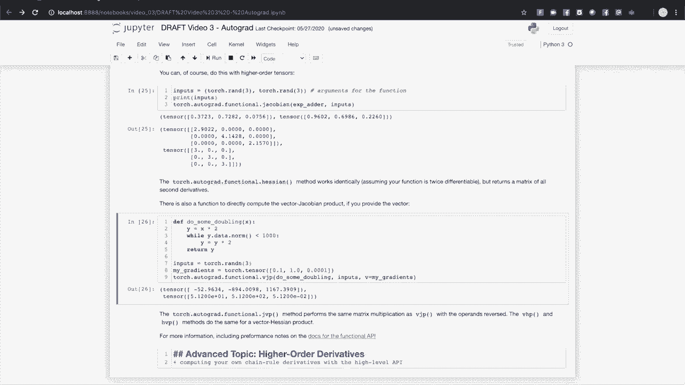

# PyTorch入门课程，P3：L3 - Autograd基础知识 🧠

在本节课中，我们将学习PyTorch的核心特性之一：**Autograd**。Autograd是PyTorch用于自动计算梯度的引擎，它使得基于反向传播的模型训练变得快速而灵活。我们将了解它的工作原理、在训练循环中的作用，以及如何控制梯度计算。

---

## 概述

Autograd通过自动追踪张量上的所有操作来计算导数（梯度）。这对于训练神经网络至关重要，因为我们需要计算损失函数相对于模型参数的梯度，以便通过优化算法（如随机梯度下降）来更新参数。

---

## Autograd的作用与原理

上一节我们概述了Autograd的重要性，本节中我们来看看它的核心机制。

PyTorch的Autograd功能是构建快速灵活深度学习框架的关键部分。它简化了偏导数的计算，这些导数也被称为驱动反向传播学习的梯度。

当我们训练模型时，会计算一个损失函数，它衡量模型预测与理想值之间的差距。为了最小化这个损失，我们需要计算损失函数相对于模型可学习权重的偏导数。这些导数指明了调整权重的方向。计算这些导数需要在计算图的每条路径上应用微积分的链式法则。

Autograd通过在运行时追踪计算来加速此过程。模型计算产生的每个输出张量都携带了其生成过程的操作历史。这个历史使得系统能够快速计算从输出到模型学习权重的导数。由于历史是在运行时收集的，因此即使模型具有动态结构、决策分支或循环，也能获得正确的导数。这为PyTorch提供了超越静态计算图框架的灵活性。

---

## 一个简单的Autograd示例

为了理解Autograd的实际工作方式，我们通过一个简单的代码示例来观察。

首先，导入必要的库并创建一个需要计算梯度的张量。

```python
import torch
import matplotlib.pyplot as plt

# 创建一个一维张量，并设置 requires_grad=True 以追踪梯度
A = torch.linspace(0, 2*torch.pi, steps=100, requires_grad=True)
print(A)
```

打印张量 `A` 时，PyTorch会提示它需要计算梯度。

接下来，我们对 `A` 执行一个计算。

```python
# 计算 A 中所有值的正弦
B = torch.sin(A)
plt.plot(A.detach().numpy(), B.detach().numpy())
plt.show()
```

打印张量 `B`，可以看到它有一个 `grad_fn` 属性，这表示它来自一个需要梯度的计算（`SinBackward` 操作）。

让我们再进行几步计算。

```python
# 对 B 进行加倍并加一
C = 2 * B + 1
print(C)
```

输出张量 `C` 同样包含了其生成操作的信息。

默认情况下，Autograd期望梯度计算的最终输出是一个标量值，这符合损失函数输出单个标量值的情况。我们可以通过对张量元素求和来得到一个标量输出。

```python
# 对 C 的元素求和，得到一个标量输出
D = C.sum()
print(D)
```

我们可以通过 `grad_fn` 属性回溯计算历史。

```python
# 回溯计算历史
print(D.grad_fn)  # 来自 SumBackward
print(C.grad_fn)  # 来自 AddBackward
print(B.grad_fn)  # 来自 SinBackward
print(A.grad_fn)  # None，因为 A 是计算图的叶节点
```

张量 `A` 没有 `grad_fn`，它是计算图的输入（叶节点），也是我们希望计算梯度的目标变量。

那么，如何实际计算梯度呢？只需在输出标量张量上调用 `.backward()` 方法。

```python
# 计算梯度
D.backward()
```

回顾我们的计算：`D = sum(2 * sin(A) + 1)`。根据链式法则，`sin(x)` 的导数是 `cos(x)`，乘以2的因子，加法操作不影响导数。因此，`A` 的梯度应为 `2 * cos(A)`。

我们可以绘制计算出的梯度来验证。

```python
# 绘制 A 的梯度
plt.plot(A.detach().numpy(), A.grad.detach().numpy())
plt.show()
```

图形显示，计算出的梯度确实是 `2 * cos(A)`。请注意，梯度仅为计算的输入（叶节点）计算。反向传播后，中间张量（如 `B`、`C`）不会附带梯度。

---

## Autograd在训练循环中的作用

上一节我们通过简单示例了解了Autograd如何计算梯度，本节中我们来看看它在实际的PyTorch模型训练循环中扮演什么角色。

为了观察Autograd在训练中的作用，我们构建一个小型模型，并观察单个训练批次中发生的变化。

首先，定义一个简单的线性模型。

```python
import torch.nn as nn

# 定义一个简单的线性模型
class TinyModel(nn.Module):
    def __init__(self):
        super().__init__()
        self.linear = nn.Linear(10, 1)  # 10个输入特征，1个输出

    def forward(self, x):
        return self.linear(x)

# 实例化模型
model = TinyModel()
print(model.linear.weight)
print(model.linear.weight.requires_grad)
```

你可能注意到，我们没有在模型参数上显式设置 `requires_grad=True`。PyTorch的 `nn.Module` 会自动为其参数管理梯度追踪。模型的权重是随机初始化的，并且尚未计算梯度（`grad` 属性为 `None`）。

接下来，创建一些模拟的训练数据。

```python
# 创建模拟输入和理想输出
inputs = torch.randn(5, 10)  # 批次大小为5，特征数为10
ideal_outputs = torch.randn(5, 1)  # 批次大小为5，输出维度为1
```

现在，进行一个前向传播并计算损失。

```python
# 前向传播
predictions = model(inputs)

# 定义损失函数：均方误差
loss_fn = nn.MSELoss()
loss = loss_fn(predictions, ideal_outputs)
print(f'初始损失: {loss.item()}')
```

此时，模型权重仍然没有梯度。为了计算梯度，我们需要调用损失张量的 `.backward()` 方法。

```python
# 反向传播，计算梯度
loss.backward()
print(model.linear.weight.grad)  # 现在权重有了梯度
```

调用 `loss.backward()` 后，计算出了损失相对于每个模型参数的梯度。这些梯度指导优化器如何调整权重以最小化损失。

设置一个优化器（如随机梯度下降）并使用计算出的梯度更新权重。

```python
# 设置优化器
optimizer = torch.optim.SGD(model.parameters(), lr=0.01)

# 使用优化器更新权重
optimizer.step()
print(model.linear.weight)  # 权重已更新
```

优化器的 `step()` 方法根据梯度更新参数。但这个过程还有一个关键步骤：在每个训练批次之后，必须将累积的梯度归零。如果不这样做，梯度会在多个批次中不断累加。

```python
# 重要：清零梯度
optimizer.zero_grad()
```

例如，如果我们在不调用 `zero_grad()` 的情况下连续运行多个训练批次，梯度会不断累积，导致训练不稳定。

```python
# 错误示例：梯度累积
for _ in range(5):
    predictions = model(inputs)
    loss = loss_fn(predictions, ideal_outputs)
    loss.backward()  # 梯度累积到 model.linear.weight.grad 中
    # 忘记调用 optimizer.zero_grad()
    optimizer.step()

print(f'累积后的梯度范数: {model.linear.weight.grad.norm()}')

# 正确做法：每次迭代后清零梯度
optimizer.zero_grad()
print(f'清零后的梯度: {model.linear.weight.grad}')  # 应为 None 或全零
```

如果你的模型没有学习或训练结果异常，首先应检查是否在每个训练步骤后正确调用了 `optimizer.zero_grad()`。

---

## 控制梯度追踪

有时，出于性能或功能原因，你可能需要控制Autograd的梯度追踪行为。PyTorch提供了多种方法来实现这一点。

以下是控制梯度追踪的几种常见方式：

1.  **直接设置 `requires_grad` 标志**：这是最直接的方法，可以永久关闭张量的梯度追踪。
    ```python
    A = torch.randn(5, requires_grad=True)
    B1 = A * 2  # B1 有 grad_fn

    A.requires_grad_(False)  # 关闭 A 的梯度追踪
    B2 = A * 2  # B2 没有 grad_fn
    print(B1.grad_fn)
    print(B2.grad_fn)
    ```

2.  **使用 `torch.no_grad()` 上下文管理器**：临时禁用上下文内所有计算的梯度追踪。
    ```python
    A = torch.randn(5, requires_grad=True)
    with torch.no_grad():
        B = A * 2  # B 没有 grad_fn
    C = A * 3      # C 有 grad_fn
    print(B.grad_fn)
    print(C.grad_fn)
    ```
    `torch.no_grad()` 也可以用作函数装饰器。

3.  **使用 `torch.enable_grad()` 上下文管理器**：在局部上下文中启用梯度追踪（通常用于在 `no_grad` 块内临时启用）。
    ```python
    with torch.no_grad():
        A = torch.randn(5)
        with torch.enable_grad():
            B = A * 2  # B 有 grad_fn
        C = A * 3      # C 没有 grad_fn
    ```

4.  **使用 `.detach()` 方法**：从计算历史中分离出一个张量，得到一个不需要梯度的副本。这在需要将张量转换为NumPy数组或进行其他不需要梯度追踪的操作时非常有用。
    ```python
    A = torch.randn(5, requires_grad=True)
    B = A.detach()  # B 是 A 的副本，但不追踪梯度
    print(A.requires_grad)
    print(B.requires_grad)
    ```

**重要警告**：必须谨慎对需要梯度的张量使用就地操作（如 `x += 1`）。这可能会破坏计算图，导致无法正确进行反向传播。PyTorch通常会阻止对需要梯度的张量进行就地操作，并抛出运行时错误。

---

## Autograd分析器

Autograd不仅可以追踪计算，还可以与时间测量结合，用于分析梯度追踪计算的性能。Autograd分析器是PyTorch内置的性能分析工具。

以下是分析器的基本用法示例：

```python
import torch.autograd.profiler as profiler

# 创建一个需要梯度的张量
x = torch.randn(100, 100, requires_grad=True)
y = torch.randn(100, 100)

# 使用分析器记录一个计算块
with profiler.profile(record_shapes=True) as prof:
    with profiler.record_function("matrix_multiplication"):
        z = x @ y  # 矩阵乘法
        z.sum().backward()

# 打印分析结果
print(prof.key_averages().table(sort_by="cpu_time_total", row_limit=10))
```

分析器可以按操作、代码块或输入形状对结果进行分组，并可以将结果导出以供其他追踪工具使用。更多高级用法请参考PyTorch官方文档。

---

## Autograd高级API（PyTorch 1.5+）

PyTorch 1.5引入了Autograd的高级函数式API，它暴露了Autograd背后的核心微分操作。为了理解这个API，我们需要一些数学背景。

假设你有一个函数 **f**，它有 **n** 个输入和 **m** 个输出：**y = f(x)**。关于输入的输出的完整偏导数集合是一个称为**雅可比矩阵（Jacobian）** 的 **m × n** 矩阵。

现在，如果你有第二个函数 **L = g(y)**，它接受 **m** 维输入（与第一个函数的输出维度相同）并返回一个标量输出。其梯度可以表示为一个关于 **y** 的列向量（这本质上是一个单列的雅可比矩阵）。

将这与机器学习联系起来：
*   第一个函数 **f** 是你的PyTorch模型，它有许多输入（包括可学习权重）和许多输出。
*   第二个函数 **g** 是损失函数，它以模型输出作为输入，输出一个标量损失值。

根据链式法则，损失相对于模型权重的梯度可以通过将模型输出的雅可比矩阵与损失函数的梯度向量相乘得到。PyTorch的Autograd引擎本质上是一个用于计算这种**向量-雅可比乘积（Vector-Jacobian Product, VJP）** 的系统。

因此，`.backward()` 方法也可以接受一个可选的向量参数，该向量表示输出张量上的梯度，用于与追踪张量的雅可比矩阵相乘。

```python
# 示例：带向量输入的 .backward()
x = torch.randn(3, requires_grad=True)
y = x * 2
# y 是一个向量，不是标量
# y.backward()  # 这会报错：梯度只能为标量输出隐式计算

# 为 y 提供一个梯度向量（形状与 y 相同）
grad_output = torch.tensor([1.0, 2.0, 3.0])
y.backward(gradient=grad_output)
print(x.grad)  # 应为 [2., 4., 6.]，因为 y = x*2，且乘上了 grad_output
```

Autograd的高级API提供了直接访问关键微分操作的函数：

*   **`torch.autograd.functional.jacobian(func, inputs)`**：计算函数在给定输入处的雅可比矩阵。
    ```python
    def add_exp(x):
        return torch.stack([torch.exp(x[0]) * 2, x[1] + 3])

    inputs = torch.tensor([1.0, 2.0], requires_grad=True)
    J = torch.autograd.functional.jacobian(add_exp, inputs)
    print(J)
    # 第一个输出对第一个输入的导数：2*exp(1) ≈ 5.436
    # 第二个输出对第二个输入的导数：1
    ```

*   **`torch.autograd.functional.hessian(func, inputs)`**：计算函数在给定输入处的海森矩阵（二阶偏导数矩阵）。

*   **`torch.autograd.functional.vjp(func, inputs, v)`**：计算向量-雅可比乘积。

*   **`torch.autograd.functional.jvp(func, inputs, v)`**：计算雅可比-向量乘积。

*   **`torch.autograd.functional.hvp(func, inputs, v)`** 和 **`torch.autograd.functional.vhp(func, inputs, v)`**：计算向量-海森乘积。

这些函数式API提供了更精细的控制，并且在某些情况下（如高阶导数计算）可能更高效。有关详细信息和重要的性能说明，请参阅PyTorch官方文档中关于Autograd Functional API的部分。

---

## 总结



在本节课中，我们一起学习了PyTorch Autograd的核心知识：


1.  **Autograd的作用**：自动计算梯度，是神经网络训练中反向传播的基础。
2.  **基本原理**：通过在运行时追踪张量操作构建动态计算图，并应用链式法则计算导数。
3.  **在训练中的应用**：在训练循环中，`loss.backward()` 计算梯度，`optimizer.step()` 更新参数，`optimizer.zero_grad()` 清除累积梯度。
4.  **控制梯度追踪**：可以使用 `requires_grad` 标志、`torch.no_grad()` 上下文管理器或 `.detach()` 方法来管理梯度计算。
5.  **性能分析**：使用Autograd分析器可以剖析梯度计算过程的性能。
6.  **高级API**：PyTorch 1.5+ 的函数式API提供了对雅可比矩阵、海森矩阵以及向量-雅可比乘积等底层微分操作的直接访问，用于更高级的用例。

掌握Autograd是有效使用PyTorch进行深度学习研究和开发的关键。它提供的自动微分能力，结合动态图的灵活性，使得构建和实验复杂模型变得更加容易。