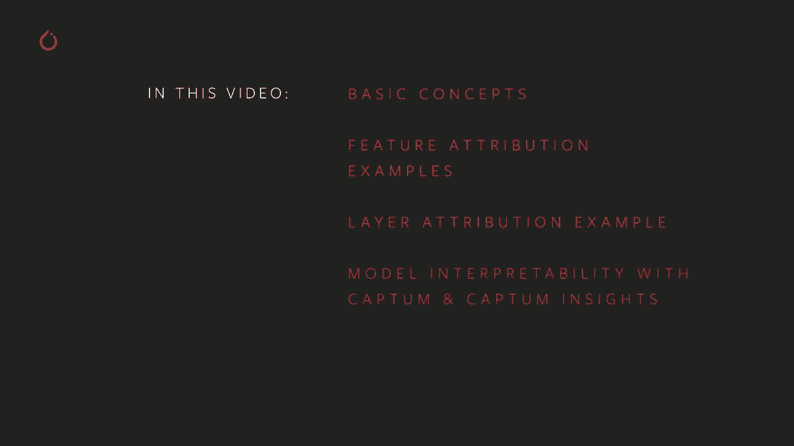
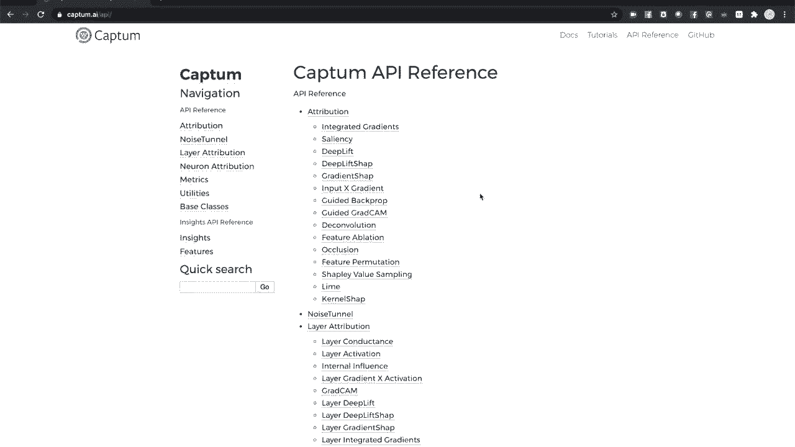
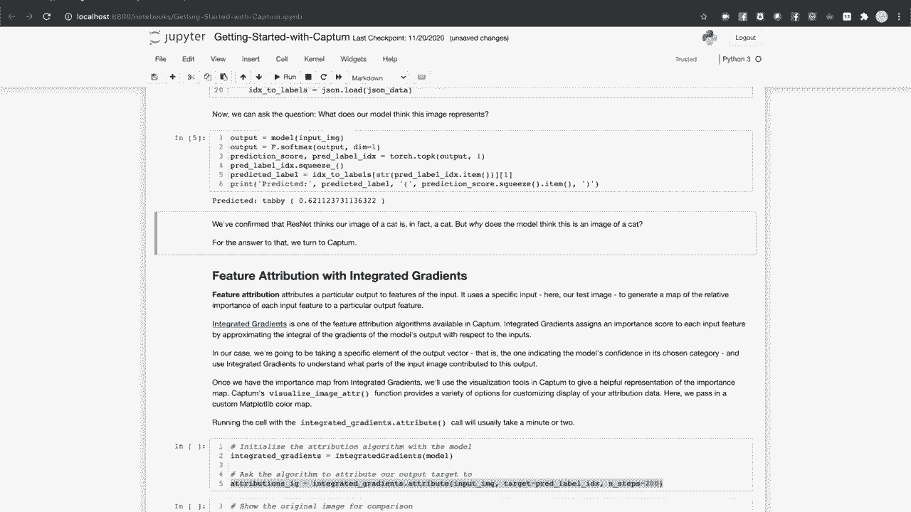
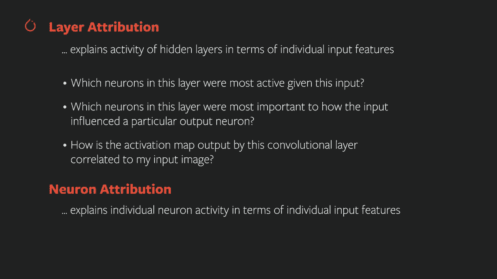
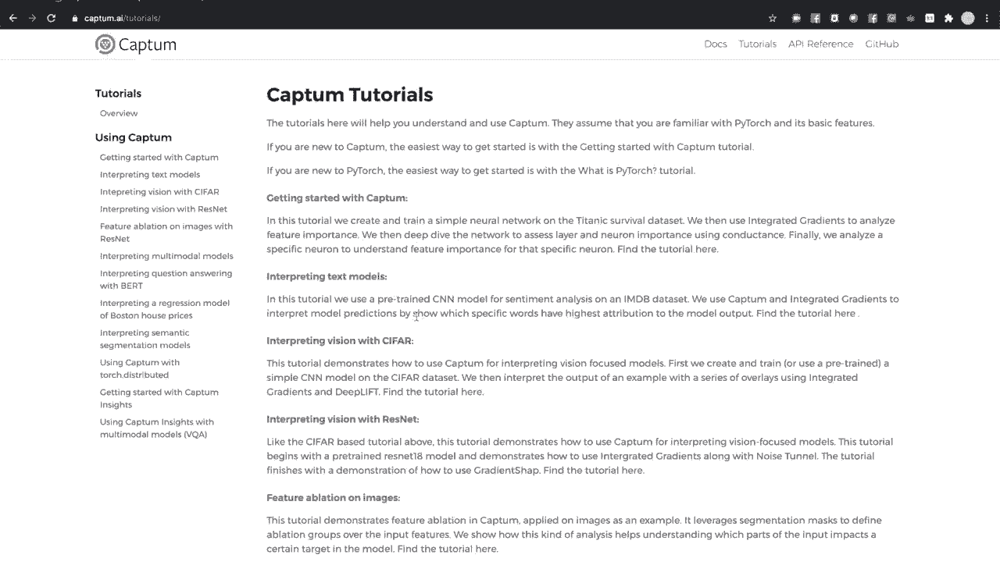

# PyTorch入门课程 P7：🎯 使用Captum进行模型理解


在本节课中，我们将学习如何使用Captum，这是一个PyTorch的模型可解释性工具集。我们将探讨其核心概念，并通过实际示例演示如何为图像分类模型执行和可视化特征归因与层归因。

Captum提供了一套工具，用于解释PyTorch模型的行为。本教程将概述其核心功能，包括归因算法和可视化方法。更深入的教程和API参考可在Captum AI网站上找到。



## 环境准备与模型加载

要运行本教程的代码，你需要安装Python 3.6或更高版本、Flask 1.1或更高版本，以及最新版本的PyTorch、TorchVision和Captum。Captum可以通过Pip或Anaconda轻松安装。



首先，我们将导入必要的库，并加载一个在ImageNet数据集上预训练的ResNet模型。我们还将准备一张猫的图像用于分析。


```python
import torch
import torchvision
from torchvision import transforms
from captum.attr import IntegratedGradients, Occlusion, LayerGradCam
from captum.insights import AttributionVisualizer
from captum.insights.attr_vis.features import ImageFeature
```

接下来，我们加载预训练模型，定义图像预处理转换，并获取ImageNet的类别标签。

```python
# 加载预训练的ResNet模型
model = torchvision.models.resnet18(pretrained=True)
model.eval()

# 定义图像预处理转换
transform = transforms.Compose([
    transforms.Resize(256),
    transforms.CenterCrop(224),
    transforms.ToTensor(),
    transforms.Normalize(mean=[0.485, 0.456, 0.406], std=[0.229, 0.224, 0.225])
])

# 加载ImageNet类别标签
with open(‘imagenet_classes.txt’) as f:
    classes = [line.strip() for line in f.readlines()]
```

现在，让我们处理一张猫的图像，并查看模型的预测结果。

```python
# 加载并预处理图像
from PIL import Image
img = Image.open(‘cat.jpg’)
transformed_img = transform(img).unsqueeze(0)  # 添加批次维度



# 获取模型预测
output = model(transformed_img)
_, predicted_idx = torch.max(output, 1)
predicted_label = classes[predicted_idx.item()]
print(f“模型预测: {predicted_label}”)
```

模型正确地识别了图像中的猫。但它是如何做出这个决定的呢？接下来，我们将使用Captum来探究模型内部的决策过程。

## 理解归因：模型决策的“为什么”

Captum的核心抽象是**归因**，这是一种将模型的输出或内部活动与其输入联系起来的定量方法。主要有三种类型的归因：

1.  **特征归因**：分析输入的哪些部分（如像素、单词）对模型的特定预测最重要。
2.  **层归因**：将模型隐藏层（如卷积层）的活动归因于输入，帮助我们理解模型内部的处理过程。
3.  **神经元归因**：深入到单个神经元的层面进行分析。

在本教程中，我们将重点介绍特征归因和层归因。

## 特征归因实战




特征归因通过特定的**归因算法**来实现。我们将尝试两种算法：积分梯度和遮挡法。

### 方法一：积分梯度

积分梯度算法通过数值近似模型输出相对于输入的梯度积分，来找出最重要的输入路径。

```python
# 创建积分梯度归因器
ig = IntegratedGradients(model)
# 计算归因
attributions_ig = ig.attribute(transformed_img, target=predicted_idx, n_steps=50)
```

计算完成后，我们得到了一个数值重要性图。为了直观理解，我们使用Captum的可视化工具将其与原始图像叠加显示。

```python
from captum.attr import visualization as viz

# 准备图像数据用于可视化
original_image = transformed_img.squeeze().cpu().detach().numpy()
original_image = np.transpose(original_image, (1, 2, 0))

# 可视化原始图像
_ = viz.visualize_image_attr(None, original_image, method=“original_image”, title=“Original Image”)

# 可视化积分梯度归因热图
_ = viz.visualize_image_attr(
    attributions_ig.squeeze().cpu().detach().numpy(),
    original_image,
    method=“heat_map”,
    cmap=‘viridis’,
    sign=“positive”,
    title=“Integrated Gradients”
)
```

热图显示，模型主要关注猫的轮廓和脸部中心区域，这些是识别猫的关键特征。

### 方法二：遮挡法

遮挡法是一种基于扰动的方法：它系统地遮挡图像的不同部分，并观察模型预测置信度的变化，从而确定哪些区域最重要。

```python
# 创建遮挡归因器
occlusion = Occlusion(model)
# 计算归因
attributions_occ = occlusion.attribute(transformed_img,
                                       target=predicted_idx,
                                       sliding_window_shapes=(3, 15, 15),
                                       strides=(3, 8, 8),
                                       baselines=0)
```

我们可以用多种方式可视化遮挡法的结果：

```python
# 可视化正面和负面归因，以及掩膜效果
_ = viz.visualize_image_attr_multiple(
    attributions_occ.squeeze().cpu().detach().numpy(),
    original_image,
    [“original_image”, “heat_map”, “heat_map”, “masked_image”],
    [“all”, “positive”, “negative”, “positive”],
    titles=[“Original”, “Positive Attribution”, “Negative Attribution”, “Masked by Positive”]
)
```

可视化结果再次证实，模型最关注猫脸和轮廓区域。遮挡法提供了与积分梯度互补的视角。

## 探究模型内部：层归因

上一节我们介绍了如何分析输入特征的重要性。本节中，我们来看看模型内部发生了什么。**层归因**可以帮助我们理解隐藏层如何响应输入。

我们将使用**GradCAM**算法，它专为分析卷积神经网络（CNN）的层而设计。GradCAM计算输出相对于指定层的梯度，将其与层激活相乘，得到该层对输出的重要性度量。

```python
# 指定要分析的层（例如，ResNet的最后一个卷积层）
target_layer = model.layer4[1].conv2

# 创建层GradCAM归因器
layer_attributor = LayerGradCam(model, target_layer)
# 计算层归因
layer_attributions = layer_attributor.attribute(transformed_img, target=predicted_idx)
```

卷积层的输出是低分辨率的激活图。为了与输入图像对比，我们需要将其上采样到原始图像尺寸。

```python
# 将低分辨率激活图上采样到输入图像大小
upsampled_attr = layer_attributor.interpolate(layer_attributions, transformed_img.shape[2:])

# 可视化层归因结果
_ = viz.visualize_image_attr(
    upsampled_attr.squeeze().cpu().detach().numpy(),
    original_image,
    method=“blended_heat_map”,
    sign=“positive”,
    title=“Layer Attribution with GradCAM”
)
```

这个可视化显示了指定卷积层的哪些激活区域对最终的“猫”预测贡献最大，让我们能一窥模型在中间层的“思考”过程。

## 高级可视化：Captum Insights

对于更灵活和交互式的分析，Captum提供了**Captum Insights**工具。它允许你在浏览器中配置不同的归因算法和参数，并可视化结果。

以下是如何为多张图像设置Captum Insights：

```python
# 准备一个包含多张图像和标签的数据集
def dataset():
    images = [‘cat.jpg’, ‘teapot.jpg’, ‘trilobite.jpg’]
    labels = [282, 849, 69]  # ImageNet中对应的类别索引
    for img_path, label in zip(images, labels):
        img = Image.open(img_path)
        yield transform(img).unsqueeze(0), label

# 创建归因可视化器
visualizer = AttributionVisualizer(
    models=[model],
    score_func=lambda o: torch.nn.functional.softmax(o, 1),  # 使用softmax获取概率
    classes=classes,
    features=[
        ImageFeature(“Image”, baseline_transforms=[lambda x: x * 0])  # 图像特征，基线为全黑
    ],
    dataset=dataset()
)

# 在Jupyter Notebook中渲染交互式小部件
visualizer.render()
```

运行后，会出现一个交互式界面。你可以选择归因算法（如积分梯度），点击“获取归因”，Captum Insights就会为每张图像生成预测概率和归因热图。这使你可以快速实验，并以最少的代码深入理解模型在不同输入上的行为。

## 总结

本节课中，我们一起学习了如何使用Captum工具集来理解和解释PyTorch模型。

我们首先介绍了**归因**的核心概念，即量化输入特征或内部层活动对模型输出的贡献。接着，我们实践了两种**特征归因**算法：**积分梯度**（基于梯度）和**遮挡法**（基于扰动），并通过热图可视化了模型在识别猫图像时关注的像素区域。

然后，我们深入模型内部，使用**层归因**算法**GradCAM**分析了卷积层的激活，理解了中间层如何影响最终预测。最后，我们探索了**Captum Insights**这个强大的交互式工具，它可以方便地对比不同算法和参数下的归因结果。



通过本课的学习，你现在已经掌握了使用Captum初步诊断和解释模型决策的基本技能，这是构建可靠、可信AI系统的重要一步。更多高级功能和详细API，请参考Captum官方文档。