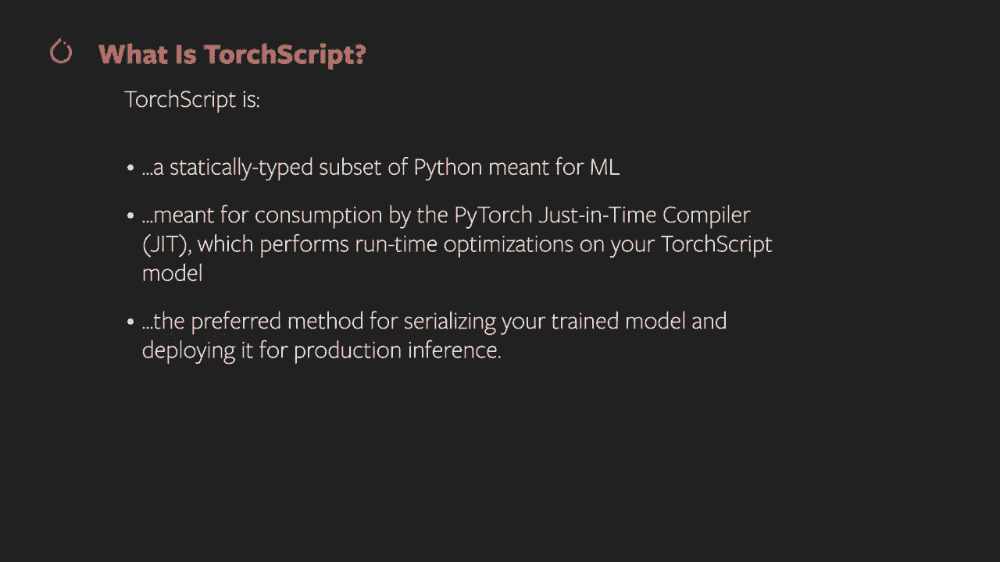
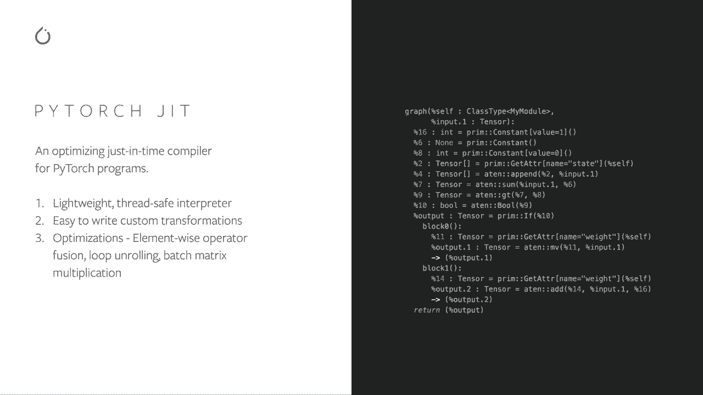
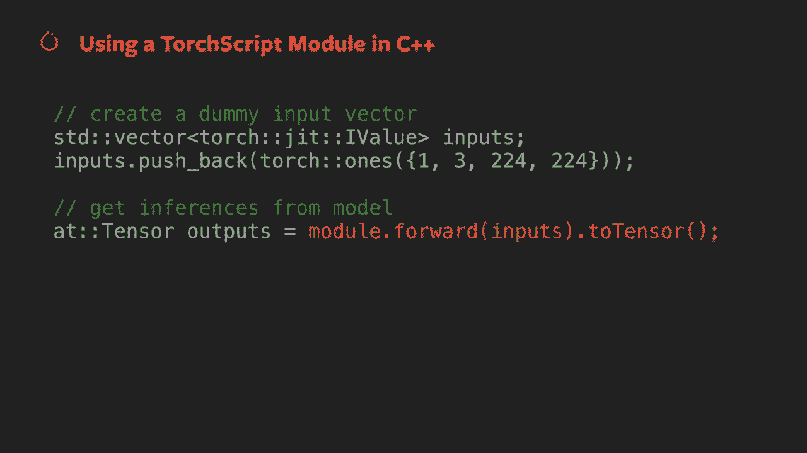
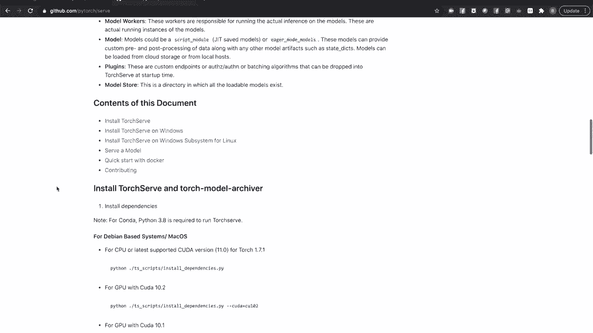
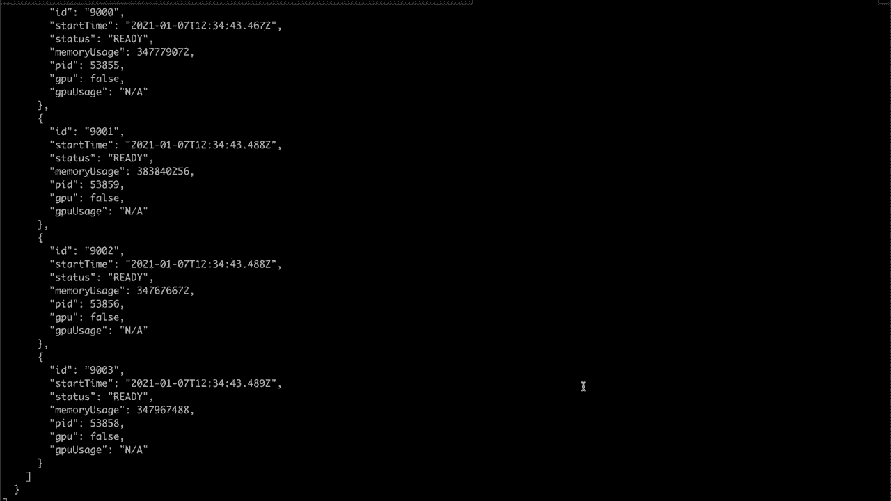
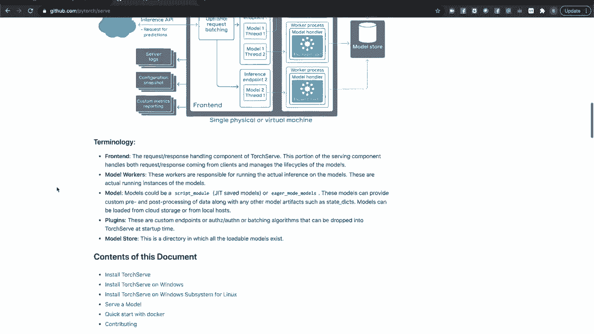

# PyTorch入门课程 P8：使用PyTorch进行生产推理部署 🚀


在本节课中，我们将学习如何将训练好的PyTorch模型部署到生产环境中进行推理。我们将涵盖从设置模型评估模式，到转换为Torch Script，再到使用C++进行高性能推理，以及利用TorchServe构建模型服务系统的完整流程。

---

## 1. 设置模型为评估模式

上一节我们介绍了模型训练，本节中我们来看看如何为推理做准备。将模型置于评估模式是部署前的第一步。

评估模式与训练模式相反。它关闭了在推理时不希望出现的、与训练相关的行为。具体来说：
*   它关闭了自动求导（autograd）。PyTorch张量（包括模型的学习权重）会跟踪其计算历史以帮助快速计算梯度，这在内存和计算上可能很昂贵，且推理时不需要。
*   它改变了某些包含训练特定功能模块的行为。例如，Dropout层仅在训练期间激活，评估模式会使其失效。批归一化（BatchNorm）层在训练期间会跟踪其计算的均值和方差的运行统计量，在评估模式下此行为被关闭。

以下是设置模型为评估模式的过程：
1.  加载基于Python的模型。这通常涉及从磁盘加载模型的状态字典并用它初始化模型对象。
2.  在模型对象上调用 `.eval()` 方法。

```python
# 示例：加载模型并设置为评估模式
model = MyModel()
model.load_state_dict(torch.load('model_weights.pth'))
model.eval()  # 设置模型为评估模式
```

值得注意的是，`.eval()` 方法实际上是调用 `.train(False)` 的别名。如果你的代码已经包含一个指示训练或推理的标志，这可能会很有用。



一旦模型进入评估模式，你就可以开始向其发送数据批次进行推理。

---

## 2. 将模型转换为Torch Script

为了优化性能并便于部署，我们可以将PyTorch模型转换为Torch Script。Torch Script是PyTorch模型的一种中间表示，可以被即时编译器（JIT）优化，并允许你将模型和权重保存在一个文件中。



### 2.1 什么是Torch Script？

Torch Script是一个用于表示PyTorch模型的静态类型Python子集。它旨在被PyTorch的即时编译器（JIT）使用，执行运行时优化（如操作符融合和批处理矩阵乘法）以提高模型性能。它还允许你将模型和权重保存在一个文件中，并作为脚本模块对象加载，你可以像调用原始模型一样调用它。

### 2.2 如何使用Torch Script？

以下是使用Torch Script的步骤：
1.  像往常一样在Python中构建、测试和训练你的模型。
2.  当准备将模型导出用于生产推理时，使用 `torch.jit.trace` 或 `torch.jit.script` 将模型转换为Torch Script。
3.  在得到的脚本模块上调用 `.save()` 方法，将其保存到一个包含计算图和模型学习权重的单一文件中。

以下是两种转换方法的区别：

*   **`torch.jit.script`**：通过直接检查你的代码并将其通过TorchScript编译器运行来转换模型。它保留了控制流（如果你的前向函数有条件或循环，你将需要它），并且能适应常见的Python数据结构。然而，由于TorchScript编译器中Python操作符支持的限制，一些模型可能无法使用此方法转换。
*   **`torch.jit.trace`**：通过使用一个样本输入执行模型并“追踪”计算图来生成TorchScript版本。这种方法不受TorchScript操作符覆盖的限制，但因为它只追踪代码中的单一路径，所以不会保留可能导致变量或非确定性运行时行为的条件或其他控制流结构。

你也可以混合使用追踪和脚本化。有关详细信息，请查阅 `torch.jit` 模块的文档。

```python
# 示例：使用 torch.jit.trace 转换模型
example_input = torch.rand(1, 3, 224, 224)
traced_script_module = torch.jit.trace(model, example_input)
traced_script_module.save("traced_model.pt")

# 示例：使用 torch.jit.script 转换模型
scripted_model = torch.jit.script(model)
scripted_model.save("scripted_model.pt")
```

进行推理时，你可以使用 `torch.jit.load` 加载模型，并以与模型的Python版本相同的方式馈送输入批次。

---

## 3. 在C++中加载Torch Script模型

在某些生产环境中，你可能需要高吞吐量或实时推理，并希望避免Python解释器的开销。你的生产环境也可能已经围绕C++代码建立。PyTorch提供了C++前端（LibTorch），允许你在C++中加载和运行Torch Script模型。

### 3.1 设置步骤

1.  访问 [pytorch.org](https://pytorch.org) 并下载最新版本的LibTorch。
2.  解压缩包并将其放置在你的构建系统可以找到的位置。
3.  在你的C++项目中使用CMake进行配置，确保使用C++14或更高版本。

### 3.2 C++推理代码示例



在Python中，你导入torch，使用 `torch.jit.load` 加载模型，然后调用它。在C++中过程类似：

```cpp
#include <torch/script.h> // 单一包含头文件

int main() {
    // 声明并加载Torch Script模块
    torch::jit::script::Module module;
    try {
        module = torch::jit::load("traced_model.pt");
    } catch (const c10::Error& e) {
        std::cerr << "加载模型失败\n";
        return -1;
    }

    // 创建输入张量（示例中使用全1张量，实际应根据模型要求）
    std::vector<torch::jit::IValue> inputs;
    inputs.push_back(torch::ones({1, 3, 224, 224}));

    // 执行推理
    at::Tensor output = module.forward(inputs).toTensor();

    // 处理输出...
    std::cout << output.slice(/*dim=*/1, /*start=*/0, /*end=*/5) << '\n';
}
```

pytorch.org的教程部分包含了引导你设置C++项目以及展示C++前端各个方面的内容。

---



## 4. 使用TorchServe部署模型

设置生产模型服务环境可能很复杂，特别是当你需要服务多个模型、处理多个版本、要求可扩展性或需要详细的日志记录和指标时。TorchServe是PyTorch的模型服务解决方案，旨在满足这些需求。

### 4.1 TorchServe核心功能

TorchServe加载你的模型到独立的进程空间中，并将传入的请求分发给它们。其主要功能包括：
*   **内置处理器**：涵盖图像分类、分割、目标检测和文本分类等常见用例。
*   **模型版本管理**：允许为模型设置版本标识符，并同时服务多个版本。
*   **请求批处理**：可批量处理来自多个来源的输入请求，以提高吞吐量。
*   **日志记录与指标**：提供强大的日志记录功能以及记录自定义指标的能力。
*   **API接口**：提供用于推断的RESTful API和用于模型管理的API，可通过HTTPS进行安全保护。

### 4.2 快速入门示例

以下演示如何设置和运行TorchServe，使用一个预训练的图像分类模型。

**步骤1：安装TorchServe**
建议创建一个新的Conda环境。
```bash
# 克隆TorchServe仓库（包含安装脚本）
git clone https://github.com/pytorch/serve.git
cd serve

# 安装依赖（根据系统调整，例如指定CUDA版本）
./scripts/install_dependencies.py

# 安装torchserve和模型归档工具
pip install torchserve torch-model-archiver
```

**步骤2：准备模型归档**
模型归档是一个包含模型代码、权重及其他支持文件的包。
```bash
# 1. 下载预训练权重（以DenseNet-161为例）
wget https://download.pytorch.org/models/densenet161-8d451a50.pth -O densenet161.pth

# 2. 创建模型归档
torch-model-archiver \
    --model-name densenet161 \
    --version 1.0 \
    --model-file serve/examples/image_classifier/densenet_161/model.py \
    --serialized-file densenet161.pth \
    --handler image_classifier \
    --extra-files serve/examples/image_classifier/index_to_name.json
```
这将生成一个 `densenet161.mar` 文件。

**步骤3：启动TorchServe**
```bash
# 创建模型存储目录
mkdir model_store
mv densenet161.mar model_store/

# 启动TorchServe服务
torchserve --start --ncs --model-store model_store --models densenet161.mar
```

**步骤4：进行推理**
```bash
# 下载示例图片
curl -O https://raw.githubusercontent.com/pytorch/serve/master/docs/images/kitten_small.jpg

# 调用预测API
curl http://localhost:8080/predictions/densenet161 -T kitten_small.jpg
```
服务器将返回模型识别出的前几个类别及其置信度。

**步骤5：使用管理API**
管理API默认运行在8081端口，可用于查看和管理模型。
```bash
# 查看已注册的模型
curl http://localhost:8081/models

# 查看特定模型详情
curl http://localhost:8081/models/densenet161

# 调整模型工作进程数
curl -v -X PUT "http://localhost:8081/models/densenet161?min_worker=4&max_worker=4"

# 停止TorchServe服务
torchserve --stop
```

TorchServe GitHub仓库中提供了更多操作指南和示例，包括设置HTTPS、编写自定义处理器等。



---



## 总结


在本节课中，我们一起学习了将PyTorch模型部署到生产环境进行推理的完整流程。我们从**设置模型为评估模式**开始，这是关闭训练特定行为的关键一步。接着，我们探讨了如何通过**Torch Script**将模型转换为可优化、可序列化的格式，并介绍了在**C++中使用LibTorch**进行高性能推理的方法。最后，我们介绍了**TorchServe**这一强大的模型服务框架，它能够帮助我们轻松管理、版本控制和扩展模型服务。


记住，选择哪种部署方式取决于你的具体需求：简单的脚本转换适用于大多数情况；C++部署适用于对性能有极致要求或已有C++基础架构的环境；而TorchServe则适用于需要完整、可扩展模型服务系统的复杂生产场景。