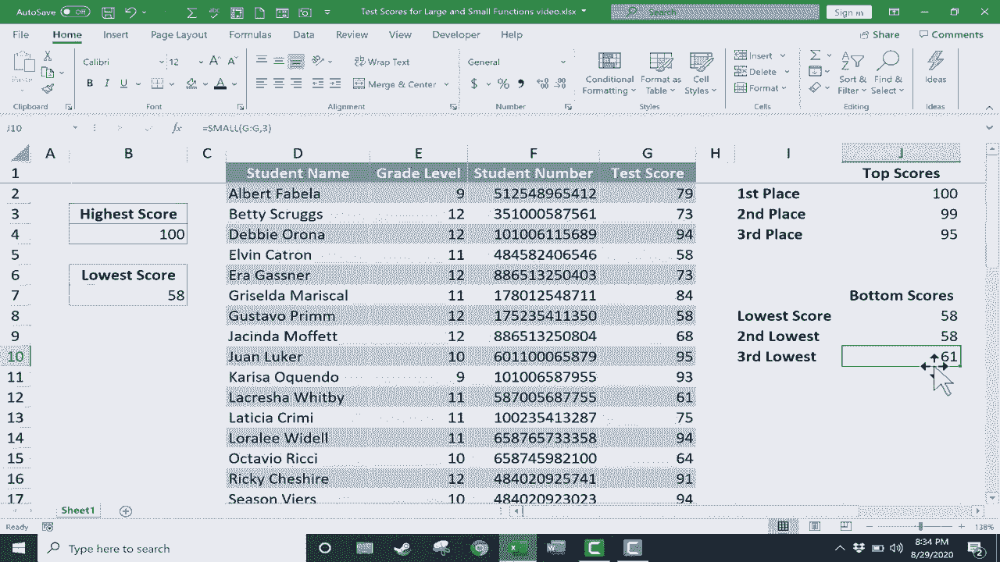

# Excel 中级教程 - P52：53）LARGE 函数和 SMALL 函数 📊


在本节课中，我们将要学习 Excel 中两个功能强大但较少被提及的函数：`LARGE` 函数和 `SMALL` 函数。它们在某些场景下比常用的 `MAX` 和 `MIN` 函数更为灵活和强大。

假设我们有一份包含学生姓名和考试分数的列表。作为老师，我们不仅需要找到最高分和最低分，有时还需要快速找出前几名或后几名的分数。这正是 `LARGE` 和 `SMALL` 函数大显身手的地方。

## 回顾 MAX 与 MIN 函数

上一节我们提到了查找极值的需求。大多数人会使用 `MAX` 和 `MIN` 函数来找到最高分和最低分。

例如，要找到最高分，可以在单元格中输入公式：
```excel
=MAX(G:G)
```
按下回车键后，函数会返回分数列中的最大值，例如 100 分。

同样，要找到最低分，可以使用公式：
```excel
=MIN(G:G)
```
这个公式会返回分数列中的最小值，例如 58 分。

这种方法简单直接，但只能返回一个极值。

## 引入更强大的 LARGE 和 SMALL 函数

本节中我们来看看如何超越单一的极值。`LARGE` 和 `SMALL` 函数允许我们获取指定排名位置的数据。

`LARGE` 函数用于返回数据集中第 K 个最大值。其语法结构为：
```excel
=LARGE(array, k)
```
其中，`array` 是要查找的数据区域，`k` 是您想查找的第几大值（例如，1 表示最大值，2 表示第二大值）。

`SMALL` 函数则用于返回数据集中第 K 个最小值。其语法结构为：
```excel
=SMALL(array, k)
```
其中，`array` 是要查找的数据区域，`k` 是您想查找的第几小值。

## 使用 LARGE 函数查找前 N 名

以下是使用 `LARGE` 函数查找前三名分数的具体步骤。

首先，在目标单元格（例如 J2）中输入公式以获取最高分：
```excel
=LARGE(G:G, 1)
```
这个公式会返回分数列中最大的数字。

接下来，为了获取第二名和第三名的分数，我们可以复制公式并修改 `k` 参数。

1.  将 J2 单元格的公式向下拖动填充（使用自动填充手柄）到 J3 和 J4。
2.  将 J3 单元格公式中的 `1` 改为 `2`：
    ```excel
    =LARGE(G:G, 2)
    ```
3.  将 J4 单元格公式中的 `1` 改为 `3`：
    ```excel
    =LARGE(G:G, 3)
    ```

操作完成后，J2:J4 单元格将分别显示第一、第二和第三高的分数。

## 使用 SMALL 函数查找后 N 名

同样地，我们可以使用 `SMALL` 函数来查找分数最低的几名。

首先，在目标单元格（例如 J8）中输入公式以获取最低分：
```excel
=SMALL(G:G, 1)
```

然后，通过复制和修改参数来获取倒数第二和第三的分数。

1.  将 J8 单元格的公式向下拖动填充到 J9 和 J10。
2.  将 J9 单元格公式中的 `1` 改为 `2`：
    ```excel
    =SMALL(G:G, 2)
    ```
3.  将 J10 单元格公式中的 `1` 改为 `3`：
    ```excel
    =SMALL(G:G, 3)
    ```

现在，J8:J10 单元格就显示了最低、第二低和第三低的分数。如果出现并列分数（例如两个 58 分），函数也会正确地将其分别识别为第 1 小和第 2 小值。

## 函数对比与应用场景

了解了具体用法后，我们来对比一下这两组函数。`MAX`/`MIN` 函数是 `LARGE`/`SMALL` 函数在 `k=1` 时的特例。`LARGE(array,1)` 完全等同于 `MAX(array)`，`SMALL(array,1)` 完全等同于 `MIN(array)`。

`LARGE` 和 `SMALL` 函数的优势在于其灵活性。当您需要生成成绩报告中的“光荣榜”（前5名）或“需关注名单”（后5名）时，这两个函数比 `MAX`/`MIN` 更高效。您无需手动排序或筛选，直接通过修改 `k` 值即可动态获取所需排名的数据。

## 总结



本节课中我们一起学习了 `LARGE` 和 `SMALL` 函数的核心用法。我们了解到，它们通过 `=LARGE(数据范围, 排名)` 和 `=SMALL(数据范围, 排名)` 的公式结构，可以轻松提取数据集中任意排名位置的值。这不仅解决了查找单一极值的问题，还能高效应对查找“前N名”或“后N名”的复杂需求，是数据分析和报告制作中的实用工具。