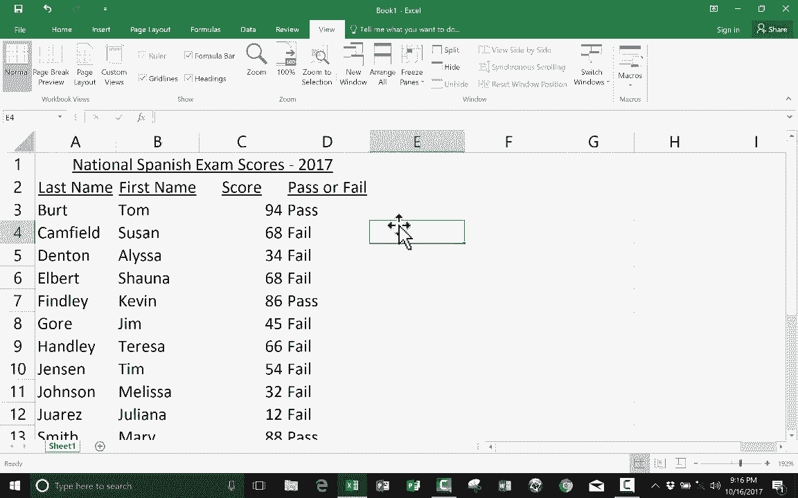

# Excel 高级教程（持续更新中） - P11：11）使用 IF 函数编写电子表格 📊

在本节课中，我们将要学习 Microsoft Excel 中 IF 函数的基础知识。IF 函数允许我们在电子表格中实现简单的逻辑判断，类似于编程中的“如果-那么”语句，是自动化数据处理的重要工具。

## 概述与场景引入

上一节我们介绍了 Excel 的基础函数，本节中我们来看看如何利用 IF 函数进行条件判断。

假设我们有一个学生考试成绩表，我们希望根据分数自动判断每位学生是否通过考试。以下是实现这一目标的具体步骤。

## IF 函数基础语法

IF 函数的基本结构遵循一个逻辑判断流程。其核心语法可以用以下公式表示：

**`=IF(逻辑测试, 值为真时的结果, 值为假时的结果)`**

这个公式意味着：**如果**某个条件成立，**那么**返回第一个结果；**否则**返回第二个结果。

## 分步操作指南

以下是使用 IF 函数判断考试成绩是否及格的具体操作步骤。

1.  **定位目标单元格**
    首先，选中你希望显示判断结果的单元格，例如 D3 单元格。

2.  **输入 IF 函数公式**
    在选中的单元格中输入等号 `=` 开始公式，然后输入 `IF(`。此时，Excel 会提供公式提示。

3.  **设置逻辑测试条件**
    点击学生分数的单元格（例如 C3），然后输入比较运算符和及格分数线。例如，输入 `C3>69`。这表示测试 C3 单元格的值是否大于 69。

4.  **定义条件为真时的结果**
    输入第一个逗号 `,`，这代表“那么”的部分。接着，在引号内输入条件成立时希望显示的内容，例如 `"pass"`。公式此时应为 `=IF(C3>69, "pass",`。

5.  **定义条件为假时的结果**
    输入第二个逗号 `,`，这代表“否则”的部分。然后在引号内输入条件不成立时希望显示的内容，例如 `"fail"`。

6.  **完成公式并查看结果**
    输入右括号 `)` 闭合公式，然后按回车键。单元格 D3 将根据 C3 的分数显示“pass”或“fail”。

## 使用自动填充提高效率

手动为每个学生输入公式非常耗时。我们可以利用 Excel 的自动填充功能快速复制公式。

将鼠标移动到已输入公式的单元格（如 D3）右下角，当光标变成黑色加号时，按住鼠标左键向下拖动。Excel 会自动为每一行填充公式，并智能地调整单元格引用（例如，D4 中的公式会变成 `=IF(C4>69, "pass", "fail")`），从而快速完成所有判断。

## 总结

本节课中我们一起学习了 Excel 中 IF 函数的基本用法。我们掌握了其核心语法 **`=IF(条件, 结果1, 结果2)`**，并通过一个成绩判断的实例，练习了从输入公式到使用自动填充的完整流程。IF 函数是实现表格智能判断的基础，熟练掌握它将为处理更复杂的数据逻辑打下坚实的基础。