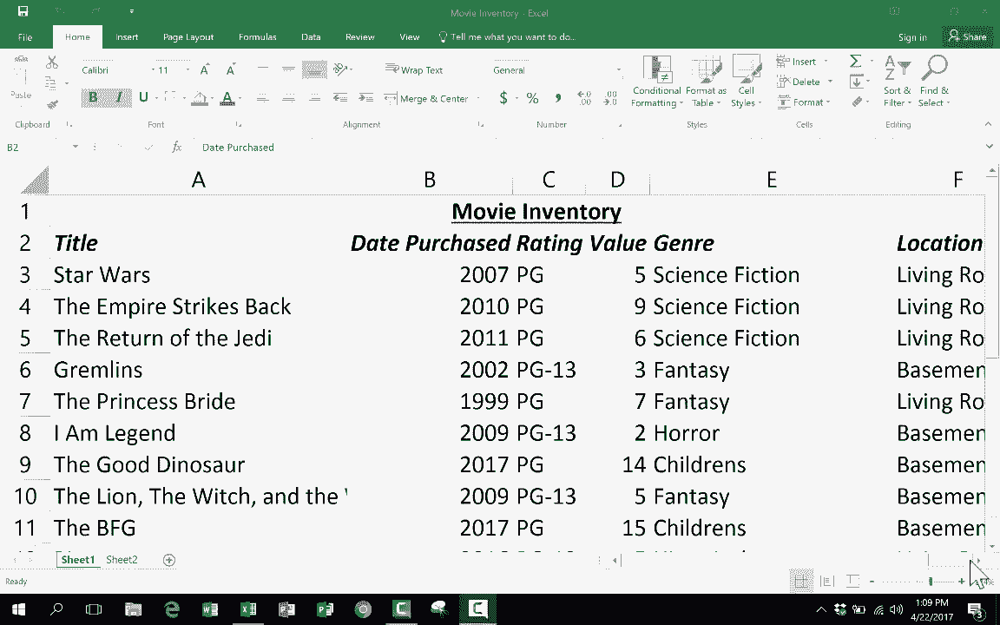
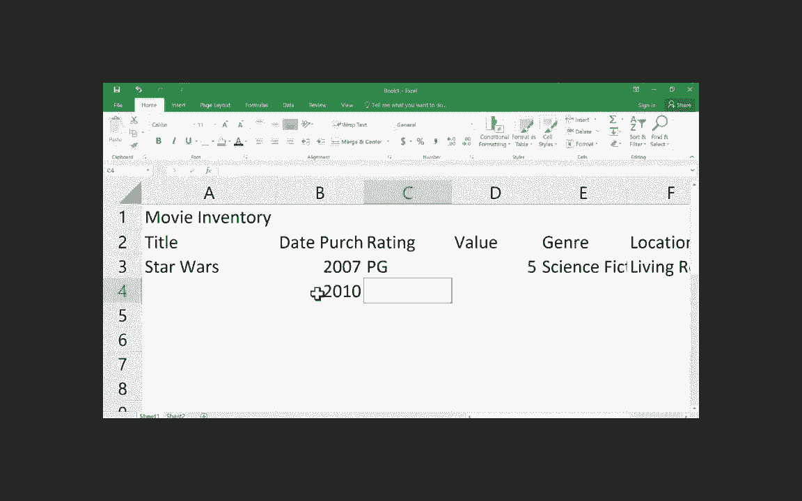
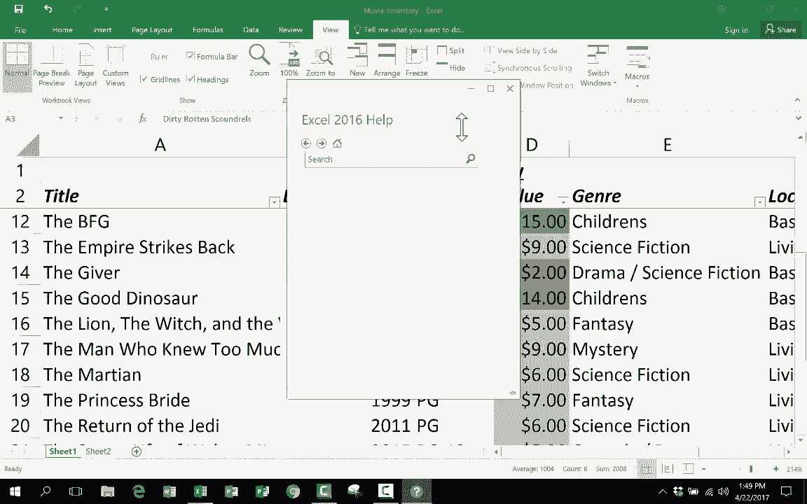

# Excel中级教程 (P1) 📊：核心技能与高效技巧

在本节课中，我们将学习一系列中级Excel技能、技巧和窍门，帮助你更正确、更高效地使用Excel。课程内容涵盖高级格式设置、强大的数据输入工具、核心公式与函数，以及一些能显著提升效率的中高级技巧。

如果你尚未掌握Excel基础知识，建议先学习《Excel初学者指南》教程，以便更好地理解本课内容。

---

## 1. 高级格式设置 🎨

上一节我们提到了基础格式设置，本节中我们来看看几个能节省大量时间的高级格式选项。

### 1.1 格式刷

格式刷位于“开始”选项卡的“剪贴板”组中，图标是一把刷子。它的作用是复制单元格的格式，而非内容。

**操作方式如下：**
1.  点击一个拥有理想格式的单元格作为示例。
2.  点击“格式刷”图标。
3.  将鼠标移动到希望应用此格式的单元格或区域上。
4.  单击单个单元格，或点击并拖动以覆盖一个区域，然后释放鼠标。

### 1.2 条件格式

条件格式位于“开始”选项卡的“样式”组中。它允许你根据单元格内容的值，自动应用特定的格式规则。

以下是设置颜色刻度的一个简单示例：
1.  选择需要应用条件格式的列或区域（例如D列）。
2.  点击“条件格式” -> “色阶”。
3.  选择一个颜色方案（例如“绿-黄-红色阶”）。Excel会自动根据数值大小，为单元格填充不同深浅的背景色，使高值和低值一目了然。

条件格式功能非常强大，你还可以探索以下选项：
*   **数据条：** 在单元格内显示进度条式的填充。
*   **突出显示单元格规则：** 例如，当单元格值大于10时改变背景色。
*   **项目选取规则：** 例如，突出显示值最高的10%的单元格。
*   **图标集：** 使用箭头、旗帜等图标表示数据趋势。

### 1.3 数字格式

正确设置数字格式能让数据更易读。例如，将一列数字设置为货币格式：
1.  选中需要格式化的数字列（例如D列）。
2.  在“开始”选项卡的“数字”组中，点击“会计数字格式”（$）或“货币格式”按钮。
3.  两者的主要区别在于货币符号的对齐方式。

---

## 2. 公式与函数的力量 ⚙️

掌握了格式设置后，本节我们来看看Excel真正的核心功能：公式与函数。它们能对数据进行计算和分析。

假设我们想计算DVD收藏的总价值、平均价值、最高价和最低价。

### 2.1 求和 (SUM)

求总价值有以下几种方法：

**方法一：使用SUM函数**
在目标单元格中输入公式：
`=SUM(D3:D22)`
按回车键，即可得到D3到D22单元格区域所有数值的总和。

**方法二：鼠标选择区域**
1.  在目标单元格输入 `=SUM(`。
2.  用鼠标点击并拖动选择D3到D22区域。
3.  输入 `)` 并按回车。

**方法三：自动求和 (最快)**
1.  点击目标单元格。
2.  在“开始”选项卡的“编辑”组中，点击“自动求和”图标 (∑)。
3.  按回车确认。**注意：** 此功能有时会选错范围，使用后需检查公式引用的区域是否正确。

### 2.2 平均值 (AVERAGE)

计算平均价值的公式为：
`=AVERAGE(D3:D22)`
同样，你也可以使用“自动求和”下拉菜单中的“平均值”功能。

### 2.3 最大值 (MAX) 与最小值 (MIN)

查找最高价值的公式为：
`=MAX(D3:D22)`

查找最低价值的公式为：
`=MIN(D3:D22)`

### 2.4 探索更多函数

Excel拥有大量函数。以下是探索方法：
*   **公式栏提示：** 在单元格或公式栏中输入 `=` 后，Excel会给出函数建议列表和简短说明。
*   **“公式”选项卡：** 这里按类别（如财务、逻辑、文本等）整理了所有函数。
*   **插入函数：** 点击公式栏旁的 `fx` 按钮，可以通过描述你想做的事情来搜索合适的函数。

---

## 3. 高效技巧与窍门 🚀

了解了核心的公式函数后，本节我们学习几个能极大提升工作效率的中高级技巧。

### 3.1 自动填充柄

选中单元格时，右下角会出现一个小方块（自动填充柄）。鼠标悬停其上会变成黑色十字。

**它的用途包括：**
*   **复制内容：** 拖动填充柄，可复制单元格内容（文本或数字）。
*   **填充序列：** 如果选中了两个有规律的单元格（如2015和2016），拖动填充柄会自动延续该模式（2017, 2018...）。
*   **填充日期/时间/星期：** 输入一个起始日期（如“1月1日”），拖动填充柄会自动填充后续日期。
*   **复制公式：** 拖动包含公式的单元格的填充柄，可将公式复制到相邻单元格，并自动调整单元格引用。

### 3.2 数据排序

要将电影列表按字母顺序排列：
1.  点击数据区域内的任一单元格（如电影名列的某个单元格）。
2.  进入“数据”选项卡，点击“升序”(A到Z)或“降序”(Z到A)按钮。
**重要提示：** Excel在排序时会移动整行数据，确保所有列的数据保持对应关系，不会错乱。

### 3.3 数据筛选

筛选可以临时隐藏不符合条件的数据，便于查看特定信息。

**启用与使用筛选：**
1.  选中列标题行。
2.  在“数据”选项卡中点击“筛选”按钮。列标题旁会出现下拉箭头。
3.  点击下拉箭头，取消勾选你不想看到的内容（例如，取消勾选“R”级，只显示“PG-13”和“G”级电影），然后点击“确定”。被隐藏的行号会显示为蓝色。
4.  要取消筛选，再次点击“筛选”按钮，或在下拉菜单中选择“全选”。

### 3.4 冻结窗格

当表格很长时，向下滚动会看不到表头。冻结窗格功能可以锁定特定的行或列。

**操作步骤：**
1.  点击你希望保持冻结部分**下方**的那一行（例如，要冻结前两行的标题，就点击第3行）。
2.  进入“视图”选项卡，在“窗口”组中点击“冻结窗格”。
3.  在下拉菜单中选择“冻结窗格”。
现在，向下滚动时，被冻结的行将始终保持可见。

---

## 总结 📝

本节课中我们一起学习了Excel的中级核心技能：
1.  **高级格式：** 使用**格式刷**快速复制格式，利用**条件格式**让数据可视化，并正确设置**数字格式**。
2.  **公式函数：** 掌握了 **`SUM`**, **`AVERAGE`**, **`MAX`**, **`MIN`** 等基础函数的使用，并了解了探索更多函数的途径。
3.  **高效技巧：** 运用**自动填充柄**智能填充数据，通过**排序**整理数据顺序，利用**筛选**快速聚焦关键信息，以及使用**冻结窗格**方便查看大型表格。

掌握这些技能，你将能更加得心应手地处理和分析Excel数据。继续练习和探索，你会发现Excel的更多强大功能。