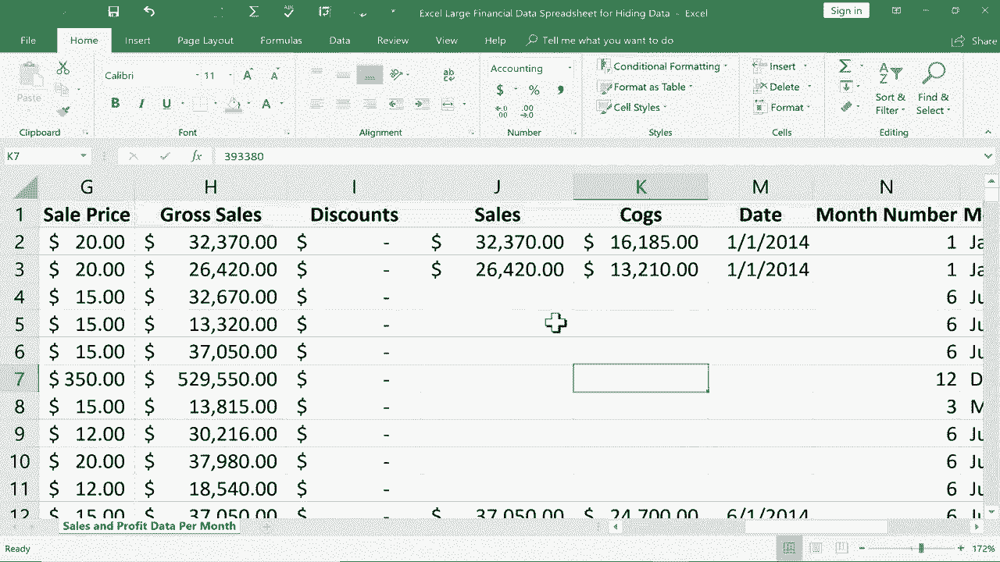

# Excel中级教程 (P10)：🔒 隐藏数据

在本节课中，我们将学习如何在Excel中隐藏数据，包括隐藏行、列、工作表以及单个单元格。我们还将探讨隐藏数据的原因，以及如何通过保护工作簿来增强数据安全性。


假设你有一个包含财务数据和客户信息的电子表格。当你需要与合作伙伴共享部分数据时，可能不希望对方看到所有信息，例如客户个人隐私或公司利润。这时，隐藏数据就成为一个实用的解决方案。

---

## 1. 隐藏行与列

上一节我们介绍了隐藏数据的应用场景，本节中我们来看看如何具体操作。隐藏行和列是最基础的方法。

以下是隐藏行的步骤：
1.  选中需要隐藏的行。例如，要隐藏产品“Montana”相关的所有行（第8至17行），请点击左侧行号“8”并按住鼠标向下拖动至行号“17”。
2.  在选中的任意行号上右键单击。
3.  在弹出的菜单中选择“隐藏”。

隐藏后，行号会跳过被隐藏的行（例如，从第7行直接跳到第18行），并且在第7行和第18行之间会显示一条稍粗的线条，提示此处有隐藏内容。

隐藏列的操作与之类似：
1.  点击需要隐藏的列的列标（例如，要隐藏“总利润”所在的列）。
2.  右键单击该列标。
3.  选择“隐藏”。

---

## 2. 取消隐藏行与列

学会了隐藏，自然也需要知道如何恢复显示。取消隐藏行和列同样简单。

要取消隐藏行：
1.  选中包含隐藏行的上下两行（例如，选中第7行和第18行）。
2.  在选中的行号上右键单击。
3.  选择“取消隐藏”。

要取消隐藏列：
1.  选中包含隐藏列的左右两列（例如，选中隐藏列两侧的列标）。
2.  在选中的列标上右键单击。
3.  选择“取消隐藏”。

---

## 3. 隐藏与取消隐藏工作表

除了行和列，你还可以隐藏整个工作表，这对于保护独立的数据模块（如客户名单）非常有用。

以下是隐藏工作表的步骤：
1.  在底部的工作表标签栏中，右键单击需要隐藏的工作表名称（例如“客户名单”）。
2.  在弹出的菜单中选择“隐藏”。

要取消隐藏工作表，操作略有不同：
1.  在任意一个可见的工作表标签上右键单击。
2.  选择“取消隐藏”。
3.  在弹出的对话框中，选择你想要恢复显示的工作表名称。
4.  点击“确定”。

---

## 4. 保护隐藏的数据

然而，简单的隐藏并不安全，接收者可以轻松地取消隐藏看到数据。为了加强保护，我们可以使用“保护工作簿”功能。

以下是保护工作簿结构的步骤：
1.  点击顶部菜单栏的“审阅”选项卡。
2.  在“保护”组中，点击“保护工作簿”。
3.  在弹出的对话框中，勾选“结构”。
4.  输入一个密码（可选但推荐），然后点击“确定”。
5.  再次输入密码进行确认。

**保护后效果**：
*   用户将无法通过右键菜单“取消隐藏”来显示被隐藏的工作表。
*   **但请注意**：被隐藏的行和列仍然可以通过前面介绍的方法取消隐藏。因此，保护工作簿主要适用于保护工作表结构。

---

## 5. 隐藏单个单元格内容

有时，你不想隐藏整行或整列，而只想隐藏某个特定单元格（如一个关键数字）的内容。这时可以使用一个视觉技巧。

以下是隐藏单个单元格内容的步骤：
1.  选中你想要隐藏内容的单元格或单元格区域。
2.  在“开始”选项卡的“字体”组中，找到“字体颜色”工具。
3.  将字体颜色设置为与单元格背景色相同（通常为白色）。

**代码示例**：这相当于手动执行了格式设置，其核心是改变单元格的显示属性。
```excel
// 这是一个概念性描述，实际操作是通过界面完成
单元格.字体.颜色 = 白色
```

**重要提示**：此方法仅使单元格内容在界面上“不可见”，但如果有人选中该单元格，其内容仍会在上方的编辑栏中显示。因此，它不适用于需要高度保密的数据。

---

## 总结

本节课中，我们一起学习了在Excel中隐藏数据的多种方法：
*   **隐藏行/列**：通过右键菜单快速隐藏，并通过选中相邻区域取消隐藏。
*   **隐藏工作表**：通过右键工作表标签隐藏，并通过“取消隐藏”对话框恢复。
*   **增强保护**：使用“保护工作簿”功能防止他人取消隐藏工作表。
*   **视觉隐藏**：通过将字体颜色设置为白色来“隐藏”单个单元格内容，但需注意其局限性。



根据你的安全需求，可以选择合适的方法组合使用，例如将敏感数据放在独立工作表中并隐藏，同时为工作簿结构设置密码保护。