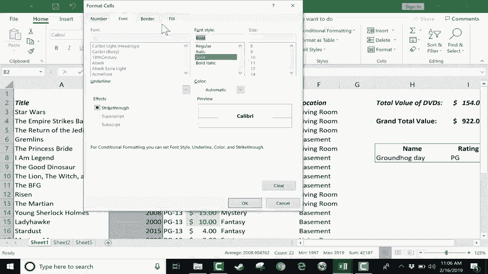

# Excel中级教程 (P11)：深入了解条件格式 📊

在本节课中，我们将深入学习 Microsoft Excel 中的“条件格式”功能。条件格式是一个强大的工具，它允许我们根据单元格中的数据值，自动改变其外观（如颜色、图标、数据条等），从而使数据更直观、更易于分析。我们将通过两个示例电子表格来演示其核心功能和应用场景。

上一节我们介绍了条件格式的基本概念，本节中我们将详细探索其各项具体规则和设置方法。

## 概述：什么是条件格式？

条件格式位于 **“开始”** 选项卡下的 **“样式”** 组中。它的核心作用是：**基于设定的条件，动态改变单元格的格式**。例如，你可以让数值大于100的单元格显示为绿色，或者用数据条的长度来直观表示数值的大小。

## 应用条件格式：基本步骤

以下是应用条件格式的基本流程：
1.  选择要应用格式的单元格区域（例如一整列）。
2.  点击 **“开始”** -> **“条件格式”**。
3.  从下拉菜单中选择所需的规则类型。
4.  设置具体的条件和期望的格式样式。
5.  点击 **“确定”** 应用规则。

## 规则类型详解

### 1. 突出显示单元格规则 🎯

此规则用于快速标记出符合特定条件的单元格，例如数值范围、文本内容或日期。

假设我们有一个电影库存表，其中D列是电影的价值。我们想高亮显示价值高于 $9.99 的DVD。

**操作步骤：**
1.  选中D列。
2.  点击 **“条件格式”** -> **“突出显示单元格规则”** -> **“大于”**。
3.  在对话框中输入 `9.99`。
4.  在右侧下拉菜单中选择一个格式，例如 **“绿填充色深绿色文本”**。
5.  点击 **“确定”**。

**效果**：所有价值大于9.99的单元格背景变为绿色，文本变为深绿色。

**注意**：如果选择整列时包含了标题（如“价值”），标题也可能被错误格式化。修复方法是：选中标题单元格，点击 **“条件格式”** -> **“清除规则”** -> **“清除所选单元格的规则”**。

**其他常用选项包括：**
*   **小于/介于/等于**：针对数值条件。
*   **文本包含**：高亮包含特定关键词的单元格。
*   **发生日期**：标记特定时间段的日期。
*   **重复值**：快速找出重复或唯一的数据。

你还可以点击 **“自定义格式…”** 来完全自定义字体、边框和填充颜色。

### 2. 项目选取规则：前/后N项 📈

此规则用于快速标识出数据中顶部或底部的项目，如前10名或后10%。

切换到包含财务数据的表格，假设我们想找出E列中销售额最高的项目。

**操作步骤：**
1.  选中E列。
2.  点击 **“条件格式”** -> **“项目选取规则”** -> **“前10项”**。
3.  在对话框中，你可以将数量 `10` 改为任何数字（如前60项），或改为百分比（如前10%）。
4.  选择格式后点击 **“确定”**。

**修改现有规则**：如需调整，可点击 **“条件格式”** -> **“管理规则”**，选择规则后点击 **“编辑规则”** 进行修改。

**其他选项：**
*   **后10项**：标识排名靠后的项目。
*   **高于/低于平均值**：快速找出表现优于或差于平均水平的项目。

### 3. 数据条 📊

数据条直接在单元格内添加一个横向条形图，条形长度与单元格数值成正比，提供非常直观的比较。

假设在财务表中，H列是总销售额，我们想用数据条进行可视化。

**操作步骤：**
1.  选中H列。
2.  点击 **“条件格式”** -> **“数据条”**。
3.  从渐变或实心填充样式中选择一种（如“橙色数据条”）。

**效果**：数值越大，单元格内的彩色条形就越长。

**高级技巧：仅显示条形图**
如果你希望隐藏数字，只保留条形图用于演示：
1.  选中数据列，点击 **“条件格式”** -> **“数据条”** -> **“其他规则…”**。
2.  在规则设置窗口中，勾选 **“仅显示数据条”**。
3.  点击 **“确定”**。此时单元格内只显示条形，数值可在公式栏中查看。

### 4. 色阶 🌈

色阶使用两种或三种颜色的渐变来标识数值的大小。通常，一种颜色代表较低值，另一种颜色代表较高值。

例如，对J列的数据应用色阶。

**操作步骤：**
1.  选中J列。
2.  点击 **“条件格式”** -> **“色阶”**。
3.  选择一个预设方案（如“红-黄-绿色阶”，其中红色代表低值，绿色代表高值）。

**效果**：数值最高的单元格显示为深绿色，数值最低的显示为深红色，中间值呈现渐变色。

### 5. 图标集 ⭐

图标集根据数值所在的范围，在单元格内显示不同的图标（如箭头、信号灯、旗帜）。

例如，对L列的利润数据应用图标集。

**操作步骤：**
1.  选中L列。
2.  点击 **“条件格式”** -> **“图标集”**。
3.  选择一组图标（如“三向箭头”）。

**效果**：Excel会自动将数据划分为三个区间，并分别用上箭头（高）、横箭头（中）、下箭头（低）来标记。

**自定义图标规则：**
你可以精细控制每个图标对应的数值范围。
1.  点击 **“条件格式”** -> **“图标集”** -> **“其他规则…”**。
2.  在规则设置窗口中，你可以将划分依据从“百分比”改为“数字”，并手动设置每个图标代表的阈值（例如，大于85显示绿灯，小于20显示红灯）。
3.  点击 **“确定”** 应用自定义规则。

## 总结

本节课我们一起深入学习了 Excel 条件格式的五大核心功能：
1.  **突出显示单元格规则**：用于快速标记符合简单条件（数值、文本、日期）的数据。
2.  **项目选取规则**：用于标识排名靠前、靠后或高于/低于平均值的数据。
3.  **数据条**：在单元格内添加条形图，提供直观的数值大小对比。
4.  **色阶**：使用颜色渐变来可视化数值范围。
5.  **图标集**：用不同的图标来对数据进行分类评级。

通过灵活运用这些功能，你可以将枯燥的数据表格转化为清晰、直观的可视化报告，极大地提升数据分析和演示的效率。记住，你总是可以通过 **“管理规则”** 来查看、编辑或删除已应用的所有条件格式规则。