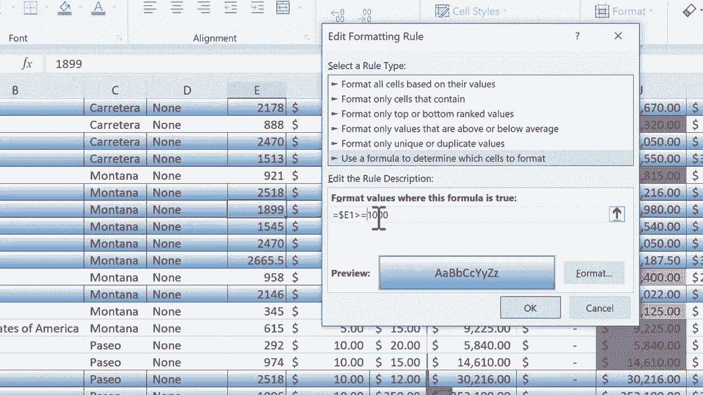

# Excel中级教程 - P12：12）条件格式高级技巧 🎨

在本节课中，我们将学习如何基于特定条件突出显示整行数据，而不仅仅是单个单元格。这是一种高级条件格式技巧，能帮助你更直观地分析和强调数据表中的关键信息。

## 概述

条件格式是Excel中强大的可视化工具。在之前的教程中，我们学习了如何根据单元格自身的值来改变其格式。本节教程将在此基础上更进一步，教你如何根据某一列的值，来格式化**整行**数据。例如，我们可以高亮显示“销量最高”的产品所在的所有行。

## 选择数据范围


首先，我们需要选中要应用格式的整个数据区域。

以下是操作步骤：
1.  点击数据表左上角（通常是A1单元格）。
2.  按住鼠标左键，拖动以选中从A列到Q列的所有数据。
3.  确保整个数据区域都被高亮选中。

## 创建新规则

选中数据后，我们就可以创建基于公式的条件格式规则了。

以下是操作步骤：
1.  在Excel顶部菜单栏中，点击 **“开始”** 选项卡。
2.  在“样式”组中，点击 **“条件格式”**。
3.  在下拉菜单中，选择 **“新建规则”**。

## 使用公式确定格式

在弹出的“新建格式规则”对话框中，我们需要选择规则类型并输入公式。

以下是操作步骤：
1.  在规则类型列表中，选择 **“使用公式确定要设置格式的单元格”**。
2.  在“为符合此公式的值设置格式”下方的输入框中，点击鼠标，准备输入公式。

## 编写绝对引用公式

这是本技巧的核心。我们需要编写一个公式，让Excel检查特定列（本例为E列“销量”）的值，并据此决定是否格式化整行。

公式的关键在于使用**绝对列引用**和**相对行引用**。假设我们想高亮显示“销量”大于1000的所有行，公式如下：
```excel
=$E1>1000
```
*   **`$E`**：美元符号`$`锁定了E列。这意味着无论规则应用到哪一列，判断条件都只针对E列的值。
*   **`1`**：这里使用相对行引用（没有`$`）。当规则应用到第2行时，公式会自动变为`$E2>1000`；应用到第3行时，变为`$E3>1000`，以此类推。
*   **`>1000`**：这是判断条件，表示检查E列单元格的值是否大于1000。

**注意**：公式中引用的行号（`1`）应与所选数据区域的**首行**行号一致。如果数据从第2行开始，则应使用`$E2`。

## 设置格式样式

公式输入完成后，我们需要定义当条件满足时，单元格应呈现的格式。

以下是操作步骤：
1.  点击对话框右下角的 **“格式”** 按钮。
2.  在弹出的“设置单元格格式”对话框中，可以设置字体、边框、填充等。
    *   例如，在“填充”选项卡中选择一个颜色（如深绿色）来高亮整行。
    *   也可以在“边框”选项卡中为整行添加框线。
3.  设置完毕后，点击 **“确定”** 返回上一级对话框。

## 应用并检查规则

现在，我们可以应用规则并查看效果。



以下是操作步骤：
1.  在“新建格式规则”对话框中，点击 **“确定”**。
2.  Excel会立即扫描E列，将所有值大于1000的**整行**以你设置的格式（如绿色填充）高亮显示。
3.  若要修改或删除规则，可以再次点击 **“条件格式”** -> **“管理规则”**。在规则管理器中，你可以编辑公式（例如将`>1000`改为`>=1000`以包含等于1000的值）、修改格式或删除规则。

## 总结

本节课我们一起学习了Excel条件格式的高级技巧——**基于公式高亮显示整行**。关键要点是使用类似`=$E1>1000`的公式结构，其中**`$`符号锁定列**，而行号相对引用。通过这个技巧，你可以让数据表格中符合特定条件的行（如销量领先、任务逾期等）一目了然，极大地提升了数据分析和呈现的效率。