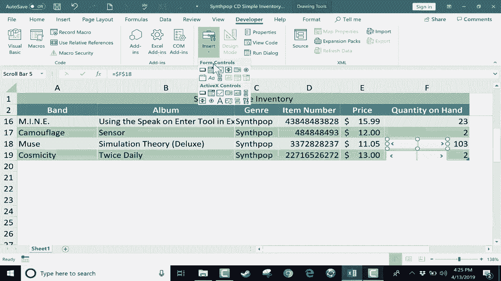

# Excel中级教程 - P14：添加滚动条控件 📊

在本节课中，我们将学习如何在Excel中添加一个表单控件——滚动条。这个滚动条可以帮助你快速调整单元格中的数值，无需手动输入。我们将从启用“开发者”选项卡开始，逐步完成滚动条的插入、设置与应用。

---

## 概述：什么是表单控件？

上一节我们介绍了Excel的基础数据操作，本节中我们来看看如何通过表单控件提升交互效率。表单控件是Excel中一类可交互的元素，例如按钮、复选框和滚动条。它们允许用户通过点击或拖动来改变单元格的值，非常适合制作动态表格或仪表板。

---

## 第一步：启用“开发者”选项卡

默认情况下，Excel的功能区不显示“开发者”选项卡。你需要手动启用它。

1.  在Excel功能区任意选项卡上右键单击。
2.  从菜单中选择“自定义功能区”。
3.  在弹出的“Excel选项”窗口中，右侧列表找到并勾选“开发者”复选框。
4.  点击“确定”。

完成后，功能区将出现“开发者”选项卡。

---

## 第二步：插入滚动条控件

现在，我们可以在工作表中插入滚动条了。

1.  点击“开发者”选项卡。
2.  在“控件”组中，点击“插入”。
3.  在“表单控件”区域，找到并点击“滚动条”图标（通常是一个横向滚动条图案）。
4.  鼠标指针会变成十字形，在希望放置滚动条的位置单击并拖动，绘制出滚动条。

滚动条会浮动在单元格上方，不会破坏原有数据。

---

## 第三步：配置滚动条属性

插入的滚动条需要正确设置才能控制目标单元格。以下是关键配置步骤。

1.  右键单击滚动条，选择“设置控件格式”。
2.  在弹出的对话框中，切换到“控制”选项卡。
3.  设置以下核心参数：
    *   **当前值**：滚动条的初始位置，可暂时忽略。
    *   **最小值**：滚动条对应的最小值，例如 `0`。
    *   **最大值**：滚动条对应的最大值，例如 `200`。
    *   **步长**：点击箭头时数值的变化量，例如 `1`。
    *   **页步长**：点击滚动条空白处时数值的变化量，例如 `10`。
    *   **单元格链接**：点击右侧选择按钮，或直接输入需要被控制的单元格地址（如 `$F$3`）。

**核心概念公式**：
滚动条的值（Value）与链接单元格（Cell_Link）的关系为：
`Cell_Link = Value`
其中，`Value` 的取值范围由你设置的 **最小值** 和 **最大值** 决定。

4.  点击“确定”完成设置。

---

## 第四步：测试与使用滚动条

设置完成后，即可测试滚动条功能。

*   **点击箭头**：每次点击滚动条两端的箭头，链接单元格的数值会按“步长”增减。
*   **拖动滑块**：拖动滚动条中间的滑块，可以快速将数值调整到目标值。
*   **点击滑轨**：点击滑块与箭头之间的空白区域，数值会按“页步长”增减。

测试前，请先点击其他单元格，确保滚动条未被选中。

---

## 第五步：复制与批量应用滚动条

如果你需要为多个单元格添加滚动条，复制是高效的方法。

1.  选中已配置好的滚动条，按 `Ctrl+C` 复制。
2.  按 `Ctrl+V` 粘贴到新位置。
3.  **重要**：右键单击新粘贴的滚动条，进入“设置控件格式”，将其“单元格链接”修改为新的目标单元格地址（如 `$F$4`）。
4.  重复此过程，为其他单元格添加滚动条。

---

## 总结

本节课中，我们一起学习了如何在Excel中添加并配置滚动条表单控件。关键步骤包括：启用“开发者”选项卡、插入滚动条、设置其控制参数（特别是**单元格链接**、**最小值**和**最大值**），以及通过复制来批量应用。这个功能能让你通过简单的拖动或点击，快速调整表格中的数值，非常适合库存管理、数据模拟等场景。

---

> 提示：表单控件功能丰富，除了滚动条，还有数值调节钮、复选框、选项按钮等。如果你有兴趣了解更多，可以在评论区留言。