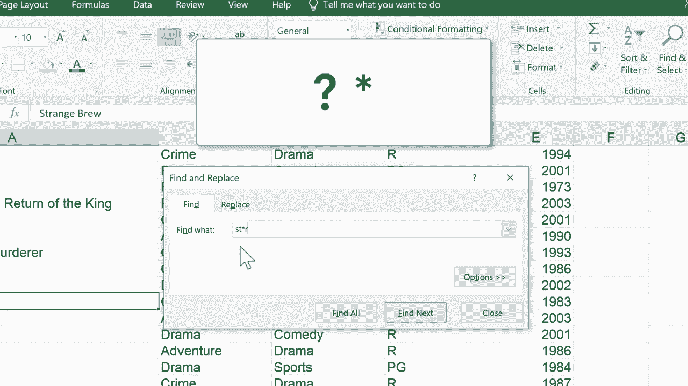

# Excel中级教程 P16：使用查找、替换与通配符 🔍

在本节课中，我们将学习如何使用Excel强大的“查找和替换”功能来快速定位和修改电子表格中的数据。我们还将介绍两个关键的通配符——问号（`?`）和星号（`*`）——它们能帮助我们在不确定完整信息时进行模糊搜索。

## 概述

“查找和替换”是Excel中用于搜索特定数据并进行批量修改的核心工具。掌握它和通配符的使用，能极大提升处理大型表格的效率。

## 使用“查找”功能定位数据

假设我们有一个包含电影标题及其信息的电子表格。要快速检查是否包含某部特定电影，例如《黑暗骑士》，我们可以使用“查找”功能。

1.  按下快捷键 `Ctrl + F`，弹出“查找和替换”对话框。
2.  在“查找内容”输入框中键入“黑暗骑士”。
3.  按下回车键或点击“查找下一个”，Excel便会定位到包含该数据的单元格。

如果目的仅仅是验证数据是否存在，完成上述步骤即可。

## 使用“替换”功能修正数据

上一节我们介绍了如何查找数据，本节中我们来看看如何修正数据。有时我们可能需要将查找到的内容替换为新的内容。

例如，发现“黑暗骑士”的命名有误，应改为“蝙蝠侠：黑暗骑士”。

1.  在“查找和替换”对话框中，切换到“替换”标签页。
2.  在“查找内容”中输入“黑暗骑士”。
3.  在“替换为”中输入“蝙蝠侠：黑暗骑士”。
4.  若仅修改当前找到的一处，点击“替换”；若需修改所有相同内容，则点击“全部替换”。

这是一种高效的纠错方法。如果你在表格中犯了重复的拼写错误，可以让Excel一次性找到所有错误实例并替换为正确数据。

## 使用通配符进行模糊查找

如果你不确定要查找内容的完整或准确拼写，或者想查找具有某种模式的所有数据，可以使用通配符。

Excel中两个主要的通配符是问号（`?`）和星号（`*`）。

### 问号通配符 (`?`)

问号代表任意**单个**字符。

例如，想查找以“ST”开头、后接任意一个字符、然后是“R”的电影名。我们可以使用模式：`ST?R`。

*   `ST?R` 可以匹配 “STER”（如 Joker 中的 “STER”）。
*   `ST?R` 可以匹配 “STAR”（如 Star Wars 中的 “STAR”）。

以下是操作步骤：
1.  打开“查找”对话框。
2.  在查找内容中输入 `ST?R`。
3.  点击“查找下一个”，Excel会依次定位到符合该模式的所有单元格。

### 星号通配符 (`*`)

星号代表任意**数量**的字符（包括零个字符）。

例如，想查找包含“ST”、后接任意数量字符、然后是“R”的电影名。我们可以使用模式：`ST*R`。

*   `ST*R` 可以匹配 “STER”、“STAR”。
*   `ST*R` 也可以匹配更长的字符串，如 “ST. ANDREW‘S”（如果其中包含ST和R）。

`ST*R` 的搜索范围比 `ST?R` 更广，因为它允许“ST”和“R”之间存在多个字符。

## 总结

本节课中我们一起学习了Excel“查找和替换”功能的核心用法：
*   **查找** (`Ctrl + F`)：用于快速定位特定数据。
*   **替换**：用于将找到的数据批量修改为新数据。
*   **通配符**：用于进行模糊或模式匹配搜索。
    *   `?` 代表一个任意字符。
    *   `*` 代表任意数量的任意字符。

熟练运用这些工具，可以帮助你更高效地管理和清理电子表格中的数据。